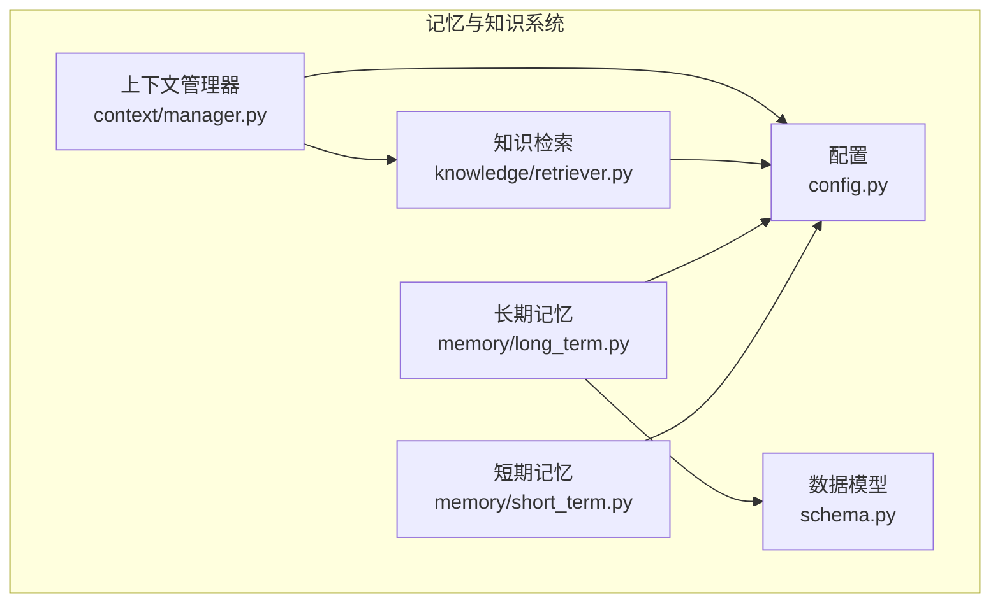
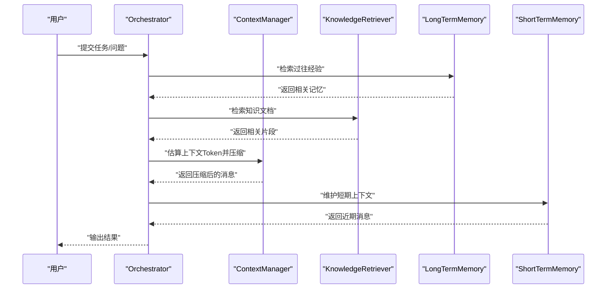
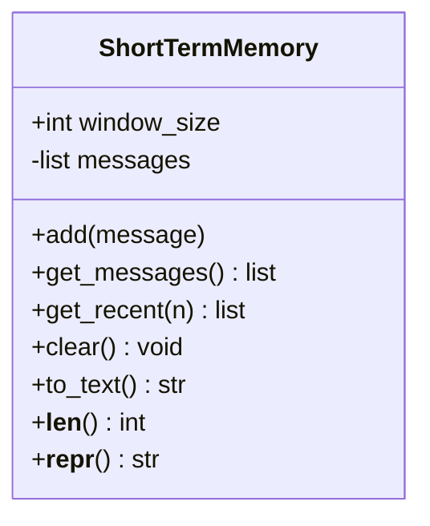
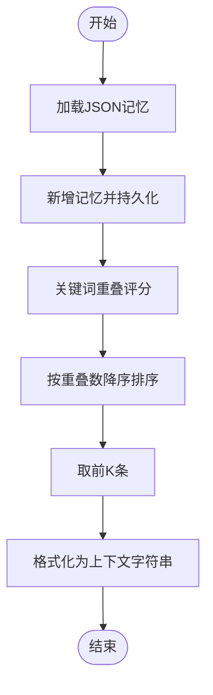
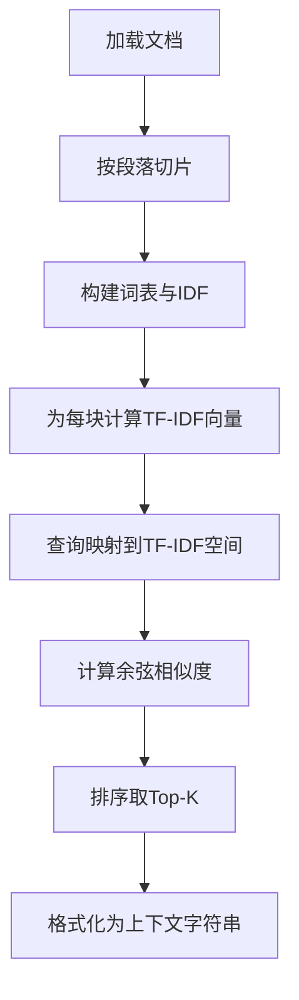
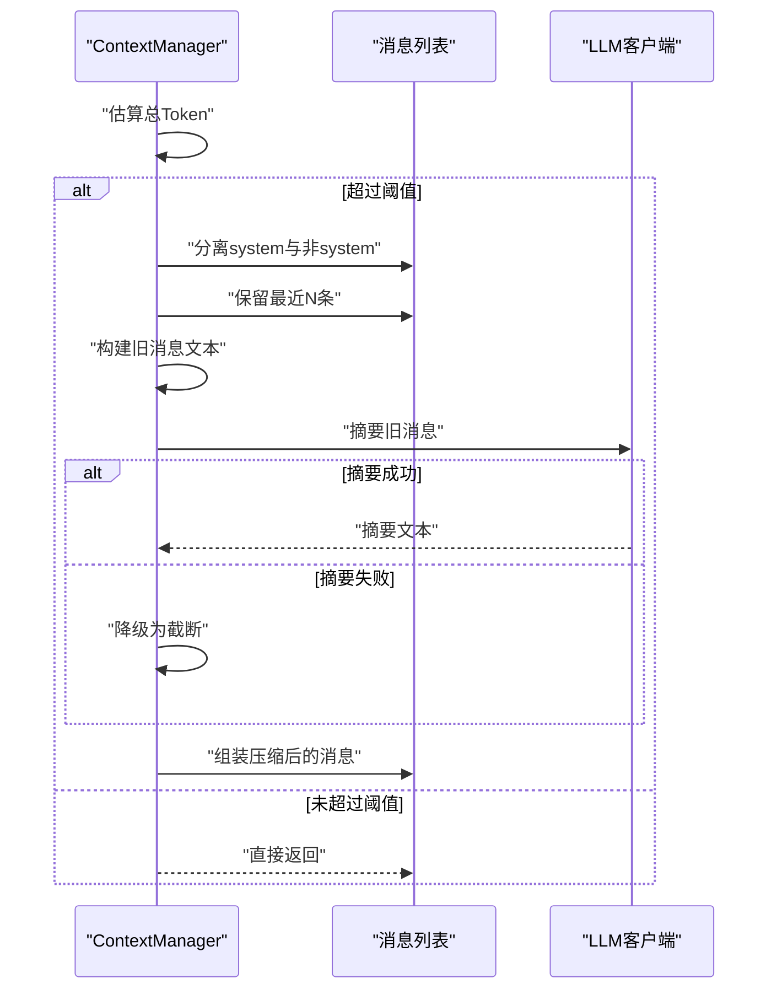
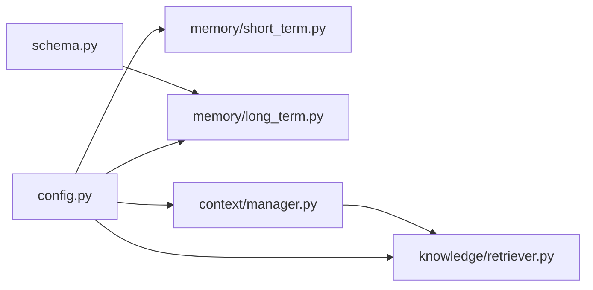

# 记忆和知识系统

<cite>
**本文引用的文件**
- [memory/short_term.py](file://memory/short_term.py)
- [memory/long_term.py](file://memory/long_term.py)
- [knowledge/retriever.py](file://knowledge/retriever.py)
- [context/manager.py](file://context/manager.py)
- [config.py](file://config.py)
- [schema.py](file://schema.py)
- [knowledge/docs/sample.txt](file://knowledge/docs/sample.txt)
- [memory/__init__.py](file://memory/__init__.py)
- [knowledge/__init__.py](file://knowledge/__init__.py)
- [backups/memory/short_term.py](file://backups/memory/short_term.py)
- [backups/memory/long_term.py](file://backups/memory/long_term.py)
- [backups/knowledge/retriever.py](file://backups/knowledge/retriever.py)
- [backups/context/manager.py](file://backups/context/manager.py)
</cite>

## 目录
1. [简介](#简介)
2. [项目结构](#项目结构)
3. [核心组件](#核心组件)
4. [架构总览](#架构总览)
5. [详细组件分析](#详细组件分析)
6. [依赖分析](#依赖分析)
7. [性能考虑](#性能考虑)
8. [故障排除指南](#故障排除指南)
9. [结论](#结论)
10. [附录](#附录)

## 简介
本文件系统性梳理 manus_demo 的记忆与知识系统，重点覆盖：
- 短期记忆（ShortTermMemory）的滑动窗口机制与会话管理
- 长期记忆（LongTermMemory）的持久化存储与数据管理策略
- 知识检索（KnowledgeRetriever）的 TF-IDF 检索与上下文压缩
- 上下文管理器（ContextManager）的上下文窗口与 Token 估算
- 配置项与使用示例
- 在整体架构中的作用与与其他组件的交互
- 性能优化建议、最佳实践与故障排除

## 项目结构
记忆与知识系统主要分布在以下模块：
- memory：短期与长期记忆
- knowledge：本地文档检索与 TF-IDF 索引
- context：上下文窗口与 Token 估算、LLM 压缩
- config：全局配置项（上下文上限、记忆窗口、知识切片等）
- schema：MemoryEntry 等数据模型

图表来源
- [memory/short_term.py:1-91](file://memory/short_term.py#L1-L91)
- [memory/long_term.py:1-142](file://memory/long_term.py#L1-L142)
- [knowledge/retriever.py:1-229](file://knowledge/retriever.py#L1-L229)
- [context/manager.py:1-187](file://context/manager.py#L1-L187)
- [config.py:1-109](file://config.py#L1-L109)
- [schema.py:648-657](file://schema.py#L648-L657)

章节来源
- [memory/short_term.py:1-91](file://memory/short_term.py#L1-L91)
- [memory/long_term.py:1-142](file://memory/long_term.py#L1-L142)
- [knowledge/retriever.py:1-229](file://knowledge/retriever.py#L1-L229)
- [context/manager.py:1-187](file://context/manager.py#L1-L187)
- [config.py:1-109](file://config.py#L1-L109)
- [schema.py:648-657](file://schema.py#L648-L657)

## 核心组件
- 短期记忆（ShortTermMemory）
  - 基于内存的滑动窗口，保留最近 N 条消息，自动淘汰最旧条目
  - 提供添加、获取、清空、序列化为文本等能力
- 长期记忆（LongTermMemory）
  - 基于 JSON 文件的持久化存储，支持关键词重叠检索
  - 提供存储、检索、格式化上下文、清空等能力
- 知识检索（KnowledgeRetriever）
  - 基于 TF-IDF 的关键词检索，文档按段落切片，构建倒排索引
  - 提供检索与结果格式化
- 上下文管理器（ContextManager）
  - Token 估算与上下文压缩，保留 system 与近期消息，对旧消息进行 LLM 摘要压缩

章节来源
- [memory/short_term.py:20-91](file://memory/short_term.py#L20-L91)
- [memory/long_term.py:24-142](file://memory/long_term.py#L24-L142)
- [knowledge/retriever.py:26-229](file://knowledge/retriever.py#L26-L229)
- [context/manager.py:22-187](file://context/manager.py#L22-L187)

## 架构总览
记忆与知识系统在整体流程中的位置如下：

图表来源
- [context/manager.py:82-136](file://context/manager.py#L82-L136)
- [knowledge/retriever.py:111-158](file://knowledge/retriever.py#L111-L158)
- [memory/long_term.py:79-101](file://memory/long_term.py#L79-L101)
- [memory/short_term.py:36-67](file://memory/short_term.py#L36-L67)

## 详细组件分析

### 短期记忆（ShortTermMemory）
- 滑动窗口机制
  - 初始化时读取配置窗口大小，默认来自全局配置
  - 添加消息时若超过窗口大小，按 FIFO 方式切片淘汰最旧条目
- 会话管理
  - 提供获取全部/最近 N 条消息的能力，便于快速拼接上下文
  - 提供清空能力，适合新会话开始时重置
- 序列化与调试
  - 将消息序列化为可读文本，便于日志与调试

图表来源
- [memory/short_term.py:20-91](file://memory/short_term.py#L20-L91)

章节来源
- [memory/short_term.py:27-67](file://memory/short_term.py#L27-L67)
- [memory/short_term.py:74-91](file://memory/short_term.py#L74-L91)

### 长期记忆（LongTermMemory）
- 持久化策略
  - 启动时从磁盘加载 JSON 文件，若不存在或损坏则返回空列表
  - 每次存储后立即持久化，保证重启可恢复
- 检索策略
  - 基于关键词重叠度评分：将查询词与记忆条目（task + summary + learnings）做集合交集，重叠数即相关性分数
  - 返回前 K 条（默认 3）
- 上下文格式化
  - 将检索到的记忆条目格式化为可注入 LLM 的上下文字符串

图表来源
- [memory/long_term.py:42-77](file://memory/long_term.py#L42-L77)
- [memory/long_term.py:79-101](file://memory/long_term.py#L79-L101)
- [memory/long_term.py:123-138](file://memory/long_term.py#L123-L138)

章节来源
- [memory/long_term.py:31-64](file://memory/long_term.py#L31-L64)
- [memory/long_term.py:70-101](file://memory/long_term.py#L70-L101)
- [memory/long_term.py:123-138](file://memory/long_term.py#L123-L138)

### 知识检索（KnowledgeRetriever）
- 文档加载与切片
  - 从配置的知识文档目录加载 txt/md 文件
  - 按段落边界切分为固定大小的块，尽量保持语义完整性
- TF-IDF 索引构建
  - 统计词频与文档频率，计算 IDF 并为每个块生成 TF-IDF 向量
- 检索与结果格式化
  - 查询向量同样映射到 TF-IDF 空间，计算与各块的余弦相似度
  - 返回前 K 条（默认 3），并格式化为可注入 LLM 的上下文字符串

图表来源
- [knowledge/retriever.py:53-104](file://knowledge/retriever.py#L53-L104)
- [knowledge/retriever.py:111-143](file://knowledge/retriever.py#L111-L143)
- [knowledge/retriever.py:145-158](file://knowledge/retriever.py#L145-L158)

章节来源
- [knowledge/retriever.py:37-46](file://knowledge/retriever.py#L37-L46)
- [knowledge/retriever.py:53-104](file://knowledge/retriever.py#L53-L104)
- [knowledge/retriever.py:111-158](file://knowledge/retriever.py#L111-L158)

### 上下文管理器（ContextManager）
- Token 估算
  - 提供简单估算函数：按字符数粗略折算 Token（英文约 3 字符/Token，CJK 约 2 字符/Token）
  - 为消息列表估算总 Token，包含每条消息的固定开销
- 上下文压缩
  - 当总 Token 超过阈值时，将消息分为 system、旧消息、近期消息三部分
  - 使用 LLM 将旧消息摘要为单条 summary，替换旧消息，保留 system 与近期消息
  - 若摘要失败，降级为截断原文末尾若干字符

图表来源
- [context/manager.py:82-136](file://context/manager.py#L82-L136)
- [context/manager.py:157-186](file://context/manager.py#L157-L186)

章节来源
- [context/manager.py:53-75](file://context/manager.py#L53-L75)
- [context/manager.py:82-136](file://context/manager.py#L82-L136)
- [context/manager.py:157-186](file://context/manager.py#L157-L186)

## 依赖分析
- 组件耦合
  - ShortTermMemory 与 LongTermMemory 仅依赖配置与数据模型，彼此低耦合
  - KnowledgeRetriever 依赖配置与文件系统，检索结果可被其他组件复用
  - ContextManager 依赖配置与 LLM 客户端，负责上下文压缩
- 外部依赖
  - config 提供全局配置（上下文上限、记忆窗口、知识切片、知识返回条数等）
  - schema 提供 MemoryEntry 等数据模型，确保跨模块数据一致性

图表来源
- [config.py:23-36](file://config.py#L23-L36)
- [memory/long_term.py:18-19](file://memory/long_term.py#L18-L19)
- [context/manager.py:17](file://context/manager.py#L17)
- [schema.py:648-657](file://schema.py#L648-L657)

章节来源
- [config.py:23-36](file://config.py#L23-L36)
- [memory/long_term.py:18-19](file://memory/long_term.py#L18-L19)
- [context/manager.py:17](file://context/manager.py#L17)
- [schema.py:648-657](file://schema.py#L648-L657)

## 性能考虑
- 短期记忆
  - 窗口大小直接影响内存占用与上下文新鲜度，建议结合任务复杂度与 Token 估算调优
- 长期记忆
  - JSON 文件 I/O 成本随条目增多上升，建议定期清理冗余条目或采用分片策略
  - 检索为 O(N) 线性扫描，N 为记忆条目数；可考虑引入倒排索引或向量化检索
- 知识检索
  - TF-IDF 索引构建为一次性成本，查询为向量相似度计算；建议预构建索引并缓存
  - 切片大小影响检索粒度与召回，过大易超 Token，过小增加索引规模
- 上下文管理
  - Token 估算为近似值，实际消耗以模型为准；建议预留安全余量
  - LLM 摘要压缩为异步调用，注意超时与重试策略

## 故障排除指南
- 长期记忆加载失败
  - 现象：启动时报错或返回空记忆
  - 排查：确认 JSON 文件存在且格式正确；检查权限与编码
- 知识检索无结果
  - 现象：检索返回空或少量结果
  - 排查：确认知识文档目录存在且包含 txt/md 文件；检查切片大小与查询关键词
- 上下文压缩失败
  - 现象：摘要失败导致降级截断
  - 排查：检查 LLM 客户端连通性与超时设置；适当降低摘要温度与最大 Token
- Token 估算偏差
  - 现象：上下文频繁压缩或仍超限
  - 排查：根据实际模型调整估算系数；增大上下文上限或减少非必要消息

章节来源
- [memory/long_term.py:53-55](file://memory/long_term.py#L53-L55)
- [knowledge/retriever.py:58-60](file://knowledge/retriever.py#L58-L60)
- [context/manager.py:183-186](file://context/manager.py#L183-L186)

## 结论
记忆与知识系统通过短期记忆的滑动窗口、长期记忆的关键词检索、知识库的 TF-IDF 检索以及上下文管理器的 Token 估算与压缩，形成了完整的上下文闭环。在保证可解释性与可控性的前提下，为多智能体协作提供了稳定的经验与知识支撑。建议在生产环境中进一步引入向量化检索、索引增量更新与更精细的 Token 估算策略，以提升性能与稳定性。

## 附录

### 配置项与使用示例
- 配置项（来自配置模块）
  - 上下文 Token 上限：用于 ContextManager 的压缩阈值
  - 短期记忆窗口大小：ShortTermMemory 的滑动窗口容量
  - 长期记忆存储目录：LongTermMemory 的 JSON 文件路径
  - 知识文档目录、切片大小、返回条数：KnowledgeRetriever 的索引与检索参数
- 使用示例（路径指引）
  - 初始化短期记忆：[memory/short_term.py:27](file://memory/short_term.py#L27)
  - 添加消息与获取最近上下文：[memory/short_term.py:36-59](file://memory/short_term.py#L36-L59)
  - 存储与检索长期记忆：[memory/long_term.py:70-101](file://memory/long_term.py#L70-L101)
  - 构建与使用知识检索器：[knowledge/retriever.py:37-46](file://knowledge/retriever.py#L37-L46)，[knowledge/retriever.py:111-158](file://knowledge/retriever.py#L111-L158)
  - 上下文压缩与 Token 估算：[context/manager.py:82-136](file://context/manager.py#L82-L136)，[context/manager.py:53-75](file://context/manager.py#L53-L75)
- 数据模型
  - 记忆条目模型：[schema.py:648-657](file://schema.py#L648-L657)

章节来源
- [config.py:23-36](file://config.py#L23-L36)
- [memory/short_term.py:27-59](file://memory/short_term.py#L27-L59)
- [memory/long_term.py:70-101](file://memory/long_term.py#L70-L101)
- [knowledge/retriever.py:37-46](file://knowledge/retriever.py#L37-L46)
- [knowledge/retriever.py:111-158](file://knowledge/retriever.py#L111-L158)
- [context/manager.py:53-75](file://context/manager.py#L53-L75)
- [context/manager.py:82-136](file://context/manager.py#L82-L136)
- [schema.py:648-657](file://schema.py#L648-L657)