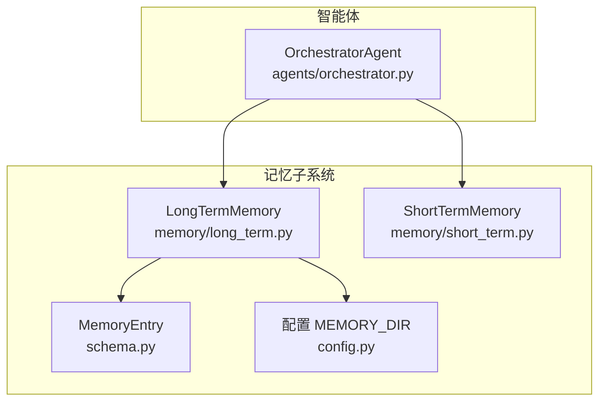
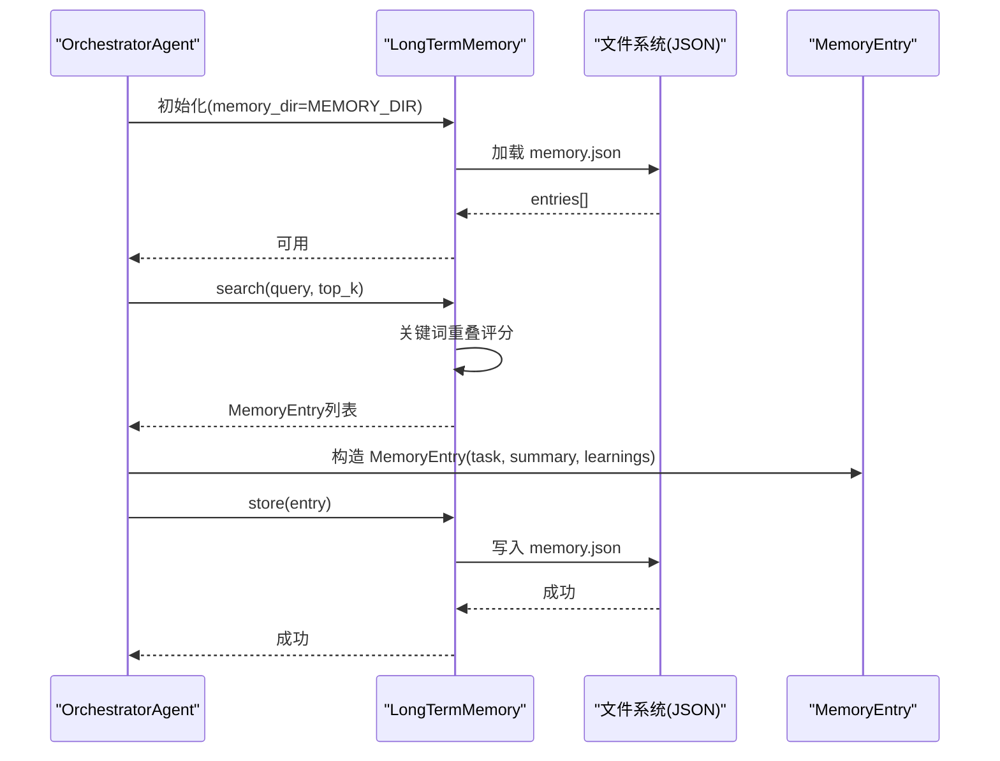
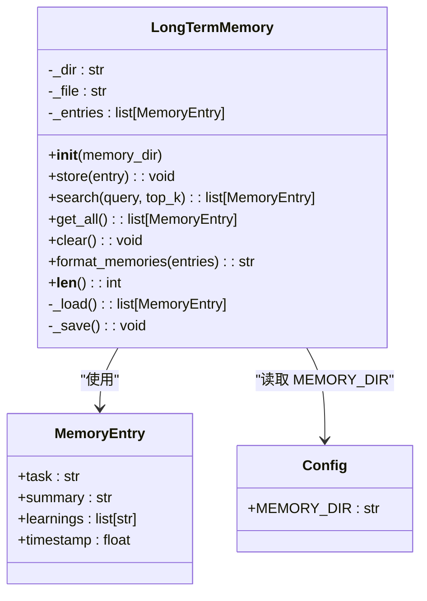
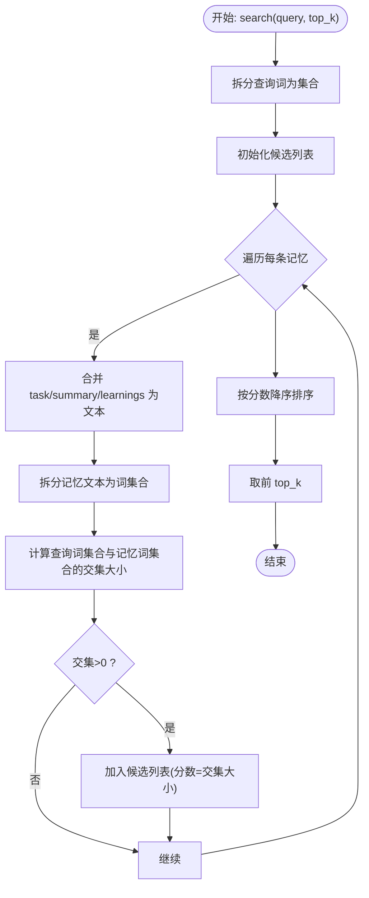
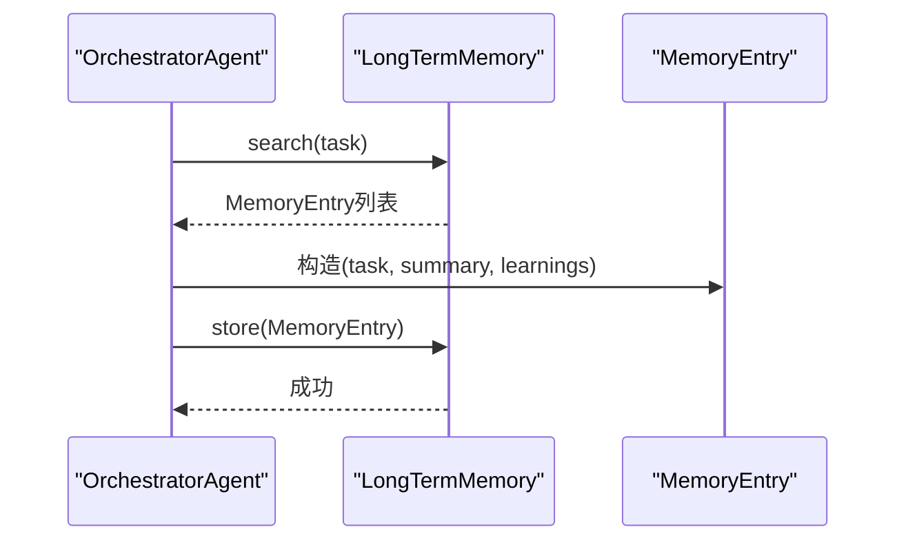
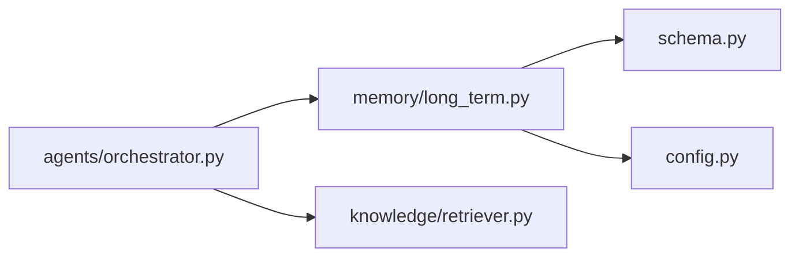

# 长期记忆

<cite>
**本文引用的文件**
- [memory/long_term.py](file://memory/long_term.py)
- [schema.py](file://schema.py)
- [config.py](file://config.py)
- [agents/orchestrator.py](file://agents/orchestrator.py)
- [memory/short_term.py](file://memory/short_term.py)
- [sxw_aicoding/docs/v7_optimization_research.md](file://sxw_aicoding/docs/v7_optimization_research.md)
</cite>

## 目录
1. [简介](#简介)
2. [项目结构](#项目结构)
3. [核心组件](#核心组件)
4. [架构总览](#架构总览)
5. [详细组件分析](#详细组件分析)
6. [依赖分析](#依赖分析)
7. [性能考量](#性能考量)
8. [故障排查指南](#故障排查指南)
9. [结论](#结论)
10. [附录](#附录)

## 简介
本文件面向长期记忆系统，聚焦 LongTermMemory 类的持久化存储机制与数据管理策略，系统阐述记忆数据的保存、加载与查询实现，解释数据格式与存储结构的设计取舍，说明与文件系统的集成方式，并给出配置选项、使用示例与最佳实践。同时，结合项目现状与优化研究文档，讨论长期记忆在智能体学习与经验积累中的作用，以及数据安全与备份策略建议。

## 项目结构
长期记忆位于 memory 子模块，核心文件包括：
- memory/long_term.py：长期记忆实现（JSON 文件持久化、关键词检索、格式化输出）
- schema.py：MemoryEntry 数据模型定义
- config.py：MEMORY_DIR 等配置项
- agents/orchestrator.py：在任务执行流程中使用长期记忆进行上下文收集与经验沉淀
- memory/short_term.py：短期记忆（滑动窗口）与长期记忆配合使用
- sxw_aicoding/docs/v7_optimization_research.md：长期记忆系统升级研究（含 Memdir 四类记忆、语义检索等）

图表来源
- [memory/long_term.py:1-142](file://memory/long_term.py#L1-L142)
- [schema.py:662-671](file://schema.py#L662-L671)
- [config.py:29](file://config.py#L29)
- [agents/orchestrator.py:144-146](file://agents/orchestrator.py#L144-L146)

章节来源
- [memory/long_term.py:1-142](file://memory/long_term.py#L1-L142)
- [schema.py:662-671](file://schema.py#L662-L671)
- [config.py:29](file://config.py#L29)
- [agents/orchestrator.py:144-146](file://agents/orchestrator.py#L144-L146)

## 核心组件
- LongTermMemory：基于 JSON 文件的持久化记忆，支持新增、检索、全量读取、清空与格式化输出，每次新增即持久化，重启后可恢复。
- MemoryEntry：记忆条目数据模型，包含任务、摘要、学习点与时间戳。
- 配置项 MEMORY_DIR：决定长期记忆 JSON 文件的存储目录。
- OrchestratorAgent：在任务完成后将最终答案写入长期记忆，形成“经验沉淀”。

章节来源
- [memory/long_term.py:24-142](file://memory/long_term.py#L24-L142)
- [schema.py:662-671](file://schema.py#L662-L671)
- [config.py:29](file://config.py#L29)
- [agents/orchestrator.py:219](file://agents/orchestrator.py#L219)

## 架构总览
长期记忆在系统中的位置与交互如下：
- 初始化：OrchestratorAgent 在构造时创建 LongTermMemory 实例，指向 MEMORY_DIR。
- 上下文收集：在执行任务前，OrchestratorAgent 调用 LongTermMemory.search 获取相关历史经验，并通过 format_memories 格式化注入到提示词。
- 经验沉淀：任务完成后，OrchestratorAgent 调用 _store_memory 将最终答案封装为 MemoryEntry 并写入长期记忆。

图表来源
- [agents/orchestrator.py:144-146](file://agents/orchestrator.py#L144-L146)
- [agents/orchestrator.py:234-250](file://agents/orchestrator.py#L234-L250)
- [agents/orchestrator.py:219](file://agents/orchestrator.py#L219)
- [memory/long_term.py:42-63](file://memory/long_term.py#L42-L63)
- [memory/long_term.py:70-77](file://memory/long_term.py#L70-L77)
- [schema.py:662-671](file://schema.py#L662-L671)

## 详细组件分析

### LongTermMemory 类
- 职责
  - 持久化：启动时从 MEMORY_DIR 下的 memory.json 加载；每次 store 后立即写回。
  - 查询：基于关键词重叠度评分，返回与查询词在 task/summary/learnings 中出现次数最多的若干条。
  - 输出：format_memories 将 MemoryEntry 列表格式化为可注入提示词的字符串。
  - 管理：get_all 返回全部条目；clear 清空并持久化。
- 数据模型
  - MemoryEntry：包含 task、summary、learnings（列表）、timestamp。
- 存储结构
  - 单文件 JSON：memory.json，数组元素为 MemoryEntry 的序列化对象。
  - 编码：UTF-8，确保中文显示正确。
- 错误处理
  - 加载失败时记录警告并返回空列表，保证系统稳健性。
- 复杂度
  - 搜索：O(N×M)，N 为记忆条目数，M 为平均条目文本长度（按词拆分比较）。
  - 写入：O(N)（序列化+落盘）。
- 与配置的关系
  - memory_dir 可通过构造函数覆盖 config.MEMORY_DIR。

图表来源
- [memory/long_term.py:24-142](file://memory/long_term.py#L24-L142)
- [schema.py:662-671](file://schema.py#L662-L671)
- [config.py:29](file://config.py#L29)

章节来源
- [memory/long_term.py:24-142](file://memory/long_term.py#L24-L142)
- [schema.py:662-671](file://schema.py#L662-L671)
- [config.py:29](file://config.py#L29)

### 搜索算法与评分
- 关键词重叠评分
  - 将查询词与每个条目的 task/summary/learnings 合并文本进行词集合交集计算，交集大小作为相关性分数。
  - 仅返回分数大于 0 的条目，并按分数降序取前 top_k。
- 适用场景
  - demo 场景下简单有效；对语义相似但关键词不匹配的任务效果有限。
- 优化方向（参见优化研究文档）
  - 引入 Memdir 四类记忆（用户偏好、反馈、项目、参考）提升检索粒度。
  - 两阶段检索：关键词粗筛 + LLM 语义精排，限制返回数量避免 token 膨胀。

图表来源
- [memory/long_term.py:79-101](file://memory/long_term.py#L79-L101)

章节来源
- [memory/long_term.py:79-101](file://memory/long_term.py#L79-L101)

### 与智能体的集成
- 上下文收集
  - OrchestratorAgent 在执行任务前调用 long_term.search 获取相关记忆，format_memories 后注入提示词。
- 经验沉淀
  - 任务完成后，将最终答案封装为 MemoryEntry 并调用 long_term.store，形成闭环。

图表来源
- [agents/orchestrator.py:234-250](file://agents/orchestrator.py#L234-L250)
- [agents/orchestrator.py:219](file://agents/orchestrator.py#L219)
- [memory/long_term.py:70-77](file://memory/long_term.py#L70-L77)
- [schema.py:662-671](file://schema.py#L662-L671)

章节来源
- [agents/orchestrator.py:234-250](file://agents/orchestrator.py#L234-L250)
- [agents/orchestrator.py:219](file://agents/orchestrator.py#L219)
- [memory/long_term.py:70-77](file://memory/long_term.py#L70-L77)
- [schema.py:662-671](file://schema.py#L662-L671)

### 数据模型与存储格式
- MemoryEntry 字段
  - task：原始任务描述
  - summary：执行结果摘要
  - learnings：从本次任务中提取的学习点列表
  - timestamp：记录时间戳
- 存储格式
  - memory.json：数组，元素为 MemoryEntry 的 model_dump() 结果（JSON 对象）。
  - 写入时使用 UTF-8 编码与缩进格式，便于人工阅读与版本控制。

章节来源
- [schema.py:662-671](file://schema.py#L662-L671)
- [memory/long_term.py:62](file://memory/long_term.py#L62)

## 依赖分析
- 组件耦合
  - LongTermMemory 依赖 MemoryEntry（数据模型）与 config.MEMORY_DIR（配置）。
  - OrchestratorAgent 依赖 LongTermMemory 与 KnowledgeRetriever/Knowledge 模块共同提供上下文。
- 外部依赖
  - 文件系统：JSON 文件读写。
  - 配置模块：环境变量或 .env 文件加载 MEMORY_DIR。
- 潜在循环依赖
  - 当前模块间为单向依赖，无循环。

图表来源
- [agents/orchestrator.py:144-146](file://agents/orchestrator.py#L144-L146)
- [memory/long_term.py:18-19](file://memory/long_term.py#L18-L19)
- [config.py:29](file://config.py#L29)

章节来源
- [agents/orchestrator.py:144-146](file://agents/orchestrator.py#L144-L146)
- [memory/long_term.py:18-19](file://memory/long_term.py#L18-L19)
- [config.py:29](file://config.py#L29)

## 性能考量
- 搜索复杂度
  - O(N×M)：N 为记忆条目数，M 为平均条目文本长度。当条目规模增长时，查询开销线性上升。
- I/O 开销
  - 每次 store 都会写回 JSON 文件，频繁写入可能影响性能。建议在高并发场景下引入批量写入或异步写入策略。
- Token 消耗
  - format_memories 将记忆注入提示词，top_k 参数可控制上下文长度，避免过度占用上下文窗口。
- 优化建议（参见优化研究文档）
  - 引入 Memdir 四类记忆，按类别检索减少无效扫描。
  - 两阶段检索：关键词粗筛 + LLM 语义精排，限制返回数量。
  - 对大文件采用增量更新或分片存储策略。

[本节为通用性能讨论，不直接分析具体文件]

## 故障排查指南
- 无法加载长期记忆
  - 现象：启动时报警告，返回空列表。
  - 可能原因：memory.json 不存在或格式异常。
  - 处理：检查 MEMORY_DIR 路径权限与文件完整性；必要时删除或修复 JSON。
- 写入失败
  - 现象：store 后未持久化。
  - 可能原因：磁盘空间不足、权限不足、编码问题。
  - 处理：确认目录可写、磁盘空间充足、文件未被其他进程占用。
- 检索结果为空
  - 现象：search 返回空列表。
  - 可能原因：查询词与记忆文本无关键词重叠；top_k 过小。
  - 处理：放宽查询词或增大 top_k；考虑引入语义检索。
- 配置未生效
  - 现象：MEMORY_DIR 未按预期。
  - 可能原因：环境变量未设置或 .env 未加载。
  - 处理：检查 .env 或系统环境变量；确认加载顺序。

章节来源
- [memory/long_term.py:53-55](file://memory/long_term.py#L53-L55)
- [memory/long_term.py:62](file://memory/long_term.py#L62)
- [config.py:11](file://config.py#L11)

## 结论
LongTermMemory 通过简单可靠的 JSON 文件持久化，实现了跨会话的经验沉淀与检索。其关键词重叠评分在 demo 场景下具备实用价值，但在语义理解与检索粒度方面存在局限。结合优化研究文档的 Memdir 四类记忆与两阶段检索方案，可进一步提升长期记忆的准确性与可维护性。建议在生产环境中引入备份与增量写入策略，确保数据安全与性能稳定。

[本节为总结性内容，不直接分析具体文件]

## 附录

### 配置选项
- MEMORY_DIR：长期记忆 JSON 文件所在目录（默认位于用户主目录下的 .manus_demo）
- SHORT_TERM_WINDOW：短期记忆滑动窗口大小（与长期记忆协同使用）

章节来源
- [config.py:29](file://config.py#L29)
- [config.py:30](file://config.py#L30)

### 使用示例（路径指引）
- 初始化与使用
  - 在智能体中创建 LongTermMemory 实例：[agents/orchestrator.py:144-146](file://agents/orchestrator.py#L144-L146)
  - 搜索相关记忆：[agents/orchestrator.py:234-250](file://agents/orchestrator.py#L234-L250)
  - 写入经验：[agents/orchestrator.py:219](file://agents/orchestrator.py#L219)
- 数据模型
  - MemoryEntry 字段定义：[schema.py:662-671](file://schema.py#L662-L671)
- 搜索实现
  - 关键词重叠评分与排序：[memory/long_term.py:79-101](file://memory/long_term.py#L79-L101)
- 持久化实现
  - 加载与保存：[memory/long_term.py:42-63](file://memory/long_term.py#L42-L63)

### 数据安全与备份策略建议
- 备份
  - 周期性复制 memory.json 至安全位置或版本控制系统。
  - 对重要历史经验进行归档，避免单点故障。
- 访问控制
  - 限制 MEMORY_DIR 目录权限，仅允许运行用户访问。
- 完整性校验
  - 定期校验 JSON 格式，发现异常及时修复或回滚。
- 备选方案
  - 引入 Memdir 四类记忆与语义检索，降低关键词匹配误差带来的风险。
  - 参考优化研究文档中的两阶段检索与限制返回数量策略，避免 token 膨胀与性能退化。

章节来源
- [sxw_aicoding/docs/v7_optimization_research.md:666-797](file://sxw_aicoding/docs/v7_optimization_research.md#L666-L797)
- [sxw_aicoding/docs/v7_optimization_research.md:886-962](file://sxw_aicoding/docs/v7_optimization_research.md#L886-L962)