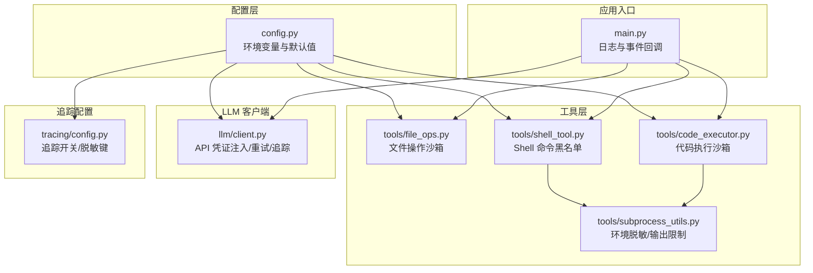
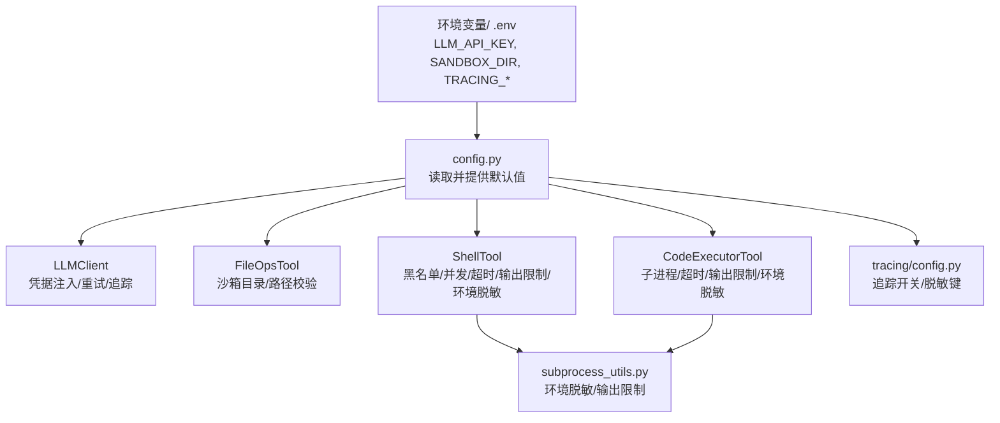
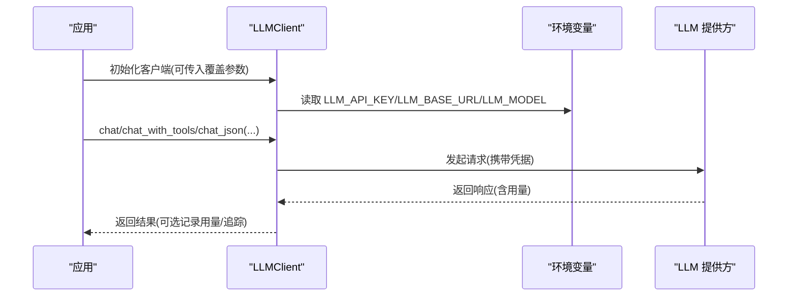
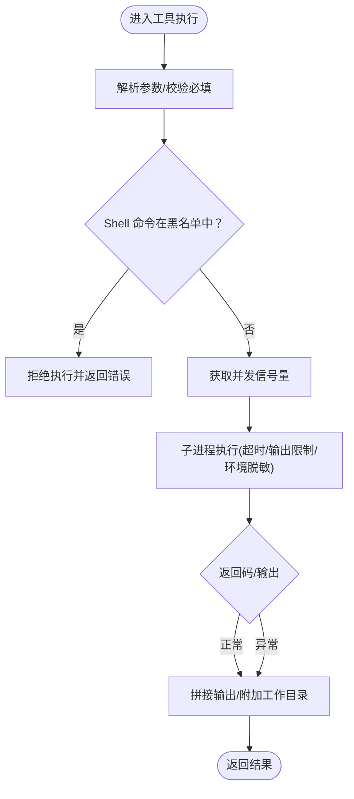
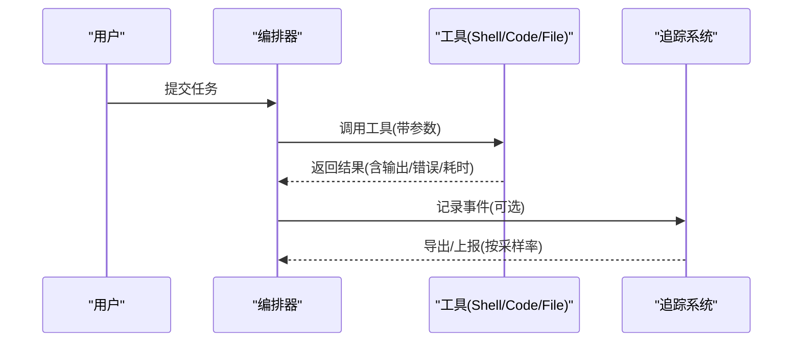
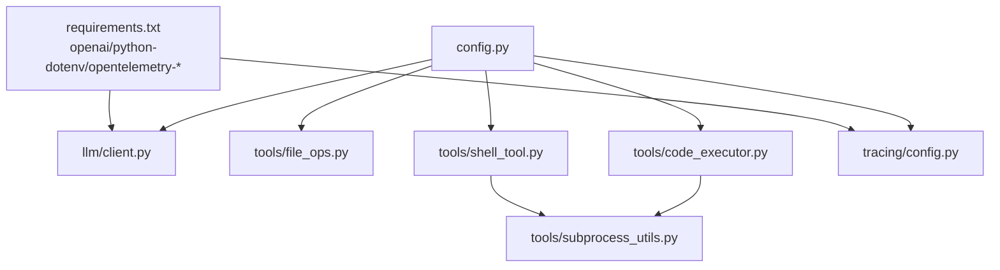

# 安全配置

<cite>
**本文引用的文件**
- [config.py](file://config.py)
- [main.py](file://main.py)
- [llm/client.py](file://llm/client.py)
- [tools/code_executor.py](file://tools/code_executor.py)
- [tools/shell_tool.py](file://tools/shell_tool.py)
- [tools/file_ops.py](file://tools/file_ops.py)
- [tools/subprocess_utils.py](file://tools/subprocess_utils.py)
- [tracing/config.py](file://tracing/config.py)
- [requirements.txt](file://requirements.txt)
- [tests/test_shell_tool.py](file://tests/test_shell_tool.py)
- [tests/test_tracing.py](file://tests/test_tracing.py)
</cite>

## 目录
1. [简介](#简介)
2. [项目结构](#项目结构)
3. [核心组件](#核心组件)
4. [架构总览](#架构总览)
5. [详细组件分析](#详细组件分析)
6. [依赖分析](#依赖分析)
7. [性能考虑](#性能考虑)
8. [故障排查指南](#故障排查指南)
9. [结论](#结论)
10. [附录](#附录)

## 简介
本指南面向 manus_demo 的安全配置，围绕以下主题提供系统化的配置建议与最佳实践：
- API 密钥安全管理：环境变量使用、密钥轮换策略、访问控制机制
- 沙箱安全配置：SANDBOX_DIR 目录权限、文件操作安全限制、Shell 命令执行安全策略、代码执行隔离机制
- 网络通信安全：LLM API 端点验证、HTTPS 证书配置、代理设置、防火墙规则
- 数据安全与隐私保护：敏感信息过滤、日志脱敏、数据加密存储
- 安全审计与监控：安全事件响应流程与最佳实践

## 项目结构
manus_demo 采用模块化设计，安全相关配置主要集中在配置模块与工具模块中：
- 配置模块集中定义环境变量读取与默认值
- 工具模块对 LLM、文件操作、Shell、代码执行进行封装，并内置安全限制
- 追踪模块提供可选的全链路追踪与脱敏能力

图表来源
- [config.py:1-109](file://config.py#L1-L109)
- [main.py:395-516](file://main.py#L395-L516)
- [llm/client.py:32-67](file://llm/client.py#L32-L67)
- [tools/file_ops.py:23-31](file://tools/file_ops.py#L23-L31)
- [tools/shell_tool.py:25-61](file://tools/shell_tool.py#L25-L61)
- [tools/code_executor.py:25-37](file://tools/code_executor.py#L25-L37)
- [tools/subprocess_utils.py:38-52](file://tools/subprocess_utils.py#L38-L52)
- [tracing/config.py:14-43](file://tracing/config.py#L14-L43)

章节来源
- [config.py:1-109](file://config.py#L1-L109)
- [main.py:395-516](file://main.py#L395-L516)

## 核心组件
- 配置模块：集中读取环境变量，提供 LLM 凭证、沙箱目录、并发与超时、追踪等配置项
- LLM 客户端：注入 API 凭证、可选重试、令牌用量追踪、可选 OpenTelemetry 追踪
- 文件操作工具：限制在沙箱目录内，防路径穿越
- Shell 工具：命令黑名单、并发限制、超时与输出限制、环境脱敏
- 代码执行工具：子进程隔离、超时与输出限制、环境脱敏
- 追踪配置：集中开关、后端、采样率、提示记录开关、属性长度限制、敏感键脱敏

章节来源
- [config.py:13-109](file://config.py#L13-L109)
- [llm/client.py:32-67](file://llm/client.py#L32-L67)
- [tools/file_ops.py:23-96](file://tools/file_ops.py#L23-L96)
- [tools/shell_tool.py:25-151](file://tools/shell_tool.py#L25-L151)
- [tools/code_executor.py:25-101](file://tools/code_executor.py#L25-L101)
- [tracing/config.py:14-79](file://tracing/config.py#L14-L79)

## 架构总览
下图展示了安全相关的配置与组件交互关系，强调凭据注入、沙箱隔离、输出限制与追踪脱敏。

图表来源
- [config.py:13-109](file://config.py#L13-L109)
- [llm/client.py:32-67](file://llm/client.py#L32-L67)
- [tools/file_ops.py:23-31](file://tools/file_ops.py#L23-L31)
- [tools/shell_tool.py:25-61](file://tools/shell_tool.py#L25-L61)
- [tools/code_executor.py:25-37](file://tools/code_executor.py#L25-L37)
- [tools/subprocess_utils.py:38-52](file://tools/subprocess_utils.py#L38-L52)
- [tracing/config.py:14-43](file://tracing/config.py#L14-L43)

## 详细组件分析

### API 密钥安全管理
- 环境变量使用
  - LLM 凭证通过环境变量注入，优先级高于硬编码，生产环境务必通过 .env 或系统环境变量注入
  - LLM 客户端构造时从配置模块读取 base_url、api_key、model 等参数
- 密钥轮换策略
  - 建议通过 CI/CD 管道滚动更新 LLM_API_KEY，配合重试机制降低轮换窗口影响
  - 重试策略：指数退避，最大重试次数与退避因子可配置
- 访问控制机制
  - LLM 调用仅通过客户端封装，避免直接在业务代码中暴露凭证
  - 追踪记录可选择不记录完整 prompt，降低敏感信息泄露风险

图表来源
- [llm/client.py:41-67](file://llm/client.py#L41-L67)
- [config.py:13-20](file://config.py#L13-L20)

章节来源
- [config.py:13-20](file://config.py#L13-L20)
- [llm/client.py:32-67](file://llm/client.py#L32-L67)

### 沙箱安全配置
- SANDBOX_DIR 目录权限设置
  - 默认位于用户家目录下的隐藏目录，确保最小权限原则
  - 文件操作工具在初始化时创建目录，避免权限不足导致的执行失败
- 文件操作安全限制
  - 路径解析使用绝对路径与 realpath，拒绝逃出沙箱的路径
  - 仅允许在沙箱目录内进行读写与列举
- Shell 命令执行安全策略
  - 命令黑名单：覆盖破坏性文件系统操作、提权、远程执行、系统服务管理、凭据导出等
  - 并发限制：通过信号量限制同时运行的 Shell 子进程数量
  - 超时与输出限制：防止长时间运行与内存耗尽
  - 环境脱敏：子进程环境变量中剔除敏感键（如 API Key、Token、Secret 等）
- 代码执行隔离机制
  - 代码执行同样在子进程中进行，工作目录为沙箱目录
  - 与 Shell 工具一致的超时、输出限制与环境脱敏策略

图表来源
- [tools/shell_tool.py:99-151](file://tools/shell_tool.py#L99-L151)
- [tools/subprocess_utils.py:62-101](file://tools/subprocess_utils.py#L62-L101)

章节来源
- [config.py:69-77](file://config.py#L69-L77)
- [tools/file_ops.py:23-96](file://tools/file_ops.py#L23-L96)
- [tools/shell_tool.py:25-151](file://tools/shell_tool.py#L25-L151)
- [tools/code_executor.py:25-101](file://tools/code_executor.py#L25-L101)
- [tools/subprocess_utils.py:38-52](file://tools/subprocess_utils.py#L38-L52)

### 网络通信安全
- LLM API 端点验证
  - 支持任意 OpenAI 兼容接口，可通过 base_url 指向不同提供商
  - 建议在生产环境固定 base_url 并使用 HTTPS
- HTTPS 证书配置
  - 使用系统默认证书栈；如需自定义 CA，可在运行环境中配置 SSL 证书路径
- 代理设置
  - 通过系统环境变量配置 HTTP/HTTPS 代理，LLM 客户端将沿用系统代理
- 防火墙规则
  - 仅开放必要的出站端口（如 443），限制入站访问
  - 如需本地追踪导出，仅开放本地监听端口（如 OTLP 端点）

章节来源
- [config.py:13-20](file://config.py#L13-L20)
- [llm/client.py:50-54](file://llm/client.py#L50-L54)

### 数据安全与隐私保护
- 敏感信息过滤
  - 子进程环境脱敏：自动剔除包含敏感键的环境变量
  - 追踪脱敏：可配置敏感键集合，避免在追踪属性中记录敏感信息
- 日志脱敏
  - 追踪日志可选择不记录完整 prompt，降低泄露风险
  - 属性值最大长度限制，防止超长日志造成资源浪费
- 数据加密存储
  - 建议对长期记忆与知识库文件采用文件系统级加密或容器级加密
  - 传输通道使用 HTTPS/TLS，避免明文传输

章节来源
- [tools/subprocess_utils.py:28-52](file://tools/subprocess_utils.py#L28-L52)
- [tracing/config.py:70-79](file://tracing/config.py#L70-L79)
- [config.py:101-109](file://config.py#L101-L109)

### 安全审计与监控
- 追踪与可观测性
  - 可选开启全链路追踪，支持多种导出后端（控制台、文件、OTLP、Phoenix）
  - 采样率可控，避免高负载时的性能开销
  - 可选择是否记录完整 prompt，兼顾可观测性与隐私
- 安全事件响应流程
  - 发现异常（如命令被拦截、超时、输出截断）立即记录并告警
  - 审计日志包含：事件类型、工具调用、参数摘要、返回码、耗时
  - 建议接入集中式日志与告警平台，设置阈值与规则

图表来源
- [main.py:448-455](file://main.py#L448-L455)
- [llm/client.py:317-420](file://llm/client.py#L317-L420)
- [tracing/config.py:14-43](file://tracing/config.py#L14-L43)

章节来源
- [main.py:395-516](file://main.py#L395-L516)
- [llm/client.py:317-420](file://llm/client.py#L317-L420)
- [tracing/config.py:14-79](file://tracing/config.py#L14-L79)

## 依赖分析
- 外部依赖
  - OpenAI SDK：LLM 客户端依赖
  - OpenTelemetry：可选追踪能力
  - python-dotenv：.env 文件加载
- 内部依赖
  - 配置模块为所有组件提供统一的环境变量读取与默认值
  - 工具模块依赖子进程工具进行安全执行
  - 追踪配置模块依赖根配置模块

图表来源
- [requirements.txt:1-19](file://requirements.txt#L1-L19)
- [config.py:13-109](file://config.py#L13-L109)
- [llm/client.py:24-25](file://llm/client.py#L24-L25)
- [tracing/config.py:11](file://tracing/config.py#L11)

章节来源
- [requirements.txt:1-19](file://requirements.txt#L1-L19)
- [config.py:13-109](file://config.py#L13-L109)

## 性能考虑
- 并发与超时
  - Shell 与代码执行均有限流与超时，避免资源耗尽
  - 输出大小限制防止大体量输出占用内存
- 追踪开销
  - 关闭追踪可零开销；开启时合理设置采样率与属性长度上限
- 日志级别
  - 生产环境建议 INFO 级别，避免过多 DEBUG 日志

## 故障排查指南
- Shell 命令被拦截
  - 检查命令是否命中黑名单；必要时调整命令或使用替代方案
- 超时或输出截断
  - 调整超时与输出限制配置；确认子进程是否被正确清理
- 环境变量泄漏
  - 确认敏感键是否被剔除；检查测试用例中的环境注入
- 追踪未生效
  - 检查追踪开关与后端配置；确认 OpenTelemetry 依赖安装

章节来源
- [tests/test_shell_tool.py:153-197](file://tests/test_shell_tool.py#L153-L197)
- [tests/test_tracing.py:35-72](file://tests/test_tracing.py#L35-L72)
- [tools/subprocess_utils.py:38-52](file://tools/subprocess_utils.py#L38-L52)

## 结论
manus_demo 在配置层统一管理安全相关参数，在工具层内置了沙箱隔离、命令黑名单、环境脱敏、输出限制与并发控制等安全机制。结合可选的追踪与脱敏策略，可在保障功能可用的同时显著提升安全性与可观测性。建议在生产环境中严格遵循环境变量注入、最小权限、输出限制与追踪脱敏的最佳实践，并建立完善的审计与告警体系。

## 附录
- 常用配置项速览
  - LLM_BASE_URL、LLM_API_KEY、LLM_MODEL：LLM 凭证与模型
  - SANDBOX_DIR：沙箱目录
  - CODE_EXEC_TIMEOUT、SHELL_EXEC_TIMEOUT、SUBPROCESS_MAX_OUTPUT_BYTES：执行超时与输出限制
  - SHELL_MAX_CONCURRENT、CODE_MAX_CONCURRENT：并发限制
  - TRACING_ENABLED、TRACING_BACKEND、TRACING_ENDPOINT、TRACING_SAMPLE_RATE、TRACING_LOG_PROMPTS、TRACING_MAX_ATTRIBUTE_LENGTH：追踪开关与脱敏

章节来源
- [config.py:13-109](file://config.py#L13-L109)