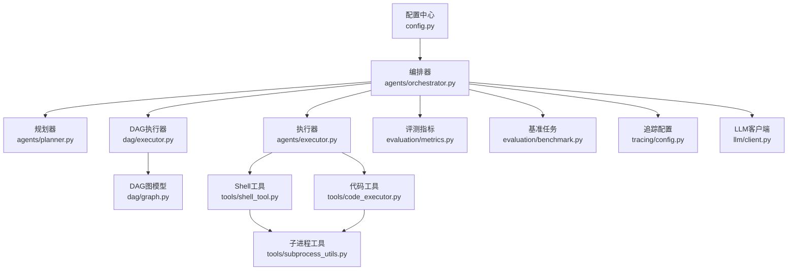
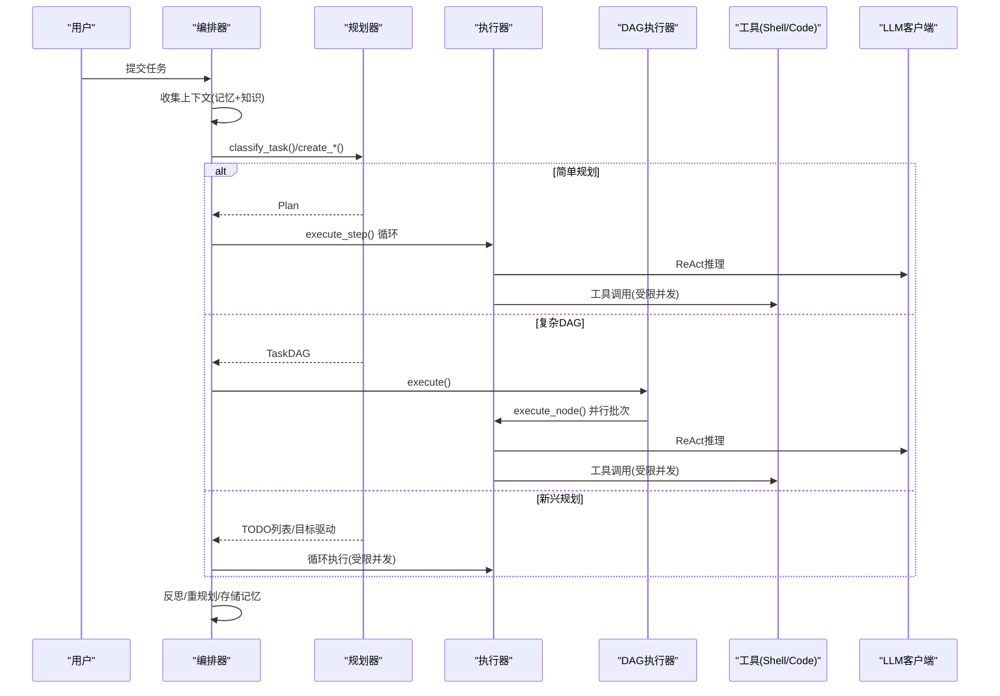
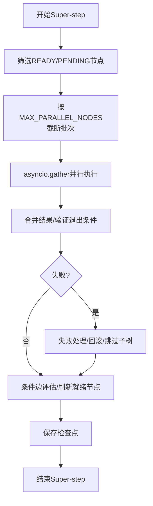
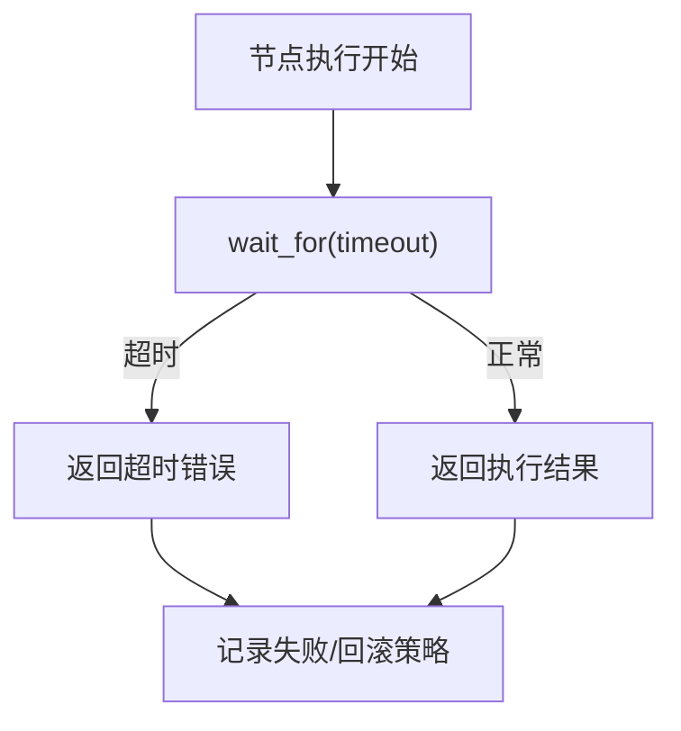
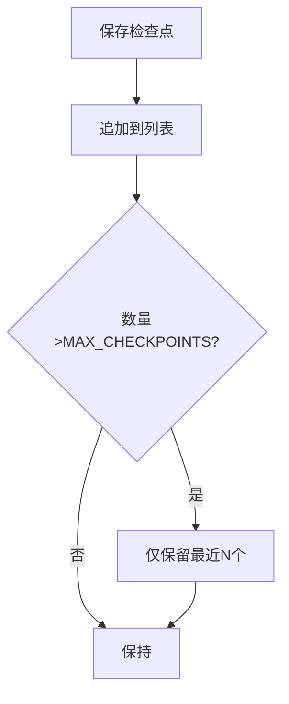
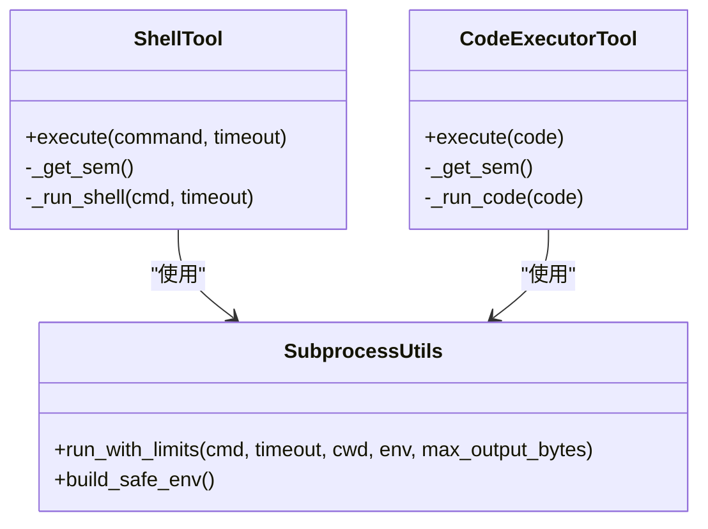
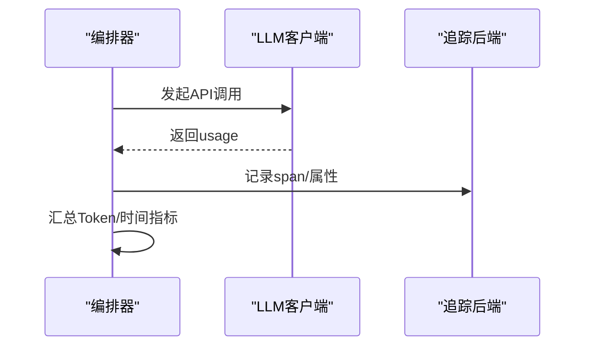
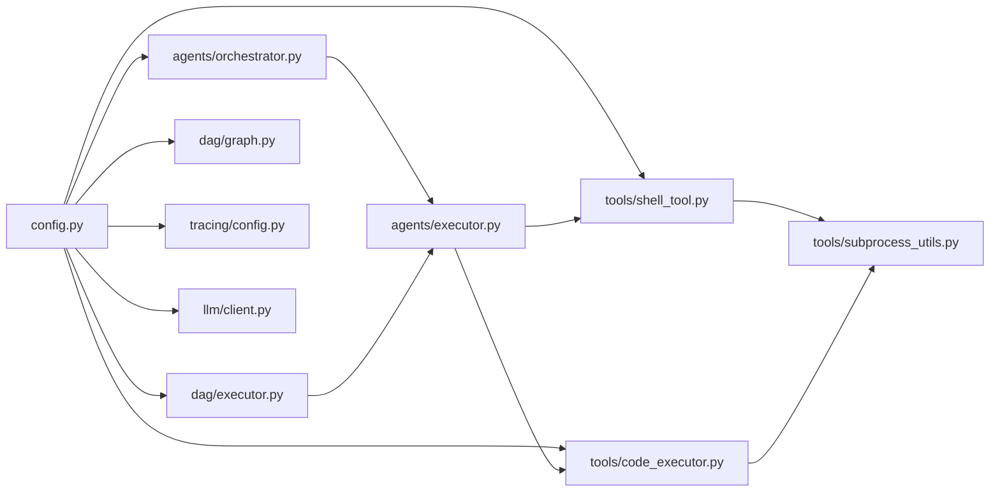

# 性能优化

<cite>
**本文引用的文件**
- [config.py](file://config.py)
- [orchestrator.py](file://agents/orchestrator.py)
- [executor.py](file://agents/executor.py)
- [dag/executor.py](file://dag/executor.py)
- [dag/graph.py](file://dag/graph.py)
- [code_executor.py](file://tools/code_executor.py)
- [shell_tool.py](file://tools/shell_tool.py)
- [subprocess_utils.py](file://tools/subprocess_utils.py)
- [metrics.py](file://evaluation/metrics.py)
- [benchmark.py](file://evaluation/benchmark.py)
- [test_optimizations.py](file://tests/test_optimizations.py)
- [tracing/config.py](file://tracing/config.py)
- [client.py](file://llm/client.py)
- [v7_optimization_research.md](file://sxw_aicoding/docs/v7_optimization_research.md)
- [DAG推理执行代码深度分析与优化方案.md](file://.trae/documents/DAG推理执行代码深度分析与优化方案.md)
</cite>

## 目录
1. [简介](#简介)
2. [项目结构](#项目结构)
3. [核心组件](#核心组件)
4. [架构总览](#架构总览)
5. [详细组件分析](#详细组件分析)
6. [依赖分析](#依赖分析)
7. [性能考量](#性能考量)
8. [故障排查指南](#故障排查指南)
9. [结论](#结论)
10. [附录](#附录)

## 简介
本指南面向 manus_demo 的性能优化实践，围绕配置参数、执行模式、并发与资源控制、监控与分析等方面，给出可落地的调优建议与可视化说明。重点覆盖：
- 并行执行优化：MAX_PARALLEL_NODES、工具并发上限
- 超时参数调优：NODE_EXECUTION_TIMEOUT、CODE_EXEC_TIMEOUT、SHELL_EXEC_TIMEOUT
- 内存与检查点：MAX_CHECKPOINTS、MEMORY_DIR
- 规划模式性能特征：简单规划、复杂DAG规划、新兴规划
- 工具执行优化：并发控制、输出缓冲、进程池
- 监控与分析：Token 使用追踪、执行时间统计、资源监控
- 高级优化：缓存策略、连接池、网络请求优化

## 项目结构
manus_demo 采用“配置中心 + 多智能体 + DAG 执行 + 工具集”的分层组织：
- 配置层：集中于 config.py，读取环境变量或 .env，统一暴露运行参数
- 智能体层：Orchestrator 负责路由与编排，Planner/Executor/Reflector 等子智能体分工协作
- 执行层：DAGExecutor 实现 Super-step 并行执行；ExecutorAgent 实现 ReAct 循环
- 工具层：Shell/Code 执行工具封装子进程，带超时与输出限制
- 评测与监控：metrics/benchmark 提供指标与评测；tracing 提供链路追踪；LLMClient 提供 Token 追踪

图表来源
- [config.py](file://config.py)
- [orchestrator.py](file://agents/orchestrator.py)
- [executor.py](file://agents/executor.py)
- [dag/executor.py](file://dag/executor.py)
- [dag/graph.py](file://dag/graph.py)
- [code_executor.py](file://tools/code_executor.py)
- [shell_tool.py](file://tools/shell_tool.py)
- [subprocess_utils.py](file://tools/subprocess_utils.py)
- [metrics.py](file://evaluation/metrics.py)
- [benchmark.py](file://evaluation/benchmark.py)
- [tracing/config.py](file://tracing/config.py)
- [client.py](file://llm/client.py)

章节来源
- [config.py](file://config.py)
- [orchestrator.py](file://agents/orchestrator.py)

## 核心组件
- 配置中心：集中管理 LLM、Agent 限制、DAG 执行、工具执行、追踪、Token 追踪等参数
- 编排器：根据任务复杂度路由到 simple/complex/emergent 路径，驱动执行与反思
- DAG 执行器：基于 Super-step 的并行执行引擎，支持失败处理、条件边、自适应规划与检查点
- 执行器：ReAct 循环，结合工具路由与 LLM，完成单节点/步骤的推理与行动
- 工具层：Shell/Code 工具通过子进程执行，带超时、输出限制与并发信号量
- 评测与监控：指标体系、基准任务、追踪配置、LLM Token 追踪

章节来源
- [config.py](file://config.py)
- [orchestrator.py](file://agents/orchestrator.py)
- [dag/executor.py](file://dag/executor.py)
- [executor.py](file://agents/executor.py)
- [code_executor.py](file://tools/code_executor.py)
- [shell_tool.py](file://tools/shell_tool.py)
- [subprocess_utils.py](file://tools/subprocess_utils.py)
- [metrics.py](file://evaluation/metrics.py)
- [benchmark.py](file://evaluation/benchmark.py)
- [tracing/config.py](file://tracing/config.py)
- [client.py](file://llm/client.py)

## 架构总览
下面的时序图展示了 Orchestrator 在不同规划模式下的执行流程与关键性能控制点。

图表来源
- [orchestrator.py](file://agents/orchestrator.py)
- [executor.py](file://agents/executor.py)
- [dag/executor.py](file://dag/executor.py)
- [code_executor.py](file://tools/code_executor.py)
- [shell_tool.py](file://tools/shell_tool.py)

## 详细组件分析

### 配置参数与性能影响
- MAX_PARALLEL_NODES：限制每轮 Super-step 并行节点数，直接影响吞吐与资源占用
- NODE_EXECUTION_TIMEOUT：单节点执行超时，避免卡死拖累整体
- CODE_EXEC_TIMEOUT / SHELL_EXEC_TIMEOUT：工具执行超时，保障系统稳定性
- SUBPROCESS_MAX_OUTPUT_BYTES：子进程输出上限，防止内存暴涨
- SHELL_MAX_CONCURRENT / CODE_MAX_CONCURRENT：工具并发上限，避免资源争用
- MAX_CHECKPOINTS：检查点数量上限，控制内存占用
- MEMORY_DIR：长期记忆存储目录，影响磁盘 IO 与持久化开销
- TOKEN_TRACKING_ENABLED：开启后记录每调用的 Token 使用，便于成本分析
- TRACING_*：追踪开关、后端、采样率、属性长度等，影响可观测性与开销

章节来源
- [config.py](file://config.py)

### 并行执行优化（MAX_PARALLEL_NODES）
- DAG 执行器在每轮 Super-step 中按 MAX_PARALLEL_NODES 截断可执行节点批次，并通过 asyncio.gather 并行执行
- 并行度越高，吞吐越大，但 CPU/IO/LLM 限流/内存占用随之上升
- 建议：根据任务复杂度与资源容量逐步调优；复杂 DAG 适当降低并行度以减少冲突与回滚

图表来源
- [dag/executor.py](file://dag/executor.py)

章节来源
- [dag/executor.py](file://dag/executor.py)

### 超时参数调优（NODE_EXECUTION_TIMEOUT、CODE_EXEC_TIMEOUT、SHELL_EXEC_TIMEOUT）
- 节点级超时：DAG 执行器对单节点执行包裹超时，避免阻塞
- 工具级超时：Shell/Code 工具在子进程执行时设置超时与输出上限
- 建议：根据任务典型耗时设定初始值，结合监控与压测逐步收敛

图表来源
- [dag/executor.py](file://dag/executor.py)
- [code_executor.py](file://tools/code_executor.py)
- [shell_tool.py](file://tools/shell_tool.py)
- [subprocess_utils.py](file://tools/subprocess_utils.py)

章节来源
- [dag/executor.py](file://dag/executor.py)
- [code_executor.py](file://tools/code_executor.py)
- [shell_tool.py](file://tools/shell_tool.py)
- [subprocess_utils.py](file://tools/subprocess_utils.py)

### 内存使用优化（MAX_CHECKPOINTS、MEMORY_DIR）
- 检查点：DAG 执行器与图模型在运行中保存检查点，用于回溯与恢复
- MAX_CHECKPOINTS：限制内存中保留的检查点数量，防止长期运行内存泄漏
- MEMORY_DIR：长期记忆存储目录，建议挂载高性能磁盘并定期清理

图表来源
- [dag/graph.py](file://dag/graph.py)
- [dag/executor.py](file://dag/executor.py)
- [test_optimizations.py](file://tests/test_optimizations.py)

章节来源
- [dag/graph.py](file://dag/graph.py)
- [test_optimizations.py](file://tests/test_optimizations.py)

### 规划模式的性能特征
- 简单规划（simple）：顺序执行，ReAct 循环，适合单步/少量步骤任务，CPU/IO 负载较低，Token 消耗可控
- 复杂DAG（complex）：并行 Super-step 执行，适合多步骤、强依赖任务，吞吐高但资源占用大，需合理设置 MAX_PARALLEL_NODES 与超时
- 新兴规划（emergent）：TODO 列表/目标驱动，适合探索性任务，迭代频繁，Token 与工具调用成本较高

章节来源
- [orchestrator.py](file://agents/orchestrator.py)
- [metrics.py](file://evaluation/metrics.py)
- [benchmark.py](file://evaluation/benchmark.py)

### 工具执行性能优化
- 并发控制：Shell/Code 工具各自维护 asyncio.Semaphore，受 SHELL_MAX_CONCURRENT/CODE_MAX_CONCURRENT 控制
- 输出缓冲：SUBPROCESS_MAX_OUTPUT_BYTES 限制单次输出，避免内存暴涨
- 进程池：子进程通过 asyncio.create_subprocess_exec 管理，超时/异常时强制清理，防止孤儿进程
- 建议：根据任务类型与资源情况平衡并发度；对长输出任务适当提高上限或拆分输出

图表来源
- [shell_tool.py](file://tools/shell_tool.py)
- [code_executor.py](file://tools/code_executor.py)
- [subprocess_utils.py](file://tools/subprocess_utils.py)

章节来源
- [shell_tool.py](file://tools/shell_tool.py)
- [code_executor.py](file://tools/code_executor.py)
- [subprocess_utils.py](file://tools/subprocess_utils.py)

### 监控与性能分析
- Token 使用追踪：LLMClient 记录每调用的 Prompt/Completion/Total Token，支持按引擎汇总
- 执行时间统计：评测指标包含执行耗时、ReAct 迭代次数、轨迹效率等
- 追踪：Tracing 配置支持多种后端与采样率，可记录 LLM 调用耗时与 Token 消耗
- 建议：在压测与线上环境中开启必要的追踪与 Token 追踪，结合基准任务对比不同配置的性能表现

图表来源
- [client.py](file://llm/client.py)
- [tracing/config.py](file://tracing/config.py)
- [metrics.py](file://evaluation/metrics.py)

章节来源
- [client.py](file://llm/client.py)
- [tracing/config.py](file://tracing/config.py)
- [metrics.py](file://evaluation/metrics.py)

### 高级性能调优建议
- 缓存策略：短期记忆窗口（SHORT_TERM_WINDOW）与知识检索（KNOWLEDGE_*）可减少重复检索与上下文膨胀
- 连接池与网络：LLM 客户端可引入重试与退避（LLM_RETRY_*），缓解瞬时抖动
- 数据库/持久化：MEMORY_DIR 建议使用高性能存储；检查点与日志定期清理
- 网络请求优化：工具执行前进行必要校验（Shell 命令黑名单），减少无效调用

章节来源
- [config.py](file://config.py)
- [client.py](file://llm/client.py)
- [shell_tool.py](file://tools/shell_tool.py)

## 依赖分析
- 配置中心集中影响执行器、DAG 执行器、工具与追踪等模块
- DAG 执行器依赖执行器与状态机，受 MAX_PARALLEL_NODES、NODE_EXECUTION_TIMEOUT 等参数约束
- 工具层依赖子进程工具，受超时与输出限制约束
- 评测与监控模块依赖指标体系与基准任务，支撑性能对比与回归

图表来源
- [config.py](file://config.py)
- [orchestrator.py](file://agents/orchestrator.py)
- [executor.py](file://agents/executor.py)
- [dag/executor.py](file://dag/executor.py)
- [dag/graph.py](file://dag/graph.py)
- [code_executor.py](file://tools/code_executor.py)
- [shell_tool.py](file://tools/shell_tool.py)
- [subprocess_utils.py](file://tools/subprocess_utils.py)
- [tracing/config.py](file://tracing/config.py)
- [client.py](file://llm/client.py)

章节来源
- [config.py](file://config.py)
- [orchestrator.py](file://agents/orchestrator.py)
- [dag/executor.py](file://dag/executor.py)
- [executor.py](file://agents/executor.py)
- [code_executor.py](file://tools/code_executor.py)
- [shell_tool.py](file://tools/shell_tool.py)
- [subprocess_utils.py](file://tools/subprocess_utils.py)
- [tracing/config.py](file://tracing/config.py)
- [client.py](file://llm/client.py)

## 性能考量
- 并行度与资源：MAX_PARALLEL_NODES 与工具并发上限需与 CPU/IO/LLM 限流相匹配
- 超时与稳定性：合理设置各类超时，避免单点阻塞引发级联失败
- 内存与持久化：检查点数量与存储位置直接影响内存与磁盘压力
- Token 成本：开启 Token 追踪，结合评测指标评估不同配置的成本-效果
- 可观测性：追踪后端与采样率需在可观测性与开销之间权衡

## 故障排查指南
- 节点超时/失败：检查 NODE_EXECUTION_TIMEOUT 与工具超时设置，关注失败处理与回滚
- 并发过高导致资源争用：降低 MAX_PARALLEL_NODES 与工具并发上限
- 内存增长：确认 MAX_CHECKPOINTS 生效，检查 DAG 状态累积与检查点清理
- Token 暴涨：核对 TOKEN_TRACKING_ENABLED 与 LLM 调用频次，优化上下文长度
- 追踪异常：检查 TRACING_* 配置与后端可用性

章节来源
- [dag/executor.py](file://dag/executor.py)
- [code_executor.py](file://tools/code_executor.py)
- [shell_tool.py](file://tools/shell_tool.py)
- [subprocess_utils.py](file://tools/subprocess_utils.py)
- [dag/graph.py](file://dag/graph.py)
- [client.py](file://llm/client.py)
- [tracing/config.py](file://tracing/config.py)

## 结论
manus_demo 的性能优化围绕“配置参数 + 执行模式 + 并发与资源 + 监控分析”四个维度展开。通过合理设置并行度、超时与内存上限，结合 Token 与追踪监控，可在不同规划模式下取得更优的吞吐与成本平衡。建议以基准任务与评测指标为依据，持续迭代调参，形成稳定高效的运行基线。

## 附录
- 相关优化研究与规划：v7 优化技术调研与规划报告、DAG 执行优化方案文档
- 测试用例：DAG 优化测试覆盖检查点、邻接表与边界条件

章节来源
- [v7_optimization_research.md](file://sxw_aicoding/docs/v7_optimization_research.md)
- [DAG推理执行代码深度分析与优化方案.md](file://.trae/documents/DAG推理执行代码深度分析与优化方案.md)
- [test_optimizations.py](file://tests/test_optimizations.py)