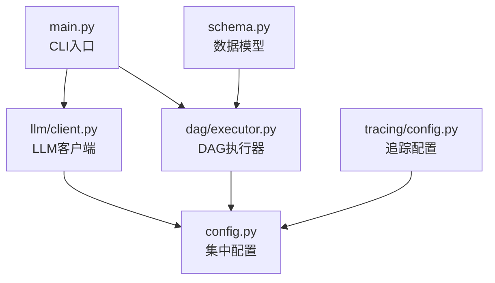
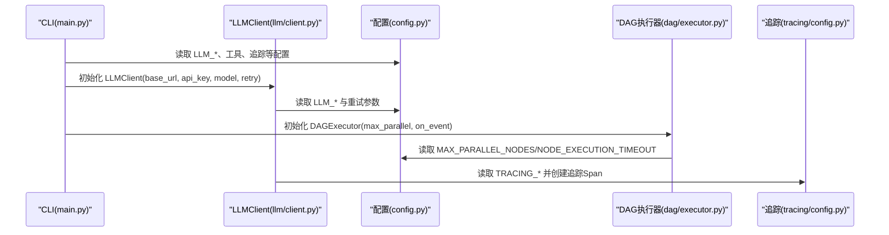
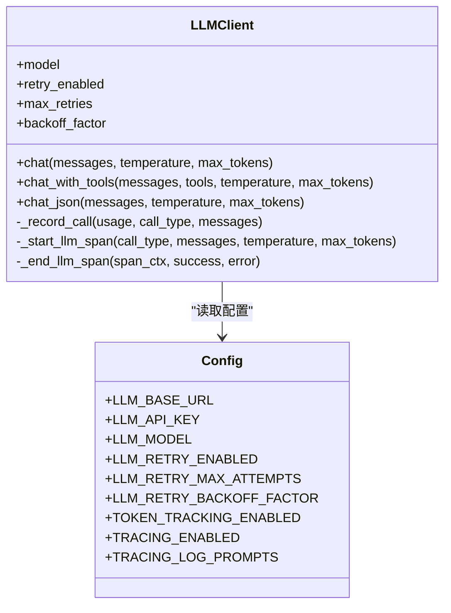
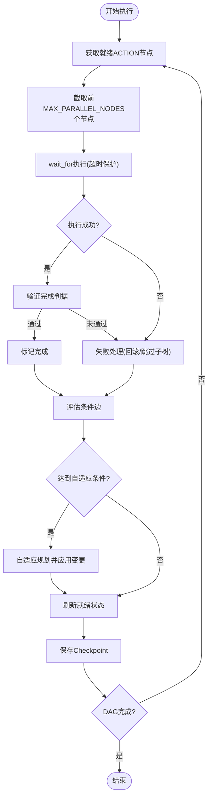
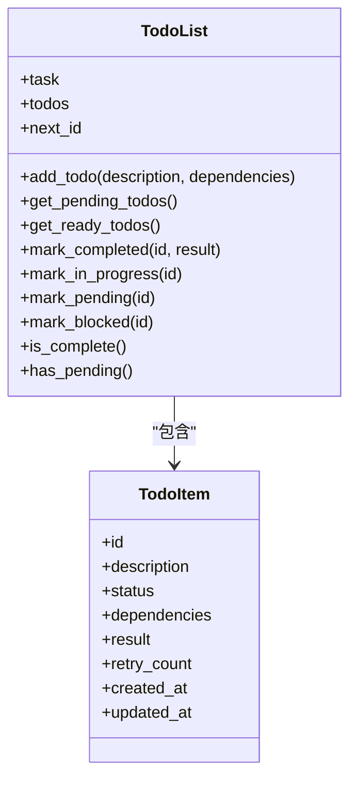
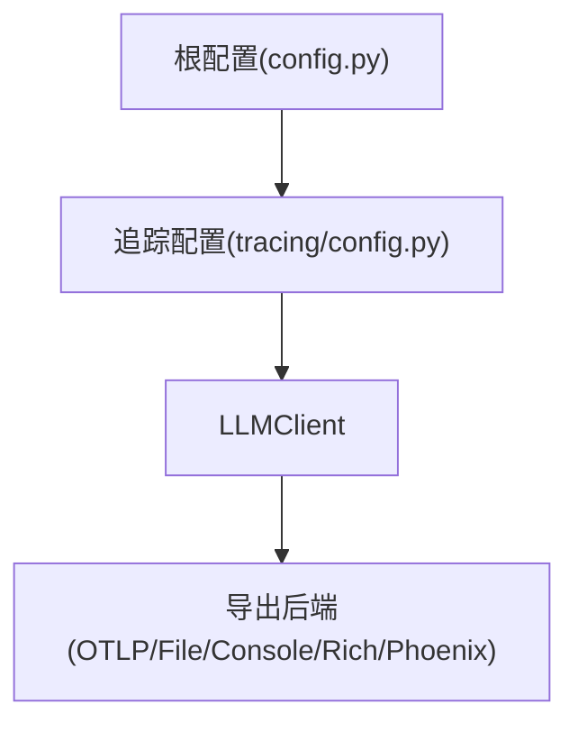
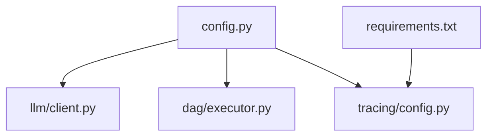

# 环境配置

<cite>
**本文引用的文件**
- [config.py](file://config.py)
- [backups/config.py](file://backups/config.py)
- [main.py](file://main.py)
- [schema.py](file://schema.py)
- [llm/client.py](file://llm/client.py)
- [dag/executor.py](file://dag/executor.py)
- [tracing/config.py](file://tracing/config.py)
- [requirements.txt](file://requirements.txt)
</cite>

## 目录
1. [简介](#简介)
2. [项目结构](#项目结构)
3. [核心组件](#核心组件)
4. [架构总览](#架构总览)
5. [详细组件分析](#详细组件分析)
6. [依赖分析](#依赖分析)
7. [性能考虑](#性能考虑)
8. [故障排查指南](#故障排查指南)
9. [结论](#结论)
10. [附录](#附录)

## 简介
本指南面向 manus_demo 项目的环境配置，系统性说明所有可配置参数的作用、默认值、取值范围与推荐实践。内容涵盖：
- LLM API 配置（基础URL、API密钥、模型名称）
- 智能体执行限制（上下文Token上限、ReAct循环迭代次数、重规划尝试次数）
- 记忆系统配置（长期记忆存储目录、短期记忆窗口大小）
- 知识库配置（文档目录、切片大小、检索条数）
- 规划路由选项（自动/简单/复杂/新兴模式）
- DAG 执行参数（最大并行节点数、节点执行超时、Checkpoint 数量）
- 自适应规划设置
- 工具路由阈值
- 隐式规划配置
- 工具执行参数（沙箱目录、代码/Shell 执行超时、并发限制、输出大小限制）
- 功能开关标志（ReAct 引擎 v2、目标驱动规划、LLM 重试、Token 追踪、全链路追踪）
- LLM 客户端重试机制
- 全链路追踪配置（后端、端点、服务名、采样率、提示记录、属性长度）

## 项目结构
manus_demo 的配置主要集中在根级配置模块，其他组件通过导入该模块获取运行参数。关键文件与职责如下：
- config.py：集中定义所有运行时配置项，支持从 .env 与环境变量加载，具备明确默认值与注释
- main.py：CLI 入口，初始化 LLM 客户端与工具，绑定事件回调用于 UI 展示
- llm/client.py：LLM 客户端封装，读取 config 中的 LLM_* 参数与重试配置
- dag/executor.py：DAG 执行器，读取并使用 MAX_PARALLEL_NODES、NODE_EXECUTION_TIMEOUT、MAX_CHECKPOINTS 等配置
- tracing/config.py：全链路追踪配置，从根配置读取并派生导出参数
- schema.py：数据模型，包含 Token 追踪、TODO 列表、目标驱动规划等结构，用于理解配置的使用场景
- requirements.txt：追踪相关依赖清单

图表来源
- [config.py:1-109](file://config.py#L1-L109)
- [main.py:448-455](file://main.py#L448-L455)
- [llm/client.py:41-58](file://llm/client.py#L41-L58)
- [dag/executor.py:98-104](file://dag/executor.py#L98-L104)
- [tracing/config.py:17-43](file://tracing/config.py#L17-L43)

章节来源
- [config.py:1-109](file://config.py#L1-L109)
- [main.py:448-455](file://main.py#L448-L455)
- [llm/client.py:41-58](file://llm/client.py#L41-L58)
- [dag/executor.py:98-104](file://dag/executor.py#L98-L104)
- [tracing/config.py:17-43](file://tracing/config.py#L17-L43)

## 核心组件
本节对关键配置项进行分类说明，包括作用、默认值、取值范围与典型场景建议。

- LLM API 配置
  - LLM_BASE_URL：LLM 基础接口地址，默认指向 OpenAI 兼容服务地址
  - LLM_API_KEY：API 密钥，建议通过 .env 或环境变量注入
  - LLM_MODEL：模型名称，默认 deepseek-chat
  - 用途：统一 LLM 客户端初始化参数，支持多种 OpenAI 兼容提供商
  - 参考实现：[llm/client.py:41-58](file://llm/client.py#L41-L58)

- 智能体执行限制
  - MAX_CONTEXT_TOKENS：上下文 Token 上限，默认 8000，超限时触发摘要压缩
  - MAX_REACT_ITERATIONS：每个 Action 节点 ReAct 循环最大迭代次数，默认 10
  - MAX_REPLAN_ATTEMPTS：反思失败后最大重规划次数，默认 3
  - 用途：控制 LLM 推理成本与稳定性，避免无限循环

- 记忆系统配置
  - MEMORY_DIR：长期记忆存储目录，默认 ~/.manus_demo
  - SHORT_TERM_WINDOW：短期记忆滑动窗口大小，默认 20 条
  - 用途：持久化任务摘要与学习点，支持跨轮对话记忆

- 知识库配置
  - KNOWLEDGE_DOCS_DIR：知识文档目录（相对项目根），默认指向项目内 docs
  - KNOWLEDGE_CHUNK_SIZE：文档切片大小（字符数），默认 500
  - KNOWLEDGE_TOP_K：知识检索返回的最大条数，默认 3
  - 用途：TF-IDF 检索，为 LLM 提供上下文增强

- 规划路由选项
  - PLAN_MODE：规划模式，可选 auto/simple/complex/emergent，默认 auto
  - 用途：混合分类器选择 v1/v2/v5 路径，实现“自动/简单/复杂/新兴”模式

- DAG 执行参数
  - MAX_PARALLEL_NODES：每个 Super-step 最多并行执行的节点数，默认 3
  - NODE_EXECUTION_TIMEOUT：单个节点执行超时（秒），默认 300（5 分钟）
  - MAX_CHECKPOINTS：内存中保留的最大 Checkpoint 数量，默认 10
  - 用途：提升吞吐、保障稳定性与可观测性

- 自适应规划设置（v3）
  - ADAPTIVE_PLANNING_ENABLED：是否启用超步间自适应规划，默认 true
  - ADAPT_PLAN_INTERVAL：每隔几个超步执行一次自适应检查，默认 1
  - ADAPT_PLAN_MIN_COMPLETED：至少完成多少个 ACTION 节点后才启动自适应，默认 1
  - 用途：根据中间结果动态调整 DAG 结构

- 工具路由阈值（v3）
  - TOOL_FAILURE_THRESHOLD：连续失败多少次后建议切换工具，默认 2
  - 用途：基于失败统计进行工具切换提示

- 隐式规划配置（v5）
  - EMERGENT_PLANNING_ENABLED：是否启用隐式规划模式，默认 true
  - MAX_TODO_ITEMS：TODO 列表最大项数，默认 20
  - MAX_TODO_RETRIES：单个 TODO 最大重试次数，默认 3
  - TODO_COMPRESSION_THRESHOLD：上下文窗口使用率达到 80% 时压缩 TODO
  - MAX_EMERGENT_OUTER_ITERATIONS：Emergent 主循环最大迭代数（TODO 调度层）
  - 用途：Claude Code 风格 TODO 列表驱动的隐式规划

- 工具执行参数
  - SANDBOX_DIR：沙箱目录，默认 ~/.manus_demo/sandbox，防止越权访问
  - CODE_EXEC_TIMEOUT：Python 代码执行超时（秒），默认 30
  - SHELL_EXEC_TIMEOUT：Shell 命令执行超时（秒），默认 30
  - SUBPROCESS_MAX_OUTPUT_BYTES：单次子进程最大输出字节数，默认 512KB
  - SHELL_MAX_CONCURRENT：最大并发 Shell 子进程数，默认 3
  - CODE_MAX_CONCURRENT：最大并发代码执行子进程数，默认 3
  - 用途：安全与稳定性的边界控制

- 功能开关标志
  - ENABLE_REACT_ENGINE_V2：是否启用 v2 ReAct 引擎，默认 false
  - ENABLE_GOAL_DRIVEN_PLANNER：是否启用 v8 目标驱动规划引擎，默认 false
  - TOKEN_TRACKING_ENABLED：是否启用 Token 消耗追踪，默认 true
  - TRACING_ENABLED：全链路追踪总开关，默认 false
  - TRACING_LOG_PROMPTS：是否记录完整 prompt，默认 false
  - 用途：按需开启高级特性与可观测性

- LLM 客户端重试机制
  - LLM_RETRY_ENABLED：是否启用 LLM 调用重试，默认 false
  - LLM_RETRY_MAX_ATTEMPTS：最大重试次数，默认 3
  - LLM_RETRY_BACKOFF_FACTOR：退避因子，默认 2.0
  - 用途：指数退避应对瞬时错误，提升鲁棒性

- 全链路追踪配置（v7）
  - TRACING_BACKEND：导出后端，可选 console/file/rich/otlp/phoenix，默认 console
  - TRACING_ENDPOINT：OTLP HTTP 端点地址，默认 http://localhost:4318
  - TRACING_SERVICE_NAME：服务标识，默认 manus-demo
  - TRACING_SAMPLE_RATE：采样率（0.0-1.0），默认 1.0
  - TRACING_MAX_ATTRIBUTE_LENGTH：属性值最大字符数，默认 1000
  - 用途：统一追踪与可观测性，支持多种导出后端

章节来源
- [config.py:17-19](file://config.py#L17-L19)
- [config.py:23-25](file://config.py#L23-L25)
- [config.py:29](file://config.py#L29)
- [config.py:30](file://config.py#L30)
- [config.py:34](file://config.py#L34)
- [config.py:35](file://config.py#L35)
- [config.py:36](file://config.py#L36)
- [config.py:40](file://config.py#L40)
- [config.py:44](file://config.py#L44)
- [config.py:48-51](file://config.py#L48-L51)
- [config.py:54](file://config.py#L54)
- [config.py:63-67](file://config.py#L63-L67)
- [config.py:71](file://config.py#L71)
- [config.py:72-76](file://config.py#L72-L76)
- [config.py:80](file://config.py#L80)
- [config.py:92](file://config.py#L92)
- [config.py:83-85](file://config.py#L83-L85)
- [config.py:102-108](file://config.py#L102-L108)

## 架构总览
下图展示了配置在系统中的流向：CLI 初始化 LLM 客户端与工具，LLM 客户端读取 LLM_* 配置与重试参数；DAG 执行器读取并行、超时与 Checkpoint 参数；追踪配置从根配置派生并注入 LLM 客户端。

图表来源
- [main.py:448-455](file://main.py#L448-L455)
- [llm/client.py:41-58](file://llm/client.py#L41-L58)
- [config.py:17-19](file://config.py#L17-L19)
- [config.py:44](file://config.py#L44)
- [config.py:58](file://config.py#L58)
- [config.py:102-108](file://config.py#L102-L108)
- [tracing/config.py:17-43](file://tracing/config.py#L17-L43)

## 详细组件分析

### LLM 客户端与重试机制
- 初始化：从 config 读取 LLM_BASE_URL、LLM_API_KEY、LLM_MODEL；可覆盖构造参数
- 重试：当启用时，对速率限制、超时与 API 错误进行指数退避重试
- Token 追踪：在启用时记录每次调用的 prompt/completion/total tokens
- 追踪：在启用时为 chat/chat_with_tools/chat_json 创建 Span

图表来源
- [llm/client.py:41-58](file://llm/client.py#L41-L58)
- [llm/client.py:73-118](file://llm/client.py#L73-L118)
- [llm/client.py:125-176](file://llm/client.py#L125-L176)
- [llm/client.py:183-228](file://llm/client.py#L183-L228)
- [llm/client.py:273-302](file://llm/client.py#L273-L302)
- [llm/client.py:317-420](file://llm/client.py#L317-L420)
- [config.py:17-19](file://config.py#L17-L19)
- [config.py:83-85](file://config.py#L83-L85)

章节来源
- [llm/client.py:41-58](file://llm/client.py#L41-L58)
- [llm/client.py:73-118](file://llm/client.py#L73-L118)
- [llm/client.py:125-176](file://llm/client.py#L125-L176)
- [llm/client.py:183-228](file://llm/client.py#L183-L228)
- [llm/client.py:273-302](file://llm/client.py#L273-L302)
- [llm/client.py:317-420](file://llm/client.py#L317-L420)
- [config.py:83-85](file://config.py#L83-L85)

### DAG 执行器与并行/超时/Checkpoint
- 并行：每轮最多执行 MAX_PARALLEL_NODES 个 ACTION 节点
- 超时：单节点执行超时为 NODE_EXECUTION_TIMEOUT，超时返回失败并记录
- Checkpoint：最多保留 MAX_CHECKPOINTS 个 Checkpoint，便于恢复与调试
- 自适应：按间隔与完成数触发自适应规划，动态调整 DAG

图表来源
- [dag/executor.py:169-182](file://dag/executor.py#L169-L182)
- [dag/executor.py:291-310](file://dag/executor.py#L291-L310)
- [dag/executor.py:578-599](file://dag/executor.py#L578-L599)
- [config.py:44](file://config.py#L44)
- [config.py:58](file://config.py#L58)
- [config.py:48-51](file://config.py#L48-L51)

章节来源
- [dag/executor.py:169-182](file://dag/executor.py#L169-L182)
- [dag/executor.py:291-310](file://dag/executor.py#L291-L310)
- [dag/executor.py:578-599](file://dag/executor.py#L578-L599)
- [config.py:44](file://config.py#L44)
- [config.py:58](file://config.py#L58)
- [config.py:48-51](file://config.py#L48-L51)

### 隐式规划（TODO 列表）与目标驱动规划
- 隐式规划（v5）：维护 TODO 列表，支持动态增删改、去环检测、压缩与重试
- 目标驱动规划（v8）：维护目标文档与里程碑，周期性锚定与反思，指导下一步行动

图表来源
- [schema.py:395-420](file://schema.py#L395-L420)
- [schema.py:422-567](file://schema.py#L422-L567)

章节来源
- [schema.py:395-420](file://schema.py#L395-L420)
- [schema.py:422-567](file://schema.py#L422-L567)
- [config.py:63-67](file://config.py#L63-L67)
- [config.py:92-96](file://config.py#L92-L96)

### 全链路追踪配置
- 源自根配置：TRACING_ENABLED、TRACING_BACKEND、TRACING_ENDPOINT、TRACING_SERVICE_NAME、TRACING_SAMPLE_RATE、TRACING_LOG_PROMPTS、TRACING_MAX_ATTRIBUTE_LENGTH
- 派生参数：服务版本、输出目录、批处理队列与导出参数
- LLM 客户端集成：在 chat/chat_with_tools/chat_json 调用前后创建/结束 Span，并记录令牌用量与错误

图表来源
- [config.py:102-108](file://config.py#L102-L108)
- [tracing/config.py:17-43](file://tracing/config.py#L17-L43)
- [tracing/config.py:49-67](file://tracing/config.py#L49-L67)
- [llm/client.py:317-420](file://llm/client.py#L317-L420)

章节来源
- [config.py:102-108](file://config.py#L102-L108)
- [tracing/config.py:17-43](file://tracing/config.py#L17-L43)
- [tracing/config.py:49-67](file://tracing/config.py#L49-L67)
- [llm/client.py:317-420](file://llm/client.py#L317-L420)

## 依赖分析
- 配置来源：config.py 作为单一事实来源，其他模块通过 import config 获取参数
- 追踪依赖：requirements.txt 中包含 opentelemetry-* 与 web 查看器依赖，确保追踪功能可用
- 关键耦合点：
  - LLM 客户端与配置强耦合，便于统一管理凭证与模型
  - DAG 执行器与配置耦合，控制并行度与超时
  - 追踪配置与 LLM 客户端耦合，实现端到端可观测性

图表来源
- [config.py:1-109](file://config.py#L1-L109)
- [llm/client.py:24](file://llm/client.py#L24)
- [dag/executor.py:49](file://dag/executor.py#L49)
- [tracing/config.py:11](file://tracing/config.py#L11)
- [requirements.txt:6-14](file://requirements.txt#L6-L14)

章节来源
- [config.py:1-109](file://config.py#L1-L109)
- [llm/client.py:24](file://llm/client.py#L24)
- [dag/executor.py:49](file://dag/executor.py#L49)
- [tracing/config.py:11](file://tracing/config.py#L11)
- [requirements.txt:6-14](file://requirements.txt#L6-L14)

## 性能考虑
- 并行度与资源：MAX_PARALLEL_NODES 过高可能导致资源争用，建议结合 CPU/IO 与模型吞吐评估
- 超时与稳定性：NODE_EXECUTION_TIMEOUT 与 LLM_RETRY_* 需平衡可靠性与响应时间
- Token 与成本：MAX_CONTEXT_TOKENS 与 TOKEN_TRACKING_ENABLED 有助于成本控制与预算监控
- 追踪开销：TRACING_SAMPLE_RATE 与 TRACING_LOG_PROMPTS 会影响性能与隐私，建议在调试阶段开启，生产关闭或降低采样率

## 故障排查指南
- LLM 重试未生效
  - 检查 LLM_RETRY_ENABLED 是否为 true，确认 LLM_RETRY_MAX_ATTEMPTS 与 LLM_RETRY_BACKOFF_FACTOR 设置
  - 参考：[llm/client.py:63-66](file://llm/client.py#L63-L66)，[config.py:83-85](file://config.py#L83-L85)
- 节点执行超时
  - 调整 NODE_EXECUTION_TIMEOUT，检查工具执行超时与输出大小限制
  - 参考：[dag/executor.py:291-310](file://dag/executor.py#L291-L310)，[config.py:58](file://config.py#L58)，[config.py:72-76](file://config.py#L72-L76)
- 追踪未输出
  - 检查 TRACING_ENABLED 与 TRACING_BACKEND，确认导出后端可达
  - 参考：[config.py:102-108](file://config.py#L102-L108)，[tracing/config.py:17-23](file://tracing/config.py#L17-L23)
- 目标驱动规划未启用
  - 确认 ENABLE_GOAL_DRIVEN_PLANNER 为 true，并合理设置 GOAL_* 参数
  - 参考：[config.py:92](file://config.py#L92)，[config.py:93-96](file://config.py#L93-L96)

章节来源
- [llm/client.py:63-66](file://llm/client.py#L63-L66)
- [config.py:83-85](file://config.py#L83-L85)
- [dag/executor.py:291-310](file://dag/executor.py#L291-L310)
- [config.py:58](file://config.py#L58)
- [config.py:72-76](file://config.py#L72-L76)
- [config.py:102-108](file://config.py#L102-L108)
- [tracing/config.py:17-23](file://tracing/config.py#L17-L23)
- [config.py:92](file://config.py#L92)
- [config.py:93-96](file://config.py#L93-L96)

## 结论
本指南系统梳理了 manus_demo 的环境配置，明确了各参数的作用、默认值与最佳实践。建议在生产环境中：
- 通过 .env 或环境变量注入敏感参数（如 LLM_API_KEY）
- 合理设置并行度与超时，兼顾吞吐与稳定性
- 按需开启追踪与 Token 追踪，平衡可观测性与性能
- 使用目标驱动与隐式规划提升复杂任务的可控性

## 附录

### 配置文件结构说明
- 根配置模块（config.py）集中定义所有运行时参数，支持默认值与注释
- 追踪配置模块（tracing/config.py）从根配置派生导出参数
- CLI（main.py）负责初始化 LLM 客户端与工具，并绑定事件回调

章节来源
- [config.py:1-109](file://config.py#L1-L109)
- [tracing/config.py:17-43](file://tracing/config.py#L17-L43)
- [main.py:448-455](file://main.py#L448-L455)

### 环境变量优先级规则
- 通过 python-dotenv 自动加载项目根目录 .env 文件
- 环境变量优先级高于 .env 文件
- CLI 与 LLM 客户端均从 config 模块读取参数，确保一致性

章节来源
- [config.py:11](file://config.py#L11)
- [llm/client.py:50-54](file://llm/client.py#L50-L54)

### 不同部署场景的配置差异与最佳实践
- 开发/调试
  - 开启 TRACING_ENABLED 与 TRACING_LOG_PROMPTS，提高可观测性
  - 适度提高 MAX_PARALLEL_NODES 以提升吞吐
  - 启用 TOKEN_TRACKING_ENABLED 以便成本分析
- 生产
  - 关闭 TRACING_LOG_PROMPTS，避免敏感信息泄露
  - 降低 TRACING_SAMPLE_RATE 或关闭 TRACING_ENABLED
  - 合理设置 NODE_EXECUTION_TIMEOUT 与 LLM_RETRY_*，平衡可靠性与成本
  - 使用稳定的 SANDBOX_DIR 与严格的输出大小限制

章节来源
- [config.py:102-108](file://config.py#L102-L108)
- [config.py:58](file://config.py#L58)
- [config.py:83-85](file://config.py#L83-L85)
- [config.py:71-76](file://config.py#L71-L76)