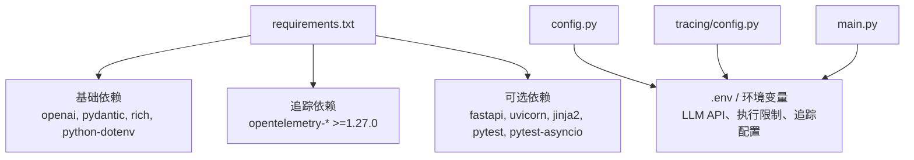
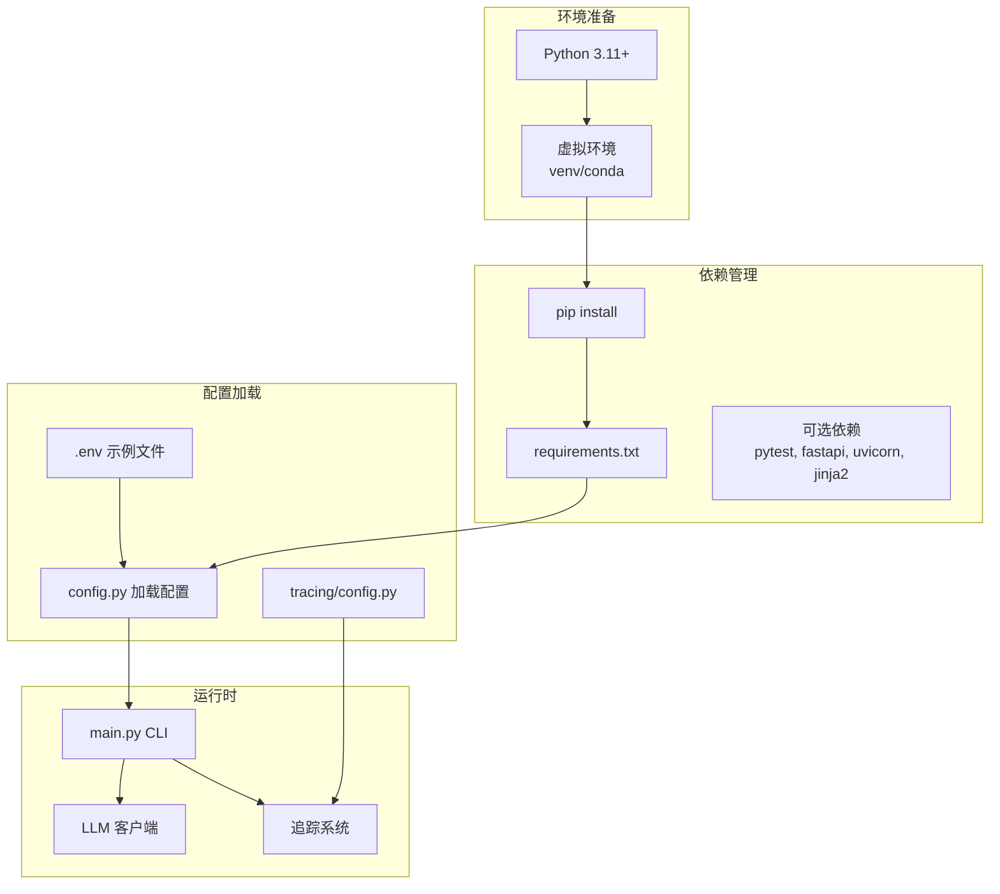
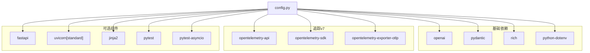

# 安装与环境配置

<cite>
**本文引用的文件**
- [requirements.txt](file://requirements.txt)
- [README.md](file://README.md)
- [README_CN.md](file://README_CN.md)
- [config.py](file://config.py)
- [tracing/config.py](file://tracing/config.py)
- [main.py](file://main.py)
</cite>

## 目录
1. [简介](#简介)
2. [项目结构](#项目结构)
3. [核心组件](#核心组件)
4. [架构总览](#架构总览)
5. [详细组件分析](#详细组件分析)
6. [依赖分析](#依赖分析)
7. [性能考虑](#性能考虑)
8. [故障排查指南](#故障排查指南)
9. [结论](#结论)
10. [附录](#附录)

## 简介
本指南面向首次搭建 manus_demo 的用户，提供从 Python 版本要求、虚拟环境创建与激活、依赖安装、可选组件、.env 配置到常见问题排查的完整流程。项目支持 Python 3.11+，并通过 requirements.txt 管理运行时依赖，同时提供可选的测试与追踪功能。

## 项目结构
与安装和环境配置直接相关的文件与职责概览：
- requirements.txt：声明运行所需的基础依赖与可选依赖（测试、追踪 Web 查看器、OTel 导出链路等）
- README.md / README_CN.md：包含环境准备、依赖安装、.env 配置与运行示例
- config.py：负责从 .env 或系统环境变量加载配置，包括 LLM API、执行限制、追踪开关等
- tracing/config.py：集中管理追踪相关配置（后端、采样率、敏感信息脱敏等）
- main.py：CLI 入口，提供交互模式、单任务模式、日志级别控制等

图表来源
- [requirements.txt](file://requirements.txt)
- [config.py](file://config.py)
- [tracing/config.py](file://tracing/config.py)
- [main.py](file://main.py)

章节来源
- [requirements.txt](file://requirements.txt)
- [README.md](file://README.md)
- [README_CN.md](file://README_CN.md)

## 核心组件
- Python 版本要求与兼容性检查
  - 需要 Python 3.11 或更高版本。可在终端执行版本检查命令，确保满足要求。
- 虚拟环境
  - 推荐使用 venv 或 conda 创建隔离环境，并在安装前激活。
- 依赖安装
  - 使用 pip 安装 requirements.txt 中声明的所有依赖。
  - 如需运行测试，额外安装 pytest 与 pytest-asyncio。
- .env 配置
  - 复制示例配置文件后，填写 LLM API 密钥与模型信息；也可通过系统环境变量覆盖。
  - 追踪相关配置位于 TRACING_* 开头的环境变量中，支持多种导出后端与采样策略。

章节来源
- [README.md](file://README.md)
- [README_CN.md](file://README_CN.md)
- [config.py](file://config.py)

## 架构总览
下图展示了安装与配置的关键交互关系：从 Python 环境准备，到依赖安装、.env 配置加载，再到运行时对 LLM 与追踪系统的初始化。

图表来源
- [requirements.txt](file://requirements.txt)
- [config.py](file://config.py)
- [tracing/config.py](file://tracing/config.py)
- [main.py](file://main.py)

## 详细组件分析

### Python 版本要求与兼容性检查
- 版本要求
  - 需要 Python 3.11 或更高版本。
- 兼容性检查方法
  - 在终端执行版本检查命令，确认 Python 版本满足要求后再进行后续步骤。

章节来源
- [README.md](file://README.md)
- [README_CN.md](file://README_CN.md)

### 虚拟环境创建与激活（venv/conda）
- venv 方案
  - 创建虚拟环境：python3 -m venv .venv
  - 激活虚拟环境：source .venv/bin/activate（macOS/Linux），Windows 使用 .venv\Scripts\activate
- conda 方案
  - 创建环境：conda create -n manus-demo python=3.11
  - 激活环境：conda activate manus-demo

章节来源
- [README.md](file://README.md)
- [README_CN.md](file://README_CN.md)

### 依赖安装流程（pip）
- 安装运行时依赖
  - pip install -r requirements.txt
- 安装测试依赖（可选）
  - pip install pytest pytest-asyncio

章节来源
- [requirements.txt](file://requirements.txt)
- [README.md](file://README.md)
- [README_CN.md](file://README_CN.md)

### requirements.txt 依赖作用说明
- 基础依赖
  - openai：OpenAI 兼容接口封装，用于 LLM 调用
  - pydantic：数据模型与校验
  - rich：控制台富文本输出与 UI 渲染
  - python-dotenv：从 .env 文件加载环境变量
- 追踪（v7）
  - opentelemetry-api、opentelemetry-sdk、opentelemetry-exporter-otlp：全链路追踪与导出能力
- 追踪 Web 查看器（可选）
  - fastapi、uvicorn[standard]、jinja2：提供本地 Web 查看器服务
- 测试（可选）
  - pytest、pytest-asyncio：测试框架与异步支持

章节来源
- [requirements.txt](file://requirements.txt)
- [README.md](file://README.md)
- [README_CN.md](file://README_CN.md)

### 可选依赖安装时机与用途
- pytest / pytest-asyncio
  - 用途：运行单元测试，验证 DAG 能力、隐式规划、工具路由与自适应规划等功能
  - 安装时机：需要离线验证或参与测试时安装
- fastapi / uvicorn / jinja2
  - 用途：本地 Web 查看器，用于可视化与浏览追踪数据
  - 安装时机：需要本地查看追踪数据时安装

章节来源
- [requirements.txt](file://requirements.txt)
- [README.md](file://README.md)
- [README_CN.md](file://README_CN.md)

### .env 配置示例与关键参数
- 复制示例配置文件
  - cp .env.example .env
- 关键参数（LLM API）
  - LLM_BASE_URL：LLM API 地址（支持 OpenAI 兼容接口）
  - LLM_API_KEY：API 密钥
  - LLM_MODEL：模型名称
- 日志与执行参数
  - 可通过环境变量覆盖 MAX_CONTEXT_TOKENS、MAX_REACT_ITERATIONS、MAX_PARALLEL_NODES 等
- 追踪配置（v7）
  - TRACING_ENABLED：总开关
  - TRACING_BACKEND：导出后端（console / file / rich / otlp / phoenix）
  - TRACING_ENDPOINT：OTLP HTTP 端点地址
  - TRACING_SERVICE_NAME：服务标识
  - TRACING_SAMPLE_RATE：采样率（0.0–1.0）
  - TRACING_LOG_PROMPTS：是否记录完整 prompt（隐私保护）
  - TRACING_MAX_ATTRIBUTE_LENGTH：属性值最大字符数

章节来源
- [README.md](file://README.md)
- [README_CN.md](file://README_CN.md)
- [config.py](file://config.py)
- [tracing/config.py](file://tracing/config.py)

### 运行与验证
- 交互模式
  - python main.py
- 单任务模式
  - python main.py "<任务描述>"
- 详细日志模式
  - python main.py -v
- 强制规划路径（调试用）
  - PLAN_MODE=simple/complex/emergent python main.py
- 追踪 Web 查看器（可选）
  - 安装 fastapi/uvicorn/jinja2 后，使用本地 Web 查看器服务

章节来源
- [README.md](file://README.md)
- [README_CN.md](file://README_CN.md)
- [main.py](file://main.py)

## 依赖分析
下图展示 requirements.txt 中依赖的分组与用途，以及与运行时配置的关系。

图表来源
- [requirements.txt](file://requirements.txt)
- [config.py](file://config.py)

章节来源
- [requirements.txt](file://requirements.txt)
- [config.py](file://config.py)

## 性能考虑
- 并行执行与资源限制
  - MAX_PARALLEL_NODES 控制每个 Super-step 的最大并行节点数，合理设置可提升吞吐但需关注系统资源
- 超时与稳健性
  - NODE_EXECUTION_TIMEOUT、CODE_EXEC_TIMEOUT、SHELL_EXEC_TIMEOUT 等参数影响执行稳健性
- 追踪开销
  - TRACING_SAMPLE_RATE 与 TRACING_BACKEND 会影响性能与存储占用，建议在开发调试时开启，生产环境谨慎使用高采样率

章节来源
- [config.py](file://config.py)

## 故障排查指南
- ModuleNotFoundError
  - 确认已在激活的虚拟环境中执行 pip install -r requirements.txt
- API Key 配置错误
  - 使用 python -c "import config; print(config.LLM_BASE_URL, config.LLM_MODEL)" 验证配置加载
- 测试离线运行
  - 所有测试通过 Mock 模拟 LLM，无需联网或 API Key
- 生成文件位置
  - 通过 file_ops 写入的文件保存在 SANDBOX_DIR（默认 ~/.manus_demo/sandbox）
- 长期记忆位置
  - 长期记忆存储在 MEMORY_DIR/memory.json（默认 ~/.manus_demo/memory.json）
- 清空记忆重新开始
  - 删除 MEMORY_DIR/memory.json 文件
- Planner 计划结构
  - Planner 每次 LLM 生成不同计划，属于“自主规划”的正常行为
- LangGraph 借鉴点
  - 项目借鉴了集中式状态、Super-step 并行与 Checkpoint 等理念，便于理解原理

章节来源
- [README_CN.md](file://README_CN.md)
- [config.py](file://config.py)

## 结论
按照本指南完成 Python 版本检查、虚拟环境创建、依赖安装与 .env 配置后，即可顺利运行 manus_demo。如需测试或追踪功能，可按需安装 pytest、fastapi/uvicorn/jinja2 等可选依赖。遇到问题时，可依据故障排查章节逐步定位与解决。

## 附录
- CLI 运行与模式
  - 交互模式、单任务模式、详细日志模式、强制规划路径等详见 README
- 追踪配置要点
  - TRACING_ENABLED、TRACING_BACKEND、TRACING_ENDPOINT、TRACING_SAMPLE_RATE 等参数可按需调整

章节来源
- [README.md](file://README.md)
- [README_CN.md](file://README_CN.md)
- [main.py](file://main.py)
- [tracing/config.py](file://tracing/config.py)