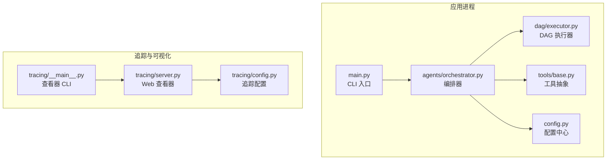
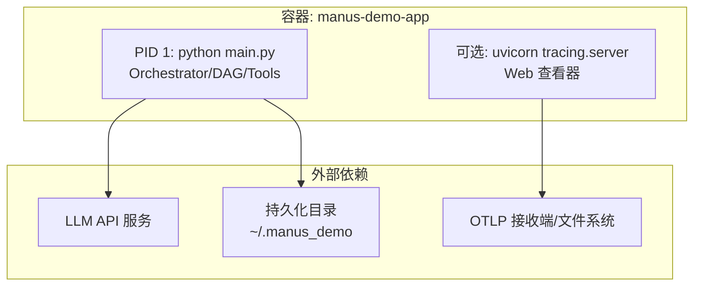
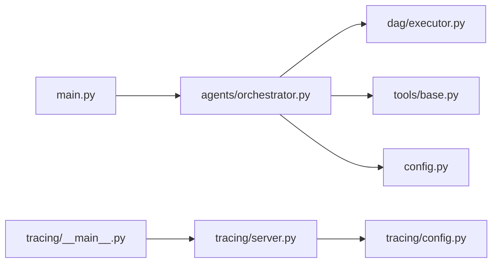

# 容器化部署

<cite>
**本文引用的文件**
- [README.md](file://README.md)
- [requirements.txt](file://requirements.txt)
- [main.py](file://main.py)
- [config.py](file://config.py)
- [tracing/config.py](file://tracing/config.py)
- [tracing/server.py](file://tracing/server.py)
- [tracing/__main__.py](file://tracing/__main__.py)
- [agents/orchestrator.py](file://agents/orchestrator.py)
- [dag/executor.py](file://dag/executor.py)
- [tools/base.py](file://tools/base.py)
</cite>

## 目录
1. [简介](#简介)
2. [项目结构](#项目结构)
3. [核心组件](#核心组件)
4. [架构总览](#架构总览)
5. [详细组件分析](#详细组件分析)
6. [依赖关系分析](#依赖关系分析)
7. [性能考虑](#性能考虑)
8. [故障排查指南](#故障排查指南)
9. [结论](#结论)
10. [附录](#附录)

## 简介
本指南面向 manus_demo 项目，提供从 Dockerfile 编写、docker-compose.yml 服务编排、多阶段构建优化、容器运行参数配置，到 Kubernetes 部署与运维最佳实践的完整方案。文档兼顾工程落地与可维护性，既适用于开发调试，也适用于生产部署。

## 项目结构
manus_demo 是一个基于 Python 的多智能体演示系统，采用模块化设计，核心入口为命令行程序，支持交互模式与单任务模式；同时具备可选的全链路追踪与 Web 查看器能力。项目主要模块包括：
- CLI 入口与日志：main.py
- 配置中心：config.py（读取 .env 或环境变量）
- 智能体编排：agents/orchestrator.py
- DAG 执行引擎：dag/executor.py
- 工具抽象与扩展：tools/base.py
- 追踪与 Web 查看器：tracing/*（FastAPI + OTLP/文件导出）

图表来源
- [main.py:1-516](file://main.py#L1-L516)
- [config.py:1-109](file://config.py#L1-L109)
- [agents/orchestrator.py:1-200](file://agents/orchestrator.py#L1-L200)
- [dag/executor.py:1-200](file://dag/executor.py#L1-L200)
- [tools/base.py:1-175](file://tools/base.py#L1-L175)
- [tracing/config.py:1-79](file://tracing/config.py#L1-L79)
- [tracing/server.py:1-276](file://tracing/server.py#L1-L276)
- [tracing/__main__.py:1-108](file://tracing/__main__.py#L1-L108)

章节来源
- [README.md:156-265](file://README.md#L156-L265)
- [main.py:495-516](file://main.py#L495-L516)
- [config.py:11-109](file://config.py#L11-L109)

## 核心组件
- CLI 入口与运行模式
  - 支持交互模式与单任务模式，日志级别可通过参数控制。
  - 关键入口：[main.py:495-516](file://main.py#L495-L516)
- 配置中心
  - 从 .env 或环境变量加载，涵盖 LLM、内存、知识库、规划路由、DAG 执行、工具参数、追踪等。
  - 关键配置：[config.py:11-109](file://config.py#L11-L109)
- 编排器
  - 负责任务上下文收集、复杂度分类、路由到 v1/v2/v5 路径、反思与记忆存储。
  - 关键实现：[agents/orchestrator.py:60-200](file://agents/orchestrator.py#L60-L200)
- DAG 执行器
  - Super-step 并行执行、状态机校验、失败回滚、条件边评估、Checkpoint。
  - 关键实现：[dag/executor.py:62-200](file://dag/executor.py#L62-L200)
- 工具抽象
  - 提供统一工具接口与可选追踪包装 traced_execute。
  - 关键实现：[tools/base.py:22-175](file://tools/base.py#L22-L175)
- 追踪与 Web 查看器
  - 支持多种导出后端（console/file/otlp/phoenix/rich），Web 查看器基于 FastAPI/Jinja2。
  - 关键实现：[tracing/config.py:14-79](file://tracing/config.py#L14-L79)，[tracing/server.py:29-276](file://tracing/server.py#L29-L276)，[tracing/__main__.py:21-108](file://tracing/__main__.py#L21-L108)

章节来源
- [main.py:396-516](file://main.py#L396-L516)
- [config.py:11-109](file://config.py#L11-L109)
- [agents/orchestrator.py:60-200](file://agents/orchestrator.py#L60-L200)
- [dag/executor.py:62-200](file://dag/executor.py#L62-L200)
- [tools/base.py:22-175](file://tools/base.py#L22-L175)
- [tracing/config.py:14-79](file://tracing/config.py#L14-L79)
- [tracing/server.py:29-276](file://tracing/server.py#L29-L276)
- [tracing/__main__.py:21-108](file://tracing/__main__.py#L21-L108)

## 架构总览
manus_demo 的容器化部署建议采用“单容器多进程”或“多容器微服务”两种思路：
- 单容器多进程：将主程序与可选的追踪 Web 查看器放在同一容器，通过进程管理器（如 tini/s6-overlay）或直接以 PID1 启动主程序，辅以 uvicorn 运行查看器。
- 多容器微服务：将主程序与追踪 Web 查看器拆分为独立服务，通过 Docker 网络通信，便于横向扩展与资源隔离。

图表来源
- [main.py:495-516](file://main.py#L495-L516)
- [tracing/server.py:29-38](file://tracing/server.py#L29-L38)
- [config.py:17-109](file://config.py#L17-L109)

## 详细组件分析

### Dockerfile 编写指导
- 基础镜像选择
  - 建议使用官方 Python 运行时镜像（如 python:3.11-slim），兼顾体积与兼容性。
- 依赖安装
  - 使用 requirements.txt 安装运行时依赖；如需编译依赖，可在镜像构建阶段安装 build-essential 等工具，构建完成后清理。
- 工作目录与用户
  - 设置非 root 用户与隔离工作目录，降低权限风险。
- 启动命令
  - 主程序入口：python main.py（支持 -v/--verbose、单任务参数）。
  - 可选启动追踪 Web 查看器：python -m tracing --host 0.0.0.0 --port 8600。
- 安全加固
  - 禁止写入 /usr/local/lib/python*/site-packages 外目录；只挂载必要的卷（如 ~/.manus_demo）。

章节来源
- [requirements.txt:1-19](file://requirements.txt#L1-L19)
- [main.py:495-516](file://main.py#L495-L516)
- [tracing/__main__.py:21-108](file://tracing/__main__.py#L21-L108)

### docker-compose.yml 服务编排配置
- 服务定义
  - manus-demo-app：运行主程序，暴露必要端口（如 8600 用于查看器）。
  - 可选 tracing-viewer：独立服务，连接相同网络与存储。
- 网络设置
  - 自定义桥接网络，便于服务间通信与隔离。
- 卷挂载
  - 挂载 ~/.manus_demo 到容器内相同路径，持久化记忆与知识库。
  - 可选挂载 traces 目录用于 Web 查看器。
- 环境变量传递
  - 通过 .env 或 compose 的 environment/env_file 字段传递 LLM 配置、追踪开关与采样率等。

章节来源
- [config.py:17-109](file://config.py#L17-L109)
- [tracing/config.py:14-79](file://tracing/config.py#L14-L79)
- [tracing/server.py:40-44](file://tracing/server.py#L40-L44)

### 多阶段构建优化策略
- 目标
  - 减少镜像体积、提升安全与构建稳定性。
- 策略
  - 构建阶段：安装编译依赖，pip 安装依赖，清理缓存与构建包。
  - 运行阶段：仅拷贝最小运行时产物，使用 slim 镜像，禁用 shell 与调试工具。
  - 依赖锁定：固定 requirements.txt 版本，避免不必要的升级。
  - 缓存优化：合理组织 Dockerfile 层，使 pip 安装层可复用。

章节来源
- [requirements.txt:1-19](file://requirements.txt#L1-L19)

### 容器运行参数配置
- 资源限制
  - CPU/内存配额与限制，避免资源争抢；对并发执行（MAX_PARALLEL_NODES）与子进程（SHELL_MAX_CONCURRENT/CODE_MAX_CONCURRENT）进行约束。
- 健康检查
  - 对 Web 查看器端口进行 TCP/HTTP 健康检查；对主程序可通过探针或外部调度器进行业务级健康探测。
- 重启策略
  - 生产建议 unless-stopped 或 on-failure，便于故障恢复。
- 日志与审计
  - 将日志输出到 stdout/stderr，交由容器运行时收集；开启 TRACE_LOG_PROMPTS 仅在调试环境使用。

章节来源
- [config.py:44-77](file://config.py#L44-L77)
- [config.py:102-109](file://config.py#L102-L109)

### Kubernetes 部署配置
- Deployment
  - 单副本或无状态多副本，设置 readiness/liveness 探针；使用 ConfigMap/Secret 管理配置与密钥。
- Service
  - ClusterIP 暴露内部服务；如需 Web 查看器，可使用 NodePort/LoadBalancer。
- ConfigMap
  - 用于存放非敏感配置（如采样率、服务名、追踪后端）。
- Secret
  - 存放 LLM API Key、敏感参数（如 TOKEN 等）。
- Pod 安全与资源
  - 使用非 root 用户、只读根文件系统、最小权限 RBAC；设置资源 requests/limits。

章节来源
- [config.py:17-109](file://config.py#L17-L109)
- [tracing/config.py:14-79](file://tracing/config.py#L14-L79)

### 容器监控、日志收集与性能优化
- 监控指标
  - 业务指标：任务成功率、平均执行时长、Token 消耗、DAG 并行度。
  - 系统指标：CPU/内存/IO、容器重启次数、网络延迟。
- 日志收集
  - stdout/stderr 日志采集；结合追踪后端（OTLP）统一上报。
- 性能优化
  - 合理设置 MAX_PARALLEL_NODES 与子进程并发上限；启用 LLM 重试与指数退避；对知识库与记忆目录进行 I/O 优化。

章节来源
- [config.py:23-77](file://config.py#L23-L77)
- [tracing/config.py:14-79](file://tracing/config.py#L14-L79)

## 依赖关系分析
manus_demo 的运行时依赖主要来自 Python 包与可选的追踪组件。下图展示了关键模块间的依赖关系与数据流向。

图表来源
- [main.py:34-42](file://main.py#L34-L42)
- [agents/orchestrator.py:42-56](file://agents/orchestrator.py#L42-L56)
- [dag/executor.py:49-52](file://dag/executor.py#L49-L52)
- [tools/base.py:18-20](file://tools/base.py#L18-L20)
- [config.py:8-11](file://config.py#L8-L11)
- [tracing/server.py:21-24](file://tracing/server.py#L21-L24)
- [tracing/config.py:11-12](file://tracing/config.py#L11-L12)
- [tracing/__main__.py:16-18](file://tracing/__main__.py#L16-L18)

章节来源
- [main.py:34-42](file://main.py#L34-L42)
- [agents/orchestrator.py:42-56](file://agents/orchestrator.py#L42-L56)
- [dag/executor.py:49-52](file://dag/executor.py#L49-L52)
- [tools/base.py:18-20](file://tools/base.py#L18-L20)
- [config.py:8-11](file://config.py#L8-L11)
- [tracing/server.py:21-24](file://tracing/server.py#L21-L24)
- [tracing/config.py:11-12](file://tracing/config.py#L11-L12)
- [tracing/__main__.py:16-18](file://tracing/__main__.py#L16-L18)

## 性能考虑
- 并发与资源
  - MAX_PARALLEL_NODES 控制 Super-step 并行度；SHELL_MAX_CONCURRENT/CODE_MAX_CONCURRENT 控制工具执行并发。
- LLM 调用
  - 启用 LLM_RETRY_ENABLED 与合理的退避参数，降低外部服务抖动影响。
- 追踪开销
  - TRACING_ENABLED 与采样率直接影响性能；生产环境建议关闭或降低采样率。
- I/O 与持久化
  - 将 MEMORY_DIR 与知识库目录挂载到高性能持久卷，避免频繁磁盘 IO。

章节来源
- [config.py:23-86](file://config.py#L23-L86)
- [tracing/config.py:33-67](file://tracing/config.py#L33-L67)

## 故障排查指南
- 启动失败
  - 检查 LLM 配置（LLM_BASE_URL/LLM_API_KEY/LLM_MODEL）与网络连通性。
  - 查看容器日志，确认依赖安装与 Python 版本匹配。
- 追踪不可用
  - 确认 TRACING_ENABLED=true 且后端配置正确；Web 查看器需指定 traces 目录。
- 性能异常
  - 调整 MAX_PARALLEL_NODES、子进程并发与超时参数；检查外部 LLM 服务响应。
- 日志噪声
  - 通过 -v/--verbose 控制日志级别；在生产环境关闭 DEBUG。

章节来源
- [config.py:17-109](file://config.py#L17-L109)
- [main.py:396-413](file://main.py#L396-L413)
- [tracing/__main__.py:52-63](file://tracing/__main__.py#L52-L63)

## 结论
通过合理的镜像分层、最小权限与资源限制、以及可选的追踪与 Web 查看器编排，manus_demo 可在容器环境中稳定运行并具备可观测性。建议在生产中结合 Kubernetes 进行弹性伸缩与高可用部署，并持续优化并发参数与外部依赖的可靠性。

## 附录
- 常用环境变量参考
  - LLM_BASE_URL、LLM_API_KEY、LLM_MODEL
  - MAX_PARALLEL_NODES、SHELL_MAX_CONCURRENT、CODE_MAX_CONCURRENT
  - TRACING_ENABLED、TRACING_BACKEND、TRACING_ENDPOINT、TRACING_SAMPLE_RATE
- 常见端口
  - Web 查看器：8600（默认）
- 常见卷挂载
  - ~/.manus_demo（记忆与知识库）
  - traces 目录（用于文件导出后端）

章节来源
- [config.py:17-109](file://config.py#L17-L109)
- [tracing/__main__.py:26-43](file://tracing/__main__.py#L26-L43)