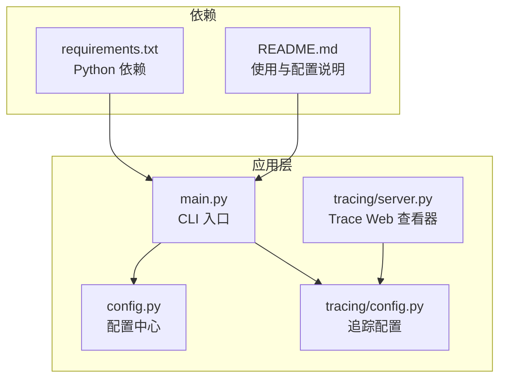
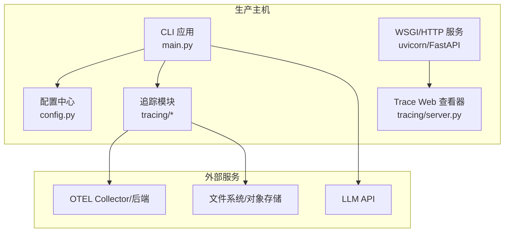
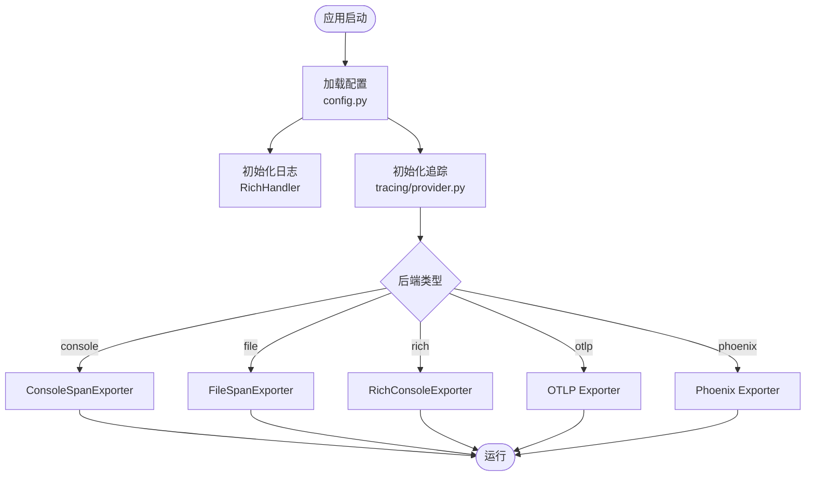
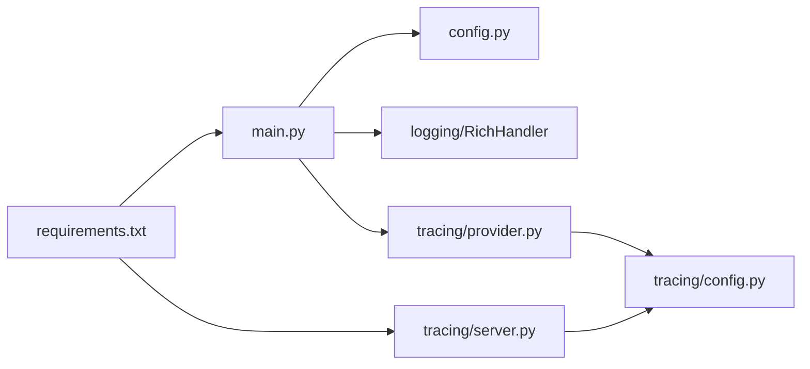

# 生产环境部署

<cite>
**本文引用的文件**
- [README.md](file://README.md)
- [requirements.txt](file://requirements.txt)
- [config.py](file://config.py)
- [main.py](file://main.py)
- [tracing/config.py](file://tracing/config.py)
- [tracing/server.py](file://tracing/server.py)
- [tracing/provider.py](file://tracing/provider.py)
- [tracing/exporters.py](file://tracing/exporters.py)
- [sxw_aicoding/docs/tracing-guide.md](file://sxw_aicoding/docs/tracing-guide.md)
- [sxw_aicoding/docs/tracing-design.md](file://sxw_aicoding/docs/tracing-design.md)
- [sxw_aicoding/docs/llm-integration.md](file://sxw_aicoding/docs/llm-integration.md)
- [tests/test_concurrent_execution.py](file://tests/test_concurrent_execution.py)
- [tools/subprocess_utils.py](file://tools/subprocess_utils.py)
</cite>

## 目录
1. [简介](#简介)
2. [项目结构](#项目结构)
3. [核心组件](#核心组件)
4. [架构总览](#架构总览)
5. [详细组件分析](#详细组件分析)
6. [依赖关系分析](#依赖关系分析)
7. [性能考量](#性能考量)
8. [故障排查指南](#故障排查指南)
9. [结论](#结论)
10. [附录](#附录)

## 简介
本指南面向生产环境部署 manus_demo，围绕硬件与软件要求、进程管理（WSGI/HTTP 服务器）、日志与追踪、监控与告警、安全加固、负载均衡与连接池、缓存与持久化、故障恢复与灾备等方面，提供可落地的配置与最佳实践。文档严格基于仓库现有代码与文档进行提炼，确保可操作性与一致性。

## 项目结构
manus_demo 是一个基于 Python 的多智能体演示系统，采用命令行交互入口，支持多种规划路径（v1/v2/v5），具备 DAG 执行、ReAct 循环、工具路由、自适应规划、全链路追踪等能力。生产部署可复用其 CLI 入口与配置体系，结合外部 WSGI/HTTP 服务器对外提供服务。

**图表来源**
- [main.py:1-516](file://main.py#L1-L516)
- [config.py:1-109](file://config.py#L1-L109)
- [tracing/config.py:1-79](file://tracing/config.py#L1-L79)
- [tracing/server.py:1-276](file://tracing/server.py#L1-L276)
- [requirements.txt:1-19](file://requirements.txt#L1-L19)
- [README.md:156-265](file://README.md#L156-L265)

**章节来源**
- [README.md:97-154](file://README.md#L97-L154)
- [requirements.txt:1-19](file://requirements.txt#L1-L19)
- [main.py:1-516](file://main.py#L1-L516)

## 核心组件
- CLI 入口与日志
  - CLI 提供交互模式与单任务模式，支持 -v/--verbose 输出调试日志；日志通过 RichHandler 输出，抑制第三方噪声。
  - 参考路径：[main.py:396-413](file://main.py#L396-L413)
- 配置中心
  - 通过 .env 与环境变量加载，涵盖 LLM API、上下文窗口、并发、工具执行、追踪等关键参数。
  - 参考路径：[config.py:1-109](file://config.py#L1-L109)
- 全链路追踪
  - 支持 console/file/rich/otlp/phoenix 等后端，具备采样、属性截断、敏感信息脱敏、批处理导出等生产特性。
  - 参考路径：[tracing/config.py:1-79](file://tracing/config.py#L1-L79)，[tracing/server.py:1-276](file://tracing/server.py#L1-L276)，[tracing/provider.py:154-174](file://tracing/provider.py#L154-L174)，[tracing/exporters.py:107-139](file://tracing/exporters.py#L107-L139)
- 并发与资源限制
  - 通过 MAX_PARALLEL_NODES、SHELL_MAX_CONCURRENT、CODE_MAX_CONCURRENT、超时与输出限制等参数保障稳定性。
  - 参考路径：[config.py:44-76](file://config.py#L44-L76)，[tools/subprocess_utils.py:38-71](file://tools/subprocess_utils.py#L38-L71)
- 压力测试与并发基线
  - 包含中等并发（10 并行 Action）的压力测试，可作为生产并发规划参考。
  - 参考路径：[tests/test_concurrent_execution.py:74-162](file://tests/test_concurrent_execution.py#L74-L162)

**章节来源**
- [main.py:396-413](file://main.py#L396-L413)
- [config.py:1-109](file://config.py#L1-L109)
- [tracing/config.py:1-79](file://tracing/config.py#L1-L79)
- [tracing/server.py:1-276](file://tracing/server.py#L1-L276)
- [tracing/provider.py:154-174](file://tracing/provider.py#L154-L174)
- [tracing/exporters.py:107-139](file://tracing/exporters.py#L107-L139)
- [tools/subprocess_utils.py:38-71](file://tools/subprocess_utils.py#L38-L71)
- [tests/test_concurrent_execution.py:74-162](file://tests/test_concurrent_execution.py#L74-L162)

## 架构总览
生产部署可采用“CLI 应用 + WSGI/HTTP 服务器 + 外部服务”的组合：
- CLI 应用负责业务编排与执行（main.py），通过配置中心与追踪模块协同工作。
- WSGI/HTTP 服务器（如 uvicorn/FastAPI）对外提供 API/页面服务（如 Trace Web 查看器）。
- 外部服务包括 LLM API、可观测性后端（OTLP/Phoenix/Jaeger）、对象存储/数据库（用于日志/追踪落盘）。

**图表来源**
- [main.py:1-516](file://main.py#L1-L516)
- [config.py:1-109](file://config.py#L1-L109)
- [tracing/server.py:1-276](file://tracing/server.py#L1-L276)
- [requirements.txt:11-14](file://requirements.txt#L11-L14)

## 详细组件分析

### 硬件与软件要求
- 硬件建议（按并发与任务复杂度）
  - CPU：建议 2 核起步，复杂任务与高并发场景建议 4-8 核。
  - 内存：建议 4GB 起步，复杂 DAG 与工具执行较多时建议 8GB+。
  - 存储：SSD 本地盘用于日志/追踪文件与沙箱目录；对象存储用于归档。
  - 网络：稳定带宽，LLM API 延迟与吞吐需满足 SLA。
- 软件要求
  - Python 3.11+（见 README 快速开始）。
  - 依赖安装：pip install -r requirements.txt。
  - 生产建议：使用独立虚拟环境与进程隔离。

**章节来源**
- [README.md:158-207](file://README.md#L158-L207)
- [requirements.txt:1-19](file://requirements.txt#L1-L19)

### 进程管理与 WSGI/HTTP 服务器
- CLI 启动
  - 交互模式：python main.py
  - 单任务模式：python main.py "<任务>"
  - 调试日志：python main.py -v
  - 参考路径：[README.md:209-251](file://README.md#L209-L251)，[main.py:495-516](file://main.py#L495-L516)
- WSGI/HTTP 服务器
  - 推荐 uvicorn（requirements.txt 已包含）。
  - Trace Web 查看器可通过 python -m tracing 启动（FastAPI + uvicorn）。
  - 参考路径：[requirements.txt:12-14](file://requirements.txt#L12-L14)，[tracing/server.py:21-38](file://tracing/server.py#L21-L38)，[sxw_aicoding/docs/tracing-guide.md:149-192](file://sxw_aicoding/docs/tracing-guide.md#L149-L192)
- 进程与并发
  - 通过 MAX_PARALLEL_NODES 控制 Super-step 并行度。
  - 通过 SHELL_MAX_CONCURRENT、CODE_MAX_CONCURRENT 控制工具并发。
  - 参考路径：[config.py:44-76](file://config.py#L44-L76)

**章节来源**
- [README.md:209-251](file://README.md#L209-L251)
- [main.py:495-516](file://main.py#L495-L516)
- [requirements.txt:12-14](file://requirements.txt#L12-L14)
- [tracing/server.py:21-38](file://tracing/server.py#L21-L38)
- [sxw_aicoding/docs/tracing-guide.md:149-192](file://sxw_aicoding/docs/tracing-guide.md#L149-L192)
- [config.py:44-76](file://config.py#L44-L76)

### 日志与追踪配置
- 日志
  - RichHandler 输出，支持 INFO/DEBUG 级别；抑制 httpx/openai/httpcore 噪声。
  - 参考路径：[main.py:396-413](file://main.py#L396-L413)
- 追踪（OTel）
  - 后端：console/file/rich/otlp/phoenix；采样率、属性截断、敏感信息脱敏、批处理导出。
  - Web 查看器：FastAPI 页面，支持 trace 列表与详情树形视图。
  - 参考路径：[tracing/config.py:1-79](file://tracing/config.py#L1-L79)，[tracing/server.py:65-276](file://tracing/server.py#L65-L276)，[tracing/provider.py:154-174](file://tracing/provider.py#L154-L174)，[tracing/exporters.py:107-139](file://tracing/exporters.py#L107-L139)，[sxw_aicoding/docs/tracing-guide.md:195-231](file://sxw_aicoding/docs/tracing-guide.md#L195-L231)，[sxw_aicoding/docs/tracing-design.md:557-599](file://sxw_aicoding/docs/tracing-design.md#L557-L599)

**图表来源**
- [config.py:1-109](file://config.py#L1-L109)
- [tracing/provider.py:154-174](file://tracing/provider.py#L154-L174)
- [tracing/exporters.py:107-139](file://tracing/exporters.py#L107-L139)

**章节来源**
- [main.py:396-413](file://main.py#L396-L413)
- [tracing/config.py:1-79](file://tracing/config.py#L1-L79)
- [tracing/server.py:65-276](file://tracing/server.py#L65-L276)
- [tracing/provider.py:154-174](file://tracing/provider.py#L154-L174)
- [tracing/exporters.py:107-139](file://tracing/exporters.py#L107-L139)
- [sxw_aicoding/docs/tracing-guide.md:195-231](file://sxw_aicoding/docs/tracing-guide.md#L195-L231)
- [sxw_aicoding/docs/tracing-design.md:557-599](file://sxw_aicoding/docs/tracing-design.md#L557-L599)

### 监控与告警
- 应用性能监控
  - 使用 OTLP 后端对接 Jaeger/Tempo 等；采样率建议 0.1~0.3 以平衡开销与覆盖率。
  - 参考路径：[sxw_aicoding/docs/tracing-guide.md:220-229](file://sxw_aicoding/docs/tracing-guide.md#L220-L229)，[tracing/config.py:33-43](file://tracing/config.py#L33-L43)
- 错误监控
  - 通过日志与追踪结合，定位 LLM 调用失败、工具执行异常、超时等问题。
  - 参考路径：[main.py:474-477](file://main.py#L474-L477)，[tools/subprocess_utils.py:62-71](file://tools/subprocess_utils.py#L62-L71)
- 业务指标监控
  - 通过配置项控制上下文窗口、最大迭代、重试策略等，间接反映执行效率与成本。
  - 参考路径：[config.py:23-86](file://config.py#L23-L86)，[sxw_aicoding/docs/llm-integration.md:615-648](file://sxw_aicoding/docs/llm-integration.md#L615-L648)

**章节来源**
- [sxw_aicoding/docs/tracing-guide.md:220-229](file://sxw_aicoding/docs/tracing-guide.md#L220-L229)
- [tracing/config.py:33-43](file://tracing/config.py#L33-L43)
- [main.py:474-477](file://main.py#L474-L477)
- [tools/subprocess_utils.py:62-71](file://tools/subprocess_utils.py#L62-L71)
- [config.py:23-86](file://config.py#L23-L86)
- [sxw_aicoding/docs/llm-integration.md:615-648](file://sxw_aicoding/docs/llm-integration.md#L615-L648)

### 安全配置
- HTTPS 与传输安全
  - 通过反向代理（如 Nginx/Caddy）提供 TLS 终止与证书管理。
  - 参考路径：[README.md:180-207](file://README.md#L180-L207)
- API 密钥保护
  - 通过 .env 与环境变量注入 LLM_API_KEY；生产环境建议使用密钥管理服务。
  - 参考路径：[config.py:17-19](file://config.py#L17-L19)，[README.md:180-207](file://README.md#L180-L207)
- 访问控制
  - 通过反向代理配置认证、IP 白名单、速率限制。
  - 参考路径：[README.md:180-207](file://README.md#L180-L207)
- 追踪隐私
  - 关闭 TRACING_LOG_PROMPTS，设置合理采样率与属性截断，避免敏感信息泄露。
  - 参考路径：[tracing/config.py:37-43](file://tracing/config.py#L37-L43)，[sxw_aicoding/docs/tracing-design.md:557-565](file://sxw_aicoding/docs/tracing-design.md#L557-L565)

**章节来源**
- [README.md:180-207](file://README.md#L180-L207)
- [config.py:17-19](file://config.py#L17-L19)
- [tracing/config.py:37-43](file://tracing/config.py#L37-L43)
- [sxw_aicoding/docs/tracing-design.md:557-565](file://sxw_aicoding/docs/tracing-design.md#L557-L565)

### 负载均衡、数据库连接池与缓存
- 负载均衡
  - 使用 Nginx/HAProxy 将流量分发至多实例；结合健康检查与会话亲和策略。
  - 参考路径：[README.md:180-207](file://README.md#L180-L207)
- 数据库连接池
  - 若引入外部存储（如日志/追踪落盘），建议使用连接池（如 aiomysql/aio-pika）并设置最大连接数与超时。
  - 参考路径：[tracing/server.py:65-149](file://tracing/server.py#L65-L149)
- 缓存
  - 对热点 LLM 请求结果进行缓存（需自行实现），注意缓存失效与一致性。
  - 参考路径：[config.py:23-25](file://config.py#L23-L25)

**章节来源**
- [README.md:180-207](file://README.md#L180-L207)
- [tracing/server.py:65-149](file://tracing/server.py#L65-L149)
- [config.py:23-25](file://config.py#L23-L25)

### 故障恢复与灾备
- 失败恢复
  - DAG 执行具备回滚与局部重规划能力；可通过 MAX_REPLAN_ATTEMPTS 控制反思失败后的重规划次数。
  - 参考路径：[config.py:25-26](file://config.py#L25-L26)，[tests/test_concurrent_execution.py:213-253](file://tests/test_concurrent_execution.py#L213-L253)
- 灾难备份
  - 长期记忆与沙箱目录建议定期备份；追踪文件可归档至对象存储。
  - 参考路径：[config.py:29-30](file://config.py#L29-L30)，[tracing/server.py:65-149](file://tracing/server.py#L65-L149)

**章节来源**
- [config.py:25-26](file://config.py#L25-L26)
- [tests/test_concurrent_execution.py:213-253](file://tests/test_concurrent_execution.py#L213-L253)
- [config.py:29-30](file://config.py#L29-L30)
- [tracing/server.py:65-149](file://tracing/server.py#L65-L149)

## 依赖关系分析
- CLI 与配置
  - main.py 依赖 config.py 提供运行参数；日志初始化依赖 RichHandler。
- 追踪模块
  - tracing/provider.py 基于 tracing/config.py 初始化导出器；tracing/server.py 依赖 tracing/spans 与模板渲染。
- 依赖清单
  - requirements.txt 指定 OpenAI SDK、Pydantic、Rich、dotenv、OTel SDK、FastAPI、uvicorn、Jinja2 等。

**图表来源**
- [main.py:1-516](file://main.py#L1-L516)
- [config.py:1-109](file://config.py#L1-L109)
- [tracing/provider.py:134-174](file://tracing/provider.py#L134-L174)
- [tracing/config.py:1-79](file://tracing/config.py#L1-L79)
- [tracing/server.py:21-38](file://tracing/server.py#L21-L38)
- [requirements.txt:1-19](file://requirements.txt#L1-L19)

**章节来源**
- [main.py:1-516](file://main.py#L1-L516)
- [config.py:1-109](file://config.py#L1-L109)
- [tracing/provider.py:134-174](file://tracing/provider.py#L134-L174)
- [tracing/config.py:1-79](file://tracing/config.py#L1-L79)
- [tracing/server.py:21-38](file://tracing/server.py#L21-L38)
- [requirements.txt:1-19](file://requirements.txt#L1-L19)

## 性能考量
- 并发与资源
  - MAX_PARALLEL_NODES 控制 Super-step 并行度；SHELL_MAX_CONCURRENT/CODE_MAX_CONCURRENT 控制工具并发。
  - 参考路径：[config.py:44-76](file://config.py#L44-L76)
- 超时与输出限制
  - SHELL_EXEC_TIMEOUT、CODE_EXEC_TIMEOUT、SUBPROCESS_MAX_OUTPUT_BYTES 防止资源耗尽。
  - 参考路径：[config.py:71-76](file://config.py#L71-L76)，[tools/subprocess_utils.py:62-71](file://tools/subprocess_utils.py#L62-L71)
- 压力测试基线
  - 中等并发（10 并行 Action）测试可作为生产并发规划参考。
  - 参考路径：[tests/test_concurrent_execution.py:74-162](file://tests/test_concurrent_execution.py#L74-L162)

**章节来源**
- [config.py:44-76](file://config.py#L44-L76)
- [config.py:71-76](file://config.py#L71-L76)
- [tools/subprocess_utils.py:62-71](file://tools/subprocess_utils.py#L62-L71)
- [tests/test_concurrent_execution.py:74-162](file://tests/test_concurrent_execution.py#L74-L162)

## 故障排查指南
- 日志级别
  - 使用 -v/--verbose 启用 DEBUG 级别，定位内部流程与异常。
  - 参考路径：[main.py:502-511](file://main.py#L502-L511)
- 追踪验证
  - 通过 OTLP 后端或 file 后端输出，结合 Web 查看器定位问题。
  - 参考路径：[tracing/server.py:253-276](file://tracing/server.py#L253-L276)，[sxw_aicoding/docs/tracing-guide.md:149-192](file://sxw_aicoding/docs/tracing-guide.md#L149-L192)
- 工具执行异常
  - 检查 SHELL_EXEC_TIMEOUT、CODE_EXEC_TIMEOUT、SUBPROCESS_MAX_OUTPUT_BYTES 设置；确认沙箱目录权限。
  - 参考路径：[config.py:71-76](file://config.py#L71-L76)，[tools/subprocess_utils.py:38-71](file://tools/subprocess_utils.py#L38-L71)
- LLM 调用失败
  - 启用 LLM_RETRY（LLM_RETRY_ENABLED/LLM_RETRY_MAX_ATTEMPTS/LLM_RETRY_BACKOFF_FACTOR）。
  - 参考路径：[config.py:83-85](file://config.py#L83-L85)，[sxw_aicoding/docs/llm-integration.md:625-627](file://sxw_aicoding/docs/llm-integration.md#L625-L627)

**章节来源**
- [main.py:502-511](file://main.py#L502-L511)
- [tracing/server.py:253-276](file://tracing/server.py#L253-L276)
- [sxw_aicoding/docs/tracing-guide.md:149-192](file://sxw_aicoding/docs/tracing-guide.md#L149-L192)
- [config.py:71-76](file://config.py#L71-L76)
- [tools/subprocess_utils.py:38-71](file://tools/subprocess_utils.py#L38-L71)
- [config.py:83-85](file://config.py#L83-L85)
- [sxw_aicoding/docs/llm-integration.md:625-627](file://sxw_aicoding/docs/llm-integration.md#L625-L627)

## 结论
本指南基于 manus_demo 的 CLI 与追踪模块，给出了生产环境部署的完整路径：从硬件与软件要求、进程管理（WSGI/HTTP 服务器）、日志与追踪、监控与告警、安全加固，到负载均衡、并发与资源限制、故障恢复与灾备。建议在生产中结合反向代理、OTel 后端、对象存储与密钥管理服务，形成稳定可靠的交付体系。

## 附录
- 快速启动
  - 安装依赖：pip install -r requirements.txt
  - 运行 CLI：python main.py -v
  - 启动 Trace Web 查看器：python -m tracing
  - 参考路径：[README.md:168-265](file://README.md#L168-L265)，[requirements.txt:1-19](file://requirements.txt#L1-L19)，[sxw_aicoding/docs/tracing-guide.md:149-192](file://sxw_aicoding/docs/tracing-guide.md#L149-L192)

**章节来源**
- [README.md:168-265](file://README.md#L168-L265)
- [requirements.txt:1-19](file://requirements.txt#L1-L19)
- [sxw_aicoding/docs/tracing-guide.md:149-192](file://sxw_aicoding/docs/tracing-guide.md#L149-L192)