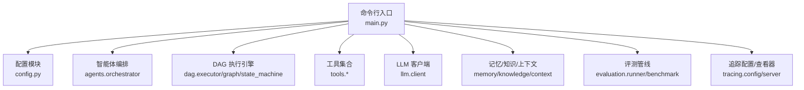
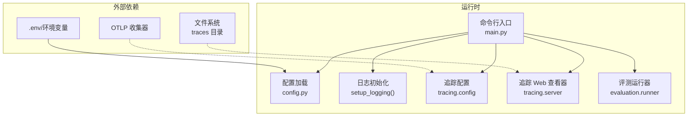
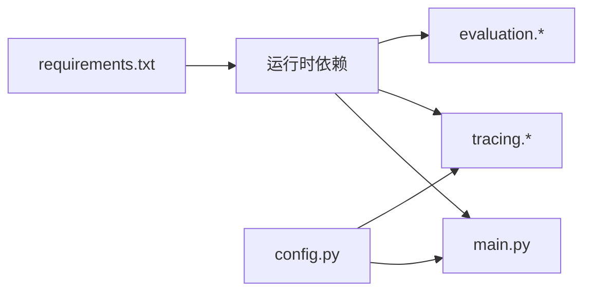

# 部署指南

<cite>
**本文引用的文件**
- [README.md](file://README.md)
- [requirements.txt](file://requirements.txt)
- [config.py](file://config.py)
- [main.py](file://main.py)
- [tracing/config.py](file://tracing/config.py)
- [tracing/server.py](file://tracing/server.py)
- [evaluation/runner.py](file://evaluation/runner.py)
- [evaluation/benchmark.py](file://evaluation/benchmark.py)
</cite>

## 目录
1. [简介](#简介)
2. [项目结构](#项目结构)
3. [核心组件](#核心组件)
4. [架构总览](#架构总览)
5. [详细组件分析](#详细组件分析)
6. [依赖分析](#依赖分析)
7. [性能考虑](#性能考虑)
8. [故障排查指南](#故障排查指南)
9. [结论](#结论)
10. [附录](#附录)

## 简介
本指南面向 manus_demo 项目的部署与运维，覆盖以下内容：
- 依赖安装与环境准备（Python 版本、虚拟环境、pip 安装）
- 环境变量与 .env 配置（必需与可选参数）
- 不同部署场景配置差异（开发、测试、生产）
- Docker 容器化部署（Dockerfile、镜像构建、运行参数、卷挂载）
- 启动脚本、进程管理、日志与监控集成的最佳实践

## 项目结构
manus_demo 是一个基于 DAG 的多智能体系统，支持交互式运行、单任务执行、测试与评测。核心入口为命令行程序，配置通过环境变量或 .env 文件加载，具备可选的全链路追踪与 Web 查看器。

图表来源
- [main.py:495-516](file://main.py#L495-L516)
- [config.py:1-109](file://config.py#L1-L109)
- [tracing/config.py:1-79](file://tracing/config.py#L1-L79)
- [tracing/server.py:1-276](file://tracing/server.py#L1-L276)
- [evaluation/runner.py:1-570](file://evaluation/runner.py#L1-L570)
- [evaluation/benchmark.py:1-311](file://evaluation/benchmark.py#L1-L311)

章节来源
- [README.md:156-292](file://README.md#L156-L292)
- [main.py:495-516](file://main.py#L495-L516)

## 核心组件
- 命令行入口与运行模式
  - 支持交互模式与单任务模式，可通过命令行参数控制日志级别与任务输入。
  - 日志系统使用 RichHandler，支持 INFO/DEBUG 级别输出。
- 配置模块
  - 从 .env 或环境变量加载，覆盖 LLM API、执行限制、计划路由、工具参数、追踪等。
- 追踪与 Web 查看器
  - 提供多种导出后端（console/file/rich/otlp/phoenix），支持文件落盘与 OTLP 推送。
  - 内置 FastAPI Web 服务用于浏览 traces 目录中的 JSON 文件。
- 评测与基准
  - 通过事件探针收集指标，计算规划、执行、效率与反思等维度的综合评分。

章节来源
- [main.py:396-413](file://main.py#L396-L413)
- [config.py:1-109](file://config.py#L1-L109)
- [tracing/config.py:1-79](file://tracing/config.py#L1-L79)
- [tracing/server.py:1-276](file://tracing/server.py#L1-L276)
- [evaluation/runner.py:1-570](file://evaluation/runner.py#L1-L570)
- [evaluation/benchmark.py:1-311](file://evaluation/benchmark.py#L1-L311)

## 架构总览
下图展示了部署层面的关键交互：CLI 启动、配置加载、日志与追踪初始化、以及可选的 Web 查看器与评测流程。

图表来源
- [main.py:396-413](file://main.py#L396-L413)
- [config.py:1-109](file://config.py#L1-L109)
- [tracing/config.py:1-79](file://tracing/config.py#L1-L79)
- [tracing/server.py:1-276](file://tracing/server.py#L1-L276)
- [evaluation/runner.py:1-570](file://evaluation/runner.py#L1-L570)

## 详细组件分析

### 依赖安装与环境准备
- Python 版本要求
  - 需要 Python 3.11+。
- 虚拟环境
  - 建议使用 venv 创建隔离环境，并在 macOS/Linux 下激活。
- 依赖安装
  - 使用 pip 安装 requirements.txt 中声明的依赖。
  - 如需运行测试，额外安装 pytest 与 pytest-asyncio。
- LLM API 配置
  - 复制示例配置文件并填入 API Key、模型与基础 URL。
  - 支持任意 OpenAI 兼容接口，只需调整基础 URL 与模型名。

章节来源
- [README.md:158-178](file://README.md#L158-L178)
- [README.md:180-207](file://README.md#L180-L207)
- [requirements.txt:1-19](file://requirements.txt#L1-L19)

### 环境变量与 .env 配置
- 加载机制
  - 项目启动时会自动加载项目根目录下的 .env 文件（若存在），且环境变量优先级高于 .env。
- 必需参数
  - LLM_BASE_URL、LLM_API_KEY、LLM_MODEL。
- 常用可选参数（节选）
  - MAX_CONTEXT_TOKENS、MAX_REACT_ITERATIONS、MAX_REPLAN_ATTEMPTS、MAX_PARALLEL_NODES、SHORT_TERM_WINDOW、CODE_EXEC_TIMEOUT、SANDBOX_DIR、MEMORY_DIR、PLAN_MODE、EMERGENT_PLANNING_ENABLED、MAX_TODO_ITEMS、TODO_COMPRESSION_THRESHOLD、ADAPTIVE_PLANNING_ENABLED、ADAPT_PLAN_INTERVAL、ADAPT_PLAN_MIN_COMPLETED、TOOL_FAILURE_THRESHOLD、TRACING_ENABLED、TRACING_BACKEND、TRACING_ENDPOINT、TRACING_SERVICE_NAME、TRACING_SAMPLE_RATE、TRACING_LOG_PROMPTS、TRACING_MAX_ATTRIBUTE_LENGTH。
- 追踪后端推荐
  - 开发：file + 记录 prompt。
  - 生产：otlp + 低采样率 + 关闭 prompt 记录。

章节来源
- [config.py:1-109](file://config.py#L1-L109)
- [README.md:304-329](file://README.md#L304-L329)
- [README.md:180-207](file://README.md#L180-L207)

### 不同部署场景的配置差异

#### 开发环境（本地开发、调试模式）
- 追踪：开启并使用 file 后端，记录完整 prompt，采样率 1.0。
- 日志：使用 -v/--verbose 启用 DEBUG 级别，便于观察内部流程。
- 工具与沙箱：确保 SANDBOX_DIR 可写，CODE_EXEC_TIMEOUT 适当放宽。
- 计划模式：可临时设置 PLAN_MODE=simple|complex|emergent 进行强制路由测试。

章节来源
- [README.md:245-250](file://README.md#L245-L250)
- [README.md:237-243](file://README.md#L237-L243)
- [config.py:102-109](file://config.py#L102-L109)

#### 测试环境（CI/CD 集成、自动化测试）
- 追踪：可关闭或使用 console 后端，避免引入外部依赖。
- 日志：INFO 级别即可，减少噪声。
- 评测：可使用 evaluation/runner 与 benchmark 数据集进行自动化回归。
- 依赖：requirements.txt 与 pytest/pytest-asyncio 已满足测试需求。

章节来源
- [requirements.txt:16-19](file://requirements.txt#L16-L19)
- [evaluation/runner.py:1-570](file://evaluation/runner.py#L1-L570)
- [evaluation/benchmark.py:1-311](file://evaluation/benchmark.py#L1-L311)

#### 生产环境（容器化部署、性能优化、安全配置）
- 追踪：启用并使用 otlp 后端，设置较低采样率，禁用 prompt 记录，限制属性长度。
- 安全：通过 .env 注入 API Key，避免硬编码；子进程环境变量会过滤敏感键。
- 性能：合理设置 MAX_PARALLEL_NODES、MAX_REACT_ITERATIONS、NODE_EXECUTION_TIMEOUT。
- 可靠性：开启 LLM 重试（可选），并配置合理的退避参数。

章节来源
- [config.py:78-86](file://config.py#L78-L86)
- [config.py:102-109](file://config.py#L102-L109)
- [tools/subprocess_utils.py:28-52](file://tools/subprocess_utils.py#L28-L52)

### Docker 容器化部署
- Dockerfile 编写要点
  - 基础镜像：建议使用官方 Python 3.11+ 镜像。
  - 设置工作目录与环境变量（如 LANG、TZ），并创建非 root 用户运行。
  - 复制 requirements.txt 并安装依赖；再复制源码。
  - 创建数据目录（如 ~/.manus_demo 与 traces），赋予容器内用户写权限。
  - 暴露端口：如需启用追踪 Web 查看器（默认端口 uvicorn），需映射相应端口。
- 镜像构建
  - 使用 docker build 命令构建镜像，注意 .dockerignore 排除不必要的文件。
- 容器运行参数
  - 通过 -e 或 --env-file 注入 .env 内容；通过 -v 挂载持久化目录（如 ~/.manus_demo、traces）。
  - 如启用追踪 Web 查看器，需映射端口（例如 8000）。
- 卷挂载建议
  - 长期记忆目录：~/.manus_demo（或映射到宿主机固定路径）。
  - 追踪文件目录：traces（用于 file 后端或 Web 查看器）。
  - 沙箱目录：~/.manus_demo/sandbox（用于文件与代码执行）。

说明
- 本节为通用容器化实践建议，具体端口与卷挂载可根据实际部署需求调整。

### 启动脚本、进程管理、日志与监控
- 启动脚本
  - 交互模式：python main.py
  - 单任务模式：python main.py "任务描述"
  - 调试模式：python main.py -v 或 python main.py -v "任务描述"
  - 强制规划路径：PLAN_MODE=simple|complex|emergent python main.py
- 进程管理
  - 生产建议使用 systemd 或容器编排平台（如 Docker Compose/Kubernetes）管理进程生命周期与健康检查。
- 日志
  - INFO/DEBUG 级别输出，结合 Rich 控制台增强可读性；在容器中建议将日志输出到 stdout/stderr，交由平台收集。
- 监控集成
  - 追踪：OTLP 后端对接集中式可观测性平台（如 Jaeger、Grafana），设置采样率与属性长度限制。
  - Web 查看器：在开发/测试环境启用，通过 FastAPI 提供 traces 目录的可视化页面。

章节来源
- [README.md:209-265](file://README.md#L209-L265)
- [main.py:396-413](file://main.py#L396-L413)
- [tracing/server.py:29-38](file://tracing/server.py#L29-L38)

## 依赖分析
- Python 依赖
  - openai、pydantic、rich、python-dotenv 为基础运行依赖。
  - 追踪相关：opentelemetry-*（SDK、导出器、OTLP）。
  - Web 查看器：fastapi、uvicorn、jinja2。
  - 测试：pytest、pytest-asyncio（可选）。
- 运行时耦合
  - main.py 依赖 config.py 提供的配置；tracing.* 模块依赖 config.py 的追踪配置；evaluation.* 模块通过事件探针接入 OrchestratorAgent 的事件流。

图表来源
- [requirements.txt:1-19](file://requirements.txt#L1-L19)
- [main.py:34-41](file://main.py#L34-L41)
- [config.py:1-109](file://config.py#L1-L109)
- [tracing/config.py:1-79](file://tracing/config.py#L1-L79)
- [evaluation/runner.py:23-45](file://evaluation/runner.py#L23-L45)

章节来源
- [requirements.txt:1-19](file://requirements.txt#L1-L19)
- [main.py:34-41](file://main.py#L34-L41)
- [config.py:1-109](file://config.py#L1-L109)

## 性能考虑
- 并行度与资源
  - MAX_PARALLEL_NODES 控制 Super-step 并行节点数量，需结合 CPU 与 LLM 速率调优。
  - NODE_EXECUTION_TIMEOUT 与 CODE/SHELL 执行超时限制，避免长时间阻塞。
- 上下文与 Token
  - MAX_CONTEXT_TOKENS 与 TODO 压缩阈值影响上下文长度，合理设置可平衡性能与准确性。
- 追踪开销
  - 采样率与属性长度限制显著影响追踪性能与存储成本；生产环境建议降低采样率并限制属性长度。

章节来源
- [config.py:23-67](file://config.py#L23-L67)
- [config.py:102-109](file://config.py#L102-L109)

## 故障排查指南
- LLM API 相关
  - 确认 .env 中 LLM_BASE_URL、LLM_API_KEY、LLM_MODEL 已正确设置。
  - 如需重试，可启用 LLM_RETRY_* 参数并设置合理退避因子。
- 追踪问题
  - 后端不可用时会回退到 console；确认 TRACING_BACKEND 与 TRACING_ENDPOINT 设置正确。
  - Web 查看器需确保 traces 目录存在且可读。
- 子进程与沙箱
  - 沙箱目录需可写；敏感环境变量会被清理，避免泄露。
- 日志级别
  - 使用 -v/--verbose 获取 DEBUG 级别日志，便于定位问题。

章节来源
- [config.py:17-19](file://config.py#L17-L19)
- [config.py:82-86](file://config.py#L82-L86)
- [tracing/config.py:17-43](file://tracing/config.py#L17-L43)
- [tracing/server.py:40-44](file://tracing/server.py#L40-L44)
- [tools/subprocess_utils.py:28-52](file://tools/subprocess_utils.py#L28-L52)
- [main.py:396-413](file://main.py#L396-L413)

## 结论
本指南提供了从环境准备、配置管理、多场景部署到容器化与可观测性的完整实践路径。建议在开发阶段充分使用 file 后端与 DEBUG 日志，在测试阶段保持最小化依赖与稳定输出，在生产阶段启用 otlp 追踪与严格的安全与性能配置。

## 附录

### 配置清单（按场景）
- 开发
  - TRACING_ENABLED=true
  - TRACING_BACKEND=file
  - TRACING_LOG_PROMPTS=true
  - TRACING_SAMPLE_RATE=1.0
- 测试
  - TRACING_ENABLED=false 或 console
  - 日志 INFO
- 生产
  - TRACING_ENABLED=true
  - TRACING_BACKEND=otlp
  - TRACING_ENDPOINT=your-otel-collector:4318
  - TRACING_LOG_PROMPTS=false
  - TRACING_SAMPLE_RATE=0.1
  - TRACING_MAX_ATTRIBUTE_LENGTH=500

章节来源
- [README.md:211-229](file://README.md#L211-L229)
- [config.py:102-109](file://config.py#L102-L109)