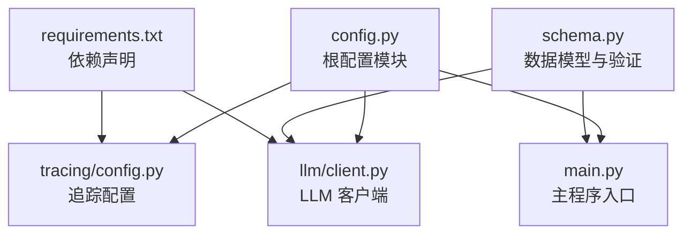
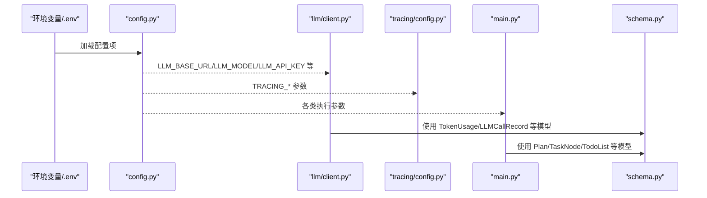
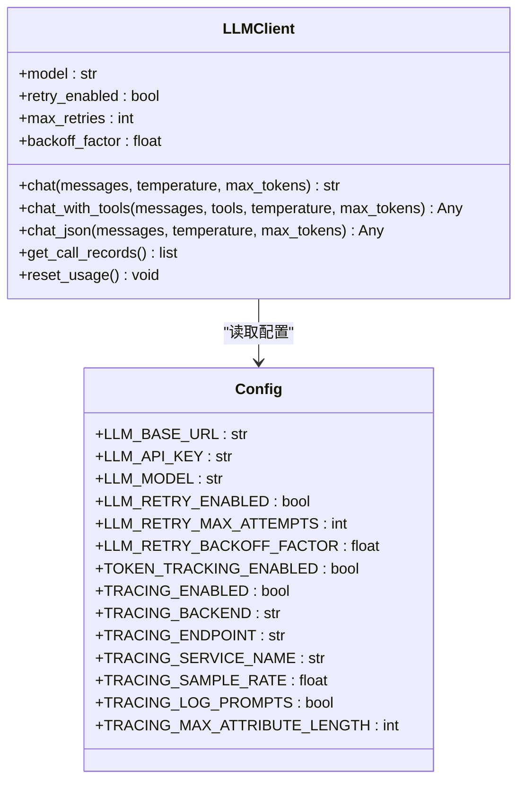
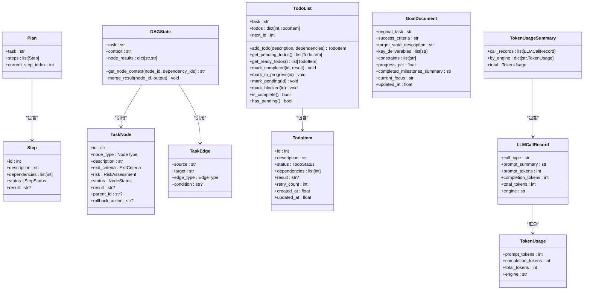
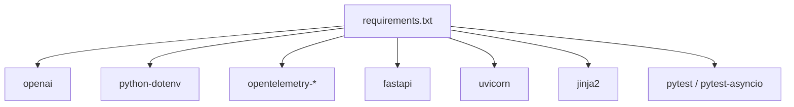

# 配置管理

<cite>
**本文引用的文件**
- [config.py](file://config.py)
- [schema.py](file://schema.py)
- [backups/config.py](file://backups/config.py)
- [backups/schema.py](file://backups/schema.py)
- [main.py](file://main.py)
- [llm/client.py](file://llm/client.py)
- [tracing/config.py](file://tracing/config.py)
- [requirements.txt](file://requirements.txt)
- [tests/test_llm_integration.py](file://tests/test_llm_integration.py)
</cite>

## 目录
1. [简介](#简介)
2. [项目结构](#项目结构)
3. [核心组件](#核心组件)
4. [架构总览](#架构总览)
5. [详细组件分析](#详细组件分析)
6. [依赖分析](#依赖分析)
7. [性能考量](#性能考量)
8. [故障排查指南](#故障排查指南)
9. [结论](#结论)
10. [附录](#附录)

## 简介
本文件面向 manus_demo 的配置管理，围绕 config.py 中的配置参数、schema.py 中的数据模型与验证规则展开，提供不同环境下的配置文件管理策略、环境变量优先级与覆盖机制说明，并补充配置热更新、配置验证、配置备份等高级主题的最佳实践与模板建议。读者无需深入技术背景即可理解如何在开发、测试、生产环境中正确配置与维护本项目。

## 项目结构
manus_demo 的配置体系主要由以下部分组成：
- 根配置模块：config.py 提供所有运行时配置项，统一从环境变量或 .env 文件加载。
- 数据模型与验证：schema.py 定义核心数据结构，使用 Pydantic 进行字段校验与类型约束。
- LLM 客户端：llm/client.py 读取 config.py 中的 LLM 相关配置，实现可选的指数退避重试与追踪集成。
- 追踪配置：tracing/config.py 从根配置模块读取追踪相关参数，形成集中式追踪设置。
- 示例与备份：backups/config.py 与 backups/schema.py 提供历史版本参考，便于迁移与对比。
- 依赖声明：requirements.txt 明确追踪与测试所需的第三方包。

图表来源
- [config.py:1-109](file://config.py#L1-L109)
- [llm/client.py:1-420](file://llm/client.py#L1-L420)
- [tracing/config.py:1-39](file://tracing/config.py#L1-L39)
- [main.py:1-516](file://main.py#L1-L516)
- [requirements.txt:1-19](file://requirements.txt#L1-L19)

章节来源
- [config.py:1-109](file://config.py#L1-L109)
- [schema.py:1-702](file://schema.py#L1-L702)
- [llm/client.py:1-420](file://llm/client.py#L1-L420)
- [tracing/config.py:1-39](file://tracing/config.py#L1-L39)
- [requirements.txt:1-19](file://requirements.txt#L1-L19)

## 核心组件
本节聚焦 config.py 中的关键配置参数类别与用途，以及 schema.py 中的数据模型与验证规则。

- LLM 客户端配置
  - 基础地址与模型：LLM_BASE_URL、LLM_MODEL
  - API 密钥：LLM_API_KEY（建议通过 .env 或环境变量注入）
  - 令牌追踪：TOKEN_TRACKING_ENABLED（是否记录 Token 消耗）
- 超时与并发
  - 节点执行超时：NODE_EXECUTION_TIMEOUT（秒）
  - 并行节点上限：MAX_PARALLEL_NODES
  - 代码/Shell 执行超时：CODE_EXEC_TIMEOUT、SHELL_EXEC_TIMEOUT
  - 并发限制：CODE_MAX_CONCURRENT、SHELL_MAX_CONCURRENT
- 重试策略
  - LLM 调用重试：LLM_RETRY_ENABLED、LLM_RETRY_MAX_ATTEMPTS、LLM_RETRY_BACKOFF_FACTOR
- 计划与执行参数
  - 上下文 Token 上限：MAX_CONTEXT_TOKENS
  - ReAct 循环迭代上限：MAX_REACT_ITERATIONS
  - 重规划尝试次数：MAX_REPLAN_ATTEMPTS
  - 计划模式：PLAN_MODE（auto/simple/complex/emergent）
  - 自适应规划：ADAPTIVE_PLANNING_ENABLED、ADAPT_PLAN_INTERVAL、ADAPT_PLAN_MIN_COMPLETED
  - 工具路由阈值：TOOL_FAILURE_THRESHOLD
- 隐式规划（Emergent）
  - TODO 列表上限：MAX_TODO_ITEMS
  - 单项最大重试：MAX_TODO_RETRIES
  - 上下文压缩阈值：TODO_COMPRESSION_THRESHOLD
  - 主循环迭代上限：MAX_EMERGENT_OUTER_ITERATIONS
- 目标驱动规划（Goal-Driven）
  - 功能开关：ENABLE_GOAL_DRIVEN_PLANNER
  - 重新锚定间隔：GOAL_REANCHOR_INTERVAL
  - 反思间隔：GOAL_REFLECTION_INTERVAL
  - 主循环迭代上限：MAX_GOAL_DRIVEN_ITERATIONS
  - 停滞窗口：GOAL_DRIVEN_STAGNATION_WINDOW
- 工具与沙箱
  - 沙箱目录：SANDBOX_DIR
  - 子进程最大输出字节数：SUBPROCESS_MAX_OUTPUT_BYTES
- 追踪（v7）
  - 总开关：TRACING_ENABLED
  - 后端：TRACING_BACKEND（console/file/rich/otlp/phoenix）
  - 端点：TRACING_ENDPOINT
  - 服务名：TRACING_SERVICE_NAME
  - 采样率：TRACING_SAMPLE_RATE（0.0-1.0）
  - 是否记录提示词：TRACING_LOG_PROMPTS
  - 属性最大长度：TRACING_MAX_ATTRIBUTE_LENGTH

章节来源
- [config.py:13-109](file://config.py#L13-L109)

## 架构总览
配置与数据模型在系统中的交互如下：

图表来源
- [config.py:1-109](file://config.py#L1-L109)
- [llm/client.py:1-420](file://llm/client.py#L1-L420)
- [tracing/config.py:1-39](file://tracing/config.py#L1-L39)
- [main.py:1-516](file://main.py#L1-L516)
- [schema.py:1-702](file://schema.py#L1-L702)

## 详细组件分析

### LLM 客户端与重试机制
- LLMClient 初始化时从 config.py 读取基础地址、API 密钥、模型名与重试参数。
- 当启用重试时，对可重试异常（限流、超时、服务端错误）按指数退避等待指定次数后重试。
- 令牌追踪与追踪集成：当 TOKEN_TRACKING_ENABLED 为真时记录每次调用的 prompt/completion/total tokens；当 TRACING_ENABLED 为真时为 LLM 调用创建追踪 Span。

图表来源
- [llm/client.py:32-420](file://llm/client.py#L32-L420)
- [config.py:13-109](file://config.py#L13-L109)

章节来源
- [llm/client.py:32-420](file://llm/client.py#L32-L420)
- [config.py:82-109](file://config.py#L82-L109)

### 数据模型与验证规则（schema.py）
- 基础模型
  - Step/Plan：旧版线性计划模型，包含步骤状态与依赖。
  - Message：OpenAI 兼容的消息结构，支持 tool_calls、tool_call_id、name。
- DAG 规划模型（v2）
  - NodeType/NodeStatus/EdgeType：节点层级、生命周期与边类型。
  - ExitCriteria/RiskAssessment：节点完成判据与风险评估。
  - TaskNode/TaskEdge：DAG 节点与边。
  - DAGState：集中式状态，提供节点上下文拼接与结果合并。
- 自适应规划（v3）
  - AdaptAction/PlanAdaptation/AdaptationResult：自适应调整动作与结果。
- 隐式规划（v5）
  - TodoStatus/TodoItem/TodoList：TODO 列表的生命周期与管理，包含环检测、依赖验证、状态转换。
- 目标驱动规划（v8）
  - Milestone/MilestonePlan/GoalDocument/GoalReflection/GoalReanchorResult：目标锚定、里程碑与反思流程。
- 执行与追踪模型
  - TokenUsage/LLMCallRecord/TokenUsageSummary：令牌消耗记录与汇总。
  - ToolCallRecord/StepResult/Reflection：工具调用记录、步骤结果与反思。

图表来源
- [schema.py:47-702](file://schema.py#L47-L702)

章节来源
- [schema.py:1-702](file://schema.py#L1-L702)

### 环境变量优先级与覆盖机制
- 加载顺序
  - config.py 在导入时自动加载项目根目录的 .env 文件（若存在），并将系统环境变量作为更高优先级的覆盖源。
- 覆盖规则
  - 系统环境变量覆盖 .env 文件中的同名键；.env 文件覆盖代码中的默认值。
- 关键配置项
  - LLM_API_KEY、LLM_BASE_URL、LLM_MODEL、TOKEN_TRACKING_ENABLED、TRACING_* 等均遵循上述优先级规则。
- 测试验证
  - 测试用例验证 .env 文件加载与环境变量读取，确保 LLM_* 相关变量被正确读取。

章节来源
- [config.py:8-11](file://config.py#L8-L11)
- [tests/test_llm_integration.py:127-138](file://tests/test_llm_integration.py#L127-L138)

### 不同环境下的配置管理策略
- 开发环境
  - 使用 .env 文件存放本地凭据与调试参数，如 LLM_API_KEY、TRACING_ENABLED=false（默认关闭）。
  - 可开启 TOKEN_TRACKING_ENABLED 以便观察 Token 消耗。
- 测试环境
  - 通过 CI 环境变量注入 LLM_API_KEY、LLM_BASE_URL、LLM_MODEL 等，避免硬编码。
  - 可设置 PLAN_MODE=simple|complex|emergent 强制某条路径，便于回归测试。
- 生产环境
  - 严格通过环境变量注入 LLM_API_KEY、LLM_BASE_URL、LLM_MODEL 等敏感信息，禁用 TRACING_LOG_PROMPTS 以保护隐私。
  - 合理设置 NODE_EXECUTION_TIMEOUT、MAX_PARALLEL_NODES、CODE_EXEC_TIMEOUT、SHELL_EXEC_TIMEOUT 等，平衡吞吐与稳定性。
  - 启用 LLM_RETRY_ENABLED 并设置合理的 LLM_RETRY_MAX_ATTEMPTS 与 LLM_RETRY_BACKOFF_FACTOR，提升鲁棒性。

章节来源
- [config.py:13-109](file://config.py#L13-L109)
- [tests/test_llm_integration.py:127-138](file://tests/test_llm_integration.py#L127-L138)

### 配置热更新、验证与备份
- 热更新
  - config.py 在模块导入时一次性读取环境变量，不支持运行时热更新。若需热更新，可在应用层引入配置监听与刷新机制（例如监听 .env 文件变更后重建 LLMClient 或重启相关组件）。
- 配置验证
  - schema.py 使用 Pydantic 字段约束（如 ge/le、默认值、类型注解）实现强类型与运行时校验；建议在应用启动时对关键配置进行显式校验（如检查 LLM_API_KEY 非空、TRACING_ENDPOINT 格式等）。
- 配置备份
  - backups/config.py 与 backups/schema.py 提供历史版本参考，便于迁移与对比；建议在升级前保留当前配置快照。

章节来源
- [backups/config.py:1-44](file://backups/config.py#L1-L44)
- [backups/schema.py:1-296](file://backups/schema.py#L1-L296)
- [schema.py:26-702](file://schema.py#L26-L702)

## 依赖分析
- LLM 客户端依赖
  - openai：异步 OpenAI 客户端。
  - python-dotenv：加载 .env 文件。
  - opentelemetry-*：追踪集成（可选）。
- 追踪配置依赖
  - tracing/config.py 依赖 OpenTelemetry SDK 与导出器。
- 测试依赖
  - pytest 与 pytest-asyncio：用于异步测试与 LLM 集成测试。

图表来源
- [requirements.txt:1-19](file://requirements.txt#L1-L19)

章节来源
- [requirements.txt:1-19](file://requirements.txt#L1-L19)

## 性能考量
- LLM 调用重试
  - 指数退避可缓解瞬时错误，但会增加总体延迟；建议结合业务 SLA 设置最大重试次数与退避上限。
- 并发与超时
  - 合理设置 MAX_PARALLEL_NODES、CODE_MAX_CONCURRENT、SHELL_MAX_CONCURRENT，避免资源争用导致的抖动。
  - NODE_EXECUTION_TIMEOUT、CODE_EXEC_TIMEOUT、SHELL_EXEC_TIMEOUT 应与任务特性匹配，防止长时间阻塞。
- 令牌追踪
  - TOKEN_TRACKING_ENABLED 会带来少量开销，建议在生产中按需开启并定期归档统计。

## 故障排查指南
- LLM API 无法连接
  - 检查 LLM_API_KEY 是否正确注入；确认 LLM_BASE_URL 与 LLM_MODEL 配置是否匹配目标提供商。
  - 若启用重试，观察日志中重试次数与退避等待时间是否符合预期。
- 追踪未生效
  - 确认 TRACING_ENABLED=true 且 TRACING_BACKEND 配置正确；检查 TRACING_ENDPOINT 与采样率设置。
- 隐式规划 TODO 无法推进
  - 检查 MAX_TODO_RETRIES 与 TODO_COMPRESSION_THRESHOLD；确认依赖关系是否形成环（TodoList._has_cycle）。
- 目标驱动规划停滞
  - 调整 GOAL_DRIVEN_STAGNATION_WINDOW 与 GOAL_REFLECTION_INTERVAL，观察反思频率与重新锚定效果。

章节来源
- [llm/client.py:92-118](file://llm/client.py#L92-L118)
- [config.py:82-109](file://config.py#L82-L109)
- [schema.py:441-462](file://schema.py#L441-L462)

## 结论
manus_demo 的配置体系以 config.py 为核心，结合 schema.py 的强类型数据模型与 llm/client.py 的可选重试与追踪能力，形成了灵活、可扩展且易于维护的配置管理框架。通过明确的环境变量优先级、不同环境的配置策略以及备份与验证机制，团队可以在开发、测试与生产环境中稳定地运行系统。

## 附录

### 配置模板与最佳实践
- .env 模板（示例）
  - LLM_BASE_URL=https://api.deepseek.com/v1
  - LLM_API_KEY=sk-xxxxxxxxxxxx
  - LLM_MODEL=deepseek-chat
  - TOKEN_TRACKING_ENABLED=true
  - TRACING_ENABLED=false
  - TRACING_BACKEND=console
  - TRACING_ENDPOINT=http://localhost:4318
  - TRACING_SERVICE_NAME=manus-demo
  - TRACING_SAMPLE_RATE=1.0
  - TRACING_LOG_PROMPTS=false
  - TRACING_MAX_ATTRIBUTE_LENGTH=1000
  - PLAN_MODE=auto
  - MAX_PARALLEL_NODES=3
  - NODE_EXECUTION_TIMEOUT=300
  - CODE_EXEC_TIMEOUT=30
  - SHELL_EXEC_TIMEOUT=30
  - CODE_MAX_CONCURRENT=3
  - SHELL_MAX_CONCURRENT=3
  - LLM_RETRY_ENABLED=false
  - LLM_RETRY_MAX_ATTEMPTS=3
  - LLM_RETRY_BACKOFF_FACTOR=2.0
  - MAX_TODO_ITEMS=20
  - MAX_TODO_RETRIES=3
  - TODO_COMPRESSION_THRESHOLD=0.8
  - ENABLE_GOAL_DRIVEN_PLANNER=false
  - GOAL_REANCHOR_INTERVAL=5
  - GOAL_REFLECTION_INTERVAL=1
  - GOAL_DRIVEN_STAGNATION_WINDOW=3
- 最佳实践
  - 生产环境必须通过环境变量注入敏感信息，禁止提交 .env 到版本库。
  - 使用 PLAN_MODE 强制路径进行回归测试，确保不同规划模式的稳定性。
  - 启用 TOKEN_TRACKING_ENABLED 观察成本趋势，结合 LLM_RETRY_* 参数优化稳定性。
  - 在生产中谨慎开启 TRACING_LOG_PROMPTS，避免泄露敏感提示词。