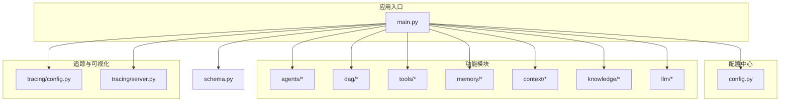
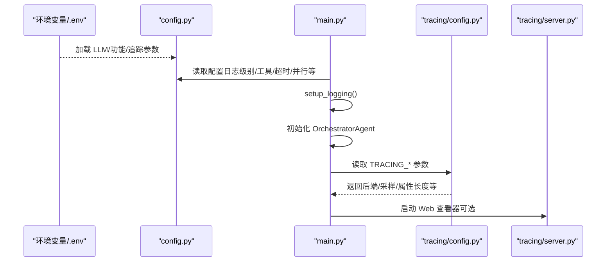
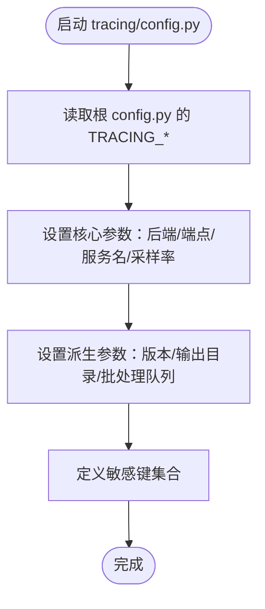
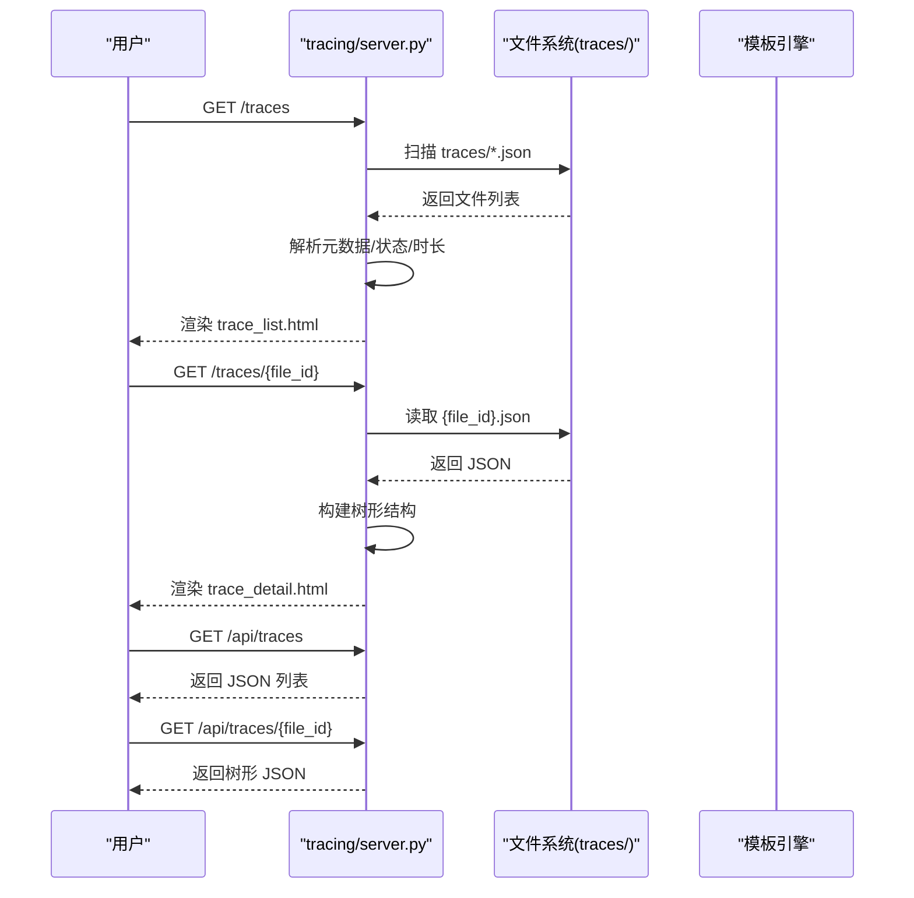
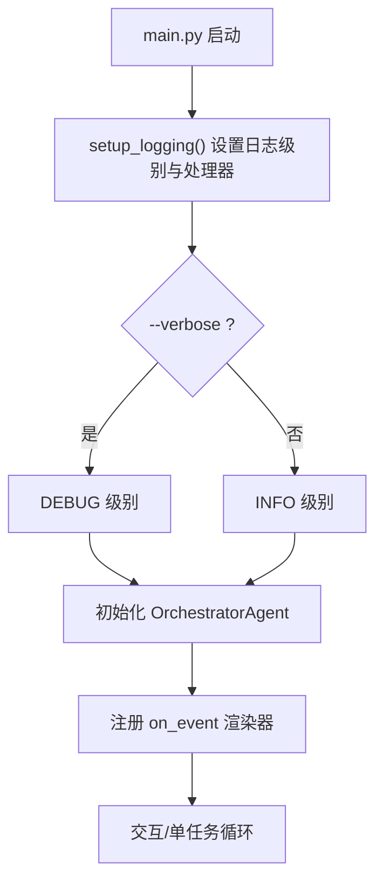

# 配置和部署

<cite>
**本文引用的文件**
- [config.py](file://config.py)
- [main.py](file://main.py)
- [requirements.txt](file://requirements.txt)
- [README.md](file://README.md)
- [README_CN.md](file://README_CN.md)
- [schema.py](file://schema.py)
- [tracing/config.py](file://tracing/config.py)
- [tracing/server.py](file://tracing/server.py)
- [backups/config.py](file://backups/config.py)
</cite>

## 目录
1. [简介](#简介)
2. [项目结构](#项目结构)
3. [核心组件](#核心组件)
4. [架构总览](#架构总览)
5. [详细组件分析](#详细组件分析)
6. [依赖分析](#依赖分析)
7. [性能考虑](#性能考虑)
8. [故障排除指南](#故障排除指南)
9. [结论](#结论)
10. [附录](#附录)

## 简介
本指南面向 manus_demo 项目的配置与部署，涵盖环境变量与配置文件结构、参数优先级、不同环境（开发/测试/生产）的差异化配置、安全与隐私建议、容器化部署思路、监控与日志配置、故障排除以及性能调优建议。文档同时给出与代码实际对应的图示与来源标注，确保读者能够准确对照实现。

## 项目结构
manus_demo 采用“配置中心 + 应用入口 + 功能模块”的分层组织方式：
- 配置中心：config.py 从 .env 或系统环境变量加载全局参数
- 应用入口：main.py 提供交互与单任务两种运行模式，并负责日志初始化
- 功能模块：agents/dag/tools/memory/context/knowledge/llm 等
- 追踪与可视化：tracing/ 提供 OpenTelemetry 集成与 Web 查看器
- 数据模型：schema.py 定义核心数据结构（含 v5/v8 新特性）

图表来源
- [main.py:1-516](file://main.py#L1-L516)
- [config.py:1-109](file://config.py#L1-L109)
- [tracing/config.py:1-79](file://tracing/config.py#L1-L79)
- [tracing/server.py:1-276](file://tracing/server.py#L1-L276)
- [schema.py:1-688](file://schema.py#L1-L688)

章节来源
- [README.md:97-154](file://README.md#L97-L154)
- [README_CN.md:122-174](file://README_CN.md#L122-L174)

## 核心组件
- 配置模块 config.py：集中管理 LLM API、执行限制、记忆与知识库、规划路由、DAG 执行、自适应规划、工具路由、超步间自适应、隐式规划、工具参数、LLM 重试、Token 跟踪、目标驱动规划、追踪等配置项。支持 .env 与系统环境变量，后者优先级更高。
- 应用入口 main.py：提供交互模式与单任务模式；通过 setup_logging 初始化 Rich 日志；事件驱动 UI 渲染；运行 OrchestratorAgent。
- 追踪配置 tracing/config.py：从根 config.py 读取 TRACING_* 参数，定义导出后端、采样率、属性长度限制、敏感键集合等。
- 追踪 Web 服务器 tracing/server.py：提供 FastAPI 服务，渲染 trace 列表与详情页，暴露 JSON API；支持路径遍历保护与根 span 解析。
- 数据模型 schema.py：定义 TaskNode/TaskEdge/DAGState、ExitCriteria/RiskAssessment、TokenUsage/LLMCallRecord/TokenUsageSummary、TodoList/TodoItem、GoalDocument/GoalReflection 等，支撑 v5/v8 新特性。

章节来源
- [config.py:1-109](file://config.py#L1-L109)
- [main.py:396-516](file://main.py#L396-L516)
- [tracing/config.py:1-79](file://tracing/config.py#L1-L79)
- [tracing/server.py:1-276](file://tracing/server.py#L1-L276)
- [schema.py:1-688](file://schema.py#L1-L688)

## 架构总览
下图展示了配置与运行时的关键交互：main.py 读取 config.py 的配置，初始化日志与 OrchestratorAgent；Tracing 子系统通过 tracing/config.py 读取 TRACING_* 参数并按后端导出；schema.py 的数据模型贯穿各模块。

图表来源
- [config.py:11-109](file://config.py#L11-L109)
- [main.py:396-413](file://main.py#L396-L413)
- [tracing/config.py:17-43](file://tracing/config.py#L17-L43)
- [tracing/server.py:29-38](file://tracing/server.py#L29-L38)

## 详细组件分析

### 配置模块与参数优先级
- 加载顺序：config.py 在导入时自动加载项目根目录的 .env（若存在），系统环境变量优先级高于 .env。
- LLM API：LLM_BASE_URL、LLM_API_KEY、LLM_MODEL
- 执行限制：MAX_CONTEXT_TOKENS、MAX_REACT_ITERATIONS、MAX_REPLAN_ATTEMPTS
- 记忆与知识库：MEMORY_DIR、SHORT_TERM_WINDOW、KNOWLEDGE_DOCS_DIR、KNOWLEDGE_CHUNK_SIZE、KNOWLEDGE_TOP_K
- 规划路由：PLAN_MODE（auto/simple/complex/emergent）
- DAG 执行：MAX_PARALLEL_NODES
- 自适应规划（v3）：ADAPTIVE_PLANNING_ENABLED、ADAPT_PLAN_INTERVAL、ADAPT_PLAN_MIN_COMPLETED
- 工具路由（v3）：TOOL_FAILURE_THRESHOLD
- DAG 执行健壮性：NODE_EXECUTION_TIMEOUT、MAX_CHECKPOINTS
- 隐式规划（v5）：EMERGENT_PLANNING_ENABLED、MAX_TODO_ITEMS、MAX_TODO_RETRIES、TODO_COMPRESSION_THRESHOLD、MAX_EMERGENT_OUTER_ITERATIONS
- 工具参数：SANDBOX_DIR、CODE_EXEC_TIMEOUT、SHELL_EXEC_TIMEOUT、SUBPROCESS_MAX_OUTPUT_BYTES、SHELL_MAX_CONCURRENT、CODE_MAX_CONCURRENT
- ReAct 引擎与 LLM 重试：ENABLE_REACT_ENGINE_V2、LLM_RETRY_ENABLED、LLM_RETRY_MAX_ATTEMPTS、LLM_RETRY_BACKOFF_FACTOR
- Token 跟踪：TOKEN_TRACKING_ENABLED
- 目标驱动规划（v8）：ENABLE_GOAL_DRIVEN_PLANNER、GOAL_REANCHOR_INTERVAL、GOAL_REFLECTION_INTERVAL、MAX_GOAL_DRIVEN_ITERATIONS、GOAL_DRIVEN_STAGNATION_WINDOW
- 追踪（v7）：TRACING_ENABLED、TRACING_BACKEND、TRACING_ENDPOINT、TRACING_SERVICE_NAME、TRACING_SAMPLE_RATE、TRACING_LOG_PROMPTS、TRACING_MAX_ATTRIBUTE_LENGTH

章节来源
- [config.py:13-109](file://config.py#L13-L109)
- [README.md:304-329](file://README.md#L304-L329)
- [README_CN.md:334-358](file://README_CN.md#L334-L358)

### 追踪配置与 Web 查看器
- tracing/config.py 从根 config.py 读取 TRACING_* 参数，定义导出后端（console/file/rich/otlp/phoenix）、采样率、属性长度限制、敏感键集合等。
- tracing/server.py 提供 FastAPI 应用，扫描 traces 目录，构建树形结构，支持路径遍历保护与根 span 解析，暴露 HTML 与 JSON API。

图表来源
- [tracing/config.py:17-79](file://tracing/config.py#L17-L79)
- [config.py:102-109](file://config.py#L102-L109)

图表来源
- [tracing/server.py:65-122](file://tracing/server.py#L65-L122)
- [tracing/server.py:124-149](file://tracing/server.py#L124-L149)
- [tracing/server.py:151-207](file://tracing/server.py#L151-L207)
- [tracing/server.py:219-247](file://tracing/server.py#L219-L247)
- [tracing/server.py:253-276](file://tracing/server.py#L253-L276)

### 日志与事件驱动 UI
- main.py.setup_logging 使用 RichHandler 初始化日志，支持 INFO/DEBUG 级别；抑制第三方 HTTP 客户端噪声。
- 事件驱动 UI：on_event 根据事件类型渲染任务面板、计划、DAG 树、节点状态、反思、Token 消耗等。

图表来源
- [main.py:396-413](file://main.py#L396-L413)
- [main.py:184-390](file://main.py#L184-L390)

章节来源
- [main.py:396-413](file://main.py#L396-L413)
- [main.py:184-390](file://main.py#L184-L390)

### 数据模型与版本演进
- schema.py 定义了 v2/v3/v5/v8 的核心数据结构：TaskNode/TaskEdge/DAGState、TodoList/TodoItem、GoalDocument/GoalReflection 等，支撑分层规划、DAG 并行、隐式规划与目标驱动规划。

章节来源
- [schema.py:157-253](file://schema.py#L157-L253)
- [schema.py:422-568](file://schema.py#L422-L568)
- [schema.py:596-641](file://schema.py#L596-L641)

## 依赖分析
- 运行时依赖：openai、pydantic、rich、python-dotenv
- 追踪依赖：opentelemetry-api/sdk/exporter-otlp、fastapi/uvicorn/jinja2（用于 Web 查看器）
- 测试依赖：pytest、pytest-asyncio（可选）

章节来源
- [requirements.txt:1-19](file://requirements.txt#L1-L19)

## 性能考虑
- 并行执行：MAX_PARALLEL_NODES 控制 Super-step 并行节点数，合理提升吞吐；需结合 CPU/IO 与 LLM 速率平衡。
- 上下文窗口：MAX_CONTEXT_TOKENS 与上下文压缩（ContextManager）降低 Token 消耗，避免超限。
- 工具执行：CODE_EXEC_TIMEOUT/SHELL_EXEC_TIMEOUT、SUBPROCESS_MAX_OUTPUT_BYTES、SHELL_MAX_CONCURRENT/CODE_MAX_CONCURRENT 控制资源占用与稳定性。
- 自适应规划：ADAPTIVE_PLANNING_ENABLED、ADAPT_PLAN_INTERVAL、ADAPT_PLAN_MIN_COMPLETED 降低无效路径开销。
- 隐式规划：TODO 列表压缩阈值 TODO_COMPRESSION_THRESHOLD 与最大项 MAX_TODO_ITEMS 控制上下文膨胀。
- 追踪采样：TRACING_SAMPLE_RATE 降低生产开销；LOG_PROMPTS 关闭避免敏感数据泄露。

章节来源
- [config.py:23-109](file://config.py#L23-L109)
- [README.md:304-329](file://README.md#L304-L329)
- [README_CN.md:334-358](file://README_CN.md#L334-L358)

## 故障排除指南
- ModuleNotFoundError：确认虚拟环境已激活并安装依赖。
- API Key 配置：通过 config 模块读取 LLM_BASE_URL/LLM_MODEL 校验加载值。
- 生成文件位置：沙箱目录 SANDBOX_DIR（默认 ~/.manus_demo/sandbox）。
- 长期记忆位置：MEMORY_DIR（默认 ~/.manus_demo/memory.json）。
- 追踪文件：traces/ 目录（Web 查看器默认读取）。
- 路径遍历保护：tracing/server.py 对 file_id 做路径遍历保护与解析校验。
- 日志级别：使用 -v/--verbose 切换 DEBUG 级别定位问题。

章节来源
- [README_CN.md:489-514](file://README_CN.md#L489-L514)
- [tracing/server.py:129-141](file://tracing/server.py#L129-L141)
- [main.py:502-511](file://main.py#L502-L511)

## 结论
manus_demo 的配置体系以 config.py 为核心，结合 .env 与系统环境变量实现灵活的参数覆盖；main.py 提供清晰的日志与事件驱动 UI；tracing 子系统支持多后端导出与 Web 可视化。通过合理设置并行度、上下文窗口、工具超时与追踪采样，可在开发、测试与生产环境中取得良好的稳定性与可观测性。

## 附录

### 环境配置与部署指南

- 环境准备
  - Python 3.11+，建议使用虚拟环境
  - 安装依赖：pip install -r requirements.txt
  - 可选：pytest 与 pytest-asyncio 用于测试

- 配置文件与优先级
  - config.py 在导入时自动加载项目根目录 .env（若存在）
  - 系统环境变量优先级高于 .env
  - 所有配置项均可通过 .env 或环境变量覆盖

- LLM API 配置
  - LLM_BASE_URL：OpenAI 兼容接口地址
  - LLM_API_KEY：API 密钥（生产环境务必通过 .env 或环境变量设置）
  - LLM_MODEL：模型名称
  - 支持多种服务商（DeepSeek/OpenAI/通义/Ollama 等），仅需修改上述三项

- 功能开关与性能参数
  - 规划路由：PLAN_MODE（auto/simple/complex/emergent）
  - DAG 并行：MAX_PARALLEL_NODES
  - 上下文窗口：MAX_CONTEXT_TOKENS
  - ReAct 迭代：MAX_REACT_ITERATIONS
  - 自适应规划：ADAPTIVE_PLANNING_ENABLED、ADAPT_PLAN_INTERVAL、ADAPT_PLAN_MIN_COMPLETED
  - 工具路由：TOOL_FAILURE_THRESHOLD
  - 隐式规划：EMERGENT_PLANNING_ENABLED、MAX_TODO_ITEMS、MAX_TODO_RETRIES、TODO_COMPRESSION_THRESHOLD
  - 工具执行：SANDBOX_DIR、CODE_EXEC_TIMEOUT、SHELL_EXEC_TIMEOUT、SUBPROCESS_MAX_OUTPUT_BYTES、SHELL_MAX_CONCURRENT、CODE_MAX_CONCURRENT
  - LLM 重试：LLM_RETRY_ENABLED、LLM_RETRY_MAX_ATTEMPTS、LLM_RETRY_BACKOFF_FACTOR
  - Token 跟踪：TOKEN_TRACKING_ENABLED
  - 目标驱动规划：ENABLE_GOAL_DRIVEN_PLANNER、GOAL_REANCHOR_INTERVAL、GOAL_REFLECTION_INTERVAL、MAX_GOAL_DRIVEN_ITERATIONS、GOAL_DRIVEN_STAGNATION_WINDOW

- 追踪与日志
  - TRACING_ENABLED：总开关
  - TRACING_BACKEND：console/file/rich/otlp/phoenix
  - TRACING_ENDPOINT：OTLP HTTP 端点
  - TRACING_SERVICE_NAME：服务标识
  - TRACING_SAMPLE_RATE：采样率（建议生产 0.1~0.3）
  - TRACING_LOG_PROMPTS：是否记录完整 prompt（默认关闭）
  - TRACING_MAX_ATTRIBUTE_LENGTH：属性最大字符数（默认 1000）

- 不同部署场景的配置差异
  - 开发环境：开启 TRACING_LOG_PROMPTS（可选）与 TRACING_BACKEND=rich/console；-v 输出详细日志；适度提高 MAX_PARALLEL_NODES 以观察并行效果
  - 测试环境：禁用 TRACING_LOG_PROMPTS；TRACING_SAMPLE_RATE=1.0；使用稳定 LLM 服务；关注 TOKEN_TRACKING_ENABLED 与上下文窗口
  - 生产环境：TRACING_SAMPLE_RATE 降为 0.1~0.3；TRACING_LOG_PROMPTS=false；关闭 console/file/rich 后端；仅使用 otlp/phoenix；严格控制工具超时与并发；开启 TOKEN_TRACKING_ENABLED 与上下文压缩

- 安全配置建议与最佳实践
  - API Key 与敏感信息：通过 .env 或环境变量注入；避免硬编码；生产环境使用只读权限的 .env
  - 追踪隐私：关闭 TRACING_LOG_PROMPTS；敏感键集合自动脱敏；限制属性长度
  - 工具与沙箱：SANDBOX_DIR 限定文件操作范围；CODE_EXEC_TIMEOUT/SHELL_EXEC_TIMEOUT 限制执行时长；SUBPROCESS_MAX_OUTPUT_BYTES 控制输出大小
  - 路径遍历保护：tracing/server.py 已内置保护，确保 file_id 安全解析

- Docker 容器化部署建议
  - 基础镜像：python:3.11-slim
  - 工作目录：/app
  - 复制 requirements.txt 并安装依赖
  - 复制项目代码与 .env（或通过环境变量注入）
  - 暴露端口：8000（用于 tracing Web 查看器）
  - 命令：python main.py
  - 挂载卷：traces/（用于持久化导出的 JSON）、~/.manus_demo（用于长期记忆与沙箱）

- 监控与日志配置方法
  - 控制台日志：RichHandler，INFO/DEBUG 级别
  - 追踪导出：console/file/rich（开发）；otlp/phoenix（生产对接 Jaeger/Zipkin/Phoenix）
  - Web 查看器：FastAPI 应用，提供 HTML 与 JSON API；支持根 span 解析与树形渲染

- 故障排除清单
  - 依赖缺失：确认虚拟环境与 requirements.txt
  - API Key 错误：检查 LLM_API_KEY 与 LLM_BASE_URL/LLM_MODEL
  - 文件权限：SANDBOX_DIR 与 MEMORY_DIR 的读写权限
  - 追踪文件：traces/ 目录存在且可写；Web 查看器端口未被占用
  - 超时与内存：调整 CODE_EXEC_TIMEOUT/SHELL_EXEC_TIMEOUT、MAX_PARALLEL_NODES、SUBPROCESS_MAX_OUTPUT_BYTES

- 性能调优与资源优化建议
  - 并行度：根据 CPU 核心数与 LLM 速率设置 MAX_PARALLEL_NODES
  - 上下文：合理设置 MAX_CONTEXT_TOKENS 与上下文压缩策略
  - 工具：限制 SHELL_MAX_CONCURRENT/CODE_MAX_CONCURRENT，避免资源争用
  - 追踪：生产环境降低采样率，关闭 LOG_PROMPTS，缩短属性长度
  - 目标驱动规划：GOAL_REFLECTION_INTERVAL 与 GOAL_REANCHOR_INTERVAL 平衡反思频率与开销

章节来源
- [README.md:156-284](file://README.md#L156-L284)
- [README_CN.md:178-284](file://README_CN.md#L178-L284)
- [config.py:13-109](file://config.py#L13-L109)
- [tracing/config.py:17-43](file://tracing/config.py#L17-L43)
- [tracing/server.py:40-44](file://tracing/server.py#L40-L44)