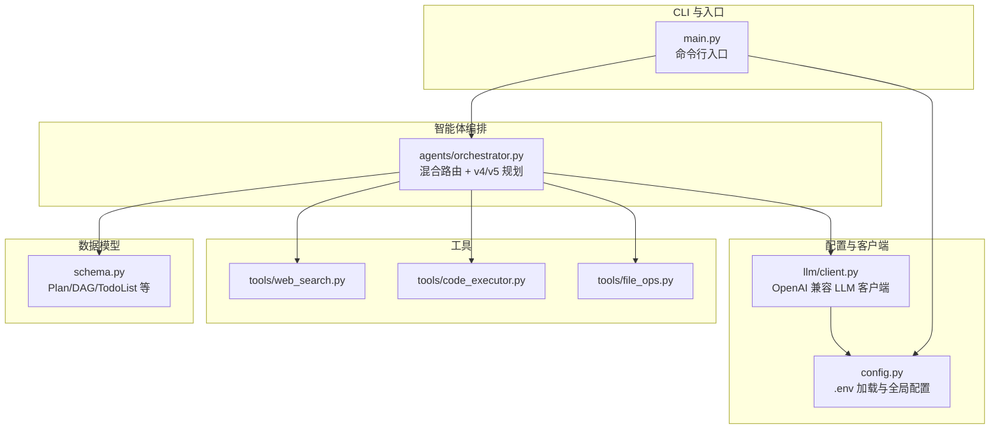
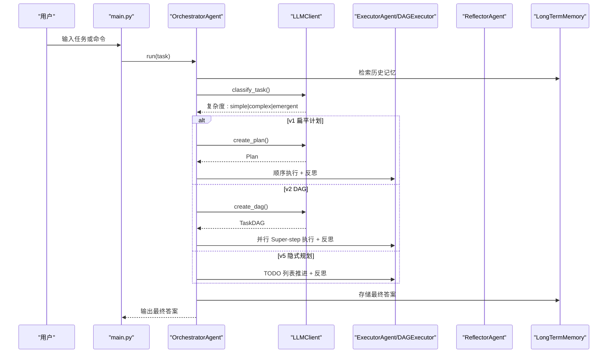
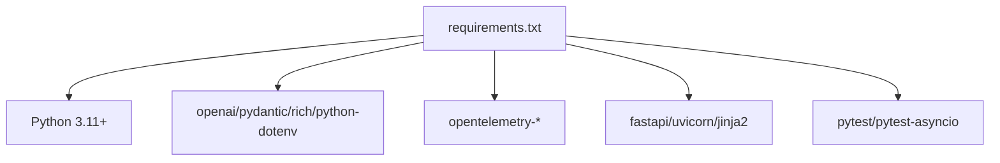

# 快速开始

<cite>
**本文引用的文件**
- [README.md](file://README.md)
- [requirements.txt](file://requirements.txt)
- [config.py](file://config.py)
- [main.py](file://main.py)
- [llm/client.py](file://llm/client.py)
- [agents/orchestrator.py](file://agents/orchestrator.py)
- [tools/web_search.py](file://tools/web_search.py)
- [tools/code_executor.py](file://tools/code_executor.py)
- [tools/file_ops.py](file://tools/file_ops.py)
- [schema.py](file://schema.py)
- [tests/test_emergent_simple.py](file://tests/test_emergent_simple.py)
</cite>

## 目录
1. [简介](#简介)
2. [项目结构](#项目结构)
3. [核心组件](#核心组件)
4. [架构总览](#架构总览)
5. [详细组件分析](#详细组件分析)
6. [依赖分析](#依赖分析)
7. [性能考虑](#性能考虑)
8. [故障排查指南](#故障排查指南)
9. [结论](#结论)
10. [附录](#附录)

## 简介
本指南面向新手，帮助你在约 15 分钟内成功运行 manus_demo 的第一个示例，体验多智能体系统的核心能力：分层规划、DAG 并行执行、工具调用、状态机驱动、自我反思与纠错。你将完成环境准备、安装依赖、配置 LLM API、运行三种模式（交互模式、单任务模式、强制规划路径模式），并了解常见问题的解决方法。

## 项目结构
manus_demo 是一个基于 DAG 的多智能体演示系统，提供交互式 CLI、丰富的可视化输出以及可扩展的工具生态。核心模块包括：
- CLI 入口与运行模式：main.py
- 配置中心：config.py（读取 .env 或环境变量）
- LLM 客户端：llm/client.py（OpenAI 兼容封装）
- 智能体编排：agents/orchestrator.py（混合路由 v4 + 隐式规划 v5）
- 工具集合：web_search、code_executor、file_ops 等
- 数据模型：schema.py（Plan、DAG、TodoList 等）

图表来源
- [main.py:1-516](file://main.py#L1-L516)
- [config.py:1-109](file://config.py#L1-L109)
- [llm/client.py:1-420](file://llm/client.py#L1-L420)
- [agents/orchestrator.py:1-600](file://agents/orchestrator.py#L1-L600)
- [tools/web_search.py:1-113](file://tools/web_search.py#L1-L113)
- [tools/code_executor.py:1-102](file://tools/code_executor.py#L1-L102)
- [tools/file_ops.py:1-138](file://tools/file_ops.py#L1-L138)
- [schema.py:1-200](file://schema.py#L1-L200)

章节来源
- [README.md:97-154](file://README.md#L97-L154)
- [main.py:1-516](file://main.py#L1-L516)
- [config.py:1-109](file://config.py#L1-L109)

## 核心组件
- CLI 入口与运行模式
  - 交互模式：多轮对话，适合探索性任务
  - 单任务模式：执行一个任务后退出
  - 强制规划路径：通过环境变量强制 v1/v2/v5
  - 详细日志模式：-v/--verbose
- 配置中心
  - LLM_BASE_URL、LLM_API_KEY、LLM_MODEL
  - 执行限制：MAX_CONTEXT_TOKENS、MAX_REACT_ITERATIONS、MAX_REPLAN_ATTEMPTS
  - DAG 并行：MAX_PARALLEL_NODES
  - 隐式规划：EMERGENT_PLANNING_ENABLED、MAX_TODO_ITEMS、TODO_COMPRESSION_THRESHOLD
  - 自适应规划：ADAPTIVE_PLANNING_ENABLED、ADAPT_PLAN_INTERVAL、TOOL_FAILURE_THRESHOLD
  - 工具沙箱：SANDBOX_DIR、CODE_EXEC_TIMEOUT、SHELL_EXEC_TIMEOUT
- LLM 客户端
  - 统一 OpenAI 兼容接口封装，支持重试（v6.0）
  - 结构化 JSON 输出与降级提取
  - Token 使用追踪与可选全链路追踪（v7）
- 智能体编排
  - 混合路由：规则快筛 + LLM 兜底，自动选择 v1/v2/v5
  - DAG 执行：Super-step 并行、状态机、条件分支、回滚
  - 隐式规划：TODO 列表管理、while(tool_use) 主循环
  - 反思与重规划：局部重规划（仅失败子树）
- 工具
  - Web 搜索（mock 结果）
  - Python 代码执行（沙箱 + 超时）
  - 文件读写（沙箱目录 + 路径校验）
  - Shell 命令（沙箱 + 并发限制）

章节来源
- [README.md:156-265](file://README.md#L156-L265)
- [config.py:13-109](file://config.py#L13-L109)
- [llm/client.py:32-420](file://llm/client.py#L32-L420)
- [agents/orchestrator.py:60-600](file://agents/orchestrator.py#L60-L600)
- [tools/web_search.py:56-113](file://tools/web_search.py#L56-L113)
- [tools/code_executor.py:25-102](file://tools/code_executor.py#L25-L102)
- [tools/file_ops.py:23-138](file://tools/file_ops.py#L23-L138)

## 架构总览
manus_demo 的执行管线采用事件驱动的 UI 渲染与多智能体协作：
- 用户输入任务
- Orchestrator 收集上下文（记忆 + 知识）
- 两阶段分类器（规则快筛 + LLM 兜底）确定复杂度
- 路由到 v1 扁平计划、v2 DAG 或 v5 隐式规划
- 执行阶段：ReAct 循环 + 工具调用；DAG 并行；TODO 列表推进
- 反思阶段：逐节点/整体质量评估；必要时局部重规划
- 结果存入长期记忆并输出最终答案

图表来源
- [main.py:415-516](file://main.py#L415-L516)
- [agents/orchestrator.py:158-222](file://agents/orchestrator.py#L158-L222)
- [llm/client.py:73-177](file://llm/client.py#L73-L177)

章节来源
- [README.md:22-96](file://README.md#L22-L96)
- [agents/orchestrator.py:60-92](file://agents/orchestrator.py#L60-L92)

## 详细组件分析

### 环境准备与依赖安装
- Python 版本要求：3.11+
- 建议使用虚拟环境
- 安装依赖：requirements.txt
- 可选测试依赖：pytest、pytest-asyncio

命令示例（按需执行）：
- 创建虚拟环境并激活
- 安装依赖
- 安装测试依赖（可选）

章节来源
- [README.md:158-179](file://README.md#L158-L179)
- [requirements.txt:1-19](file://requirements.txt#L1-L19)

### LLM API 配置（DeepSeek、OpenAI、通义千问、Ollama 等）
- 复制示例配置文件并填入 API Key
- 编辑 .env 或通过环境变量设置：
  - LLM_BASE_URL：OpenAI 兼容接口地址
  - LLM_API_KEY：API Key
  - LLM_MODEL：模型名称
- 支持任何 OpenAI 兼容接口，只需调整上述两项即可

常见提供商示例（在 .env 中设置）：
- DeepSeek（默认）
- Ollama（本地模型）
- 通义千问（DashScope 兼容模式）

章节来源
- [README.md:180-208](file://README.md#L180-L208)
- [config.py:17-19](file://config.py#L17-L19)
- [llm/client.py:51-54](file://llm/client.py#L51-L54)

### 运行模式与命令示例

#### 交互模式（多轮对话）
- 启动：python main.py
- 输入任务后，系统将展示任务分类、计划视图、DAG 树、并行执行、节点状态、反思与最终答案
- 退出：输入 quit/exit/q 或 Ctrl+C

预期行为（概览）：
- 任务开始面板
- 阶段提示（收集上下文、分类、规划、执行、反思）
- v4 混合路由：显示复杂度与 v1/v2 视图
- v2 DAG：树形可视化与状态摘要
- v5 隐式规划：TODO 列表生命周期
- Token 消耗追踪与最终答案面板

章节来源
- [README.md:211-230](file://README.md#L211-L230)
- [main.py:415-478](file://main.py#L415-L478)

#### 单任务模式（直接执行）
- 启动：python main.py "<任务描述>"
- 示例：计算前 10 个斐波那契数并保存到文件

预期行为（概览）：
- 与交互模式相同的流水线，但执行完毕即退出

章节来源
- [README.md:231-236](file://README.md#L231-L236)
- [main.py:479-493](file://main.py#L479-L493)

#### 强制规划路径模式（调试用）
- PLAN_MODE=simple：强制 v1 扁平计划
- PLAN_MODE=complex：强制 v2 DAG 计划
- PLAN_MODE=emergent：强制 v5 隐式规划

章节来源
- [README.md:237-243](file://README.md#L237-L243)
- [config.py:40](file://config.py#L40)

#### 详细日志模式
- 启动：python main.py -v 或 python main.py -v "<任务>"
- 作用：启用 DEBUG 级别日志，便于调试

章节来源
- [README.md:245-250](file://README.md#L245-L250)
- [main.py:396-413](file://main.py#L396-L413)

### 工具与安全
- Web 搜索：返回 mock 结果，可扩展为真实搜索 API
- Python 代码执行：沙箱 + 超时 + 并发限制
- 文件操作：沙箱目录 + 路径校验（防路径穿越）
- Shell 命令：沙箱 + 超时 + 并发限制

章节来源
- [tools/web_search.py:56-113](file://tools/web_search.py#L56-L113)
- [tools/code_executor.py:25-102](file://tools/code_executor.py#L25-L102)
- [tools/file_ops.py:23-138](file://tools/file_ops.py#L23-L138)
- [config.py:71-77](file://config.py#L71-L77)

### 数据模型与规划
- v1 扁平计划：Plan/Step
- v2 DAG：TaskNode/TaskEdge/DAGState/NodeStatus/ExitCriteria/RiskAssessment
- v5 隐式规划：TodoItem/TodoList/TodoStatus
- v8 目标驱动规划（特性开关）：Milestone/GoalDocument 等

章节来源
- [schema.py:47-67](file://schema.py#L47-L67)
- [schema.py:157-187](file://schema.py#L157-L187)
- [schema.py:1-200](file://schema.py#L1-L200)

### 测试与验证
- v2/v3/v4 DAG 能力测试
- v5 隐式规划测试
- v5 简单测试脚本（无需 pytest）

章节来源
- [README.md:252-265](file://README.md#L252-L265)
- [tests/test_emergent_simple.py:1-124](file://tests/test_emergent_simple.py#L1-L124)

## 依赖分析
- Python 3.11+：运行时要求
- 依赖包：openai、pydantic、rich、python-dotenv
- 追踪（v7）：opentelemetry-*、fastapi、uvicorn、jinja2
- 测试（可选）：pytest、pytest-asyncio

图表来源
- [requirements.txt:1-19](file://requirements.txt#L1-L19)

章节来源
- [requirements.txt:1-19](file://requirements.txt#L1-L19)

## 性能考虑
- 并行执行：MAX_PARALLEL_NODES 控制 Super-step 并行节点数
- 上下文窗口：MAX_CONTEXT_TOKENS 超限时触发摘要压缩
- ReAct 迭代：MAX_REACT_ITERATIONS 控制每个 Action 节点的循环上限
- 自适应规划：ADAPTIVE_PLANNING_ENABLED、ADAPT_PLAN_INTERVAL、ADAPT_PLAN_MIN_COMPLETED
- 工具失败切换：TOOL_FAILURE_THRESHOLD + ToolRouter
- 代码/Shell 执行：CODE_EXEC_TIMEOUT、SHELL_EXEC_TIMEOUT、并发限制
- Token 追踪：开启后可统计每调用与引擎维度的消耗

章节来源
- [config.py:23-77](file://config.py#L23-L77)
- [llm/client.py:273-311](file://llm/client.py#L273-L311)

## 故障排查指南
- 无法连接 LLM
  - 检查 .env 或环境变量中的 LLM_BASE_URL、LLM_API_KEY、LLM_MODEL
  - 确认网络可达与 API Key 有效
  - 可启用 LLM_RETRY_ENABLED、增加重试次数与退避因子
- 任务执行卡住或超时
  - 调整 MAX_REACT_ITERATIONS、MAX_PARALLEL_NODES
  - 检查工具超时设置（CODE_EXEC_TIMEOUT、SHELL_EXEC_TIMEOUT）
  - 查看 Token 使用与上下文长度
- DAG 执行失败
  - 查看节点状态与回滚边
  - 反思失败后进行局部重规划（仅重建失败子树）
- 隐式规划阻塞
  - 检查 TODO 列表是否出现 BLOCKED 项
  - 调整 TODO 相关阈值与压缩策略
- 日志与调试
  - 使用 -v/--verbose 启用详细日志
  - 可开启 TRACING_ENABLED 进行全链路追踪（v7）

章节来源
- [README.md:245-265](file://README.md#L245-L265)
- [config.py:48-96](file://config.py#L48-L96)
- [llm/client.py:63-67](file://llm/client.py#L63-L67)

## 结论
通过本快速开始指南，你已经完成了环境准备、依赖安装、LLM API 配置，并成功体验了三种运行模式。manus_demo 提供了清晰的可视化输出与可扩展的工具生态，适合在 15 分钟内上手并深入探索多智能体系统的规划、执行与反思机制。

## 附录

### 常用命令清单
- 创建并激活虚拟环境
- 安装依赖
- 安装测试依赖（可选）
- 配置 .env
- 运行交互模式
- 运行单任务模式
- 强制规划路径模式
- 详细日志模式
- 运行测试

章节来源
- [README.md:158-265](file://README.md#L158-L265)