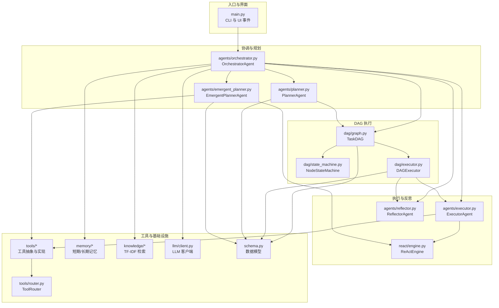
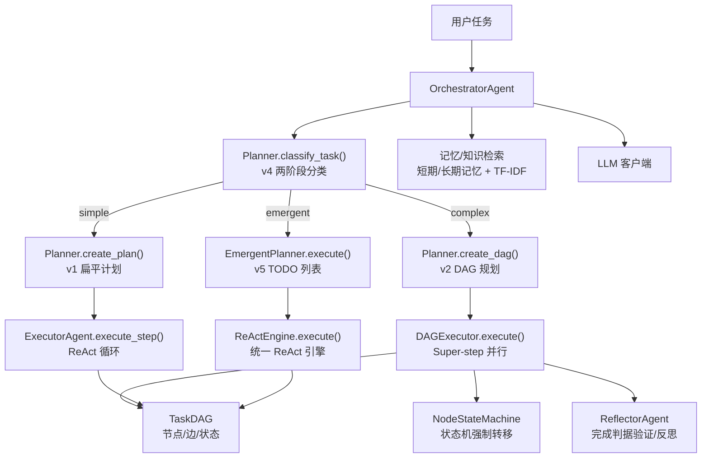
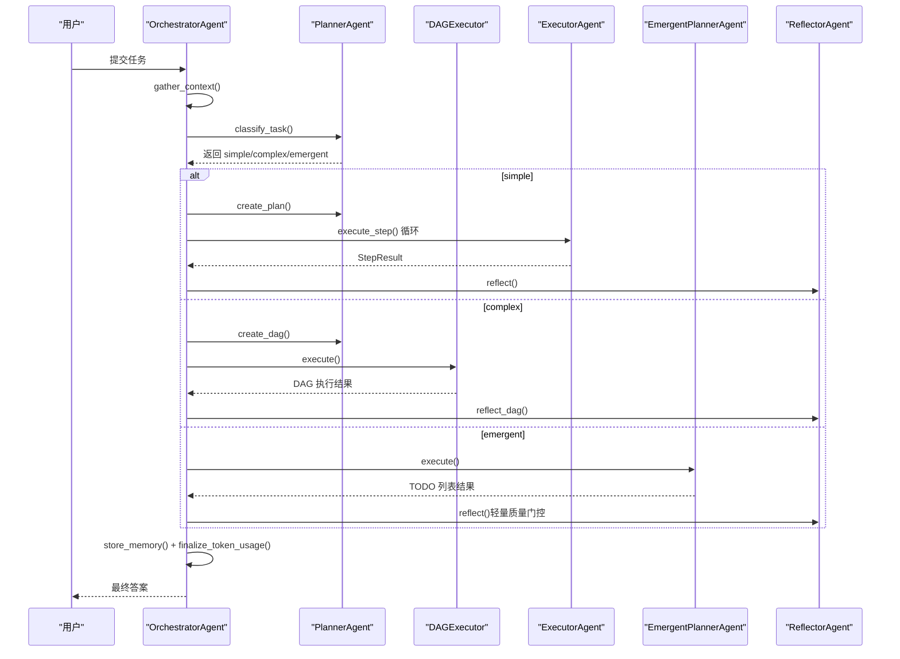
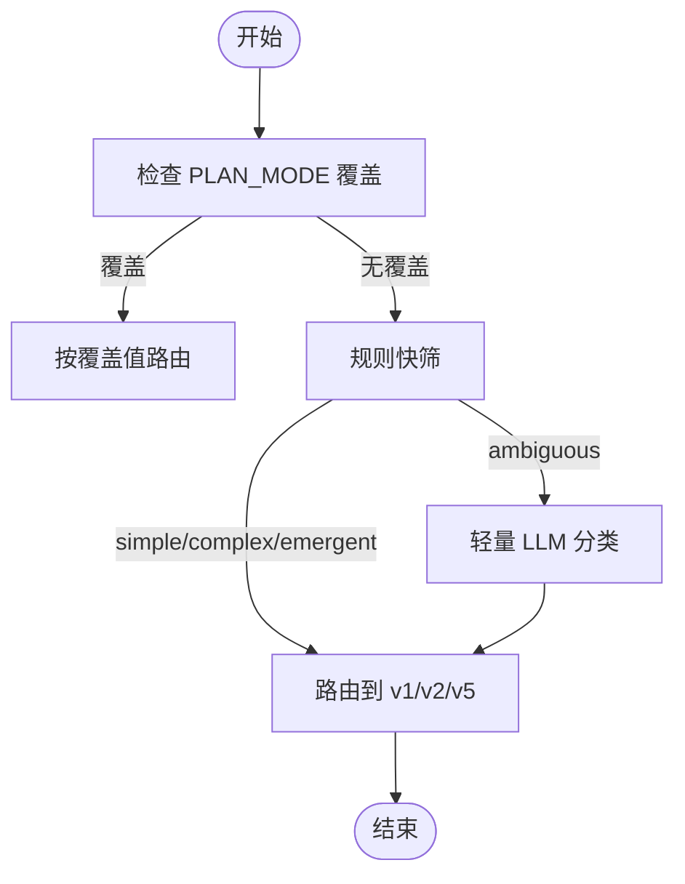
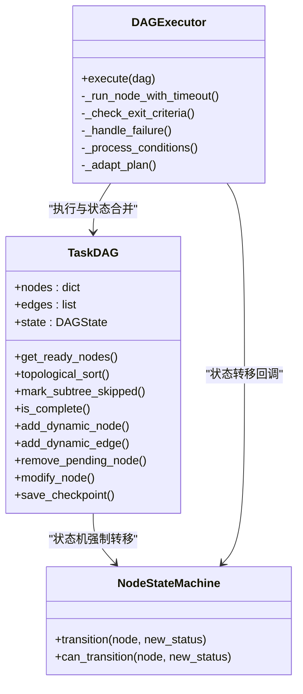
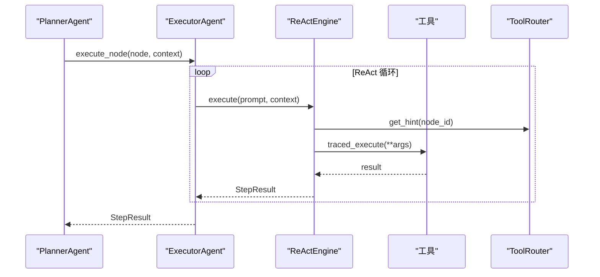
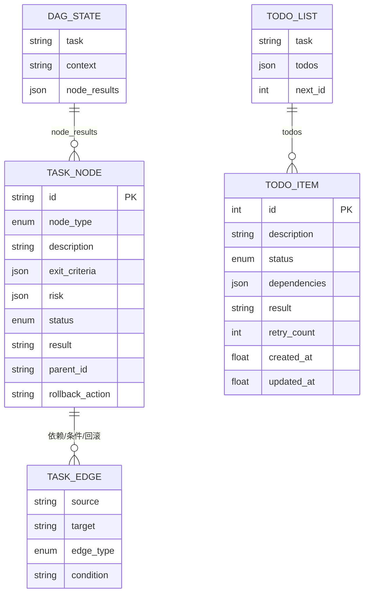
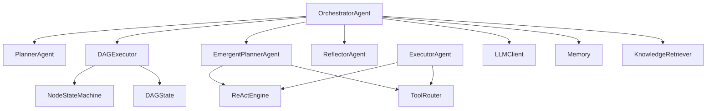

# 技术架构概览

<cite>
**本文档引用的文件**
- [README.md](file://README.md)
- [main.py](file://main.py)
- [agents/orchestrator.py](file://agents/orchestrator.py)
- [agents/planner.py](file://agents/planner.py)
- [dag/graph.py](file://dag/graph.py)
- [dag/state_machine.py](file://dag/state_machine.py)
- [dag/executor.py](file://dag/executor.py)
- [agents/emergent_planner.py](file://agents/emergent_planner.py)
- [react/engine.py](file://react/engine.py)
- [schema.py](file://schema.py)
</cite>

## 目录
1. [简介](#简介)
2. [项目结构](#项目结构)
3. [核心组件](#核心组件)
4. [架构总览](#架构总览)
5. [详细组件分析](#详细组件分析)
6. [依赖关系分析](#依赖关系分析)
7. [性能考量](#性能考量)
8. [故障排查指南](#故障排查指南)
9. [结论](#结论)

## 简介
本项目是一个基于 DAG 的多智能体系统演示，旨在教学与实践结合，展示“分层规划、DAG 并行执行、工具调用、状态机驱动、自我反思与纠错”等关键技术点。系统通过 Orchestrator Agent 作为中央协调者，采用 v4 混合规划路由（simple/complex/emergent）与 v5 隐式规划（Claude Code 风格 TODO 列表管理）相结合的方式，实现对不同复杂度与探索性任务的自适应路由与执行。

## 项目结构
项目采用按功能域划分的模块化组织方式，核心模块包括：
- Orchestrator 与 Planner：任务上下文收集、复杂度分类与规划路由
- DAG 执行引擎：TaskDAG、NodeStateMachine、DAGExecutor
- ReAct 执行与隐式规划：ExecutorAgent、EmergentPlannerAgent、ReActEngine
- 工具与路由：工具抽象、工具路由（失败追踪与替代建议）
- 记忆与知识：短期/长期记忆、TF-IDF 知识检索
- LLM 客户端：统一 OpenAI 兼容接口封装
- Schema：统一的数据模型与状态定义

**图表来源**
- [main.py:1-516](file://main.py#L1-L516)
- [agents/orchestrator.py:60-600](file://agents/orchestrator.py#L60-L600)
- [agents/planner.py:147-800](file://agents/planner.py#L147-L800)
- [dag/graph.py:43-627](file://dag/graph.py#L43-L627)
- [dag/state_machine.py:55-114](file://dag/state_machine.py#L55-L114)
- [dag/executor.py:62-648](file://dag/executor.py#L62-L648)
- [agents/emergent_planner.py:72-685](file://agents/emergent_planner.py#L72-L685)
- [react/engine.py:43-246](file://react/engine.py#L43-L246)
- [schema.py:192-702](file://schema.py#L192-L702)

**章节来源**
- [README.md:97-154](file://README.md#L97-L154)
- [main.py:1-516](file://main.py#L1-L516)

## 核心组件
- Orchestrator Agent：中央协调者，负责任务上下文收集、复杂度分类、路由到 v1/v2/v5 路径、执行与反思、结果存储与 UI 事件分发。
- Planner Agent：混合规划器，v4 两阶段分类器（规则快筛 + LLM 兜底）自动选择 simple/complex/emergent；支持 v2 DAG 规划、v1 扁平计划与 v3 自适应规划。
- DAG 执行引擎：TaskDAG（节点/边/状态）、NodeStateMachine（状态机）、DAGExecutor（Super-step 并行执行循环）。
- ReAct 执行与隐式规划：ExecutorAgent（传统 ReAct 循环）、EmergentPlannerAgent（Claude Code 风格 TODO 列表管理）、ReActEngine（统一 ReAct 引擎）。
- 工具与路由：BaseTool 抽象、ToolRouter（失败追踪与替代建议）、具体工具（网络搜索、代码执行、文件操作、Shell）。
- 记忆与知识：短期/长期记忆、TF-IDF 知识检索。
- LLM 客户端：统一 OpenAI 兼容接口封装，支持 Token 消耗追踪与多引擎聚合。

**章节来源**
- [agents/orchestrator.py:60-600](file://agents/orchestrator.py#L60-L600)
- [agents/planner.py:147-800](file://agents/planner.py#L147-L800)
- [dag/graph.py:43-627](file://dag/graph.py#L43-L627)
- [dag/state_machine.py:55-114](file://dag/state_machine.py#L55-L114)
- [dag/executor.py:62-648](file://dag/executor.py#L62-L648)
- [agents/emergent_planner.py:72-685](file://agents/emergent_planner.py#L72-L685)
- [react/engine.py:43-246](file://react/engine.py#L43-L246)
- [schema.py:192-702](file://schema.py#L192-L702)

## 架构总览
系统采用“中央协调 + 分层规划 + DAG 并行执行 + ReAct 循环”的混合架构，核心设计要点：
- 中央协调者（Orchestrator）：统一调度 Planner、DAGExecutor、EmergentPlanner、Reflector、工具与记忆/知识。
- 分层规划体系（Goal → SubGoal → Action）：v2 DAG 规划提供结构化分解与风险评估；v1 扁平计划适用于简单任务；v5 隐式规划适合探索性任务。
- DAG 执行引擎（Super-step 模型）：动态就绪节点发现、并行执行、条件分支与回滚、自适应规划、Checkpoint 快照。
- ReAct 循环机制：每个 ACTION 节点内部执行 Thought → Tool Call → Observation 循环；v6.0 引入统一 ReActEngine。
- 状态机驱动模型：NodeStateMachine 强制节点生命周期合法转移，确保 DAG 状态一致性。
- v4 混合规划路由：规则快筛 + LLM 兜底，自动选择 v1/v2/v5 路径，兼顾 token 节省与准确性。
- v5 隐式规划：TODO 列表管理 + while(tool_use) 主循环，规划在执行中自然涌现。

**图表来源**
- [README.md:22-76](file://README.md#L22-L76)
- [agents/orchestrator.py:158-222](file://agents/orchestrator.py#L158-L222)
- [agents/planner.py:213-259](file://agents/planner.py#L213-L259)
- [dag/executor.py:110-264](file://dag/executor.py#L110-L264)
- [agents/emergent_planner.py:134-276](file://agents/emergent_planner.py#L134-L276)
- [react/engine.py:84-241](file://react/engine.py#L84-L241)

## 详细组件分析

### Orchestrator Agent（中央协调者）
- 职责：收集上下文（记忆 + 知识）、复杂度分类、路由到 v1/v2/v5、执行与反思、结果存储与 UI 事件分发。
- 关键流程：
  - gather_context → classify_task → route → execute → reflect → store → finalize
  - v1：顺序执行扁平计划，支持重规划
  - v2：DAG 并行执行，支持局部重规划（失败子树）
  - v5：TODO 列表管理 + while(tool_use) 主循环
- 事件驱动 UI：通过 on_event 将执行阶段、节点状态、条件评估、反思结果等实时反馈给控制台 UI。

**图表来源**
- [agents/orchestrator.py:158-508](file://agents/orchestrator.py#L158-L508)
- [agents/planner.py:369-431](file://agents/planner.py#L369-L431)
- [dag/executor.py:110-264](file://dag/executor.py#L110-L264)
- [agents/emergent_planner.py:134-276](file://agents/emergent_planner.py#L134-L276)

**章节来源**
- [agents/orchestrator.py:60-600](file://agents/orchestrator.py#L60-L600)

### Planner Agent（混合规划器）
- v4 两阶段分类器：
  - Stage 1：规则快筛（长度、动词、并行/条件/探索性/不确定性等关键词）
  - Stage 2：轻量 LLM 分类（~60 tokens，temperature=0.0）
- v1 扁平计划：2-6 步顺序执行，支持重规划
- v2 DAG 规划：Goal → SubGoals → Actions 三层分解，支持 exit criteria、风险评估、条件边、回滚边
- v3 自适应规划：超步间评估中间结果，动态增删改节点与边

**图表来源**
- [agents/planner.py:213-259](file://agents/planner.py#L213-L259)
- [agents/planner.py:369-431](file://agents/planner.py#L369-L431)
- [agents/planner.py:481-506](file://agents/planner.py#L481-L506)
- [agents/planner.py:513-566](file://agents/planner.py#L513-L566)

**章节来源**
- [agents/planner.py:147-800](file://agents/planner.py#L147-L800)

### DAG 执行引擎（TaskDAG + NodeStateMachine + DAGExecutor）
- TaskDAG：节点/边/状态集中式管理（DAGState），支持邻接表优化、拓扑排序、下游子树跳过、动态增删改节点/边、Checkpoint 快照
- NodeStateMachine：强制合法状态转移（PENDING → READY → RUNNING → COMPLETED/FAILED/ROLLED_BACK/SKIPPED）
- DAGExecutor：Super-step 并行执行（asyncio.gather），条件边评估，失败回滚与子树跳过，自适应规划（v3）

**图表来源**
- [dag/graph.py:43-627](file://dag/graph.py#L43-L627)
- [dag/state_machine.py:55-114](file://dag/state_machine.py#L55-L114)
- [dag/executor.py:62-648](file://dag/executor.py#L62-L648)

**章节来源**
- [dag/graph.py:43-627](file://dag/graph.py#L43-L627)
- [dag/state_machine.py:55-114](file://dag/state_machine.py#L55-L114)
- [dag/executor.py:62-648](file://dag/executor.py#L62-L648)

### ReAct 执行与隐式规划（ExecutorAgent + EmergentPlannerAgent + ReActEngine）
- ExecutorAgent：每个 ACTION 节点内部的 ReAct 循环，支持工具路由（失败追踪与替代建议）
- EmergentPlannerAgent：Claude Code 风格，TODO 列表管理 + while(tool_use) 主循环，支持停滞检测与 TODO 列表动态更新
- ReActEngine：统一 ReAct 引擎，标准化循环逻辑、工具路由、迭代限制、工具调用记录与错误处理

**图表来源**
- [agents/emergent_planner.py:465-581](file://agents/emergent_planner.py#L465-L581)
- [react/engine.py:84-241](file://react/engine.py#L84-L241)
- [agents/planner.py:369-431](file://agents/planner.py#L369-L431)

**章节来源**
- [agents/emergent_planner.py:72-685](file://agents/emergent_planner.py#L72-L685)
- [react/engine.py:43-246](file://react/engine.py#L43-L246)

### 数据模型与状态（Schema）
- DAG 规划模型：TaskNode、TaskEdge、DAGState、NodeStatus、EdgeType、ExitCriteria、RiskAssessment
- 自适应规划模型：AdaptAction、PlanAdaptation、AdaptationResult
- 隐式规划模型：TodoStatus、TodoItem、TodoList（含环检测）
- 目标驱动规划模型（v8）：Milestone、MilestonePlan、GoalDocument、GoalReflection、GoalAction、GoalReanchorResult
- 执行结果与反思：StepResult、Reflection、ToolCallRecord、TokenUsage/LLMCallRecord/TokenUsageSummary
- 消息模型：Message（OpenAI 兼容）

**图表来源**
- [schema.py:157-187](file://schema.py#L157-L187)
- [schema.py:192-253](file://schema.py#L192-L253)
- [schema.py:395-420](file://schema.py#L395-L420)
- [schema.py:422-567](file://schema.py#L422-L567)

**章节来源**
- [schema.py:192-702](file://schema.py#L192-L702)

## 依赖关系分析
- 组件耦合与内聚：
  - Orchestrator 与 Planner/DAGExecutor/EmergentPlanner/Reflector 为高内聚的编排层
  - DAGExecutor 与 NodeStateMachine 强耦合，确保状态一致性
  - ReActEngine 与工具路由解耦，便于扩展与维护
- 外部依赖与集成：
  - LLM 客户端统一封装，支持多供应商接口
  - 工具路由（ToolRouter）与具体工具解耦，支持失败统计与替代建议
  - DAGState 作为唯一数据源，避免状态漂移

**图表来源**
- [agents/orchestrator.py:115-141](file://agents/orchestrator.py#L115-L141)
- [dag/executor.py:87-104](file://dag/executor.py#L87-L104)
- [agents/emergent_planner.py:90-127](file://agents/emergent_planner.py#L90-L127)

**章节来源**
- [agents/orchestrator.py:115-141](file://agents/orchestrator.py#L115-L141)
- [dag/executor.py:87-104](file://dag/executor.py#L87-L104)
- [agents/emergent_planner.py:90-127](file://agents/emergent_planner.py#L90-L127)

## 性能考量
- 并行执行：DAGExecutor 使用 asyncio.gather 在 Super-step 内并行执行多个 ACTION 节点，提升吞吐
- 动态就绪发现：运行时扫描节点状态与依赖，避免预定义执行序列带来的僵化
- 邻接表优化：TaskDAG 预构建 DEPENDENCY 边邻接表，拓扑排序与下游查找复杂度降至 O(V+E)
- 超步间自适应：按配置间隔评估中间结果，动态调整计划，减少无效执行
- Token 优化：v4 分类器仅在模糊区间触发 LLM，显著降低 token 消耗
- 超时与重试：节点执行超时保护与失败重试上限，避免单点阻塞

## 故障排查指南
- DAG 执行卡住：检查 FAILED 节点、条件边未满足、依赖环或阻塞节点
- 失败处理：确认 ROLLBACK 边是否正确配置，失败后是否执行子树跳过
- 条件分支：核对 CONDITIONAL 边的 condition 关键词匹配策略（CJK 子串 vs 拉丁词边界）
- 自适应规划：检查 ADAPT_PLAN_INTERVAL、ADAPT_PLAN_MIN_COMPLETED 配置
- TODO 列表停滞：关注停滞检测阈值与最大外层迭代次数
- UI 事件：确认 on_event 回调是否正常，避免 UI 异常影响主流程

**章节来源**
- [dag/executor.py:131-264](file://dag/executor.py#L131-L264)
- [agents/emergent_planner.py:167-276](file://agents/emergent_planner.py#L167-L276)
- [dag/graph.py:277-334](file://dag/graph.py#L277-L334)

## 结论
本系统通过 Orchestrator Agent 的中央协调与 v4/v5 的混合规划路由，实现了对不同任务类型的自适应执行路径选择；借助 DAG 执行引擎的 Super-step 并行与状态机驱动，确保了执行的正确性与可观测性；ReAct 循环与统一 ReActEngine 提供了稳定的推理与行动框架；Schema 层的统一数据模型为跨模块协作提供了坚实基础。整体架构在教学可读性与工程实用性之间取得了良好平衡，适合进一步扩展与生产化演进。