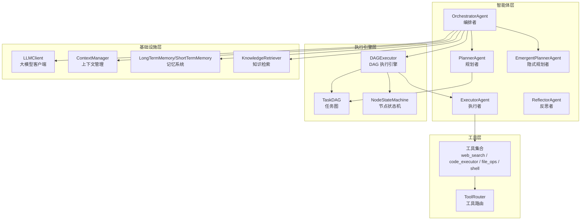
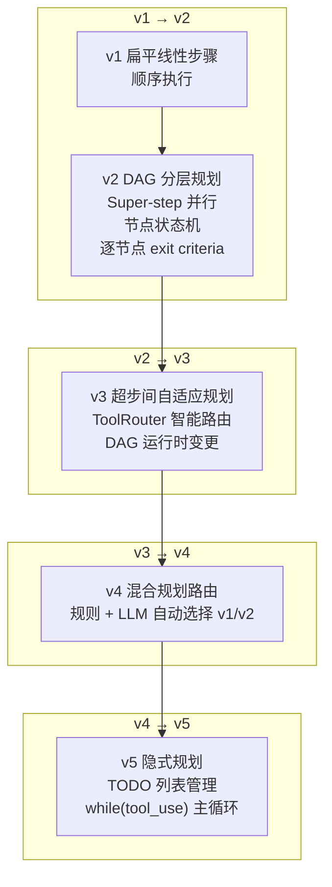
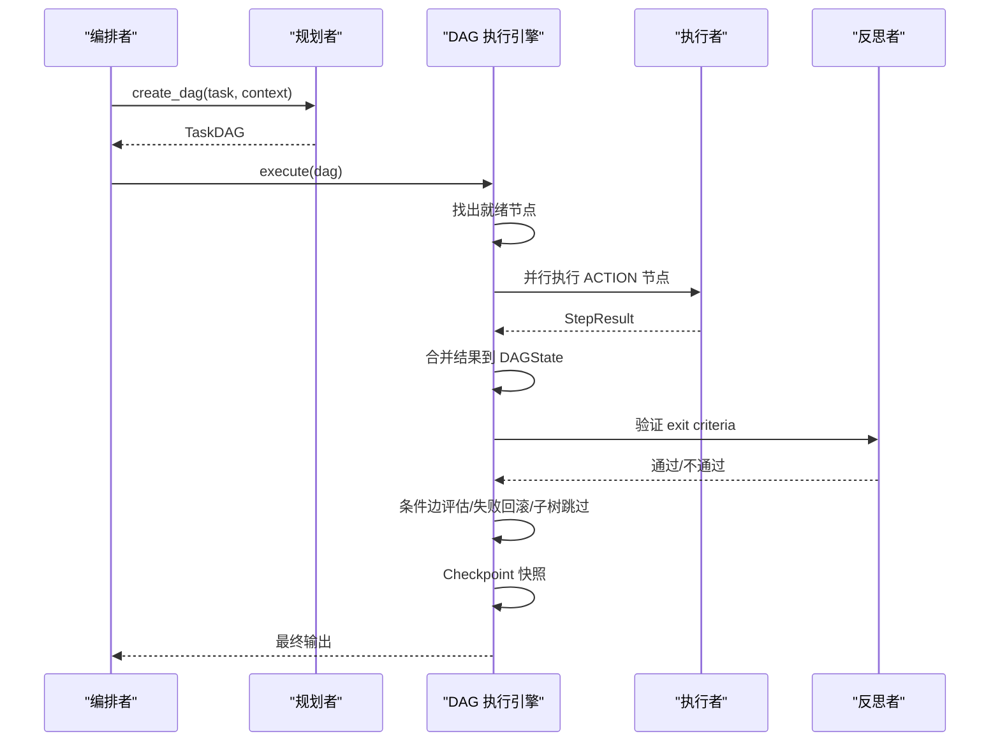
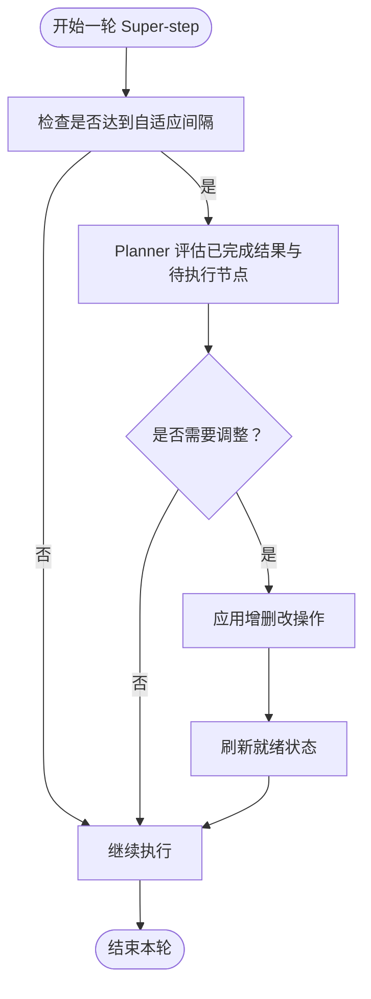
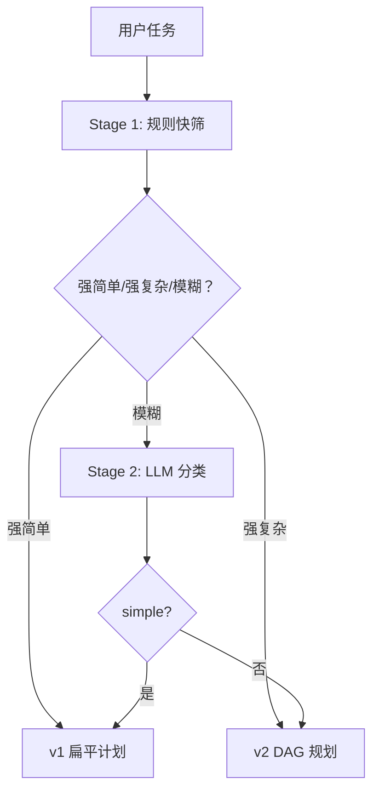
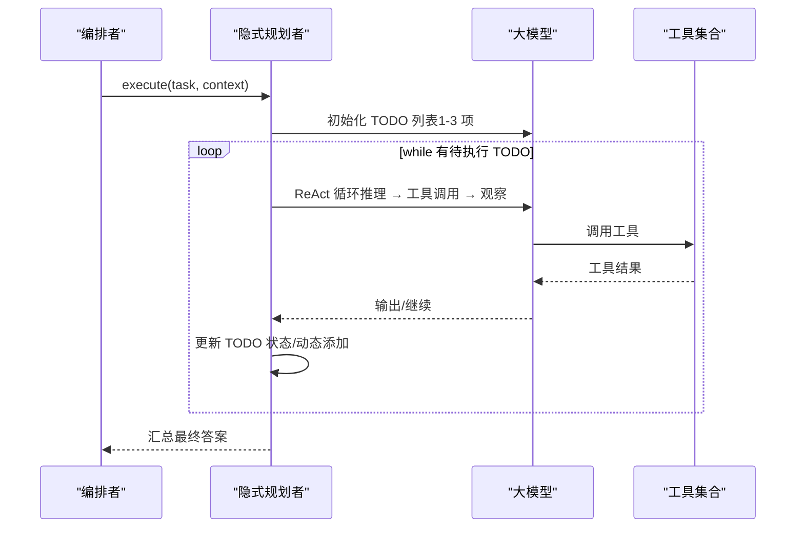
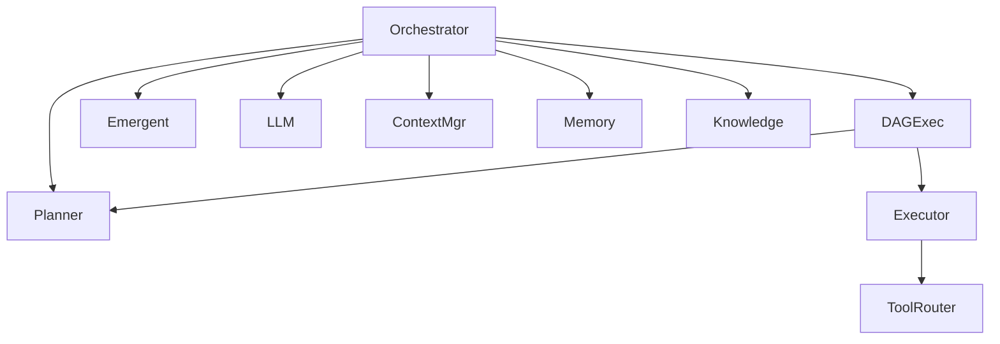

# 版本演进历史

<cite>
**本文引用的文件**
- [README.md](file://README.md)
- [README_CN.md](file://README_CN.md)
- [orchestrator.py](file://agents/orchestrator.py)
- [planner.py](file://agents/planner.py)
- [emergent_planner.py](file://agents/emergent_planner.py)
- [executor.py](file://dag/executor.py)
- [router.py](file://tools/router.py)
- [hybrid-plan-routing-v4.md](file://sxw_aicoding/old_docs/hybrid-plan-routing-v4.md)
- [emergent-planning-v5.md](file://sxw_aicoding/old_docs/emergent-planning-v5.md)
- [upgrade-plan.md](file://sxw_aicoding/docs/upgrade-plan.md)
</cite>

## 目录
1. [简介](#简介)
2. [项目结构](#项目结构)
3. [核心组件](#核心组件)
4. [架构概览](#架构概览)
5. [详细组件分析](#详细组件分析)
6. [依赖分析](#依赖分析)
7. [性能考量](#性能考量)
8. [故障排查指南](#故障排查指南)
9. [结论](#结论)
10. [附录](#附录)

## 简介
本文件系统梳理 manus_demo 从 v1 到 v5 的完整版本演进历程，重点阐述每个版本的关键改进与技术创新，特别是：
- v2：从静态线性规划到动态任务图（DAG）+ 可执行状态机的架构升级，借鉴 LangGraph 的集中状态与 Super-step 并行理念
- v3：超步间自适应规划、工具路由、DAG 运行时变更等增强功能
- v4：混合规划路由（两阶段分类器）设计，自动在 v1/v2 路径间选择
- v5：隐式规划（Emergent Planning）的 Claude Code 风格创新，基于 TODO 列表管理与 while(tool_use) 主循环

## 项目结构
manus_demo 采用“智能体层-执行引擎层-工具层-基础设施层”的分层架构，配合 v4/v5 的混合路由与 v3 的自适应规划，形成从“显式规划”到“隐式涌现”的完整演进路径。

图表来源
- [orchestrator.py](file://agents/orchestrator.py)
- [planner.py](file://agents/planner.py)
- [executor.py](file://dag/executor.py)
- [router.py](file://tools/router.py)

章节来源
- [README.md](file://README.md)
- [README_CN.md](file://README_CN.md)

## 核心组件
- OrchestratorAgent：统一编排 v1/v2/v5 路径，负责上下文收集、复杂度分类、路由与反思
- PlannerAgent：v4 混合路由（规则 + LLM）+ v2 DAG 规划 + v3 自适应规划 + v1 简单规划
- DAGExecutor：Super-step 并行执行引擎，支持条件分支、失败回滚、子树跳过、Checkpoint
- EmergentPlannerAgent：v5 隐式规划，基于 TODO 列表管理与 while(tool_use) 主循环
- ToolRouter：v3 工具路由，失败统计与替代建议注入
- TaskDAG/NodeStateMachine：v2 动态任务图与节点状态机，支撑 DAG 并行与局部重规划

章节来源
- [orchestrator.py](file://agents/orchestrator.py)
- [planner.py](file://agents/planner.py)
- [executor.py](file://dag/executor.py)
- [emergent_planner.py](file://agents/emergent_planner.py)
- [router.py](file://tools/router.py)

## 架构概览
manus_demo 的演进遵循“从显式到隐式、从静态到动态”的设计主线：
- v1：扁平线性步骤，顺序执行，失败全量重规划
- v2：三层 DAG（Goal/SubGoal/Action），Super-step 并行，节点状态机，逐节点 exit criteria，失败局部重规划
- v3：超步间自适应规划（Planner 评估中间结果 → DAG 增删改节点），ToolRouter 智能路由，DAG 运行时变更
- v4：两阶段混合分类器（规则快筛 + LLM 兜底）自动选择 v1/v2 路径
- v5：隐式规划（TODO 列表管理 + while(tool_use)），Claude Code 风格的“规划在执行中涌现”

图表来源
- [README.md](file://README.md)
- [README_CN.md](file://README_CN.md)
- [hybrid-plan-routing-v4.md](file://sxw_aicoding/old_docs/hybrid-plan-routing-v4.md)
- [emergent-planning-v5.md](file://sxw_aicoding/old_docs/emergent-planning-v5.md)

## 详细组件分析

### v2：DAG + 可执行状态机（借鉴 LangGraph 的集中状态与 Super-step 并行）
- 关键创新
  - 三层分层规划（Goal → SubGoal → Action），每个节点携带 exit criteria 与风险评估
  - Super-step 并行执行：同一轮找出所有就绪节点并行执行，显著提升吞吐
  - 节点状态机：严格的生命周期（PENDING → READY → RUNNING → COMPLETED/FAILED），非法转移抛异常
  - 条件分支与失败回滚：CONDITIONAL 边动态启用/跳过，失败触发 ROLLBACK 节点与子树跳过
  - 集中式状态（DAGState）：所有节点结果写入统一字典，支持 LangGraph 风格的 Reducer 模式
  - Checkpoint 快照：每轮 Super-step 结束保存状态，支持调试与回溯
- 设计理念
  - 借鉴 LangGraph 的 Pregel 运行时模型，以 ~100 行代码实现核心执行引擎
  - 保持极简实现，便于教学与理解

图表来源
- [executor.py](file://dag/executor.py)
- [planner.py](file://agents/planner.py)
- [orchestrator.py](file://agents/orchestrator.py)

章节来源
- [README.md](file://README.md)
- [README_CN.md](file://README_CN.md)
- [executor.py](file://dag/executor.py)

### v3：超步间自适应规划 + 工具路由 + DAG 运行时变更
- 关键增强
  - 超步间自适应规划：每 N 轮（可配置）由 Planner 评估已完成结果与待执行节点，决定 REMOVE/MODIFY/ADD
  - ToolRouter：追踪每个节点每个工具的连续失败次数，达到阈值后向 LLM 注入替代工具建议
  - DAG 运行时变更：支持动态增删改节点与边，实现执行期间的计划演化
- 设计价值
  - 从“一次性静态计划”升级为“执行中持续演进”的动态规划
  - 通过工具路由减少无效重试，提升鲁棒性

图表来源
- [executor.py](file://dag/executor.py)
- [planner.py](file://agents/planner.py)
- [router.py](file://tools/router.py)

章节来源
- [README.md](file://README.md)
- [README_CN.md](file://README_CN.md)
- [executor.py](file://dag/executor.py)
- [router.py](file://tools/router.py)

### v4：混合规划路由（两阶段分类器）
- 设计目标
  - 简单任务走 v1（扁平计划，省 token、低延迟）
  - 复杂任务走 v2（分层 DAG，支持并行与容错）
- 两阶段分类器
  - Stage 1：规则快筛（零成本，< 1ms），基于文本特征加权打分
  - Stage 2：轻量 LLM 分类（仅对模糊区间触发，~60 tokens），确定性输出
- 路由逻辑
  - Orchestrator 根据分类结果自动选择 v1/v2 路径，或强制覆盖（PLAN_MODE）

图表来源
- [hybrid-plan-routing-v4.md](file://sxw_aicoding/old_docs/hybrid-plan-routing-v4.md)
- [planner.py](file://agents/planner.py)
- [orchestrator.py](file://agents/orchestrator.py)

章节来源
- [hybrid-plan-routing-v4.md](file://sxw_aicoding/old_docs/hybrid-plan-routing-v4.md)
- [planner.py](file://agents/planner.py)
- [orchestrator.py](file://agents/orchestrator.py)

### v5：隐式规划（Emergent Planning，Claude Code 风格）
- 设计理念
  - 规划在执行中“涌现”，无需预先完整蓝图
  - 基于 TODO 列表管理，while(tool_use) 主循环驱动
  - 单一扁平消息历史，LLM 通过自然语言推理自组织
- 核心机制
  - TODO 列表集中式状态（TodoList），支持动态添加/修改/阻塞
  - 每个 TODO 通过 ReAct 循环执行，失败重试有限次后标记 BLOCKED
  - 周期性或失败后触发 TODO 列表更新，发现新工作时动态添加
- 适用场景
  - 探索性研究、需求模糊、创意设计、边执行边发现的任务
  - 与 v4 的“显式规划”互补，通过 PLAN_MODE=emergent 选择

图表来源
- [emergent_planner.py](file://agents/emergent_planner.py)
- [emergent-planning-v5.md](file://sxw_aicoding/old_docs/emergent-planning-v5.md)
- [orchestrator.py](file://agents/orchestrator.py)

章节来源
- [emergent-planning-v5.md](file://sxw_aicoding/old_docs/emergent-planning-v5.md)
- [emergent_planner.py](file://agents/emergent_planner.py)
- [orchestrator.py](file://agents/orchestrator.py)

## 依赖分析
- 组件耦合
  - Orchestrator 对 Planner/DAGExecutor/EmergentPlanner 的依赖体现了“混合路由”的核心：按复杂度自动选择路径
  - DAGExecutor 与 Planner 的耦合体现在 v3 的自适应规划：Planner 提供 adapt_plan/apply_adaptations，DAGExecutor 在超步间调用
  - ToolRouter 与 Executor 的耦合体现在失败统计与提示注入，避免 LLM 陷入工具失败循环
- 外部依赖
  - LLMClient：统一的大模型调用封装，支持多供应商
  - ContextManager：上下文压缩与 Token 估算
  - 记忆与知识：LongTermMemory/ShortTermMemory + KnowledgeRetriever

图表来源
- [orchestrator.py](file://agents/orchestrator.py)
- [planner.py](file://agents/planner.py)
- [executor.py](file://dag/executor.py)
- [router.py](file://tools/router.py)

章节来源
- [orchestrator.py](file://agents/orchestrator.py)
- [planner.py](file://agents/planner.py)
- [executor.py](file://dag/executor.py)
- [router.py](file://tools/router.py)

## 性能考量
- v2/v4 并行执行显著提升吞吐，但需注意资源竞争与超时控制
- v3 自适应规划带来额外 LLM 调用成本，需通过间隔与最小完成数阈值控制频率
- v5 隐式规划适合探索性任务，但顺序执行天然不如 DAG 并行快
- 上下文压缩与 Token 估算对长对话与复杂任务至关重要，建议结合 v7 的三层压缩策略进一步优化

## 故障排查指南
- DAG 执行卡住
  - 检查是否存在 FAILED 节点阻塞或条件边未满足
  - 查看 Checkpoint 快照定位问题轮次
- 工具调用失败
  - 通过 ToolRouter 的失败统计与替代建议定位问题工具
  - 调整 TOOL_FAILURE_THRESHOLD 或在 LLM 提示中注入替代方案
- 规划路径选择不当
  - 检查 PLAN_MODE 与分类结果，必要时强制 v1/v2
  - 对探索性任务，优先尝试 v5 隐式规划

章节来源
- [executor.py](file://dag/executor.py)
- [router.py](file://tools/router.py)
- [planner.py](file://agents/planner.py)

## 结论
manus_demo 的版本演进体现了从“显式静态规划”到“隐式动态规划”的完整技术谱系：v2 的 DAG + 状态机奠定执行基础，v3 的自适应规划与工具路由增强鲁棒性，v4 的混合路由实现资源与效果的平衡，v5 的隐式规划则拥抱探索性与创造性任务。开发者可根据任务特性选择合适路径，或在 v4/v5 间灵活切换以获得最佳性价比。

## 附录

### 升级对比表（v1 → v5）
| 维度 | v1（备份于 manus_demo_backup_before_dag.zip） | v2（当前） | v3（当前） | v4（当前） | v5（当前） |
|---|---|---|---|---|---|
| 计划结构 | 扁平 2-6 步线性 | Goal → SubGoal → Action 三层 DAG | 同 v3（执行中动态调整） | 同 v4（两阶段分类器） | 隐式 TODO 列表管理 |
| 执行模型 | 顺序 for 循环 | Super-step 并行（asyncio.gather） | 同 v3（并行 + 自适应） | 同 v4（并行 + 路由） | while(tool_use) 主循环 |
| 状态管理 | step.status 字段 | NodeStateMachine 强制合法转移 | 同 v3（状态机 + 自适应） | 同 v4（状态机 + 路由） | TodoList 集中式状态 |
| 失败处理 | 整体重规划 | 局部重规划（仅失败子树）+ 回滚 | 同 v3（局部重规划 + ToolRouter） | 同 v4（局部重规划 + 路由） | BLOCKED 标记与停滞检测 |
| 条件逻辑 | 无 | CONDITIONAL 边 + 动态跳过 | 同 v3（条件边） | 同 v4（条件边） | 无条件边（隐式分支） |
| 完成判定 | 步骤级 success 布尔 | 每节点 exit criteria（LLM 验证） | 同 v3（exit criteria） | 同 v4（exit criteria） | TODO 列表完成度 |
| 风险评估 | 无 | 每节点 confidence + risk_level | 同 v3（风险评估） | 同 v4（风险评估） | 无风险评估 |
| 数据流 | 隐式上下文拼接 | DAGState 集中状态（LangGraph 风格） | 同 v3（集中状态） | 同 v4（集中状态） | TodoList 集中式状态 |
| 可追溯性 | 无 | 每 Super-step Checkpoint 快照 | 同 v3（Checkpoint） | 同 v4（Checkpoint） | 无显式 Checkpoint |
| 新增模块 | — | — | tools/router.py（ToolRouter） | — | agents/emergent_planner.py（隐式规划） |
| 新增配置 | — | — | ADAPTIVE_PLANNING_ENABLED、ADAPT_PLAN_INTERVAL、TOOL_FAILURE_THRESHOLD | PLAN_MODE | MAX_TODO_ITEMS、TODO_COMPRESSION_THRESHOLD |

章节来源
- [README.md](file://README.md)
- [README_CN.md](file://README_CN.md)
- [router.py](file://tools/router.py)
- [hybrid-plan-routing-v4.md](file://sxw_aicoding/old_docs/hybrid-plan-routing-v4.md)
- [emergent-planning-v5.md](file://sxw_aicoding/old_docs/emergent-planning-v5.md)