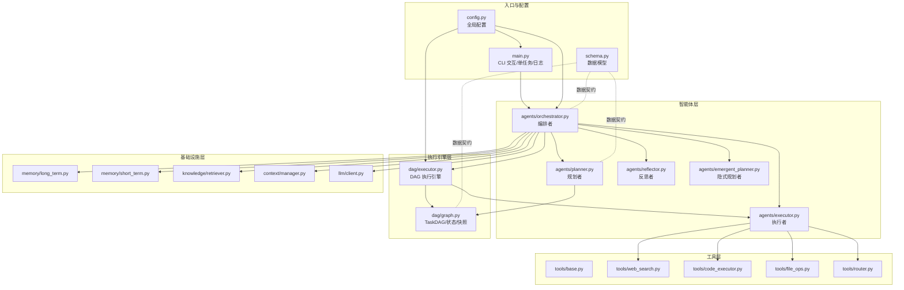
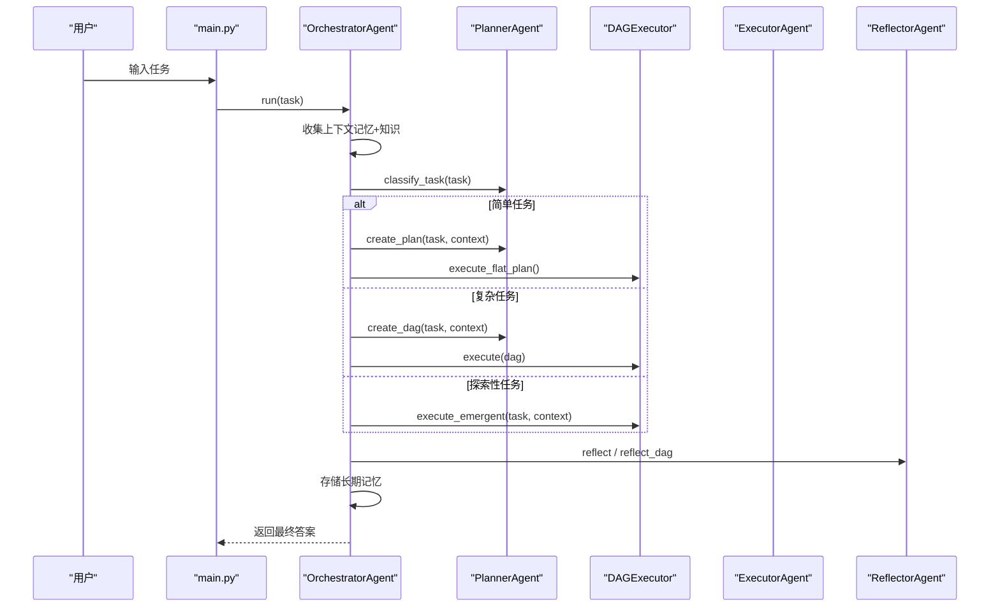
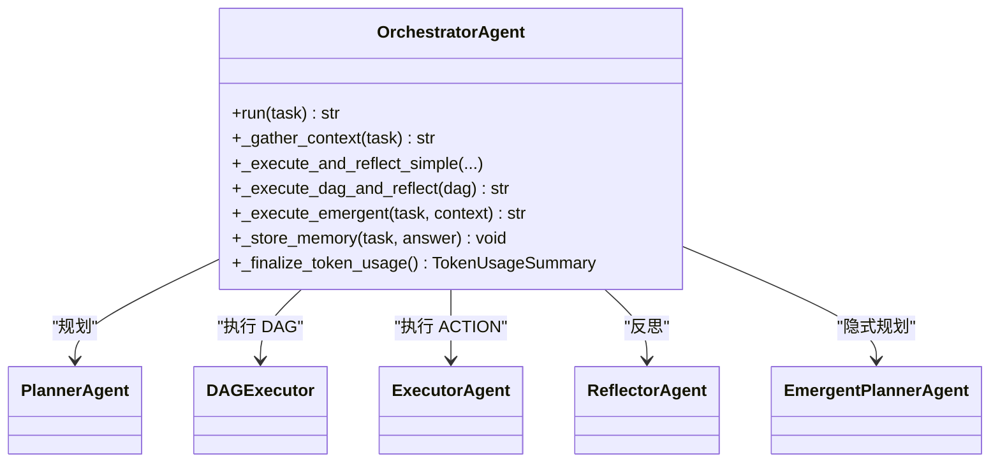
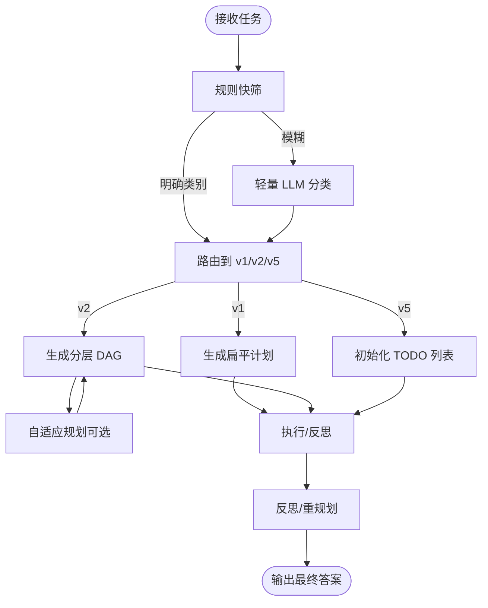
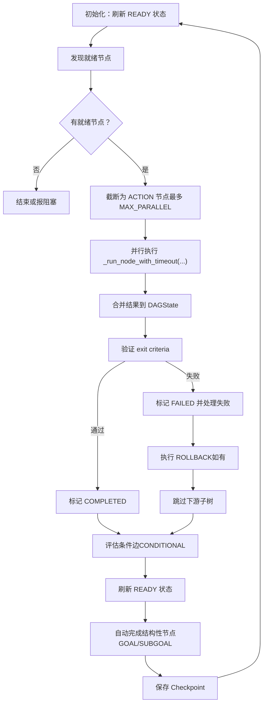
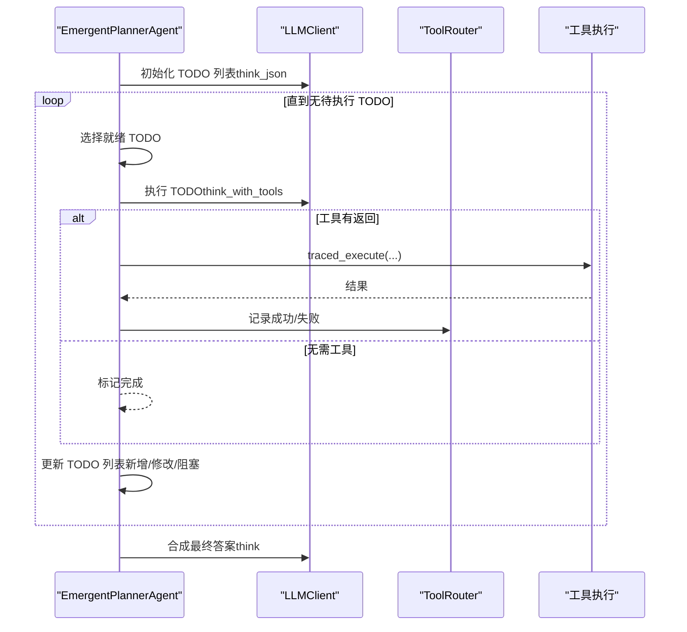
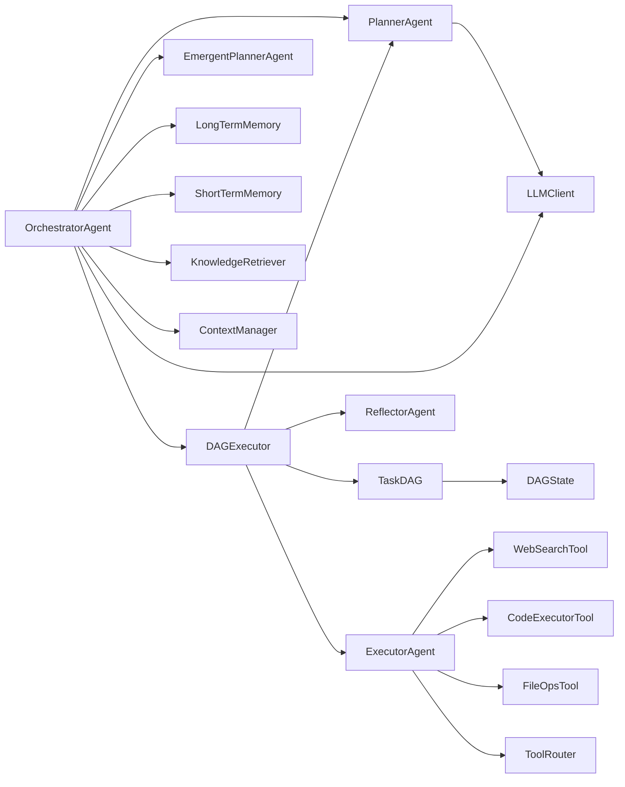

# 项目介绍

<cite>
**本文引用的文件**
- [README_CN.md](file://README_CN.md)
- [README.md](file://README.md)
- [main.py](file://main.py)
- [config.py](file://config.py)
- [schema.py](file://schema.py)
- [agents/orchestrator.py](file://agents/orchestrator.py)
- [agents/planner.py](file://agents/planner.py)
- [agents/emergent_planner.py](file://agents/emergent_planner.py)
- [dag/graph.py](file://dag/graph.py)
- [dag/executor.py](file://dag/executor.py)
</cite>

## 目录
1. [引言](#引言)
2. [项目结构](#项目结构)
3. [核心组件](#核心组件)
4. [架构总览](#架构总览)
5. [详细组件分析](#详细组件分析)
6. [依赖关系分析](#依赖关系分析)
7. [性能考量](#性能考量)
8. [故障排查指南](#故障排查指南)
9. [结论](#结论)
10. [附录](#附录)

## 引言
manus_demo 是一个面向教学的多智能体系统演示项目，旨在通过极简实现与工业级设计相结合的方式，帮助学习者深入理解现代自主 AI Agent 的核心技术原理与工程实践。项目围绕“分层规划、DAG 并行执行、工具调用（ReAct）、状态机驱动、自我反思与纠错”五大支柱展开，并在 v5 中引入 Claude Code 风格的“隐式规划（Emergent Planning）”，通过 TODO 列表管理与 while(tool_use) 主循环实现规划的自然涌现。

项目强调教学透明度与工程可扩展性并重：核心模块以自研实现呈现，避免对重型框架的依赖，使每个环节的逻辑清晰可读；同时借鉴 LangGraph 的集中状态、Super-step 并行与 Checkpoint 等理念，形成可追溯、可调试、可演化的执行闭环。

## 项目结构
manus_demo 采用“智能体层-执行引擎层-工具层-基础设施层”的分层组织方式，配合统一的数据模型与事件驱动 UI，构成完整的多智能体流水线。

图表来源
- [main.py:1-516](file://main.py#L1-L516)
- [config.py:1-109](file://config.py#L1-L109)
- [schema.py:1-688](file://schema.py#L1-L688)
- [agents/orchestrator.py:1-600](file://agents/orchestrator.py#L1-L600)
- [agents/planner.py:1-934](file://agents/planner.py#L1-L934)
- [agents/emergent_planner.py:1-685](file://agents/emergent_planner.py#L1-L685)
- [dag/graph.py:1-627](file://dag/graph.py#L1-L627)
- [dag/executor.py:1-648](file://dag/executor.py#L1-L648)

章节来源
- [README_CN.md:122-174](file://README_CN.md#L122-L174)
- [README.md:97-154](file://README.md#L97-L154)

## 核心组件
- 编排者（OrchestratorAgent）：统一协调记忆检索、任务分类、规划路由、执行与反思，支持 v1/v2/v5 三种路径的自动选择与回退。
- 规划者（PlannerAgent）：两阶段混合分类器（规则快筛 + LLM 兜底），输出 v1 扁平计划或 v2 分层 DAG；支持 v3 自适应规划与 DAG 动态变更。
- 执行者（ExecutorAgent）：在 ACTION 节点内部执行 ReAct 循环，结合工具路由与超时保护，保障稳健执行。
- 隐式规划者（EmergentPlannerAgent）：v5 引入的 Claude Code 风格规划器，通过 TODO 列表管理与 while(tool_use) 主循环实现“规划涌现”。
- DAG 执行引擎（DAGExecutor）：Super-step 并行执行模型，支持条件分支、失败回滚、子树跳过、自适应规划与 Checkpoint 快照。
- 数据模型（schema.py）：统一的 Pydantic 模型，涵盖 v1/v2/v3/v5/v8 的核心数据结构，包括 TaskNode/TaskEdge/DAGState、TodoList/TodoItem、GoalDocument 等。

章节来源
- [agents/orchestrator.py:60-92](file://agents/orchestrator.py#L60-L92)
- [agents/planner.py:147-161](file://agents/planner.py#L147-L161)
- [agents/emergent_planner.py:72-88](file://agents/emergent_planner.py#L72-L88)
- [dag/executor.py:62-85](file://dag/executor.py#L62-L85)
- [schema.py:74-187](file://schema.py#L74-L187)

## 架构总览
manus_demo 的执行路径由“任务分类 → 规划 → 执行 → 反思 → 记忆”构成，支持多路径并行与动态演进：

图表来源
- [main.py:495-516](file://main.py#L495-L516)
- [agents/orchestrator.py:158-222](file://agents/orchestrator.py#L158-L222)
- [agents/planner.py:213-259](file://agents/planner.py#L213-L259)
- [dag/executor.py:110-264](file://dag/executor.py#L110-L264)

章节来源
- [README_CN.md:37-98](file://README_CN.md#L37-L98)
- [README.md:22-76](file://README.md#L22-L76)

## 详细组件分析

### 编排者（OrchestratorAgent）
- 职责：统一编排记忆检索、任务分类、规划路由、执行与反思，支持 v1/v2/v5 路径自动选择与回退。
- 关键能力：
  - 两阶段任务复杂度分类（规则快筛 + LLM 兜底），自动选择 simple/complex/emergent。
  - v1 扁平计划顺序执行 + 反思重规划；v2 DAG 并行执行 + 局部重规划；v5 隐式规划 TODO 列表管理。
  - 长期记忆存储与 Token 消耗追踪汇总。
- 事件驱动 UI：通过 on_event 将执行阶段、节点状态、条件评估、反思结果等实时反馈到控制台。

图表来源
- [agents/orchestrator.py:60-151](file://agents/orchestrator.py#L60-L151)

章节来源
- [agents/orchestrator.py:158-222](file://agents/orchestrator.py#L158-L222)
- [agents/orchestrator.py:369-432](file://agents/orchestrator.py#L369-L432)
- [agents/orchestrator.py:439-508](file://agents/orchestrator.py#L439-L508)

### 规划者（PlannerAgent）
- 职责：两阶段混合分类器自动路由 v1/v2/v5；生成分层 DAG；支持 v3 自适应规划与 DAG 动态变更。
- 关键能力：
  - 规则快筛：基于关键词与长度等启发式规则快速判断任务类型。
  - LLM 兜底：对模糊区间进行轻量分类，避免不必要的 LLM 调用。
  - v2 DAG：一次 JSON 调用生成 Goal/SubGoal/Action 三层结构。
  - v3 自适应：在超步之间评估中间结果，动态增删改节点与边。
  - 局部重规划：失败后仅重建失败子树，保留已完成工作。
- 数据契约：TaskNode/TaskEdge/DAGState/AdaptAction/PlanAdaptation 等。

图表来源
- [agents/planner.py:213-259](file://agents/planner.py#L213-L259)
- [agents/planner.py:481-506](file://agents/planner.py#L481-L506)
- [agents/planner.py:573-672](file://agents/planner.py#L573-L672)

章节来源
- [agents/planner.py:213-259](file://agents/planner.py#L213-L259)
- [agents/planner.py:481-506](file://agents/planner.py#L481-L506)
- [agents/planner.py:573-672](file://agents/planner.py#L573-L672)
- [schema.py:157-187](file://schema.py#L157-L187)

### DAG 执行引擎（DAGExecutor）
- 职责：Super-step 并行执行模型，支持条件分支、失败回滚、子树跳过、自适应规划与 Checkpoint。
- 关键能力：
  - 就绪节点发现：扫描当前状态，动态发现依赖满足的节点。
  - 并行执行：每轮最多 MAX_PARALLEL 个 ACTION 节点并行执行，超时保护。
  - 完成判据验证：逐节点调用 Reflector 的 exit criteria 校验。
  - 失败处理：执行 ROLLBACK 节点，跳过下游子树，避免在不完整状态继续执行。
  - 条件边评估：根据上游结果动态启用/跳过下游分支。
  - 自适应规划：按配置间隔评估中间结果，动态增删改节点与边。
  - Checkpoint：每轮保存 DAG 状态快照，支持调试回溯。
- 数据契约：DAGState、NodeStatus、TaskNode、TaskEdge。

图表来源
- [dag/executor.py:110-264](file://dag/executor.py#L110-L264)
- [dag/executor.py:271-310](file://dag/executor.py#L271-L310)
- [dag/executor.py:350-448](file://dag/executor.py#L350-L448)
- [dag/executor.py:578-632](file://dag/executor.py#L578-L632)

章节来源
- [dag/executor.py:110-264](file://dag/executor.py#L110-L264)
- [dag/executor.py:350-448](file://dag/executor.py#L350-L448)
- [dag/executor.py:578-632](file://dag/executor.py#L578-L632)

### 隐式规划（EmergentPlannerAgent，v5）
- 设计理念：借鉴 Claude Code 的“无独立规划阶段”，通过 TODO 列表管理与 while(tool_use) 主循环实现规划涌现。
- 关键能力：
  - 初始化 TODO 列表（1-3 项），随执行动态增删改。
  - 每轮选择就绪 TODO，执行 ReAct 循环，支持工具路由与重试。
  - 停滞检测：连续多轮无进展时提前退出，避免无限循环。
  - 结果合成：将所有已完成 TODO 的结果综合为最终答案。
- 与 v6 的集成：可选启用统一 ReActEngine，降低重复实现。

图表来源
- [agents/emergent_planner.py:134-276](file://agents/emergent_planner.py#L134-L276)
- [agents/emergent_planner.py:347-459](file://agents/emergent_planner.py#L347-L459)
- [agents/emergent_planner.py:465-581](file://agents/emergent_planner.py#L465-L581)

章节来源
- [agents/emergent_planner.py:72-88](file://agents/emergent_planner.py#L72-L88)
- [agents/emergent_planner.py:134-276](file://agents/emergent_planner.py#L134-L276)
- [agents/emergent_planner.py:347-459](file://agents/emergent_planner.py#L347-L459)

### 数据模型（schema.py）
- v2：TaskNode/TaskEdge/DAGState/NodeStatus/EdgeType/ExitCriteria/RiskAssessment。
- v3：AdaptAction/PlanAdaptation/AdaptationResult，支撑自适应规划。
- v5：TodoStatus/TodoItem/TodoList，支撑隐式规划。
- v8：Milestone/MilestonePlan/GoalDocument/GoalReflection，支撑目标驱动规划。
- 统一契约：所有模块通过 Pydantic 模型进行数据交换，保证类型安全与结构一致性。

章节来源
- [schema.py:74-187](file://schema.py#L74-L187)
- [schema.py:260-296](file://schema.py#L260-L296)
- [schema.py:384-567](file://schema.py#L384-L567)
- [schema.py:575-641](file://schema.py#L575-L641)

## 依赖关系分析
- 模块耦合：
  - Orchestrator 依赖 Planner、DAGExecutor、Executor、Reflector、EmergentPlanner，形成“编排-规划-执行-反思”的闭环。
  - DAGExecutor 依赖 DAGState、NodeStateMachine、Reflector、Planner（v3 自适应），形成“状态-执行-反馈”的闭环。
  - Planner 依赖 LLMClient、ContextManager、DAGGraph，形成“规划-状态-上下文”的闭环。
- 外部依赖：
  - LLMClient：OpenAI 兼容接口封装，支持多服务商切换。
  - 工具层：web_search、code_executor、file_ops、shell_tool、router。
  - 基础设施：记忆（短期/长期）、知识检索、上下文压缩、Tracing（v7）。

图表来源
- [agents/orchestrator.py:115-141](file://agents/orchestrator.py#L115-L141)
- [dag/executor.py:87-104](file://dag/executor.py#L87-L104)
- [dag/graph.py:65-78](file://dag/graph.py#L65-L78)
- [schema.py:192-253](file://schema.py#L192-L253)

章节来源
- [agents/orchestrator.py:115-141](file://agents/orchestrator.py#L115-L141)
- [dag/executor.py:87-104](file://dag/executor.py#L87-L104)
- [dag/graph.py:65-78](file://dag/graph.py#L65-L78)

## 性能考量
- 并行度控制：MAX_PARALLEL_NODES 限制每轮并行节点数，避免资源竞争与超时。
- 超时保护：NODE_EXECUTION_TIMEOUT 与 asyncio.wait_for 防止单节点卡死影响整体吞吐。
- 状态合并：DAGState 使用简单字典写入，天然无锁冲突，等价于 LangGraph 的 LastValue Channel。
- 快照与回溯：Checkpoint 机制支持调试回溯，避免长时间运行内存膨胀。
- Token 跟踪：LLM 调用明细与引擎级汇总，便于成本控制与优化。

章节来源
- [config.py:44-59](file://config.py#L44-L59)
- [dag/executor.py:179-182](file://dag/executor.py#L179-L182)
- [dag/executor.py:291-310](file://dag/executor.py#L291-L310)
- [dag/graph.py:521-542](file://dag/graph.py#L521-L542)
- [agents/orchestrator.py:532-554](file://agents/orchestrator.py#L532-L554)

## 故障排查指南
- 常见问题定位：
  - 无就绪节点：检查依赖是否全部完成，是否存在 FAILED 节点未处理。
  - 条件边未满足：确认上游结果是否包含条件关键词，注意 CJK 与拉丁文的匹配策略差异。
  - 超时与异常：查看 NODE_EXECUTION_TIMEOUT 与 return_exceptions 处理，定位失败节点与重试次数。
  - DAG 环检测：动态增删改节点/边时，拓扑排序失败会触发环检测并回滚。
- 日志与 UI：
  - 详细日志模式（-v/--verbose）开启 DEBUG 级别输出，便于跟踪事件流。
  - 事件驱动 UI 展示任务阶段、节点状态、条件评估、反思结果等，便于可视化调试。
- 记忆与知识：
  - 长期记忆存储路径与短期记忆窗口大小可通过配置项调整。
  - 知识库文档位于 knowledge/docs/，启动时自动索引。

章节来源
- [main.py:396-413](file://main.py#L396-L413)
- [main.py:184-390](file://main.py#L184-L390)
- [dag/executor.py:134-141](file://dag/executor.py#L134-L141)
- [dag/executor.py:405-448](file://dag/executor.py#L405-L448)
- [dag/graph.py:389-396](file://dag/graph.py#L389-L396)
- [README_CN.md:489-514](file://README_CN.md#L489-L514)

## 结论
manus_demo 以教学为导向，通过极简实现与工业级设计的融合，构建了一个可读性强、可扩展性高、可调试性好的多智能体系统。其核心价值在于：
- 教学透明度：每个模块职责清晰，逻辑自洽，便于学习与二次开发。
- 工业级架构：借鉴 LangGraph 的集中状态、Super-step 并行与 Checkpoint 等理念，形成可演化的执行闭环。
- 技术创新：v5 隐式规划（Emergent Planning）以 TODO 列表管理与 while(tool_use) 主循环实现规划涌现，适合探索性与需求不明确的开放式任务。
- 实战能力：支持 v1/v2/v5 多路径路由、条件分支、失败回滚、自适应规划与动态 DAG 变更，覆盖从简单到复杂的多样化场景。

## 附录
- 快速开始与运行测试：参见 README 中的“快速开始”“运行测试”“配置参考”“扩展指南”等章节。
- 版本演进：v1→v2→v3→v4→v5 的能力升级与对比，详见 README 与文档目录。

章节来源
- [README_CN.md:178-331](file://README_CN.md#L178-L331)
- [README.md:156-292](file://README.md#L156-L292)