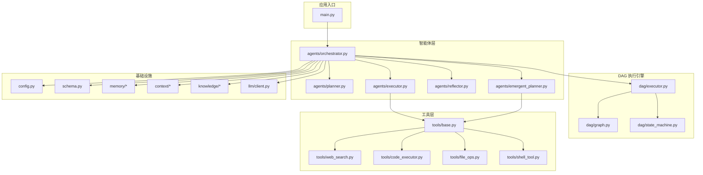
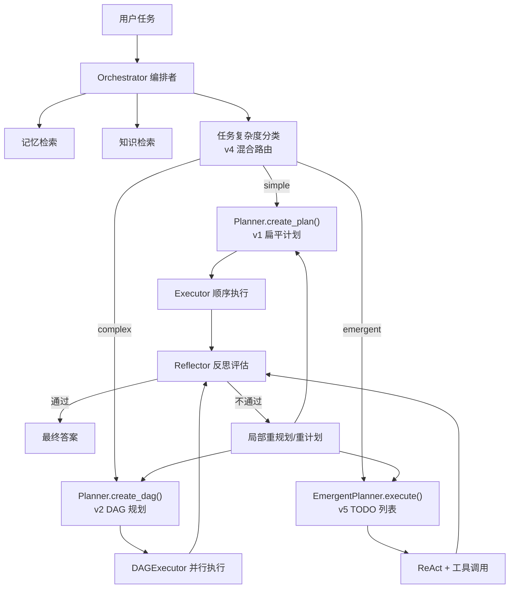
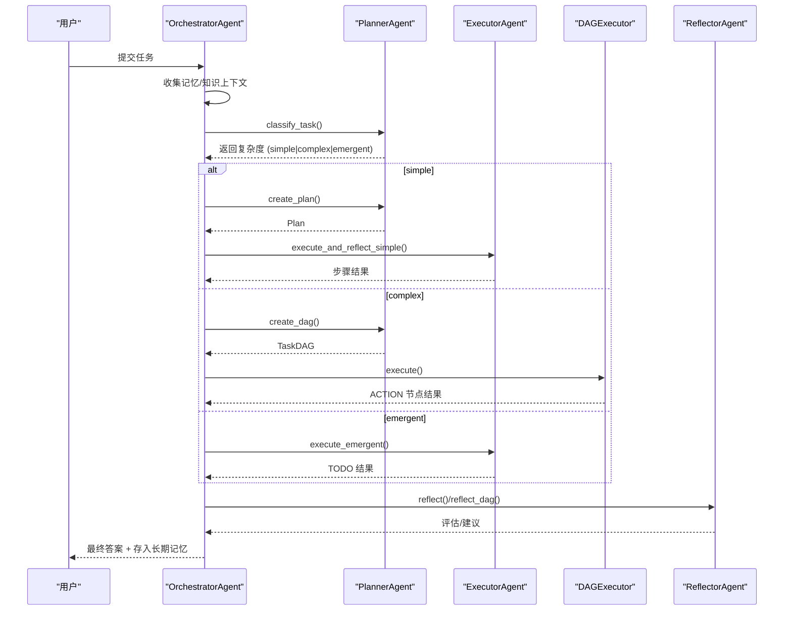
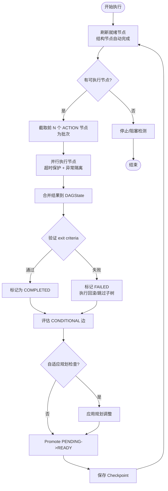
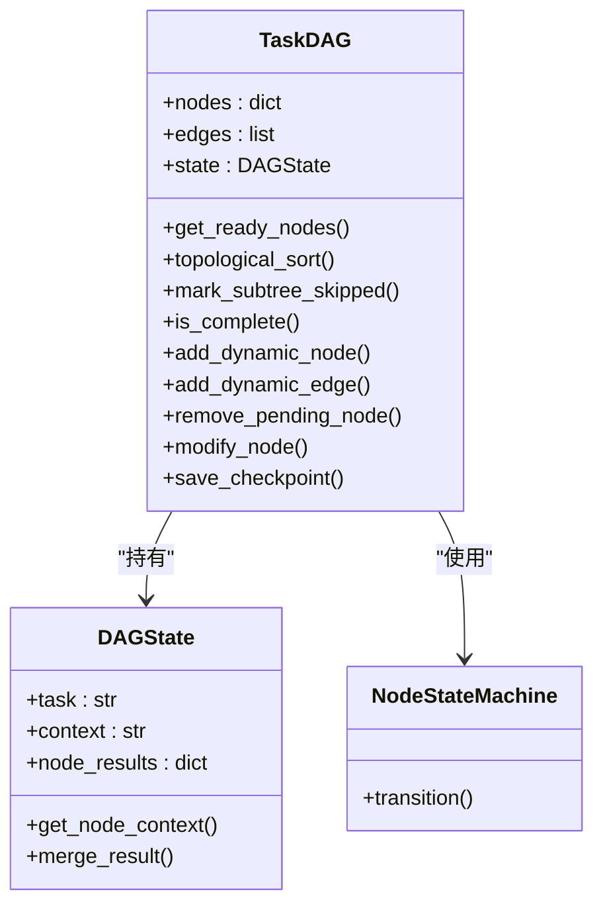
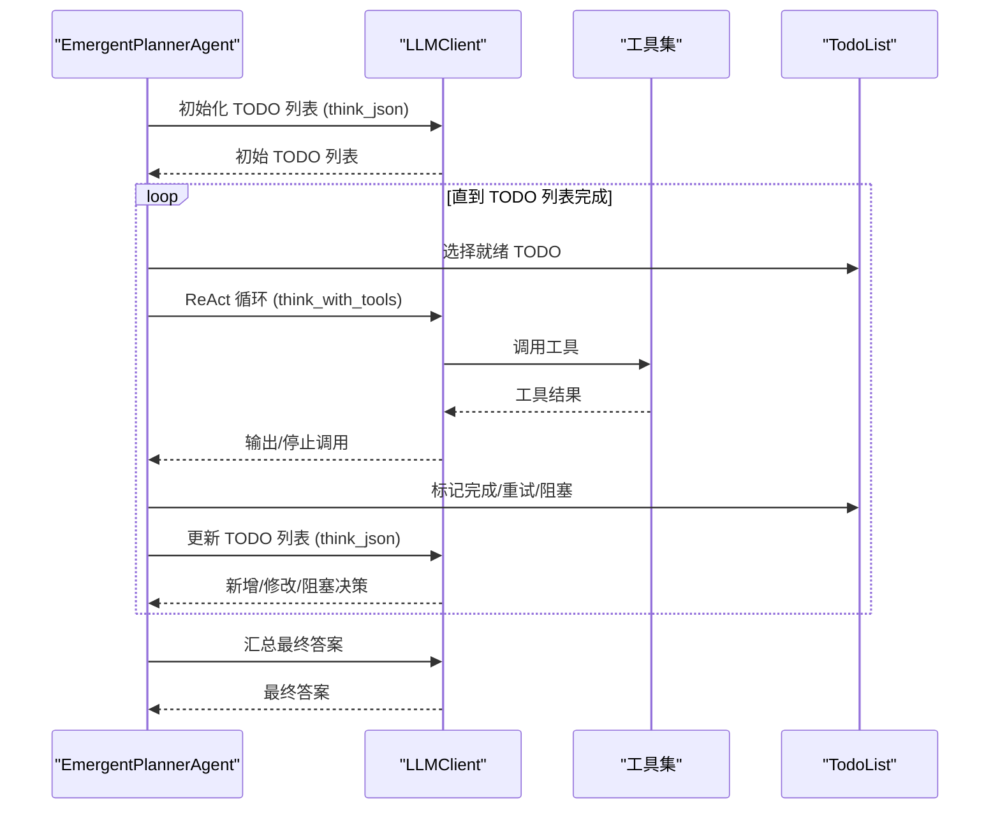
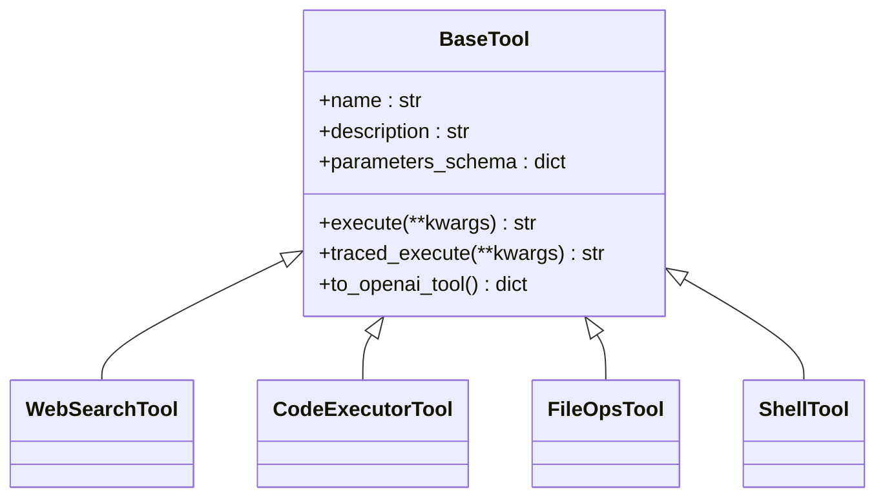
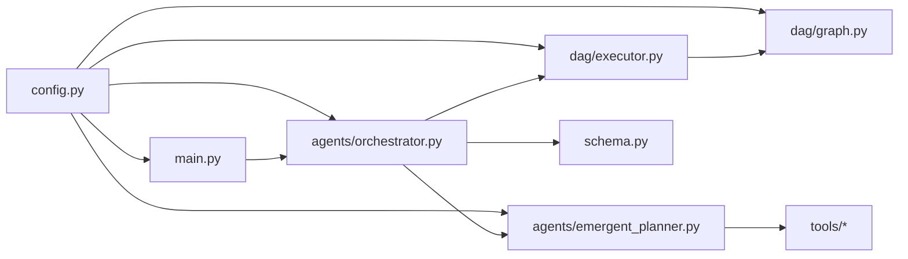

# 项目概述

<cite>
**本文引用的文件**
- [README.md](file://README.md)
- [README_CN.md](file://README_CN.md)
- [main.py](file://main.py)
- [config.py](file://config.py)
- [schema.py](file://schema.py)
- [agents/orchestrator.py](file://agents/orchestrator.py)
- [agents/emergent_planner.py](file://agents/emergent_planner.py)
- [dag/executor.py](file://dag/executor.py)
- [dag/graph.py](file://dag/graph.py)
- [tools/base.py](file://tools/base.py)
</cite>

## 目录
1. [简介](#简介)
2. [项目结构](#项目结构)
3. [核心组件](#核心组件)
4. [架构总览](#架构总览)
5. [详细组件分析](#详细组件分析)
6. [依赖分析](#依赖分析)
7. [性能考量](#性能考量)
8. [故障排查指南](#故障排查指南)
9. [结论](#结论)
10. [附录](#附录)

## 简介
manus_demo 是一个面向教学的多智能体系统演示项目，旨在帮助学习者深入理解现代自主 AI Agent 的核心原理与工程实践。系统围绕“分层规划、DAG 并行执行、工具调用（ReAct）、状态机驱动、自我反思与纠错”等关键能力展开，提供从 v1 到 v5 的演进路线，其中 v5 引入了 Claude Code 风格的“隐式规划（Emergent Planning）”，通过 TODO 列表管理与 while(tool_use) 主循环实现规划的自然涌现。

项目强调“极简实现 + 教学透明度”，在保持与 LangGraph 核心理念（集中式状态、Super-step 并行、Checkpoint）一致的同时，用更易读的自研实现呈现多智能体流水线的关键环节，适合初学者循序渐进掌握，也便于有经验的开发者快速定位扩展点。

## 项目结构
项目采用“分层模块化 + 事件驱动 UI”的组织方式，核心目录与职责如下：
- agents：智能体层，包含 Orchestrator（编排者）、Planner（规划者）、Executor（执行者）、Reflector（反思者）、EmergentPlanner（隐式规划者）等
- dag：DAG 执行引擎，包含 TaskDAG、NodeStateMachine、DAGExecutor
- tools：工具层，提供 web_search、code_executor、file_ops、shell_tool 等工具接口与实现
- memory/context/knowledge/llm：记忆、上下文压缩、知识检索、LLM 客户端等基础设施
- tracing：全链路追踪（可选）
- tests/docs：测试与文档
- main.py、config.py、schema.py：程序入口、全局配置与数据模型

图表来源
- [main.py:1-516](file://main.py#L1-L516)
- [agents/orchestrator.py:60-600](file://agents/orchestrator.py#L60-L600)
- [agents/emergent_planner.py:72-685](file://agents/emergent_planner.py#L72-L685)
- [dag/executor.py:62-648](file://dag/executor.py#L62-L648)
- [dag/graph.py:43-627](file://dag/graph.py#L43-L627)
- [tools/base.py:22-175](file://tools/base.py#L22-L175)
- [config.py:1-109](file://config.py#L1-L109)
- [schema.py:1-688](file://schema.py#L1-L688)

章节来源
- [README.md:97-154](file://README.md#L97-L154)
- [README_CN.md:122-174](file://README_CN.md#L122-L174)

## 核心组件
- OrchestratorAgent（编排者）：统一协调记忆检索、任务分类、规划路由、执行与反思，支持 v1/v2/v5 三种路径，并可选 v8 目标驱动规划
- PlannerAgent（规划者）：负责任务复杂度分类与分层规划（Goal/SubGoal/Action），支持 v3 自适应规划与 v8 目标驱动
- ExecutorAgent（执行者）：在 DAG 中执行 ACTION 节点或在 v5 中执行 TODO，内置 ReAct 循环与工具调用
- ReflectorAgent（反思者）：对节点 exit criteria 与整体 DAG 进行质量评估，支持局部重规划
- EmergentPlannerAgent（隐式规划者）：v5 的 Claude Code 风格，通过 TODO 列表管理与 while(tool_use) 主循环实现规划涌现
- DAGExecutor（DAG 执行器）：Super-step 并行执行、条件分支、失败回滚、自适应规划、Checkpoint
- TaskDAG（任务有向无环图）：集中式状态 DAGState、节点状态机、动态增删改节点/边、拓扑排序与就绪检测
- 工具层 BaseTool：统一的工具抽象，支持 OpenAI function schema 与可选追踪埋点

章节来源
- [agents/orchestrator.py:60-600](file://agents/orchestrator.py#L60-L600)
- [agents/emergent_planner.py:72-685](file://agents/emergent_planner.py#L72-L685)
- [dag/executor.py:62-648](file://dag/executor.py#L62-L648)
- [dag/graph.py:43-627](file://dag/graph.py#L43-L627)
- [tools/base.py:22-175](file://tools/base.py#L22-L175)

## 架构总览
manus_demo 的总体架构以“混合规划路由 + DAG 并行执行 + ReAct 工具调用 + 状态机驱动 + 自我反思与纠错”为核心，结合 v5 隐式规划的 TODO 列表管理，形成从任务到最终答案的闭环流水线。系统强调“集中式状态（DAGState）+ Super-step 并行 + Checkpoint 快照”的 LangGraph 风格实现，同时通过事件驱动 UI 实时展示执行过程。

图表来源
- [README.md:22-76](file://README.md#L22-L76)
- [README_CN.md:37-98](file://README_CN.md#L37-L98)
- [agents/orchestrator.py:158-222](file://agents/orchestrator.py#L158-L222)

章节来源
- [README.md:22-96](file://README.md#L22-L96)
- [README_CN.md:37-119](file://README_CN.md#L37-L119)

## 详细组件分析

### OrchestratorAgent（编排者）
- 职责：收集上下文（记忆 + 知识），两阶段任务复杂度分类（规则快筛 + LLM 兜底），路由到 v1/v2/v5 路径，执行与反思，最终答案写入长期记忆
- 特性：事件驱动 UI、可选 v8 目标驱动规划、Tracing 多播桥接
- 关键流程：任务开始 → 上下文收集 → 复杂度分类 → 规划路由 → 执行 → 反思 → 存储记忆 → 输出最终答案

图表来源
- [agents/orchestrator.py:158-222](file://agents/orchestrator.py#L158-L222)
- [agents/orchestrator.py:257-352](file://agents/orchestrator.py#L257-L352)
- [agents/orchestrator.py:439-508](file://agents/orchestrator.py#L439-L508)
- [agents/orchestrator.py:370-432](file://agents/orchestrator.py#L370-L432)

章节来源
- [agents/orchestrator.py:60-600](file://agents/orchestrator.py#L60-L600)

### DAGExecutor（DAG 执行器）
- 职责：Super-step 并行执行 ACTION 节点，合并结果到 DAGState，逐节点验证 exit criteria，失败时执行回滚与子树跳过，评估条件边，支持 v3 自适应规划与 Checkpoint
- 关键算法：就绪节点发现（拓扑 + 依赖完成）、Kahn 拓扑排序、条件边评估（词边界/子串匹配）、失败回滚与级联跳过
- 并行模型：每轮最多 MAX_PARALLEL_NODES 个节点并行，超时保护，异常隔离

图表来源
- [dag/executor.py:110-264](file://dag/executor.py#L110-L264)
- [dag/executor.py:271-310](file://dag/executor.py#L271-L310)
- [dag/executor.py:350-400](file://dag/executor.py#L350-L400)
- [dag/executor.py:405-473](file://dag/executor.py#L405-L473)
- [dag/executor.py:601-632](file://dag/executor.py#L601-L632)

章节来源
- [dag/executor.py:62-648](file://dag/executor.py#L62-L648)

### TaskDAG（任务有向无环图）
- 职责：维护节点、边、集中式状态 DAGState，提供就绪节点发现、拓扑排序、条件边与回滚边查询、动态增删改节点/边、Checkpoint 快照
- 关键能力：邻接表加速（O(V+E)）、阻塞/卡住节点诊断、孤儿节点级联跳过、动态图变更（v3）

图表来源
- [dag/graph.py:43-627](file://dag/graph.py#L43-L627)
- [schema.py:192-253](file://schema.py#L192-L253)

章节来源
- [dag/graph.py:43-627](file://dag/graph.py#L43-L627)
- [schema.py:192-253](file://schema.py#L192-L253)

### EmergentPlannerAgent（隐式规划者，v5）
- 职责：无独立规划阶段，通过 TODO 列表管理与 while(tool_use) 主循环实现规划涌现；支持统一 ReActEngine（v6.0 可选）
- 关键流程：初始化 TODO 列表 → while 有待执行 TODO → ReAct 执行 → 更新 TODO 列表（新增/修改/阻塞）→ 汇总最终答案
- 容错：单 TODO 最多重试 MAX_TODO_RETRIES 次，超时保护，停滞检测（连续多轮无完成增量）

图表来源
- [agents/emergent_planner.py:134-276](file://agents/emergent_planner.py#L134-L276)
- [agents/emergent_planner.py:283-459](file://agents/emergent_planner.py#L283-L459)
- [agents/emergent_planner.py:465-581](file://agents/emergent_planner.py#L465-L581)

章节来源
- [agents/emergent_planner.py:72-685](file://agents/emergent_planner.py#L72-L685)

### 工具层 BaseTool
- 职责：统一工具抽象，支持 OpenAI function schema、参数校验、可选追踪埋点（v7），提供 traced_execute 包装
- 设计：所有具体工具（web_search、code_executor、file_ops、shell_tool）继承自 BaseTool，统一对外接口

图表来源
- [tools/base.py:22-175](file://tools/base.py#L22-L175)

章节来源
- [tools/base.py:22-175](file://tools/base.py#L22-L175)

## 依赖分析
- 模块耦合：OrchestratorAgent 作为中枢，向上依赖 Planner/Executor/Reflector/EmergentPlanner，向下依赖 DAGExecutor/TaskDAG/NodeStateMachine；工具层通过 function calling 与执行层解耦
- 外部依赖：LLM 客户端（OpenAI 兼容）、可选 OpenTelemetry 追踪、pytest（测试）
- 配置中心：config.py 提供统一配置，支持 .env 与环境变量覆盖

图表来源
- [config.py:1-109](file://config.py#L1-L109)
- [main.py:34-41](file://main.py#L34-L41)
- [agents/orchestrator.py:42-55](file://agents/orchestrator.py#L42-L55)
- [dag/executor.py:49-57](file://dag/executor.py#L49-L57)
- [dag/graph.py:36-38](file://dag/graph.py#L36-L38)
- [agents/emergent_planner.py:42-48](file://agents/emergent_planner.py#L42-L48)

章节来源
- [config.py:1-109](file://config.py#L1-L109)
- [main.py:1-516](file://main.py#L1-L516)

## 性能考量
- 并行度控制：MAX_PARALLEL_NODES 限制每轮并行节点数，避免资源争用；DAGExecutor 使用 asyncio.gather 并行执行，return_exceptions=True 防止单节点异常影响整体
- 超时与健壮性：NODE_EXECUTION_TIMEOUT 保护单节点执行；DAGExecutor 对异常进行捕获与状态迁移；ToolRouter 追踪失败并建议替代工具
- 状态合并：DAGState 使用集中式字典写入，避免锁竞争；Checkpoint 限制内存中快照数量，防止长期运行内存膨胀
- 上下文与 Token：ContextManager 与 TokenUsageSummary 支持上下文压缩与消耗追踪，便于成本控制

## 故障排查指南
- 常见问题
  - ModuleNotFoundError：确认虚拟环境已激活并安装依赖
  - API Key 配置错误：检查 .env 或环境变量是否正确加载
  - 无网络或 API Key：测试完全离线，通过 Mock 验证 DAG 基础设施
  - 文件保存位置：沙箱目录默认在 ~/.manus_demo/sandbox，可通过 SANDBOX_DIR 配置
  - 长期记忆位置：默认在 ~/.manus_demo/memory.json，可通过 MEMORY_DIR 配置
- 调试技巧
  - 启用详细日志：python main.py -v
  - 强制规划路径：PLAN_MODE=simple|complex|emergent
  - 检查 DAG 阻塞：调用 DAG 的阻塞报告接口，定位依赖未满足或 FAILED 节点
  - 查看 Checkpoint：DAGExecutor 每轮保存快照，可用于回溯

章节来源
- [README.md:252-291](file://README.md#L252-L291)
- [README_CN.md:489-514](file://README_CN.md#L489-L514)

## 结论
manus_demo 以教学为导向，系统性展示了多智能体从“扁平计划”到“DAG 并行执行”，再到“隐式规划”的演进路径。v5 的隐式规划通过 TODO 列表与 while(tool_use) 主循环，实现了规划的自然涌现，适合探索性与需求不明确的任务。系统在保持极简实现的同时，借鉴 LangGraph 的核心理念（集中式状态、Super-step 并行、Checkpoint），并通过事件驱动 UI 与可选追踪能力，兼顾教学透明度与工程可用性。

## 附录

### 快速开始
- 环境准备：Python 3.11+，建议使用虚拟环境
- 安装依赖：pip install -r requirements.txt；运行测试需 pytest pytest-asyncio
- 配置 LLM：复制 .env.example 并填入 LLM_BASE_URL/API_KEY/MODEL
- 运行模式：交互模式、单任务模式、详细日志模式、强制规划路径、运行测试

章节来源
- [README.md:156-265](file://README.md#L156-L265)
- [README_CN.md:178-284](file://README_CN.md#L178-L284)

### 版本演进（v1→v5）
- v1：扁平 2-6 步线性计划
- v2：Goal → SubGoal → Action 三层 DAG，Super-step 并行，状态机与失败回滚
- v3：超步间自适应规划、工具路由、DAG 运行时增删改
- v4：混合规划路由（两阶段分类器），自动选择 v1/v2
- v5：隐式规划（TODO 列表 + while(tool_use)），Claude Code 风格

章节来源
- [README.md:375-400](file://README.md#L375-L400)
- [README_CN.md:453-486](file://README_CN.md#L453-L486)