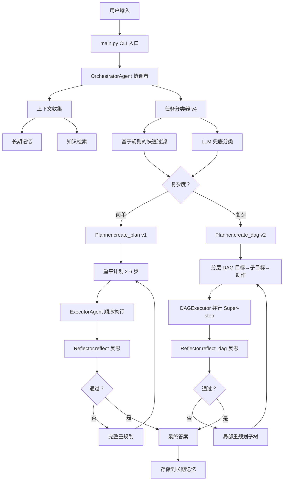
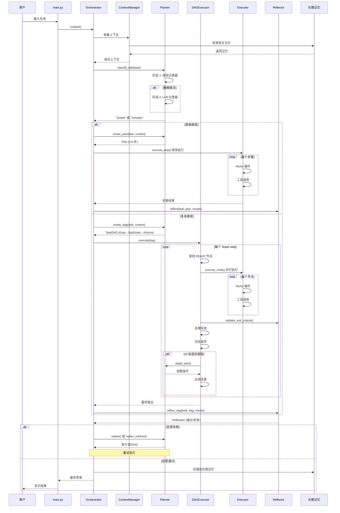

# Manus Demo v5 - 代码地图

> **生成时间**: 2026-02-28
> **版本**: v5（新增 Claude Code 风格的隐式规划）
> **目的**: 当前代码库的综合架构地图

---

## 目录

1. [系统概览](#系统概览)
2. [模块结构](#模块结构)
3. [组件详情](#组件详情)
4. [数据流](#数据流)
5. [关键设计模式](#关键设计模式)
6. [文件参考](#文件参考)

---

## 系统概览

### 架构图



### 版本演进

```
v1 → 线性规划 + 顺序执行 + 完整重规划
     │
     ▼
v2 → DAG 分层规划 + 并行 Super-step + 
     局部重规划 + 节点状态机 + 逐节点验证
     │
     ▼
v3 → 自适应规划（运行时 DAG 变更）+ 
     工具路由（基于失败的切换）+ 
     动态 DAG 增删改
     │
     ▼
v4 → 两阶段混合分类器（规则 + LLM）+ 
     自动 v1/v2 路径选择
     （简单任务节省 token，复杂任务使用 DAG）
     │
     ▼
v5 → Claude Code 风格隐式规划 + 
     TODO 列表管理 + while(tool_use) 主循环
     （无预定义计划结构，规划在执行中涌现）
```

---

## 模块结构

### 目录布局

```
manus_demo/
├── main.py                      # CLI 入口（带 Rich UI）
├── config.py                    # 从 env/.env 加载配置
├── schema.py                    # Pydantic 数据模型
├── requirements.txt             # Python 依赖
│
├── agents/                      # 智能体实现
│   ├── __init__.py
│   ├── base.py                 # BaseAgent 抽象基类
│   ├── orchestrator.py         # 中央协调者（v4 混合路由 + v5 隐式规划）
│   ├── planner.py              # 计划/DAG 生成 + 两阶段分类器
│   ├── executor.py             # 基于 ReAct 的步骤执行
│   ├── reflector.py            # 质量验证与反馈
│   └── emergent_planner.py     # Claude Code 风格隐式规划器（v5 新增）
│
├── dag/                         # DAG 执行引擎（v2 核心）
│   ├── __init__.py
│   ├── graph.py                # TaskDAG 数据结构与操作
│   ├── state_machine.py        # 节点生命周期 FSM
│   └── executor.py             # DAGExecutor（super-step 并行模型）
│
├── tools/                       # 工具实现
│   ├── __init__.py
│   ├── base.py                 # BaseTool 抽象接口
│   ├── web_search.py           # 网络搜索工具
│   ├── code_executor.py        # Python 代码执行沙箱
│   ├── file_ops.py             # 文件读写操作
│   └── router.py               # 工具路由（v3 基于失败的切换）
│
├── llm/                         # LLM 客户端层
│   ├── __init__.py
│   └── client.py               # OpenAI 兼容的 API 封装
│
├── memory/                      # 记忆系统
│   ├── __init__.py
│   ├── short_term.py           # 滑动窗口对话历史
│   └── long_term.py            # 持久化 JSON 文件存储
│
├── context/                     # 上下文管理
│   ├── __init__.py
│   └── manager.py              # 聚合记忆 + 知识 + 对话
│
├── knowledge/                   # 知识检索
│   ├── __init__.py
│   └── retriever.py            # RAG 风格 TF-IDF 文档检索
│
├── tests/                       # 测试套件
│   ├── __init__.py
│   ├── test_dag_capabilities.py
│   ├── test_emergent_planning.py    # v5 隐式规划测试
│   └── test_emergent_simple.py      # v5 简单测试脚本
│
└── docs/                        # 架构文档
    ├── codemap-v4-zh.md        # 本文件 - 当前架构地图（中文版）
    ├── codemap-v4.md           # 英文版
    ├── hybrid-plan-routing-v4.md
    ├── data-structures-and-algorithms.md
    ├── planning-test-scenarios-v4.md
    ├── upgrade-plan-v3.md
    ├── planning-gap-analysis.md
    ├── related-papers-plan-routing.md
    └── dynamic-features-v1-vs-v2.md
```

---

## 组件详情

### 1. OrchestratorAgent（`agents/orchestrator.py`）

**目的**: 管理完整混合规划生命周期的中央协调者

**主要职责**:
- 收集上下文（记忆 + 知识检索）
- 通过两阶段混合分类器分类任务复杂度
- 路由到 v1（简单）或 v2（复杂）执行路径
- 处理反思失败后的重规划
- 将已完成任务存储到长期记忆

**主要方法**:
```python
async run(task: str) -> str                    # 主入口
async _gather_context(task: str) -> str        # 检索记忆和知识
async _execute_and_reflect_simple(...)         # v1 顺序执行路径
async _execute_dag_and_reflect(dag: TaskDAG)   # v2 DAG 路径（带局部重规划）
async _execute_emergent(task, context)         # v5 隐式规划路径（新增）
```

**架构流程**:
```
用户任务
    ↓
[检索记忆和知识]
    ↓
[分类任务复杂度] ← 两阶段：规则 (<1ms) → LLM 兜底 (~0.3s)
    ↓
    ├─ simple   ─→ [创建扁平计划 2-6 步] ─→ [顺序执行] ─→ [反思]
    ├─ complex  ─→ [创建分层 DAG] ─→ [并行 Super-steps] ─→ [反思]
    └─ emergent ─→ [TODO 列表初始化] ─→ [while(tool_use) 循环] ─→ [汇总结果]
    ↓
[存储到长期记忆]
```

---

### 2. PlannerAgent（`agents/planner.py`）

**目的**: 通过两阶段分类器自动路由 v1/v2 的混合规划器

**关键特性 (v4)**:
- **两阶段分类器**: 基于规则的快速过滤 + LLM 兜底处理模糊情况
- **v1 路径**: 为简单任务创建扁平的 2-6 步计划
- **v2 路径**: 为复杂任务创建分层 Goal→SubGoals→Actions DAG
- **局部重规划**: 仅重建失败子树（保留已完成工作）
- **自适应规划 (v3)**: 在 super-step 之间调整待处理节点
- **动态 DAG 变更 (v3)**: 运行时增删改节点

**分类器规则** (`_rule_classify`):
```python
# 评分维度：
- 文本长度：<30 字符 → -2，>200 字符 → +2
- 多步骤关键词："然后"、"接着"、"first...then" → +1 到 +3
- 条件关键词："如果"、"取决于"、"if...then" → +2
- 并行关键词："同时"、"并行"、"meanwhile" → +2
- 动作动词数量：≥3 个动词 → +2，≤1 个动词 → -1

# 决策阈值：
score ≤ -2  → "simple"（简单）
score ≥ 3   → "complex"（复杂）
otherwise   → "ambiguous"（模糊）→ 触发 LLM 分类器
```

**主要方法**:
```python
async classify_task(task: str) -> str          # 两阶段混合分类器
async create_plan(task, context) -> Plan       # v1: 扁平 2-6 步
async create_dag(task, context) -> TaskDAG     # v2: 分层 DAG
async replan(...) -> Plan                      # v1: 失败后完整重规划
async replan_subtree(...) -> TaskDAG           # v2: 局部重规划（仅子树）
async adapt_plan(dag: TaskDAG)                 # v3: 执行中调整
apply_adaptations(dag, adaptations)            # v3: 应用 DAG 变更
```

---

### 3. DAGExecutor（`dag/executor.py`）

**目的**: 使用 super-step 并行模型执行 TaskDAG（灵感来自 LangGraph）

**执行模型** (Super-step / BSP):
```
每个 Super-step:
  1. 找出所有 READY 节点（依赖已完成）
  2. 通过 asyncio.gather 并行执行（最多 MAX_PARALLEL_NODES 个）
  3. 将结果合并到 DAGState（集中式共享状态）
  4. 验证每个节点的 exit criteria（通过 Reflector）
  5. 处理失败（回滚 + 跳过下游子树）
  6. 评估条件边（激活/跳过分支）
  7. (v3) 自适应规划检查：调整待处理节点
  8. 保存 checkpoint（状态快照用于调试）
  9. 重复直到所有节点到达终态（COMPLETED/SKIPPED/ROLLED_BACK）
```

**关键特性**:
- **并行执行**: 独立节点同时运行
- **逐节点验证**: 每个节点根据 exit_criteria 验证
- **失败处理**: 回滚节点 + 级联跳过下游
- **条件分支**: 根据结果动态激活/跳过路径
- **自适应规划 (v3)**: 计划在执行过程中演化
- **Checkpoint**: 每个 super-step 保存状态快照

**主要方法**:
```python
async execute(dag: TaskDAG) -> str             # 主执行循环
async _run_node(node, dag) -> StepResult       # 执行单个 ACTION 节点
async _check_exit_criteria(node, result)       # 验证节点完成
async _handle_failure(node, dag)               # 回滚 + 跳过子树
_process_conditions(dag)                       # 评估条件边
_adapt_plan(step, dag)                         # v3: 调整待处理节点
_complete_structural_nodes(dag)                # 自动完成 GOAL/SUBGOAL
```

---

### 4. ExecutorAgent（`agents/executor.py`）

**目的**: 使用 ReAct 模式（推理 + 行动）执行单个步骤/节点

**ReAct 循环**:
```
对每个步骤/节点：
  1. Thought（思考）: LLM 推理下一步行动
  2. Action（行动）: LLM 选择工具 + 参数（function calling）
  3. Observe（观察）: 工具执行，结果反馈给 LLM
  4. 重复直到步骤目标达成或达到 max_iterations
```

**可用工具**:
- `web_search`: 搜索网络
- `execute_python`: 在沙箱中运行 Python 代码
- `file_ops`: 读写文件

**v3 增强 - 工具路由**:
- 追踪每个节点的连续工具失败
- 达到阈值后（TOOL_FAILURE_THRESHOLD=2），建议替代工具
- 防止 LLM 重复调用失败的工具

**主要方法**:
```python
async execute_node(node: TaskNode, context) -> StepResult   # v2 DAG 入口
async execute_step(step: Step, context) -> StepResult       # v1 兼容入口
async _react_loop(step_id, prompt, context) -> StepResult   # 共用 ReAct 核心
```

---

### 5. ReflectorAgent（`agents/reflector.py`）

**目的**: 质量验证 - 根据任务要求评估执行结果

**验证模式**:
- `reflect(task, plan, results)`: 评估扁平计划执行（v1）
- `reflect_dag(task, dag, results)`: 评估 DAG 执行（v2）
- `validate_exit_criteria(node, result)`: 逐节点验证（v2）

**输出**:
```python
Reflection(
    passed: bool,           # 质量门控通过/失败
    score: float,           # 0.0-1.0 质量评分
    feedback: str,          # 详细评估
    suggestions: list[str]  # 改进建议
)
```

---

### 5.5. EmergentPlannerAgent（`agents/emergent_planner.py`）- v5 新增

**目的**: Claude Code 风格的隐式规划器，通过 `while(tool_use)` 主循环实现涌现规划

**关键特性 (v5)**:
- **无独立规划阶段**: 规划在执行过程中自然涌现
- **TODO 列表管理**: 动态创建、更新、完成 TODO 项
- **单一扁平消息历史**: 所有工具调用和结果在同一上下文中
- **LLM 自组织**: 通过自然语言推理自主管理任务分解

**核心循环**:
```python
1. 初始化 TODO 列表（从任务描述生成 1-3 个初始项）
2. while has_pending_todos:
   - 选择下一个就绪 TODO
   - think_with_tools() 推理 + 调用工具
   - 更新 TODO 列表（标记完成、添加新发现）
   - 检查是否所有 TODO 完成
3. 从已完成的 TODO 汇总最终答案
```

**主要方法**:
```python
async execute(task: str, context: str) -> str        # 主入口
async _init_todo_list(task, context) -> None         # 初始化 TODO 列表
async _update_todo_list(result: StepResult) -> None  # 根据执行进度更新 TODO
async _execute_todo(todo: TodoItem) -> StepResult    # 执行单个 TODO（ReAct 循环）
```

**TODO 数据结构**:
```python
TodoItem:
    id: int                      # 唯一标识符
    description: str             # 任务描述
    status: TodoStatus           # PENDING/IN_PROGRESS/COMPLETED/BLOCKED
    dependencies: list[int]      # 前置 TODO ID 列表
    result: str | None           # 执行结果

TodoList:
    task: str                    # 原始用户任务
    todos: dict[int, TodoItem]   # 按 ID 索引的 TODO 项
    next_id: int                 # 下一个可用 ID
```

**与 DAG 规划器的对比**:
| 特性 | DAG 规划器 (v2/v4) | 隐式规划器 (v5) |
|------|-------------------|----------------|
| 规划时机 | 执行前完整规划 | 执行中动态涌现 |
| 结构 | 三层层级 DAG | 扁平 TODO 列表 |
| 变更方式 | 超步间自适应 | 随时增删改 TODO |
| 适用场景 | 复杂多阶段任务 | 探索性/不确定性任务 |

---

### 6. TaskDAG（`dag/graph.py`）

**目的**: 用于分层规划的有向无环图数据结构

**节点层级**:
```
Goal（1 个节点）
├── SubGoal（2-5 个节点）
│   ├── Action（1-3 个节点）
│   └── Action
└── SubGoal
    └── Action
```

**边类型**:
- `DEPENDENCY`: "B 只能在 A 完成后运行"
- `CONDITIONAL`: "仅当 A 的结果满足条件时 B 才运行"
- `ROLLBACK`: "如果 A 失败，执行 B 进行清理"

**关键操作**:
```python
get_ready_nodes() -> list[TaskNode]            # 运行时就绪发现
get_dependency_ids(node_id) -> list[str]       # 入边查询
get_downstream(node_id) -> list[str]           # BFS 可达性分析
mark_subtree_skipped(node_id)                  # 失败时级联跳过
topological_sort() -> list[str]                # Kahn 算法（验证）
add_dynamic_node(node)                         # v3: 运行时变更
remove_pending_node(node_id)                   # v3: 移除不必要节点
modify_node(node_id, desc, exit)               # v3: 修改待处理节点
```

**数据结构**:
```python
nodes: dict[str, TaskNode]    # 哈希表 O(1) 按 ID 查找
edges: list[TaskEdge]         # 边列表（简单，对小图足够）
state: DAGState               # 集中式共享状态（灵感来自 LangGraph）
checkpoints: list[dict]       # 状态快照用于时间旅行调试
```

---

### 7. DAGState（`schema.py`）

**目的**: DAG 执行的集中式共享状态（单一事实来源）

**设计** (LangGraph 对应):
```python
class DAGState(BaseModel):
    task: str                          # 原始用户任务
    context: str                       # 累积的记忆/知识上下文
    node_results: dict[str, str]       # node_id -> 输出文本
    
    # LangGraph 对应：
    # - 每个节点写入 node_results 中的唯一 key
    # - 并行写入永不冲突（类似 "LastValue" channel）
    # - 比可配置 reducer 更简单，对 demo 规模足够
```

**主要方法**:
```python
get_node_context(node_id, dep_ids) -> str    # 从依赖构建输入
merge_result(node_id, output) -> None        # 写入结果到共享状态
```

---

### 8. NodeStateMachine（`dag/state_machine.py`）

**目的**: 强制合法的节点生命周期转移（FSM 模式）

**状态转移图**:
```
PENDING → READY → RUNNING → COMPLETED
                          → FAILED → ROLLED_BACK
任意非终态       → SKIPPED

终态（吸收态）: COMPLETED, SKIPPED, ROLLED_BACK
```

**合法转移表**:
```python
VALID_TRANSITIONS = {
    PENDING:     {READY, SKIPPED},
    READY:       {RUNNING, SKIPPED},
    RUNNING:     {COMPLETED, FAILED},
    FAILED:      {ROLLED_BACK, SKIPPED},
    COMPLETED:   {},  # 终态
    SKIPPED:     {},  # 终态
    ROLLED_BACK: {},  # 终态
}
```

**目的**: 防止非法状态变更（例如 COMPLETED → PENDING 会导致重复执行）

---

### 9. ContextManager（`context/manager.py`）

**目的**: 聚合和压缩来自多个来源的上下文

**上下文来源**:
1. 短期记忆（滑动窗口，最近 20 条消息）
2. 长期记忆（持久化 JSON 存储，按相似度检索）
3. 知识库（从 docs/ TF-IDF 检索）
4. 当前对话历史

**压缩策略**:
- 当上下文超过 MAX_CONTEXT_TOKENS (8000) 时，摘要最旧消息
- 保留最近消息的完整保真度

---

### 10. KnowledgeRetriever（`knowledge/retriever.py`）

**目的**: 使用 TF-IDF + 余弦相似度的 RAG 风格文档检索

**算法**:
```python
# 1. TF（词频）: 词在文档中的频率（归一化到 0-1）
# 2. IDF（逆文档频率）: log(N / df) - 越稀有的词权重越高
# 3. TF-IDF = TF × IDF: 每个词的特征权重
# 4. 余弦相似度：查询向量与文档向量之间的夹角
```

**数据结构**: 稀疏向量 `dict[str, float]`（内存高效）

**用途**: 规划/执行前检索相关文档

---

### 11. ToolRouter（`tools/router.py`） - v3

**目的**: 基于失败的工具切换建议（熔断器模式）

**机制**:
```python
# 追踪每个节点每个工具的统计
_stats: dict[node_id, dict[tool_name, ToolStats]]

ToolStats:
    consecutive_failures: int    # 成功时重置
    total_calls: int

# 连续失败达到 TOOL_FAILURE_THRESHOLD (2) 后：
# → 在下次 ReAct 迭代中向 LLM 建议替代工具
```

**目的**: 防止 LLM 重复调用失败的工具，提供替代建议

---

## 数据流

### 完整执行流程 (v4)



---

## 关键设计模式

### 1. 混合规划路由 (v4)

**模式**: 两阶段分类器，快速路径 + 兜底

**实现**:
```python
# 阶段 1: 基于规则的启发式 (<1ms, 零成本)
rule_result = _rule_classify(task)
if rule_result != "ambiguous":
    return rule_result  # 快速路径：60-70% 的情况

# 阶段 2: LLM 分类器 (~0.3s, ~60 tokens)
return await _llm_classify(task)  # 兜底：模糊的 30-40%
```

**优势**: 在 token 节省（简单任务跳过 LLM）和路由准确性（LLM 处理边缘情况）之间取得平衡

---

### 2. 集中式状态 (LangGraph 灵感)

**模式**: 共享状态的单一事实来源

**实现**:
```python
class DAGState:
    node_results: dict[str, str]  # 每个节点写入唯一 key
    
# 并行节点写入不同 key → 无冲突
# 等价于 LangGraph 的 "LastValue" channel
```

**优势**: 简化并行执行 - 不需要复杂的合并逻辑

---

### 3. Super-step 并行模型 (BSP / Pregel)

**模式**: 批量同步并行执行

**实现**:
```python
while not dag.is_complete():
    ready = dag.get_ready_nodes()           # 查找所有就绪
    batch = ready[:MAX_PARALLEL_NODES]      # 限制并发度
    results = await asyncio.gather(*[       # 并行执行
        _run_node(node) for node in batch
    ])
    # 屏障：等待全部完成
    for result in results:                  # 合并结果
        dag.state.merge_result(node.id, result)
    # Checkpoint 状态
    dag.save_checkpoint()
```

**优势**: 在保持正确性的同时最大化并行性（屏障同步）

---

### 4. 有限状态机 (FSM)

**模式**: 强制执行合法的状态转移

**实现**:
```python
VALID_TRANSITIONS = {
    PENDING: {READY, SKIPPED},
    READY: {RUNNING, SKIPPED},
    RUNNING: {COMPLETED, FAILED},
    # ...
}

def transition(node, new_status):
    if new_status not in VALID_TRANSITIONS[node.status]:
        raise InvalidTransitionError(...)
    node.status = new_status
```

**优势**: 防止运行时非法状态变更（状态一致性保证）

---

### 5. 局部重规划（子树替换）

**模式**: 仅替换失败部分，保留已完成工作

**实现**:
```python
# 图集合运算：
failed_subtree = BFS(failed_node)  # 查找范围
new_dag = (old_dag - failed_subtree) ∪ replanned_subtree
# 保留：old_dag.state.node_results（已完成结果）
```

**优势**: 避免冗余地重新执行成功节点（效率）

---

### 6. 运行时图变更 (v3)

**模式**: 执行过程中动态修改 DAG

**操作**:
```python
dag.add_dynamic_node(new_node)         # 添加新动作
dag.remove_pending_node(node_id)       # 移除不必要
dag.modify_node(node_id, desc, exit)   # 调整描述/目标
```

**约束**: 仅修改 PENDING/READY 节点（保持执行一致性）

**优势**: 计划根据中间结果演化（自适应规划）

---

### 7. 工具熔断器 (v3)

**模式**: 失败阈值触发替代建议

**实现**:
```python
class ToolRouter:
    def record_failure(node_id, tool_name):
        _stats[node_id][tool_name].consecutive_failures += 1
    
    def get_hint(node_id) -> str | None:
        if consecutive_failures >= TOOL_FAILURE_THRESHOLD:
            return f"工具 {tool} 失败 {count} 次。尝试替代方案：{other_tools}"
```

**优势**: 防止 LLM 重复调用失败的工具（容错）

---

## 文件参考

### 核心文件

| 文件 | 行数 | 目的 |
|------|------|------|
| `main.py` | ~420 | CLI 入口（带 Rich 控制台 UI） |
| `config.py` | ~60 | 从环境变量加载配置 |
| `schema.py` | ~450 | Pydantic 数据模型（Plan, TaskDAG, TaskNode 等） |

### 智能体

| 文件 | 行数 | 目的 |
|------|------|------|
| `agents/orchestrator.py` | ~390 | 带混合路由的中央协调者 |
| `agents/planner.py` | ~820 | 两阶段分类器 + 计划/DAG 生成 + 自适应规划 |
| `agents/executor.py` | ~270 | 基于 ReAct 的步骤/节点执行 |
| `agents/reflector.py` | ~150 | 质量验证与反馈 |
| `agents/base.py` | ~90 | BaseAgent 抽象基类 |

### DAG 引擎

| 文件 | 行数 | 目的 |
|------|------|------|
| `dag/graph.py` | ~460 | TaskDAG 数据结构 + 图算法 |
| `dag/executor.py` | ~480 | DAGExecutor super-step 并行引擎 |
| `dag/state_machine.py` | ~100 | 节点生命周期 FSM |

### 工具

| 文件 | 行数 | 目的 |
|------|------|------|
| `tools/base.py` | ~90 | BaseTool 抽象接口 |
| `tools/web_search.py` | ~80 | 网络搜索工具 |
| `tools/code_executor.py` | ~100 | Python 沙箱执行 |
| `tools/file_ops.py` | ~120 | 文件读写操作 |
| `tools/router.py` | ~90 | 工具路由（v3 基于失败的切换） |

### 基础设施

| 文件 | 行数 | 目的 |
|------|------|------|
| `llm/client.py` | ~150 | OpenAI 兼容的 API 封装 |
| `memory/short_term.py` | ~80 | 滑动窗口对话历史 |
| `memory/long_term.py` | ~120 | 持久化 JSON 文件存储 |
| `context/manager.py` | ~100 | 上下文聚合与压缩 |
| `knowledge/retriever.py` | ~100 | TF-IDF 文档检索 |

---

## 配置参考

### 关键设置（`config.py`）

```python
# 规划路由 (v4)
PLAN_MODE = "auto"  # "auto" | "simple" | "complex" | "emergent"

# LLM
LLM_BASE_URL = "https://api.deepseek.com/v1"
LLM_MODEL = "deepseek-chat"

# 执行限制
MAX_PARALLEL_NODES = 3           # 每个 super-step 最大并发节点数
MAX_REACT_ITERATIONS = 10        # 每个节点 ReAct 循环最大迭代次数
MAX_REPLAN_ATTEMPTS = 3          # 反思失败后最大重规划次数

# 自适应规划 (v3)
ADAPTIVE_PLANNING_ENABLED = true
ADAPT_PLAN_INTERVAL = 1          # 每隔几个 super-step 检查一次
ADAPT_PLAN_MIN_COMPLETED = 1     # 自适应前最少完成动作数

# 工具路由 (v3)
TOOL_FAILURE_THRESHOLD = 2       # 建议前连续失败次数

# 隐式规划 (v5)
EMERGENT_PLANNING_ENABLED = true           # 是否启用隐式规划模式
MAX_TODO_ITEMS = 20                        # TODO 列表最大项数
TODO_COMPRESSION_THRESHOLD = 0.8           # 上下文窗口使用率达到 80% 时压缩 TODO

# 记忆
MEMORY_DIR = "~/.manus_demo"
SHORT_TERM_WINDOW = 20           # 滑动窗口中的消息数

# 知识
KNOWLEDGE_CHUNK_SIZE = 500       # 每个文档块字符数
KNOWLEDGE_TOP_K = 3              # 最大检索结果数
```

---

## 测试

### 测试套件（`tests/test_dag_capabilities.py`）

**覆盖范围**:
- 分层规划（Goal→SubGoals→Actions）
- 带工具的并行执行
- 条件分支和回滚
- 节点状态机转移
- 局部重规划（子树替换）
- 自适应规划（运行时 DAG 变更）
- 工具路由失败处理

### 隐式规划测试（`tests/test_emergent_planning.py`）- v5 新增

**覆盖范围**:
- TODO 项创建与依赖管理
- TODO 列表状态转换
- EmergentPlannerAgent 初始化
- 简单任务执行流程
- TODO 列表动态更新

### 简单测试脚本（`tests/test_emergent_simple.py`）- v5 新增

**用途**: 快速验证 v5 基础功能（无需 pytest）

**运行测试**:
```bash
python -m pytest tests/ -v
```

---

## 文档

### 相关文档

- [`hybrid-plan-routing-v4.md`](hybrid-plan-routing-v4.md) - 详细的 v4 分类器设计
- [`data-structures-and-algorithms.md`](data-structures-and-algorithms.md) - 带类比的算法解释
- [`planning-test-scenarios-v4.md`](planning-test-scenarios-v4.md) - 按难度分级的测试用例（S/M/H）
- [`upgrade-plan-v3.md`](upgrade-plan-v3.md) - v3 自适应规划特性
- [`dynamic-features-v1-vs-v2.md`](dynamic-features-v1-vs-v2.md) - 特性对比

---

## 快速开始

### 运行交互模式

```bash
# 默认：自动路由（v4 两阶段分类器 + v5 隐式规划）
python main.py

# 强制简单路径（v1 扁平计划）
PLAN_MODE=simple python main.py

# 强制复杂路径（v2 DAG）
PLAN_MODE=complex python main.py

# 强制隐式规划路径（v5 TODO 列表）
PLAN_MODE=emergent python main.py

# 调试模式（详细日志）
python main.py -v
```

### 运行单个任务

```bash
# 自动路由
python main.py "查询上海今天天气"

# 强制复杂路径
PLAN_MODE=complex python main.py "调研 Python 并发模型并编写示例代码"

# 隐式规划（适合探索性任务）
PLAN_MODE=emergent python main.py "帮我分析这个项目的代码结构并提出改进建议"
```

---

## 性能特征

### 路由性能 (v4)

| 指标 | 规则分类器 | LLM 分类器 |
|------|-----------|-----------|
| 延迟 | <1ms | ~300ms |
| Token 成本 | 0 | ~60 输入 tokens |
| 覆盖率 | 60-70% | 30-40%（模糊情况） |
| 准确性 | 启发式 | 语义理解 |

### 执行性能

| 路径 | 典型步骤 | 并行度 | 延迟 |
|------|---------|--------|------|
| v1 简单 | 2-6 | 顺序 | 快 |
| v2 复杂 | 10-30 节点 | 2-3 节点/super-step | 中等（并行加速） |

### 内存使用

- 短期记忆：O(SHORT_TERM_WINDOW) 条消息在内存中
- 长期记忆：O(N) 个 JSON 条目在磁盘上（N = 已完成任务数）
- DAG checkpoints：O(S × N)，S = super-steps，N = 节点数

---

## 局限性与未来工作

### 当前局限性

1. **小规模图**: 边列表 O(E) 查找对 <100 节点足够；更大图需要邻接表
2. **简单条件评估**: 关键词匹配；生产环境应使用基于 LLM 的语义评估
3. **内存中 checkpoints**: 重启后不持久化；可添加数据库存储
4. **单一协调者**: 超出定义流水线的多智能体协作不支持

### 潜在增强

1. **图优化**: DAG 解析时预建邻接表，实现 O(出度) 依赖查找
2. **持久化 checkpoints**: 长时间任务从数据库保存/加载 DAG 状态
3. **分布式执行**: 在多台机器上运行节点实现真正并行
4. **从失败中学习**: 将失败模式存储到长期记忆用于主动避免
5. **多模态工具**: 添加图像/音频/视频处理能力

---

## 术语表

| 术语 | 定义 |
|------|------|
| **Super-step** | 并行执行的一次迭代（BSP 模型） |
| **DAG** | 有向无环图 - 任务依赖结构 |
| **ReAct** | 工具使用智能体的推理 + 行动模式 |
| **Exit Criteria** | 逐节点完成验证条件 |
| **Partial Replanning** | 仅重建失败子树，保留已完成工作 |
| **Adaptive Planning** | 根据中间结果调整待处理节点 |
| **Two-stage Classifier** | 任务复杂度的规则快筛 + LLM 兜底 |
| **FSM** | 有限状态机 - 强制执行合法状态转移 |
| **BSP** | 批量同步并行 - 屏障同步模型 |
| **TF-IDF** | 词频 - 逆文档频率 - 文本检索 |
| **Emergent Planning** | Claude Code 风格，通过 TODO 列表管理实现规划涌现（v5） |
| **TODO List** | 隐式规划中的集中式任务列表，动态增删改 |
| **while(tool_use)** | 隐式规划器的主循环模式，持续调用工具直到任务完成 |

---

**代码地图 v5 结束**

最后更新：2026-02-28
