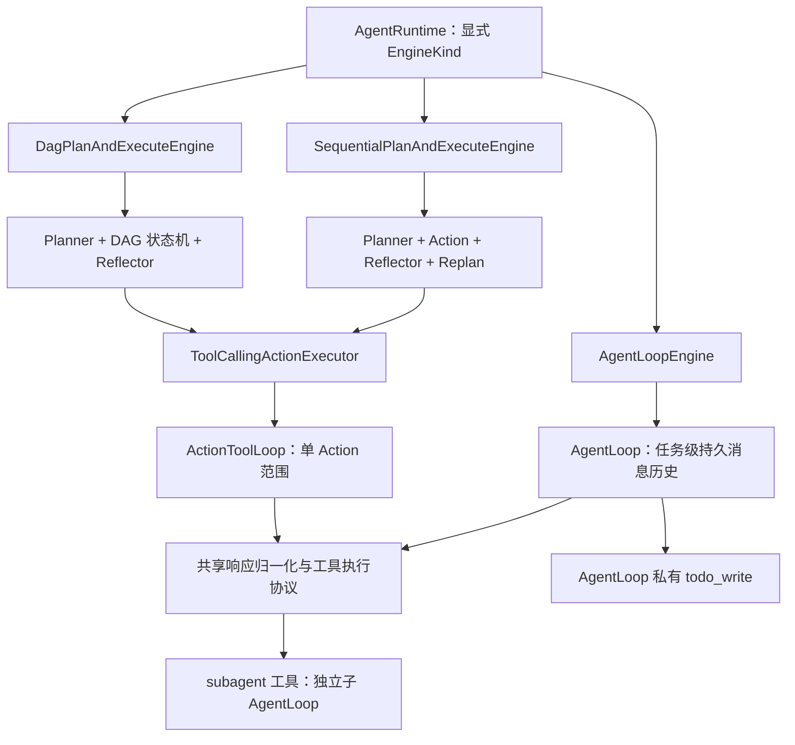

# AgentLoop / Plan-and-Execute 双范式重构记录

> 日期：2026-08-02  
> 状态：已实施，已完成离线结构验收  
> 项目性质：本地 Agent 开发学习与推理引擎对比项目，非生产系统  
> 重构范围：引擎契约、运行时、AgentLoop、Plan-and-Execute、工具循环、SubAgent、TodoWrite、CLI/WebUI/Tracing/Evaluation/Checkpoint 及文档

## 1. 需求背景

### 1.1 项目的真实目标

`manus_demo` 是一个用于学习 Agent 开发、观察执行过程、比较不同推理引擎优缺点的本地实验项目。项目不发布到生产环境，因此本次重构的优先级是：

1. 让不同编排范式的边界真实、清晰，方便对比。
2. 降低阅读与调试的认知成本，避免名称和行为不一致。
3. 保留可观测性、可重放性和结构化统计，为后续真实模型评测提供基础。
4. 允许大幅删除历史架构，不为旧名称、旧配置或兼容包袱妥协。

这一背景已保存在根目录 `AGENTS.md` 和 `CLAUDE.md` 中，作为后续开发的工程立场。

### 1.2 重构前的概念问题

在对 Sequential 执行链、Todo 引擎和 Claude Code 2.1.88 的 `QueryEngine.ts` / `query.ts` 进行对比讨论后，得出了以下判断：

- Sequential 的本质是标准的 Plan-and-Execute：Planner 先生成计划，Executor 在 Action 范围内执行工具调用，Reflector 评估后可触发 replan。
- DAG 也属于 Plan-and-Execute，区别是计划形式为依赖图，执行层拥有并发、条件、失败传播、回退和 checkpoint 语义。
- 旧 `TodoEngine` 虽然希望接近 Claude Code 的自主循环，但它仍然引入了外置 planner、scheduler 和状态机，实际上仍是 Plan-and-Execute 的变体，而不是模型自主驱动的 Agent Loop。
- `GoalEngine`、`WorkflowEngine`、`GoalDrivenPlannerAgent`、Handoff、Specialist、RemoteSubAgent 等路径扩大了架构面积，却不是当前对比实验必需的基本范式。
- 双 executor、双 tool loop、engine selector 和 `AUTO` 引擎路由让一次运行的真实路径难以直观确定，也会污染评测维度。

### 1.3 目标范式

本次重构的核心不是将 `TodoEngine` 改名，而是彻底建立两条语义不同的执行路径：

| 引擎配置值 | 实现类 | 范式 | 任务控制权 |
|---|---|---|---|
| `agent_loop` | `AgentLoopEngine` | 任务级 Agent Loop | 模型根据持久历史和工具结果自主决定下一步 |
| `sequential` | `SequentialPlanAndExecuteEngine` | 顺序、自适应 Plan-and-Execute | Planner / Reflector 管理计划，ActionLoop 执行单个 Action |
| `dag` | `DagPlanAndExecuteEngine` | DAG、自适应 Plan-and-Execute | Planner 生成依赖图，DAG 状态机调度 Action |

`agent_loop` 是默认引擎。运行时必须显式使用三个引擎值之一，不提供旧名称、兼容别名或自动引擎选择。`Effort.AUTO` 仍保留，但它只是资源策略，不是引擎自动选择。

## 2. 目标架构



### 2.1 公共引擎契约

- `EngineKind` 只包含 `SEQUENTIAL`、`DAG`、`AGENT_LOOP`。
- 删除 `ExecutorKind`、`EngineSelector`、`AUTO` 引擎和 `--executor`。
- `TaskEngine` 只负责任务级执行契约，不持有 executor。
- `PlanAndExecuteEngine` 提供 Sequential/DAG 真正共享的 ActionExecutor、Action 轨迹、失败边界和统计聚合。
- `AgentLoopEngine` 直接继承 `TaskEngine`，不继承 `PlanAndExecuteEngine`，不经过 `ActionExecutor`。
- `EngineResult` 统一返回 `engine`、`success`、`output`、`stop_reason`、`stats`、`actions`、`metadata`。
- AgentLoop 的 `actions` 恒为空列表，不伪造根 Action；Todo 等状态放入 `metadata`。
- `EngineStats` 聚合整棵调用树的 `llm_calls`、`tool_calls`、`reasoning_tokens`、`subagent_calls`。
- `stop_reason` 统一为 `completed`、`max_turns`、`timeout`、`model_error`、`invalid_response`、`engine_error`；`CancelledError` 继续向外抛出。

### 2.2 任务级 AgentLoop 契约

1. 初始历史最多包含一条 system 消息，并且只有一条用户任务/上下文消息。
2. 每轮追加完整 assistant 协议消息。
3. 存在 tool calls 时，按模型返回顺序串行执行，并追加与 call ID 匹配的 tool result。
4. 不注入 `Continue executing...` 等合成 user 消息。
5. assistant 同轮返回文本和 tool calls 时，文本不视为终态，仍执行工具。
6. 无 tool calls 且有非空文本时，该文本就是最终答案。
7. 未知工具、JSON/参数错误、JSON Schema 校验失败、guardrail 拒绝和工具异常都转为模型可见的 tool error，允许后续轮次自行恢复。
8. 空响应或重复 tool-call ID 直接记为 `invalid_response`。
9. `max_turns` 以模型调用数计算，包括上下文压缩模型调用。最后一轮如有工具调用，先完成 tool-result 配对，然后以 `max_turns` 失败收口，不额外赠送总结轮。
10. timeout、模型错误、reasoning/token 预算耗尽使用明确失败结果，不调用独立答案编译器。

### 2.3 共享与不共享的边界

AgentLoop 和 ActionToolLoop 共享：

- provider 响应归一化和 reasoning 内容提取。
- assistant 消息序列化。
- tool-call ID 和参数形状检查。
- JSON Schema 校验、guardrail、工具异常转换、结果截断和格式化。
- tool started/completed 事件、tracing 和基础统计。

两者不共享顶层控制流：

- AgentLoop 以完成整个用户任务为终止条件。
- ActionToolLoop 只完成一个 Planner 已经定义的 Action。
- 只有 Sequential/DAG 包含 Planner、Reflector、replan 或 DAG 状态机。

## 3. 整体重构实施 Plan

### 阶段一：建立新契约与 AgentLoop

- 收缩 `EngineKind`，重建 `EngineResult`、`EngineStats`、`EngineStopReason` 契约。
- 新建独立 `agent_loop/` 包，实现持久历史、模型轮次、工具结果配对、预算和终止语义。
- 新建 `AgentLoopEngine`，直接适配公共引擎契约。
- 运行时改为按三个 `EngineKind` 显式构造，删除 selector 和 executor 选择。
- 默认引擎改为 `agent_loop`，保留本地 `shell_mode = "trusted"` 和 `python_mode = "trusted"`。

### 阶段二：收敛 Plan-and-Execute

- Sequential 明确命名为 `SequentialPlanAndExecuteEngine`。
- DAG 明确命名为 `DagPlanAndExecuteEngine`。
- 新建有真实共享行为的 `PlanAndExecuteEngine` 基类。
- 两个 P&E 引擎统一使用 `ToolCallingActionExecutor + ActionToolLoop`。
- 保留语义真实的 `PlannerAgent` 和 `ReflectorAgent`，删除 `GoalDrivenPlannerAgent`。
- 对所有 Planner、ActionLoop、per-node reflection、final reflection 和 synthesis 失败进行 typed stop-reason 归类。
- 检查并统一 `StepStatus.RUNNING` 契约。

### 阶段三：TodoWrite 与 SubAgent

- 新建 `todo_write` 普通工具，仅由每个 AgentLoop 私有创建，不进入全局工具注册表。
- Todo 使用整表替换，只包含 `content`、`active_form`、`pending/in_progress/completed`。
- Todo 仅用于展示进度，不负责依赖、调度、重试、blocked 或成功判定。
- `todo_updated` 发送完整快照，WebUI 以替换方式更新。
- 将 `subagent` 保留为三个根引擎共享的普通工具。
- SubAgent 直接创建独立子 AgentLoop，隔离 system prompt、历史、Todo、预算、sandbox 和 skill 状态。
- 结构性排除 `subagent`、`ask_user` 和父级 memory 写工具，固定深度为 1。
- 子循环的最终 assistant 文本直接作为父级 tool result，删除二次结构化摘要 LLM 调用。

### 阶段四：彻底删除旧架构

删除以下实现和活动引用：

- `TodoEngine`、`emergent_planner.py`、旧 Todo scheduler/models。
- `GoalEngine`、`GoalDrivenPlannerAgent`、goal engine models。
- `WorkflowEngine`、`workflow/` 包、workflow spec 和 CLI/resume 特例。
- `EngineSelector`、executor 自动选择和用户可见 executor 维度。
- reasoning-aware executor/loop 独立分支。
- Handoff、Specialist、RemoteSubAgent 的实现、配置、事件和运行时接线。

`a2a/` 基础能力保留，但不由默认 Agent Runtime 暴露。DAG 内部作为正常业务语义的 goal/subgoal/workflow 词汇不做机械删除。

### 阶段五：外围系统同步

- CLI/WebUI 只显示 `agent_loop/sequential/dag`，移除 executor 和引擎 AUTO 选项。
- WebUI 保留 P&E 计划、反思和 DAG 展示，增加 AgentLoop turn、工具调用、Todo 快照和 SubAgent 分组。
- Tracing 统一为 `task → engine → model turn → tool call`；P&E 额外保留 planner/action/reflector/DAG spans。
- Evaluation 改为 `engine × effort × capabilities`，指标读取 `EngineStats`。
- Checkpoint 升级到 schema v2，删除 executor，只允许三个引擎。
- v1 checkpoint 不迁移、不删除，加载时显式报版本不兼容，列表时跳过并警告。
- 同步 `README.md`、`AGENTS.md`、`CLAUDE.md` 和架构/配置/引擎/评测文档。

## 4. 实际改动结果

### 4.1 核心契约与运行时

`core/models.py` 已实现：

- `EngineKind = sequential | dag | agent_loop`。
- 新增 `EngineStopReason`。
- 新增统一 `EngineStats`。
- `ActionResult` 现在携带局部统计和 typed `failure_reason`。
- `EngineResult` 删除 executor，AgentLoop 使用空 `actions`。

`runtime/app.py` 已改为显式三引擎构造：

- `agent_loop` 直接构造 `AgentLoopEngine`。
- `sequential/dag` 构造共享的 `ToolCallingActionExecutor`。
- `Effort.AUTO` 只在已知引擎后解析为资源等级：Sequential 默认 low，DAG 默认 medium，AgentLoop 默认 high。
- `AgentRuntime.aclose()` 和 `LLMClient.aclose()` 增强了并发幂等和失败/取消后重试语义。

### 4.2 新的 AgentLoop 路径

新增文件：

- `agent_loop/__init__.py`
- `agent_loop/models.py`
- `agent_loop/loop.py`
- `engines/agent_loop.py`

实际行为与目标契约一致：

- 任务级历史持续增长，不通过 ActionExecutor。
- 上下文压缩只构造临时 model-view，不改写 canonical history。
- 同轮文本 + tool calls 不会提前结束。
- 多工具调用按 provider 返回顺序串行执行。
- 工具错误作为可见 tool result 返回模型。
- 重复 call ID 在执行任何副作用前拒绝。
- 支持 reasoning-only 轮次，但不创造伪 user 提示。
- reasoning 预算在 provider 没有 usage 时使用保守估算。
- 上下文摘要模型调用也计入 `max_turns`。
- 复用同一 AgentLoop 开始新任务时，Todo、skill 激活和工具白名单状态会被重置。

### 4.3 Plan-and-Execute 收敛

新的引擎结构：

- `engines/base.py` 定义 `TaskEngine` 和 `PlanAndExecuteEngine`。
- `engines/sequential.py` 只导出 `SequentialPlanAndExecuteEngine`。
- `engines/dag.py` 导出 `DagPlanAndExecuteEngine`，代替旧 `dag_engine.py`。
- `execution/tool_calling.py` 只保留 `ToolCallingActionExecutor`。
- `tool_calling/loop.py` 只保留 `ActionToolLoop` 作为单 Action 级循环。

Sequential 保留了原有的 Planner、顺序执行、Reflector 和动态 replan。DAG 保留了依赖图、独立 Action executor、并发、条件、失败传播、回退/回滚、节点 timeout、自适应计划和 checkpoint 边界。

P&E 失败分类已覆盖：

- planner/replanner provider 失败与响应结构失败。
- ActionToolLoop 模型失败、空/非法响应、reasoning 预算和 max-turns。
- DAG per-node exit-criteria reflection。
- Sequential/DAG 最终 reflection。
- final synthesis。
- DAG 节点 timeout 和执行异常。

异常 Action 和 DAG timeout 也会保留在 `EngineResult.actions` 轨迹中，不再只有引擎级失败字符串。

### 4.4 统一工具执行层

`tool_calling/tool_execution.py` 成为两个循环共享的工具执行层，具体完成：

- JSON 解析和必须为 object 的形状检查。
- 基于 `jsonschema` 的严格参数校验，新增 `jsonschema>=4.0` 依赖。
- 未知工具、guardrail 拦截/异常、工具异常的统一错误格式。
- 工具结果截断、错误恢复提示和 tool result 对齐。
- 串行多工具调用，保证副作用、Todo 状态和 trace 可复现。
- `tool_started/tool_completed` 事件携带 call ID、Action ID 和 turn。

reasoning 能力不再通过 executor 类型切换，而是由响应归一化层动态识别。

### 4.5 TodoWrite 落地

新增 `tools/todo_write.py`：

- 每个 AgentLoop 创建独立 TodoWriteTool 实例。
- 全局 `ToolRegistry` 不包含 `todo_write`。
- Sequential/DAG 根 ActionLoop 不包含 `todo_write`。
- 整表替换、严格字段和状态校验已实现。
- WebUI 根据 `run_id` 直接替换快照，不将 Todo 当作引擎调度状态。
- 最终快照、最后一次提交和更新次数进入 AgentLoop metadata。

### 4.6 SubAgent 落地

`tools/subagent_tool.py` 已改为直接托管子 AgentLoop：

- 子 Agent 拥有独立的 system prompt、消息历史、Todo、ContextManager、token/reasoning 预算和 sandbox。
- 最大并发、每任务调用数、单次 token、turn 和 timeout 均受配置控制。
- 等待并发 semaphore 的时间也计入 SubAgent timeout。
- 禁止子 Agent 使用 `subagent`、`ask_user`、`memory_store`、`memory_consolidate`、`memory_revoke`，允许只读 `memory_search`。
- skill activation tool 每个子 Agent 独立 clone，工具过滤回调不污染父级或其他子 Agent。
- child event 携带 `subagent_id` 和 `parent_agent`，Todo 事件使用 `subagent_todo_updated`。
- timeout、取消和未预期异常会聚合已完成的子调用统计，并先收口 child `agent_loop_completed` 事件。
- 父级取消继续抛出 `CancelledError`。
- 成功子循环的最终文本直接返回，没有二次摘要模型调用。

离线装配探针确认，开启 SubAgent capability 后：

- Sequential 工具集包含 `subagent`。
- DAG 工具集包含 `subagent`。
- AgentLoop 工具集包含 `subagent` 和私有 `todo_write`。

### 4.7 统计与可观测性

`EngineStats` 使用三类来源组合整棵调用树：

1. AgentLoop 或 ActionLoop 本地观测到的模型轮次、工具调用和估算 reasoning。
2. SubAgentTool 聚合的独立子循环统计。
3. `LLMClient` 全局 call-record delta。

聚合时对本地观测和全局记录取可靠上界，避免子 Agent 双计，同时避免在 `token_tracking=false` 或 provider 缺失 usage 时把真实调用计为 0。

Tracing 层级已改为：

```text
task
└── engine
    ├── AgentLoop turn
    │   ├── LLM
    │   └── tool call
    └── Plan-and-Execute phases
        ├── planner
        ├── action
        │   └── action_loop.turn
        │       ├── LLM
        │       └── tool call
        ├── DAG execution
        └── reflector
```

TracingBridge 的 tool/turn key 包含 owner、Action ID、turn 和 call ID，避免并发 DAG Action 同时使用 `call_1` 时互相覆盖 span。

### 4.8 CLI、WebUI、Evaluation 和 Checkpoint

CLI：

- `--engine` 只接受 `sequential/dag/agent_loop`。
- 已删除 `--executor`。
- 已删除 workflow 命令和恢复特例。

WebUI：

- 运行配置只显示三个引擎。
- 增加 AgentLoop turn 与 action-loop turn 事件。
- Todo 使用每个 run 的完整快照。
- SubAgent 使用 `run_id::subagent_id` 聚合，防止不同任务中同名 `SubAgent-1` 状态串话。
- engine/task/action/tool 失败和取消使用真实失败样式，不再渲染为成功。

Evaluation：

- 实验矩阵改为 `engine × effort × capabilities`。
- 删除 executor 和 selector accuracy 维度。
- 迭代指标改读 `EngineStats.llm_calls`。
- 每个矩阵单元隔离 state、sandbox、checkpoint 和 user-skill 目录。
- CLI dry-run、实际运行和 server API 在写入任何结果前先验证 capability 和依赖组合。
- 内置以及文档生成的 case 使用非空 deterministic verifiers；LLM 生成还必须带有文档中的原文片段。

Checkpoint v2：

- 删除 executor 字段。
- engine 只能是三个新值。
- resume 使用原 task、engine、effort 和 metadata 从头重新运行。
- 不保存/恢复 AgentLoop 中途历史、Todo 或工具现场。
- v1 加载显式拒绝，列表接口跳过并警告，原文件不自动删除。

### 4.9 删除的源码路径

已删除的主要源码包括：

```text
agents/emergent_planner.py
agents/goal_driven_planner.py
agents/specialist.py
agents/subagent.py
agents/subagent_models.py

engines/dag_engine.py
engines/goal.py
engines/goal_models.py
engines/selector.py
engines/todo.py
engines/todo_models.py
engines/workflow.py

execution/reasoning_aware_tool_calling.py
tool_calling/reasoning_aware_loop.py

tools/handoff_tool.py
tools/remote_subagent_tool.py

workflow/__init__.py
workflow/engine.py
workflow/loader.py
workflow/models.py
workflow_spec.json
```

上述已删模块对应的陈旧 `__pycache__` 也已移入 macOS 系统废纸篓，避免 `workflow` 被 Python 解析为空 namespace。历史 trace、`sxw_aicoding/` 报告和 `agentbay_research/` 没有清理。

### 4.10 变更规模快照

在写入本文档前的工作区快照中：

- 98 个已跟踪文件发生修改或删除。
- 已跟踪文件的 diff 约为 2,888 行新增、6,370 行删除。
- 另新增 6 个源码文件：`agent_loop/` 三个文件、`engines/agent_loop.py`、`engines/dag.py`、`tools/todo_write.py`。

该规模反映了本次是以删除旧架构和收缩公开范式为主的重构，不是在旧 Todo/Goal/Workflow 层上继续增加适配器。

## 5. 实施结果与原 Plan 对照

| 计划项 | 实际结果 | 状态 |
|---|---|---|
| 只保留三个引擎 | `agent_loop/sequential/dag` 已成为唯一公开引擎值 | 完成 |
| AgentLoop 不属于 P&E | 独立 `agent_loop/` 包，不继承 P&E，不使用 ActionExecutor | 完成 |
| Sequential/DAG 共享 P&E 基类 | 共享 executor、Action 轨迹、失败分类和统计 | 完成 |
| 单一 Action executor/loop | 只保留 `ToolCallingActionExecutor + ActionToolLoop` | 完成 |
| reasoning 动态归一化 | 已删除 reasoning-aware 类型分支 | 完成 |
| TodoWrite 仅 AgentLoop 使用 | 未进入全局 registry，P&E 工具集不包含 | 完成 |
| SubAgent 是子 AgentLoop | 独立历史/预算/sandbox/Todo，无递归，无二次摘要 | 完成 |
| 删除 Goal/Todo/Workflow | 源码、配置、CLI、导出和活动引用已删除 | 完成 |
| 删除 Handoff/Specialist/RemoteSubAgent | 实现和运行时接线已删除 | 完成 |
| WebUI/Tracing/Evaluation 同步 | 新事件、统计和矩阵维度已落地 | 完成 |
| Checkpoint v2 | 已实现 v2 和 v1 明确拒绝 | 完成 |
| 不新增 unittest/pytest | 本轮仅使用静态检查和临时假模型探针 | 完成 |

## 6. 验收结果

### 6.1 基础静态验收

以下命令均已通过：

```bash
.venv/bin/python -m compileall -q .
.venv/bin/python -c "import core, runtime, engines, execution, tool_calling, agent_loop, evaluation, tracing, webui"

.venv/bin/python main.py --help
.venv/bin/python main.py run --help
.venv/bin/python main.py chat --help
.venv/bin/python main.py mcp-server --help
.venv/bin/python -m webui --help
.venv/bin/python -m evaluation run --dry-run

node --check webui/static/js/components/config_panel.js
node --check webui/static/js/components/event_card.js
node --check webui/static/js/components/event_renderers.js
node --check webui/static/js/components/chat.js
node --check webui/static/js/store.js
node --check webui/static/js/app.js

.venv/bin/pip check
git diff --check
```

### 6.2 静态契约搜索

活动代码中已确认不存在：

- `ExecutorKind`、`EngineSelector`、`--executor`。
- `GoalEngine`、`TodoEngine`、`WorkflowEngine`。
- `SequentialPlanEngine`、旧 `DagEngine`。
- `ReasoningAware*` 和 `reasoning_aware_*`。
- `HandoffTool`、`SpecialistAgent`、`RemoteSubAgentTool`。
- `goal_driven`、`emergent_planner`、`workflow_spec`。
- `StepStatus.IN_PROGRESS`。

CLI、WebUI schema、Evaluation 默认矩阵、Checkpoint model 和包导出仅包含三个新引擎。

### 6.3 假模型与内存探针

不访问真实 LLM 或网络的定向探针已覆盖：

- AgentLoop 的文本 + tool-call 同轮、未知工具恢复、参数 Schema 错误恢复、重复 call ID 拒绝。
- 最后一轮工具结果先配对，然后返回 `max_turns`。
- 上下文摘要计入 turn 预算。
- AgentLoop/ActionToolLoop 在没有 usage 时的 reasoning 估算和预算失败。
- Sequential/DAG 的 planner、action、reflector、synthesis typed stop reason。
- P&E Action stats 在 core/legacy 边界之间往返不丢失。
- 整棵调用树的 LLM/tool/reasoning/SubAgent 统计。
- SubAgent 的工具排除、skill clone、事件隔离、直接最终文本、排队 timeout、取消和部分统计。
- 并发 DAG Action 重复 call ID 下的 tracing span 隔离。
- action-turn 在 final/tool/reasoning/error/cancel 路径上的成对事件。
- Checkpoint v2 保存/加载、v1 拒绝、列表跳过与旧引擎值拒绝。
- 三引擎离线装配，确认 SubAgent 对三个根引擎可见、TodoWrite 仅 AgentLoop 可见。
- WebUI `run_id::subagent_id` reducer 隔离。

## 7. 当前验证边界

本次按要求没有运行：

- 真实 LLM API。
- 真实网络搜索、浏览器或 MCP 调用。
- 真实 AgentBay 或远程环境。
- 正式 Evaluation 评测任务。
- 真实 WebUI 浏览器视觉验收。
- 新的 unittest/pytest 套件。

因此，当前结论只能证明：

- 代码可编译、核心包可导入。
- 配置、公共枚举、包导出和 CLI/WebUI/Evaluation 表面一致。
- 假模型下的消息协议、终止、统计、隔离和错误分类符合设计。
- 旧架构在活动源码中已被删除。

它不能证明：

- 某个真实模型一定遵守 tool-use 协议。
- 不同 OpenAI-compatible provider 的 reasoning 字段、usage 和 assistant 消息序列化完全兼容。
- AgentLoop 在真实长任务中一定优于 Sequential 或 DAG。
- 真实工具、网络、浏览器、SubAgent 并发和正式评测的质量、延迟和成本表现。

## 8. 建议的用户运行时验证

后续真实运行可按以下顺序建立对比样本：

1. AgentLoop：单工具调用 → tool result → 最终文本，确认只有一条持续增长的任务历史。
2. AgentLoop：文本 + tool calls 同轮，确认工具继续执行。
3. AgentLoop：故意生成错误参数，确认模型在下一轮恢复。
4. TodoWrite：多次整表替换，确认 WebUI 不保留被删除的旧 Todo，且 Todo 未完成不控制 AgentLoop 成功。
5. SubAgent：确认独立历史、无递归、无 `ask_user`/记忆写工具，最终文本直接返回父循环。
6. Sequential：执行失败后 Reflector 给出反馈并动态 replan。
7. DAG：在 `dag_serial_execution = false` 时验证独立节点并发、依赖 join、timeout、失败传播和 checkpoint。
8. Checkpoint：v1 明确拒绝；v2 resume 使用原 engine/effort 从头执行。
9. 使用相同任务和 capability 矩阵对比三引擎，分别观察完成度、证据闭环、工具恢复、LLM/tool/SubAgent 调用数、reasoning token、延迟和 trace 可审计性。

## 9. 关键文件索引

| 范围 | 关键文件 |
|---|---|
| 公共契约 | `core/models.py`、`core/settings.py` |
| 运行时组装 | `runtime/app.py`、`runtime/factory.py` |
| 引擎基类 | `engines/base.py` |
| 任务级 AgentLoop | `agent_loop/loop.py`、`agent_loop/models.py`、`engines/agent_loop.py` |
| Sequential P&E | `engines/sequential.py`、`agents/planner.py`、`agents/reflector.py` |
| DAG P&E | `engines/dag.py`、`dag/executor.py` |
| Action 执行 | `execution/tool_calling.py`、`tool_calling/loop.py` |
| 共享工具协议 | `tool_calling/tool_execution.py` |
| Todo | `tools/todo_write.py` |
| SubAgent | `tools/subagent_tool.py` |
| Tracing | `tracing/bridge.py`、`llm/client.py` |
| WebUI | `webui/config_schema.py`、`webui/serializer.py`、`webui/static/js/store.js`、`webui/static/js/components/event_renderers.js` |
| Evaluation | `evaluation/models.py`、`evaluation/experiments.py`、`evaluation/runner.py` |
| Checkpoint v2 | `checkpoint/models.py`、`checkpoint/store.py` |
| 默认配置 | `settings.toml` |
| 活动文档 | `README.md`、`AGENTS.md`、`CLAUDE.md`、`docs/architecture.md`、`docs/engines.md`、`docs/configuration.md`、`docs/evaluation.md` |

## 10. 结论

本次重构不是对旧 `TodoEngine` 的渐进式修补，而是将项目的核心对比轴重新定义为：

- 模型自主驱动的任务级 Agent Loop。
- 显式计划和反思驱动的顺序 Plan-and-Execute。
- 显式依赖图和状态机驱动的 DAG Plan-and-Execute。

三个引擎现在共享稳定契约、工具执行协议、统计和可观测基础，但不再共享错误的顶层编排语义。这使后续基于同一任务、同一模型和同一 capability 集进行比较时，可以更直接地观察“模型自主控制”与“外置计划控制”的真实差异。
