# Manus Demo - 代码地图

> **生成时间**: 2026-05-11
> **版本**: v7（含全链路 Tracing + Web Viewer + LLM 重试机制 + ReActEngine + ShellTool + 评测模块）
> **目的**: 当前代码库的综合架构地图

## 目录
1. [系统概览](#系统概览)
2. [模块结构](#模块结构)
3. [组件详情](#组件详情)
4. [数据流](#数据流)
5. [关键设计模式](#关键设计模式)
6. [文件参考](#文件参考)

## 系统概览

### 架构图

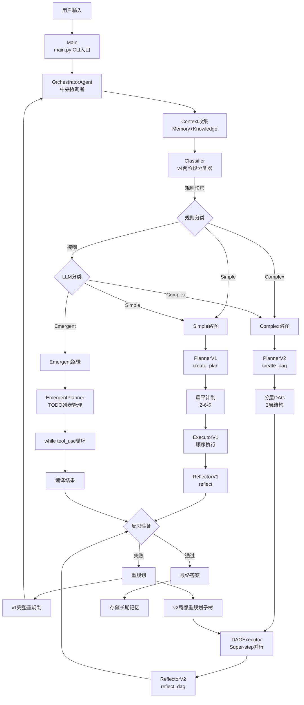

### 版本演进

```
v1 → 线性规划 + 顺序执行 + 完整重规划
v2 → DAG 分层规划 + 并行 Super-step + 局部重规划 + 节点状态机 + 逐节点验证
v3 → 自适应规划（运行时 DAG 变更）+ 工具路由（基于失败的切换）+ 动态 DAG 增删改
v4 → 两阶段混合分类器（规则 + LLM）+ 自动 v1/v2 路径选择
v5 → Claude Code 风格隐式规划 + TODO 列表管理 + while(tool_use) 主循环（新增第三条执行路径）
v6 → LLM 重试机制（指数退避）+ ReActEngine 统一引擎 Feature Flag + 评测模块（零侵入事件探针 + 四维度加权评分 + 12 基准任务）
v7 → 全链路 Tracing（OpenTelemetry Span 树 + 多后端导出 + 声明式装饰器）+ 内置 Web Viewer（FastAPI 树形可视化）
```

### 核心特性

- **混合路由系统**：自动选择 Simple/Complex/Emergent 三条执行路径
- **两阶段分类器**：规则快筛（零成本）+ LLM 兜底（高准确率）
- **Super-step 并行**：借鉴 LangGraph Pregel 运行时，支持节点并行执行
- **状态机管控**：严格节点生命周期管理，防止非法状态转移
- **隐式规划**：Claude Code 风格，通过 TODO 列表动态涌现规划
- **LLM 重试**：v6 新增指数退避重试机制，提升稳定性
- **评测模块**：零侵入事件探针 + 四维度加权评分（规划/执行/效率/反思）+ 12 基准任务 + 三模式对比报告
- **全链路 Tracing**：基于 OpenTelemetry 标准的结构化 Span 树，覆盖任务全生命周期
- **Web Viewer**：内置 FastAPI 可视化查看器，暗色主题树形 Span 展示

## 模块结构

### 目录布局

```
manus_demo/
├── agents/                    # 智能体模块
│   ├── __init__.py
│   ├── base.py               # BaseAgent 基类 (182行)
│   ├── orchestrator.py       # OrchestratorAgent 中央协调者 (523行)
│   ├── planner.py            # PlannerAgent 混合规划器 (933行)
│   ├── executor.py           # ExecutorAgent ReAct执行器 (322行)
│   ├── reflector.py          # ReflectorAgent 反思验证器 (254行)
│   └── emergent_planner.py   # EmergentPlannerAgent 隐式规划器 (684行)
│
├── dag/                       # DAG 执行引擎
│   ├── __init__.py
│   ├── graph.py              # TaskDAG 有向无环图 (626行)
│   ├── executor.py           # DAGExecutor Super-step执行器 (647行)
│   └── state_machine.py      # NodeStateMachine 节点状态机 (113行)
│
├── react/                     # ReAct 统一引擎 (v6)
│   ├── __init__.py
│   └── engine.py             # ReActEngine 统一 ReAct 循环引擎 (245行)
│
├── llm/                       # LLM 客户端
│   ├── __init__.py
│   └── client.py             # LLMClient OpenAI兼容封装 (282行)
│
├── tools/                     # 工具系统
│   ├── __init__.py
│   ├── base.py               # BaseTool 工具基类 (86行)
│   ├── router.py             # ToolRouter 智能路由器 (167行)
│   ├── web_search.py         # WebSearchTool 网络搜索 (112行)
│   ├── code_executor.py      # CodeExecutorTool 代码执行 (101行)
│   ├── file_ops.py           # FileOpsTool 文件操作 (137行)
│   ├── shell_tool.py         # ShellTool Shell命令执行 (151行)
│   └── subprocess_utils.py   # 子进程管理工具 (155行)
│
├── memory/                    # 记忆系统
│   ├── __init__.py
│   ├── short_term.py         # ShortTermMemory 短期记忆 (90行)
│   └── long_term.py          # LongTermMemory 长期记忆 (141行)
│
├── context/                   # 上下文管理
│   ├── __init__.py
│   └── manager.py            # ContextManager 上下文压缩 (186行)
│
├── knowledge/                 # 知识检索
│   ├── __init__.py
│   ├── retriever.py          # KnowledgeRetriever TF-IDF检索 (228行)
│   └── docs/
│
├── evaluation/                 # 评测模块
│   ├── __init__.py           # 模块入口，学术参考 (17行)
│   ├── metrics.py            # 指标模型 + 评分函数 (479行)
│   ├── benchmark.py          # 12 个基准任务 (310行)
│   ├── runner.py             # EvaluationProbe + EvaluationRunner (568行)
│   ├── report.py             # Rich 报告 + JSON 导出 (308行)
│   └── eval_cli.py           # CLI 入口 (185行)
│
├── tracing/                    # 全链路追踪模块 (v7)
│   ├── __init__.py            # 模块入口 + No-op Stubs
│   ├── __main__.py            # Web Viewer CLI 入口
│   ├── config.py              # Tracing 配置集中管理
│   ├── spans.py               # Span/Attribute/Event 语义常量
│   ├── provider.py            # TracerProvider 工厂
│   ├── exporters.py           # FileSpanExporter + RichConsoleExporter
│   ├── decorators.py          # @traced / @traced_llm_call / @traced_tool_call
│   ├── bridge.py              # TracingBridge 事件→Span 桥接器
│   ├── server.py              # Web Viewer FastAPI 应用
│   └── templates/             # Web Viewer HTML 模板
│       ├── base.html
│       ├── trace_list.html
│       └── trace_detail.html
│
├── tests/                     # 测试模块
│
├── sxw_aicoding/              # 文档目录
│   └── docs/
│
├── config.py                  # 全局配置 (88行)
├── schema.py                  # 数据模型定义 (612行)
├── main.py                    # CLI 入口 (515行)
└── requirements.txt           # Python 依赖
```

## 组件详情

### 1. OrchestratorAgent

**文件**: `agents/orchestrator.py` (523行)

**目的**: 管理完整混合规划生命周期的中央协调者，负责任务分类、路由选择和执行协调。

**主要职责**:
- 检索相关记忆和知识
- 使用两阶段混合分类器对任务复杂度进行分类
- 路由到三种执行路径：simple/complex/emergent
- 协调执行和反思过程
- 处理重规划逻辑
- 存储学习成果到长期记忆

**主要方法签名**:
```python
class OrchestratorAgent:
    def __init__(
        self,
        llm_client: LLMClient | None = None,
        tools: list[BaseTool] | None = None,
        on_event: Callable[[str, Any], None] | None = None,
    ) -> None

    async def run(self, task: str) -> str
    async def _gather_context(self, task: str) -> str
    async def _execute_and_reflect_simple(self, task: str, plan: Plan, context: str) -> str
    async def _execute_dag_and_reflect(self, dag: TaskDAG) -> str
    async def _execute_emergent(self, task: str, context: str) -> str
```

**架构流程**:
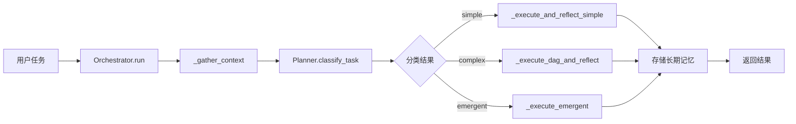

### 2. PlannerAgent

**文件**: `agents/planner.py` (933行)

**主要职责**:
- 两阶段任务分类：规则快筛 + LLM 兜底
- v1 扁平计划生成（2-6步）
- v2 DAG 分层计划生成（3层结构）
- 重规划逻辑（完整重规划/局部子树重规划）
- 自适应规划（运行时 DAG 变更）

**6个正则模式**:
```python
_MULTI_STEP_PATTERN = r"(?:step|phase|stage|then|next|after|first|second|third)"
_CONDITIONAL_PATTERN = r"(?:if|when|case|depending|based on|otherwise|else)"
_PARALLEL_PATTERN = r"(?:parallel|concurrent|simultaneously|together|at the same time)"
_ACTION_VERB_PATTERN = r"(?:create|write|implement|build|generate|develop)"
_EXPLORATORY_PATTERN = r"(?:explore|investigate|research|find|discover|analyze)"
_UNCERTAINTY_PATTERN = r"(?:maybe|possibly|might|could|try|attempt)"
```

**主要方法签名**:
```python
class PlannerAgent(BaseAgent):
    async def classify_task(self, task: str) -> str
    def _rule_classify(self, task: str) -> str
    async def _llm_classify(self, task: str) -> str
    async def create_plan(self, task: str, context: str = "") -> Plan
    async def create_dag(self, task: str, context: str = "") -> TaskDAG
    async def replan(self, task: str, completed_results: list, failed_steps: list, feedback: str) -> Plan
    async def replan_subtree(self, dag: TaskDAG, failed_node_id: str, context: str) -> TaskDAG
    async def adapt_plan(self, dag: TaskDAG) -> AdaptationResult
    def apply_adaptations(self, dag: TaskDAG, adaptations: list[PlanAdaptation]) -> list[str]
```

**两阶段分类器架构**:
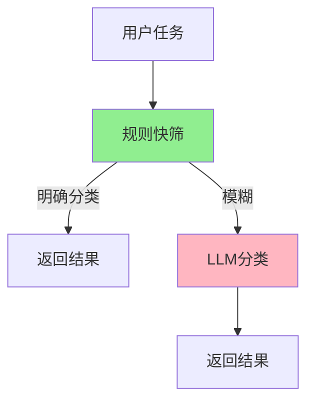

### 3. ExecutorAgent

**文件**: `agents/executor.py` (322行)

**目的**: ReAct循环执行器，负责逐步执行计划中的每个步骤/节点。

**主要职责**:
- 实现 ReAct（推理 + 行动）模式
- 使用 OpenAI 兼容的 function calling
- 支持步骤执行和节点执行两种模式
- v6 集成 ReActEngine Feature Flag（`ENABLE_REACT_ENGINE_V2`）
- v3 集成 ToolRouter 智能路由

**ReAct 循环流程**:
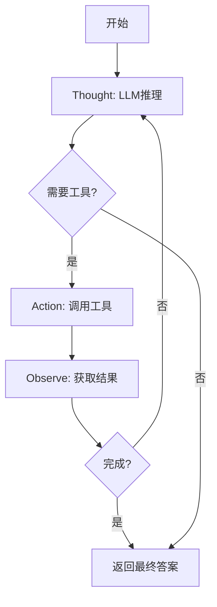

**v6 ReActEngine 集成**:
```python
# 如果 ENABLE_REACT_ENGINE_V2=true，使用统一 ReActEngine
if config.ENABLE_REACT_ENGINE_V2:
    self._react_engine = ReActEngine(
        llm_client=self.llm_client,
        tools=self.tools,
        max_iterations=self.max_iterations,
        tool_router=self.tool_router,
    )
```

**主要方法签名**:
```python
class ExecutorAgent(BaseAgent):
    def __init__(
        self,
        llm_client: LLMClient,
        tools: list[BaseTool],
        max_iterations: int | None = None,
        context_manager: ContextManager | None = None,
        tool_router: ToolRouter | None = None,
        use_react_engine: bool | None = None,
    ) -> None

    async def execute_step(self, step: Step, context: str = "") -> StepResult
    async def execute_node(self, node: TaskNode, context: str = "") -> StepResult
    async def _react_loop(self, step_id: int | str, prompt: str, context: str = "") -> StepResult
```

**ReAct 循环流程**:


### 4. ReflectorAgent

**文件**: `agents/reflector.py` (254行)

**目的**: 质量验证与反馈，负责评估执行结果的质量。

**主要职责**:
- 验证退出条件（exit criteria）
- 提供执行质量评估
- 生成改进建议
- 决定是否需要重规划

**主要方法签名**:
```python
class ReflectorAgent(BaseAgent):
    async def validate_exit_criteria(self, node: TaskNode, result: StepResult) -> bool
    async def reflect_dag(self, dag: TaskDAG, final_result: str) -> tuple[bool, str]
    async def reflect(self, task: str, result: str) -> tuple[bool, str]
```

### 5. EmergentPlannerAgent

**文件**: `agents/emergent_planner.py` (683行)

**目的**: Claude Code 风格隐式规划器，通过 TODO 列表管理实现动态规划。

**主要职责**:
- 无独立规划阶段，规划自然涌现
- TODO 列表动态创建、更新、完成
- 单一扁平消息历史
- while(tool_use) 主循环
- v6 集成 ReActEngine Feature Flag

**主要方法签名**:
```python
class EmergentPlannerAgent(BaseAgent):
    def __init__(
        self,
        llm_client: LLMClient,
        tools: list[BaseTool],
        max_iterations: int | None = None,
        max_outer_iterations: int | None = None,
        context_manager: ContextManager | None = None,
        tool_router: ToolRouter | None = None,
        use_react_engine: bool | None = None,
        on_event: Callable | None = None,
    ) -> None

    async def execute(self, task: str, context: str = "") -> str
    async def _init_todo_list(self, task: str, context: str) -> None
    async def _execute_todo(self, todo: TodoItem) -> StepResult
    async def _update_todo_list(self, last_result: StepResult) -> None
    async def _compile_answer(self, task: str, results: list[StepResult]) -> str
```

**隐式规划流程**:
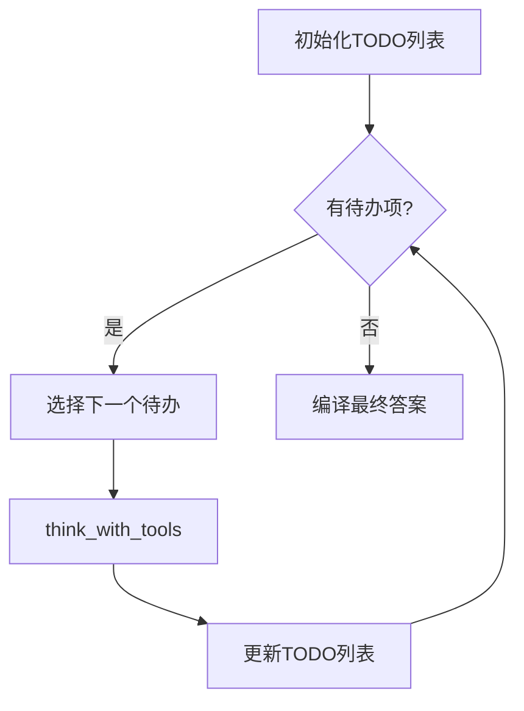

### 6. BaseAgent

**文件**: `agents/base.py` (182行)

**目的**: 所有智能体的基类，提供统一的 LLM 交互能力。

**主要职责**:
- 统一的 LLM 调用接口
- 工具调用结果管理
- 消息历史管理
- 系统提示词管理

**主要方法签名**:
```python
class BaseAgent:
    def __init__(
        self,
        name: str,
        system_prompt: str,
        llm_client: LLMClient,
        context_manager: ContextManager | None = None,
    ) -> None

    async def think(self, user_input: str, **kwargs: Any) -> str
    async def think_json(self, user_input: str, **kwargs: Any) -> Any
    async def think_with_tools(self, user_input: str, tools: list[dict[str, Any]], **kwargs: Any) -> Any
    def add_message(self, role: str, content: str) -> None
    def get_messages(self) -> list[dict[str, Any]]
    def reset(self) -> None
    def add_tool_result(self, tool_call_id: str, result: str) -> None
```

### 7. DAGExecutor

**文件**: `dag/executor.py` (647行)

**目的**: Super-step 并行执行引擎，替代原 Orchestrator 的顺序 for 循环。

**Super-step 执行流程**:
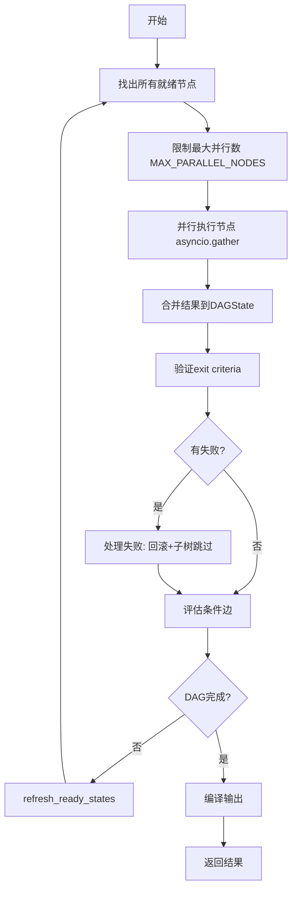

**主要方法签名**:
```python
class DAGExecutor:
    def __init__(
        self,
        executor_agent: ExecutorAgent,
        reflector_agent: ReflectorAgent,
        planner_agent: PlannerAgent | None = None,
        max_parallel: int | None = None,
        on_event: Callable[[str, Any], None] | None = None,
    ) -> None

    async def execute(self, dag: TaskDAG) -> str
    async def _run_node(self, node: TaskNode, dag: TaskDAG) -> StepResult
    async def _run_node_with_timeout(self, node: TaskNode, dag: TaskDAG) -> StepResult
    async def _handle_failure(self, node: TaskNode, dag: TaskDAG) -> None
    def _process_conditions(self, dag: TaskDAG) -> None
    async def _adapt_plan(self, step: int, dag: TaskDAG) -> None
    def _complete_structural_nodes(self, dag: TaskDAG) -> None
```

**Super-step 执行流程**:
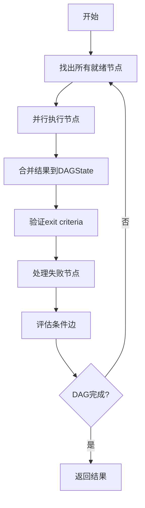

### 8. TaskDAG

**文件**: `dag/graph.py` (626行)

**目的**: DAG 数据结构与操作，提供分层任务规划的图结构支持。

**核心数据结构**:
```python
nodes: dict[str, TaskNode]              # 所有节点（key: node_id）
edges: list[TaskEdge]                   # 所有边
state: DAGState                         # 集中式共享状态
_dep_adjacency: dict[str, list[str]]   # source -> [targets] 依赖邻接表
_reverse_dep_adjacency: dict[str, list[str]]  # target -> [sources] 逆向邻接表
_checkpoints: list[dict[str, Any]]     # 内存状态快照（用于调试）
```

**DAG 结构示例**:
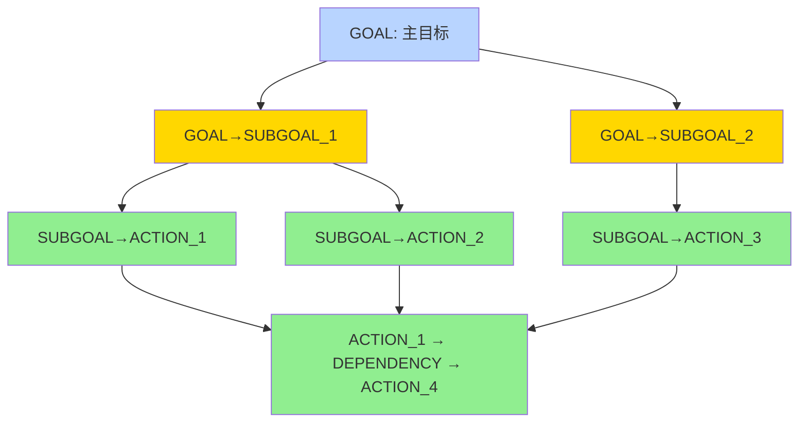

**主要方法签名**:
```python
class TaskDAG:
    def __init__(
        self,
        task: str,
        nodes: dict[str, TaskNode],
        edges: list[TaskEdge],
        context: str = "",
        state_machine: NodeStateMachine | None = None,
    ) -> None

    def get_ready_nodes(self) -> list[TaskNode]
    def topological_sort(self) -> list[str]
    def mark_subtree_skipped(self, node_id: str) -> None
    def refresh_ready_states(self) -> None
    def get_downstream(self, node_id: str) -> list[str]
    def is_complete(self) -> bool

    # v3 动态变更方法
    def add_dynamic_node(self, node: TaskNode) -> bool
    def remove_pending_node(self, node_id: str) -> bool
    def modify_node(self, node_id: str, description: str | None = None, exit_criteria_desc: str | None = None) -> bool
    def add_dynamic_edge(self, edge: TaskEdge) -> bool
```

**DAG 结构示例**:
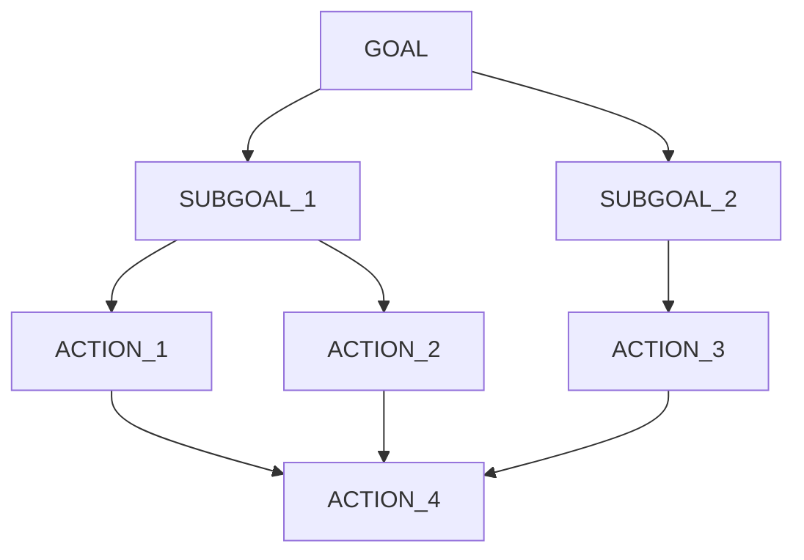

### 9. NodeStateMachine

**文件**: `dag/state_machine.py` (113行)

**目的**: 节点状态机，校验并强制执行节点生命周期的合法状态转移。

**主要职责**:
- 状态转移表管理
- 合法性校验
- 状态转移应用
- 事件回调触发

**状态转移图**:
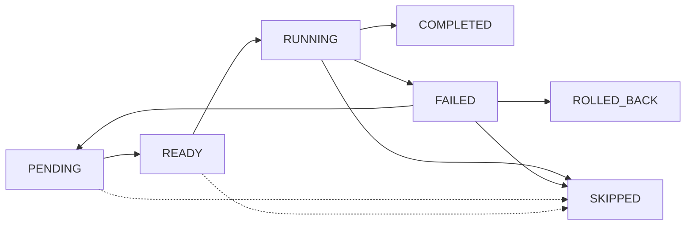

**主要方法签名**:
```python
class NodeStateMachine:
    def __init__(self, on_transition: Callable[[str, NodeStatus, NodeStatus], None] | None = None)
    def can_transition(self, node: TaskNode, new_status: NodeStatus) -> bool
    def transition(self, node: TaskNode, new_status: NodeStatus) -> None
```

### 10. LLMClient

**文件**: `llm/client.py` (282行)

**目的**: OpenAI 兼容 API 的统一封装，支持多种 LLM 服务商（DeepSeek、Qwen、Ollama、vLLM）。

**主要方法签名**:
```python
class LLMClient:
    def __init__(
        self,
        base_url: str | None = None,
        api_key: str | None = None,
        model: str | None = None,
        retry_enabled: bool | None = None,
        max_retries: int | None = None,
        backoff_factor: float | None = None,
    )

    async def chat(self, messages: list[dict], temperature: float = 0.7, max_tokens: int = 4096, **kwargs) -> str
    async def chat_with_tools(self, messages: list[dict], tools: list[dict], temperature: float = 0.7, max_tokens: int = 4096, **kwargs) -> Any
    async def chat_json(self, messages: list[dict], temperature: float = 0.3, max_tokens: int = 4096, **kwargs) -> Any
    def parse_json(text: str) -> Any  # staticmethod
    def get_call_records() -> list[LLMCallRecord]
    def reset_usage() -> None
```

**v6 重试机制流程**:
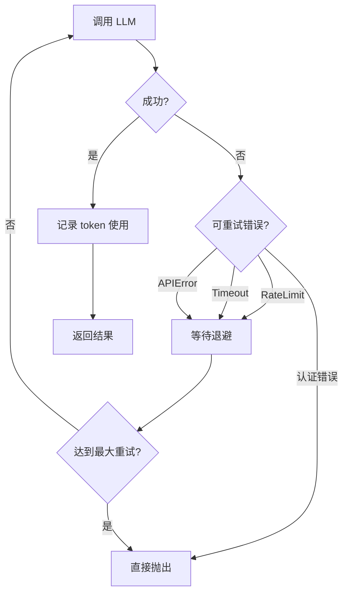

### 11. 工具系统

#### BaseTool
**文件**: `tools/base.py` (86行)

**目的**: 工具基类，定义统一的工具接口。

**主要方法签名**:
```python
class BaseTool(ABC):
    @property
    @abstractmethod
    def name(self) -> str

    @property
    @abstractmethod
    def description(self) -> str

    @property
    @abstractmethod
    def parameters_schema(self) -> dict[str, Any]

    @abstractmethod
    async def execute(self, **kwargs: Any) -> str

    def to_openai_tool(self) -> dict[str, Any]
```

#### ToolRouter
**文件**: `tools/router.py` (167行)

**目的**: 智能工具选择与基于失败的自动切换。

**主要职责**:
- 追踪每个节点的工具使用统计
- 失败计数和连续失败检测
- 超过阈值时建议替代工具
- 使用统计记录

**主要方法签名**:
```python
class ToolRouter:
    def __init__(self, available_tools: list[str], failure_threshold: int | None = None)
    def record_success(self, node_id: str, tool_name: str) -> None
    def record_failure(self, node_id: str, tool_name: str) -> None
    def should_suggest_alternative(self, node_id: str, tool_name: str) -> bool
    def get_failing_tools(self, node_id: str) -> list[str]
    def get_alternative_tools(self, node_id: str, failed_tool: str) -> list[str]
    def get_hint(self, node_id: str) -> str
    def get_node_summary(self, node_id: str) -> dict[str, Any]
    def reset_node(self, node_id: str) -> None
```

#### WebSearchTool
**文件**: `tools/web_search.py` (112行)

**目的**: 网络搜索工具，提供 mock 搜索功能。

**主要方法签名**:
```python
class WebSearchTool(BaseTool):
    async def execute(self, query: str, max_results: int = 5) -> str
```

#### CodeExecutorTool
**文件**: `tools/code_executor.py` (101行)

**目的**: 代码执行工具，通过 subprocess 沙箱执行 Python 代码。

**主要方法签名**:
```python
class CodeExecutorTool(BaseTool):
    async def execute(self, code: str, timeout: int = 30) -> str
```

#### FileOpsTool
**文件**: `tools/file_ops.py` (137行)

**目的**: 文件操作工具，提供安全的文件读写功能。

**主要方法签名**:
```python
class FileOpsTool(BaseTool):
    async def execute(self, action: str, **kwargs) -> str
    # 支持的操作: read, write, list
```

#### ShellTool
**文件**: `tools/shell_tool.py` (151行)

**目的**: Shell 命令执行工具，在沙箱子进程中执行 bash 命令。

**主要职责**:
- 基于 `subprocess_utils.run_with_limits()` 实现，支持超时、输出大小限制、流式输出捕获
- 在 sandbox 目录下执行，通过黑名单限制危险命令（`rm -rf`, `mkfs`, `dd`, `sudo` 等）
- 使用 `asyncio.Semaphore` 控制并发，通过 `build_safe_env()` 剥离敏感环境变量
- 支持工作目录切换、环境变量传递

**主要方法签名**:
```python
class ShellTool(BaseTool):
    async def execute(self, command: str, timeout: int = 30) -> str
```

#### SubprocessUtils
**文件**: `tools/subprocess_utils.py` (155行)

**目的**: 共享子进程管理工具，为 ShellTool 和 CodeExecutorTool 提供统一的子进程执行能力。

**主要职责**:
- `build_safe_env()`: 剥离敏感环境变量（api_key, secret, token, password, credential）
- `run_with_limits()`: asyncio 原生子进程执行，支持超时和输出大小限制
- `_read_with_limit()`: 并发读取 stdout/stderr，超出字节预算时终止进程并截断

**主要方法签名**:
```python
class ShellTool(BaseTool):
    async def execute(self, command: str, timeout: int = 30) -> str
```

### 12. 记忆系统

#### ShortTermMemory
**文件**: `memory/short_term.py` (90行)

**目的**: 短期记忆，使用滑动窗口缓冲区保留最近对话消息。

**主要职责**:
- 滑动窗口管理（默认 20 条）
- FIFO 自动淘汰
- 快速获取最近消息

**主要方法签名**:
```python
class ShortTermMemory:
    def __init__(self, window_size: int | None = None)
    def add(self, message: dict) -> None
    def get_messages(self) -> list[dict]
    def get_recent(self, n: int = 5) -> list[dict]
    def clear(self) -> None
    def to_text(self) -> str
```

#### LongTermMemory
**文件**: `memory/long_term.py` (141行)

**目的**: 长期记忆，基于 JSON 文件的持久化存储。

**主要职责**:
- JSON 文件持久化
- 关键词重叠度检索
- 任务摘要和学习成果存储

**主要方法签名**:
```python
class LongTermMemory:
    def __init__(self, memory_dir: str | None = None) -> None
    def _load(self) -> list[MemoryEntry]
    def _save(self) -> None
    def store(self, entry: MemoryEntry) -> None
    def search(self, query: str, top_k: int = 3) -> list[MemoryEntry]
```

### 13. 上下文与知识

#### ContextManager
**文件**: `context/manager.py` (186行)

**目的**: 上下文管理器，带 Token 感知的上下文窗口管理。

**主要职责**:
- Token 使用量估算
- 自动上下文压缩
- 保留 system prompt 和最近消息

**主要方法签名**:
```python
class ContextManager:
    def __init__(self, max_tokens: int | None = None, reserve_recent: int = 6)
    @staticmethod
    def estimate_tokens(text: str) -> int
    def estimate_messages_tokens(self, messages: list[dict]) -> int
    async def compress_if_needed(self, messages: list[dict], llm_client: Any) -> list[dict]
```

#### KnowledgeRetriever
**文件**: `knowledge/retriever.py` (228行)

**目的**: 知识检索器，使用 TF-IDF + 余弦相似度检索相关知识。

**主要职责**:
- TF-IDF 向量化
- 余弦相似度计算
- Top-K 相关文档检索

**主要方法签名**:
```python
class KnowledgeRetriever:
    def __init__(self, docs_dir: str | None = None, chunk_size: int | None = None) -> None
    def _build_index(self) -> None
    def _split_text(self, text: str, chunk_size: int) -> list[str]
    def _tokenize(self, text: str) -> list[str]
    def _compute_tf(self, text: str) -> dict[str, float]
    def search(self, query: str, top_k: int | None = None) -> list[dict[str, Any]]
    def format_results(self, results: list[dict[str, Any]]) -> str
```

### 14. 评测模块

#### EvaluationProbe（事件探针）

**文件**: `evaluation/runner.py` (568行) 中的 `EvaluationProbe` 类

**目的**: 零侵入式事件探针，挂接到 OrchestratorAgent 的事件回调，被动收集各阶段指标数据。

**设计原则**:
- 不修改核心代码（agents/、dag/、react/ 等模块零改动）
- 只读取事件数据，不修改 data
- 通过 `on_event` 回调挂接

**核心机制**:
```python
# 挂接方式
orchestrator = OrchestratorAgent(on_event=probe.on_event)
# probe 被动接收所有事件，解析并填充指标字段
# 任务结束后调用 probe.build_result() 生成 TaskEvaluationResult
```

**监听的事件类型**:

| 事件 | 收集的指标 |
|------|-----------|
| `task_complexity` | 分类结果 |
| `plan` / `dag_created` / `todo_list_initialized` | 计划结构（步骤数、节点数、环检测、todo 数量） |
| `step_complete` / `step_failed` / `node_completed` / `node_failed` | 执行结果（完成/失败数、工具调用记录、迭代数） |
| `phase` + "Re-planning" / "Partial replan" | 重规划次数 |
| `plan_adaptation` / `adaptive_planning` | DAG 自适应规划次数 |
| `reflection` | 反思判定结果、评分 |
| `token_usage_summary` | 总 token 消耗 |
| `task_complete` | 最终答案、任务成功判定 |

**主要方法签名**:
```python
class EvaluationProbe:
    def __init__(self) -> None
    def reset(self) -> None
    def on_event(self, event: str, data: Any) -> None
    def build_result(self, task: BenchmarkTask, forced_mode: PlanMode, llm_model: str) -> TaskEvaluationResult
```

#### EvaluationRunner（评测执行器）

**文件**: `evaluation/runner.py` 中的 `EvaluationRunner` 类

**目的**: 编排多任务×多模式的评测执行流程。

**执行流程**:
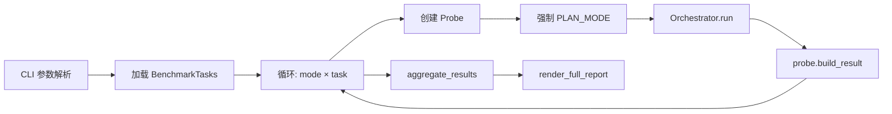

**主要方法签名**:
```python
class EvaluationRunner:
    def __init__(self, llm_client: LLMClient | None = None, tools: list[BaseTool] | None = None)
    async def evaluate_task(self, task: BenchmarkTask, mode: PlanMode) -> TaskEvaluationResult
    async def evaluate_mode(self, mode: PlanMode, tasks: list[BenchmarkTask] | None = None) -> AggregatedMetrics
    async def evaluate_all_modes(self, tasks: list[BenchmarkTask] | None = None, modes: list[PlanMode] | None = None) -> dict[PlanMode, AggregatedMetrics]
```

#### 指标模型（metrics.py）

**文件**: `evaluation/metrics.py` (479行)

**目的**: Pydantic 数据模型和四维度加权评分函数。

**数据模型**:

| 模型 | 行数 | 用途 |
|------|------|------|
| `PlanMode` | - | 枚举：simple / complex / emergent |
| `TaskDifficulty` | - | 枚举：easy / medium / hard |
| `FailureCategory` | - | 12 种失败类别枚举 |
| `PlanningMetrics` | ~15 行 | 规划阶段指标（分类准确性、步骤覆盖、计划有效性） |
| `ExecutionMetrics` | ~15 行 | 执行阶段指标（任务成功、步骤成功率、工具准确率） |
| `EfficiencyMetrics` | ~8 行 | 效率指标（Token 消耗、重规划次数、轨迹效率） |
| `ReflectionMetrics` | ~10 行 | 反思指标（反思准确性、FP/FN、观测标记） |
| `TaskEvaluationResult` | ~20 行 | 单次任务完整评测结果 |
| `AggregatedMetrics` | ~25 行 | 多任务聚合指标 |

**评分函数**:

| 函数 | 权重分配 |
|------|---------|
| `compute_planning_score()` | 自动模式：40%分类 + 30%结构 + 20%覆盖 + 10%速度；强制模式：50%结构 + 35%覆盖 + 15%速度 |
| `compute_execution_score()` | 50%任务成功 + 30%步骤成功率 + 20%工具准确率 |
| `compute_efficiency_score()` | 40%轨迹效率 + 30%Token效率 + 20%时间效率 + 10%重规划惩罚 |
| `compute_overall_score()` | 30%规划 + 40%执行 + 20%效率 + 10%反思 |
| `aggregate_results()` | 多任务聚合，含 reflection_coverage_rate 过滤 |

#### 基准任务（benchmark.py）

**文件**: `evaluation/benchmark.py` (310行)

**目的**: 12 个预定义基准任务，覆盖 3 个难度等级和 4 种工具组合。

**任务分布**:

| 难度 | 数量 | 期望分类 | 工具组合 |
|------|------|---------|---------|
| easy | 4 | simple | web_search / execute_python / file_ops / shell（各 1 个单工具任务） |
| medium | 4 | complex | web_search+execute_python（2 个）、file_ops+execute_python（2 个） |
| hard | 4 | complex/emergent | web_search+execute_python+file_ops / web_search+execute_python+shell / execute_python+web_search / execute_python+file_ops |

**Ground Truth 验证**:
- `must_include_keywords`: 答案必须包含的关键词（不区分大小写）
- `must_not_include`: 答案不得包含的禁止关键词
- `expected_subtasks`: 步骤覆盖率计算（支持中英文分割）

#### 报告生成（report.py）

**文件**: `evaluation/report.py` (308行)

**目的**: Rich 控制台对比报告 + JSON 结构化导出。

**输出组成**:
1. **对比总表**（`render_comparison_table`）— 三模式并排，最优值标绿
2. **各难度成功率表**
3. **失败分布表** — 按 FailureCategory 统计
4. **各模式详细报告**（`render_mode_detail`）— 每任务粒度
5. **树形总结**（`render_summary_tree`）— 模式级摘要
6. **JSON 导出**（`export_json`）— 含 per_task_results 的完整数据

#### 评测 CLI（eval_cli.py）

**文件**: `evaluation/eval_cli.py` (185行)

**目的**: 评测命令行入口，支持多维度筛选和输出控制。

**使用方式**:
```bash
python -m evaluation.eval_cli [OPTIONS]
  --modes simple complex          # 指定规划模式
  --difficulty easy               # 按难度筛选
  --tasks easy_001 easy_002       # 指定任务 ID
  --output results.json           # 导出 JSON
  --dry-run                       # 展示任务但不执行
  --verbose                       # 调试日志
```


### N. TracingBridge

**文件**: `tracing/bridge.py`
**目的**: 将 _emit 事件流自动转换为 OpenTelemetry Span 树

主要能力：
- 订阅 Orchestrator 的 _emit 事件回调
- 维护 Span 栈追踪父子层级
- 使用事件到处理器的映射表，支持 task/phase/node/todo/step/reflection 等全量事件
- 异常安全，tracing 错误不影响主流程

### N+1. Trace Web Viewer

**文件**: `tracing/server.py` + `tracing/__main__.py`
**目的**: 内置的 Web 可视化界面，查看本地 trace 文件

主要能力：
- Trace 列表页（按时间倒序，含状态、Span 数量、耗时）
- Trace 详情页（可折叠树形 Span 层级 + 属性展开面板）
- JSON API（/api/traces, /api/traces/{file_id}）
- CLI 启动：python -m tracing --port 8600

## 数据流

## 关键设计模式

### 1. ReAct (Reasoning + Acting)

**描述**: Executor 和 EmergentPlanner 都采用 ReAct 模式，通过 Thought-Action-Observe 循环逐步完成任务。

**实现位置**: 
- `agents/executor.py`: `_react_loop()` 方法
- `agents/emergent_planner.py`: `think_with_tools()` 调用

**优势**:
- 让 LLM 能够自然地推理和行动
- 通过工具调用扩展 LLM 能力
- 支持多轮迭代和自我修正

### 2. Super-step / BSP 并行模型

**描述**: DAGExecutor 采用 Super-step 模型，每轮并行执行所有就绪节点，借鉴 LangGraph 的 Pregel 运行时。

**实现位置**: `dag/executor.py`: `execute()` 方法

**优势**:
- 提高执行效率，充分利用并行性
- 集中式状态管理，简化数据流
- 支持条件边和动态 DAG 变更

**示例**:
```python
# 每个 Super-step:
ready_nodes = dag.get_ready_nodes()
results = await asyncio.gather(*[run_node(n) for n in ready_nodes])
# 合并结果、验证、评估条件边
```

### 3. 集中式状态管理

**描述**: TaskDAG 使用 DAGState 作为集中式共享状态，所有节点通过 state 共享数据，灵感来自 LangGraph。

**实现位置**: `dag/graph.py`: `DAGState` 类

**优势**:
- 简化节点间数据传递
- 支持时间旅行调试（checkpoints）
- 便于状态快照和恢复

**对比**:
- LangGraph: 使用 TypedDict 定义状态
- 本实现: 使用简单的 dict，更轻量

### 4. 有限状态机 (FSM)

**描述**: NodeStateMachine 严格管控节点生命周期，防止非法状态转移。

**实现位置**: `dag/state_machine.py`: `NodeStateMachine` 类

**优势**:
- 确保状态一致性
- 提供清晰的转移路径
- 支持事件驱动 UI 更新

**状态转移表**:
```python
VALID_TRANSITIONS = {
    NodeStatus.PENDING: {NodeStatus.READY, NodeStatus.SKIPPED},
    NodeStatus.READY: {NodeStatus.RUNNING, NodeStatus.SKIPPED},
    NodeStatus.RUNNING: {NodeStatus.COMPLETED, NodeStatus.FAILED, NodeStatus.SKIPPED},
    NodeStatus.FAILED: {NodeStatus.ROLLED_BACK, NodeStatus.SKIPPED, NodeStatus.PENDING},
    NodeStatus.COMPLETED: set(),
    NodeStatus.SKIPPED: set(),
    NodeStatus.ROLLED_BACK: set(),
}
```

### 5. 两阶段混合分类器

**描述**: Planner 使用规则快筛 + LLM 兜底的两阶段分类器，平衡效率和准确率。

**实现位置**: `agents/planner.py`: `classify_task()` 方法

**优势**:
- 规则快筛零成本，处理 60-70% 显然任务
- LLM 兜底处理模糊区间，保证准确率
- 节省 token 成本，参考 DAAO 和 RouteLLM (ICLR 2025)

**流程**:
```python
# Stage 1: 规则快筛（< 1ms）
result = self._rule_classify(task)
if result:
    return result

# Stage 2: LLM 分类（仅对模糊区间，~60 tokens）
return await self._llm_classify(task)
```

### 6. 隐式涌现规划

**描述**: EmergentPlanner 采用 Claude Code 风格的隐式规划，通过 TODO 列表管理动态涌现计划。

**实现位置**: `agents/emergent_planner.py`: `EmergentPlannerAgent` 类

**优势**:
- 无独立规划阶段，减少 token 消耗
- TODO 列表动态演化，适应不确定性
- 单一扁平消息历史，LLM 可见所有上下文

**核心循环**:
```python
while has_pending_todos(todo_list):
    todo = select_next_todo(todo_list)
    result = await think_with_tools(todo)
    todo_list = await update_todo_list(todo_list, result)
```

### 7. 事件驱动 UI

**描述**: 所有组件支持 `on_event` 回调，实现事件驱动的 UI 实时更新。

**实现位置**: 
- `dag/executor.py`: `_on_node_transition()` 回调
- `dag/state_machine.py`: `on_transition` 参数

**优势**:
- 解耦业务逻辑和 UI 更新
- 支持实时状态可视化
- 便于调试和监控

**示例**:
```python
def on_event(event_type: str, data: Any):
    if event_type == "node_transition":
        update_ui_node_status(data["node_id"], data["new_status"])
```

## 文件参考

### 核心文件汇总表

| 文件路径 | 行数 | 核心职责 | 关键类/方法 |
|---------|------|---------|-----------|
| `agents/orchestrator.py` | 523 | 中央协调者，三路由管理 | `OrchestratorAgent.run()` |
| `agents/planner.py` | 933 | 混合分类器 + 计划生成 | `PlannerAgent.classify_task()` |
| `agents/executor.py` | 322 | ReAct 执行器 | `ExecutorAgent._react_loop()` |
| `agents/reflector.py` | 254 | 质量验证与反馈 | `ReflectorAgent.reflect()` |
| `agents/emergent_planner.py` | 684 | 隐式规划器 | `EmergentPlannerAgent.execute()` |
| `agents/base.py` | 182 | 智能体基类 | `BaseAgent.think()` |
| `dag/executor.py` | 647 | Super-step 并行执行 | `DAGExecutor.execute()` |
| `dag/graph.py` | 626 | DAG 数据结构 | `TaskDAG.get_ready_nodes()` |
| `dag/state_machine.py` | 113 | 节点状态机 | `NodeStateMachine.transition()` |
| `llm/client.py` | 417 | LLM 客户端 | `LLMClient.chat()` |
| `react/engine.py` | 245 | 统一 ReAct 引擎 | `ReActEngine.execute()` |
| `tools/base.py` | 174 | 工具基类 | `BaseTool.execute()` |
| `tools/router.py` | 167 | 智能工具路由 | `ToolRouter.get_hint()` |
| `tools/web_search.py` | 112 | 网络搜索工具 | `WebSearchTool.execute()` |
| `tools/code_executor.py` | 101 | 代码执行工具 | `CodeExecutorTool.execute()` |
| `tools/file_ops.py` | 137 | 文件操作工具 | `FileOpsTool.execute()` |
| `tools/shell_tool.py` | 151 | Shell 命令执行工具 | `ShellTool.execute()` |
| `tools/subprocess_utils.py` | 155 | 子进程管理工具 | `run_with_limits()` |
| `memory/short_term.py` | 90 | 短期记忆 | `ShortTermMemory.add()` |
| `memory/long_term.py` | 141 | 长期记忆 | `LongTermMemory.search()` |
| `context/manager.py` | 186 | 上下文管理 | `ContextManager.compress_if_needed()` |
| `knowledge/retriever.py` | 228 | 知识检索器 | `KnowledgeRetriever.search()` |
| `evaluation/metrics.py` | 479 | 评测指标模型 + 评分函数 | `compute_overall_score()`, `aggregate_results()` |
| `evaluation/benchmark.py` | 310 | 12 个基准任务定义 | `get_benchmark_tasks()` |
| `evaluation/runner.py` | 568 | 事件探针 + 评测执行器 | `EvaluationProbe`, `EvaluationRunner` |
| `evaluation/report.py` | 308 | Rich 报告 + JSON 导出 | `render_comparison_table()`, `export_json()` |
| `evaluation/eval_cli.py` | 185 | 评测 CLI 入口 | `main()` |
| `tracing/__init__.py` | - | 模块入口 + No-op Stubs | - |
| `tracing/__main__.py` | - | Web Viewer CLI 入口 | - |
| `tracing/config.py` | - | Tracing 配置集中管理 | - |
| `tracing/spans.py` | - | Span/Attribute/Event 语义常量 | - |
| `tracing/provider.py` | - | TracerProvider 工厂 | - |
| `tracing/exporters.py` | - | FileSpanExporter + RichConsoleExporter | - |
| `tracing/decorators.py` | - | @traced / @traced_llm_call / @traced_tool_call | - |
| `tracing/bridge.py` | - | TracingBridge 事件→Span 桥接器 | - |
| `tracing/server.py` | - | Web Viewer FastAPI 应用 | - |
| `schema.py` | 612 | 数据模型定义 | `Plan`, `TaskDAG`, `TaskNode` |
| `config.py` | 88 | 全局配置 | `LLM_MODEL`, `MAX_PARALLEL_NODES` |
| `main.py` | 515 | CLI 入口 | `main()` |

### 版本演进关键文件

| 版本 | 新增/修改文件 | 核心变更 |
|------|-------------|---------|
| v1 | `agents/planner.py` | 线性规划器，2-6 步扁平计划 |
| v2 | `dag/executor.py`, `dag/graph.py`, `dag/state_machine.py` | DAG 分层规划 + Super-step 并行 |
| v3 | `tools/router.py`, `dag/graph.py` | 工具路由 + 动态 DAG 变更 |
| v4 | `agents/planner.py` | 两阶段混合分类器 |
| v5 | `agents/emergent_planner.py` | 隐式规划 + TODO 列表管理 |
| v6 | `llm/client.py`, `agents/executor.py`, `agents/emergent_planner.py`, `tools/shell_tool.py`, `react/engine.py` | LLM 重试 + ReActEngine + ShellTool + 统一 ReAct 引擎 |
| v6 | `evaluation/metrics.py`, `evaluation/benchmark.py`, `evaluation/runner.py`, `evaluation/report.py`, `evaluation/eval_cli.py`, `tests/test_evaluation.py` | 评测模块：零侵入事件探针 + 四维度加权评分 + 12 基准任务 + 三模式对比报告 |
| v7 | `tracing/bridge.py`, `tracing/exporters.py`, `tracing/decorators.py`, `tracing/provider.py`, `tracing/server.py`, `llm/client.py`, `tools/base.py` | 全链路 Tracing + Web Viewer |

### 测试文件

| 文件路径 | 测试内容 |
|---------|---------|
| `tests/test_dag_capabilities.py` | DAG 功能测试 |
| `tests/test_emergent_planning.py` | 隐式规划测试 |
| `tests/test_emergent_simple.py` | 隐式规划简单场景测试 |
| `tests/test_llm_integration.py` | LLM 集成测试 |
| `tests/test_optimizations.py` | 性能优化测试 |
| `tests/test_real_tools.py` | 真实工具测试 |
| `tests/test_shell_tool.py` | Shell 工具测试 |
| `tests/test_concurrent_execution.py` | 并发执行测试 |
| `tests/test_cycle_detection.py` | 循环检测测试 |
| `tests/test_tracing.py` | Tracing 模块测试（27 用例） |

### 文档文件

| 文件路径 | 内容 |
|---------|------|
| `docs/codemap.md` | 本代码地图文档 |
| `docs/CHANGELOG.md` | 版本更新日志 |
| `docs/data-structures-and-algorithms.md` | 数据结构与算法说明 |
| `docs/dynamic-features.md` | v1~v5 动态特性对比 |
| `docs/emergent-planning.md` | v5/v6 隐式规划文档 |
| `docs/emergent-planning-test-scenarios.md` | 隐式规划测试场景 |
| `docs/hybrid-plan-routing.md` | v4 混合路由文档 |
| `docs/llm-integration.md` | v6 LLM 集成文档 |
| `docs/planning-gap-analysis.md` | 规划缺口分析 |
| `docs/planning-test-scenarios.md` | 规划测试场景 |
| `docs/related-papers.md` | 相关论文（DAAO, RouteLLM） |
| `docs/upgrade-plan.md` | v6 升级计划 |
| `docs/tracing-guide.md` | v7 Tracing 使用指南 |

---

## 总结

Manus Demo 是一个功能完整的多智能体任务执行系统，具有以下核心特点：

1. **混合路由架构**：自动选择 Simple/Complex/Emergent 三条执行路径，适应不同复杂度的任务
2. **两阶段分类器**：规则快筛 + LLM 兜底，在效率和准确率之间取得平衡
3. **Super-step 并行**：借鉴 LangGraph 的 Pregel 运行时，支持高效的并行执行
4. **状态机管控**：严格节点生命周期管理，确保系统一致性
5. **隐式规划**：Claude Code 风格的动态规划，适应不确定性任务
6. **LLM 重试机制**：v6 新增的指数退避重试，提升系统稳定性
7. **Shell 命令执行**：v6 新增 `ShellTool`，支持在沙箱中执行 bash 命令，增强真实环境交互能力
8. **全链路 Tracing**：v7 新增基于 OpenTelemetry 的结构化 Span 树，覆盖 LLM 调用、工具执行、反思等全生命周期，支持 File/Rich/OTLP/Phoenix 多后端导出，并提供内置 Web Viewer 可视化查看器

该系统展示了如何将多种先进技术（ReAct、DAG、状态机、混合路由等）整合为一个实用的多智能体系统，为复杂任务的自动化执行提供了完整的解决方案。
