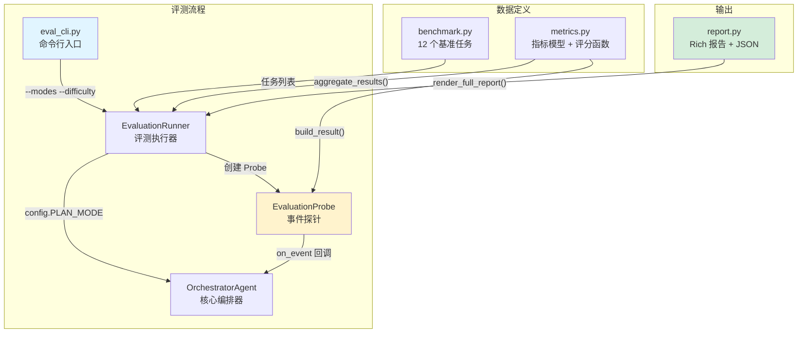

# Manus Demo - 评测模块功能说明与使用指南

> **版本**: v7.0（含深度代码评审 7 项 Bug 修复）
> **更新日期**: 2026-05-12
> **目的**: 介绍评测模块的整体设计思路、架构、指标体系、使用方法和扩展指南，帮助新加入的开发人员快速上手

---

## 目录

- [1. 为什么需要评测模块](#1-为什么需要评测模块)
- [2. 整体设计思路](#2-整体设计思路)
- [3. 架构概览](#3-架构概览)
- [4. 模块结构与文件说明](#4-模块结构与文件说明)
- [5. 指标体系详解](#5-指标体系详解)
- [6. 基准任务集](#6-基准任务集)
- [7. 快速开始：5 分钟上手](#7-快速开始5-分钟上手)
- [8. 命令行参数详解](#8-命令行参数详解)
- [9. 报告输出说明](#9-报告输出说明)
- [10. 实战用例](#10-实战用例)
- [11. 扩展指南](#11-扩展指南)
- [12. 学术参考来源](#12-学术参考来源)

---

## 1. 为什么需要评测模块

Manus Demo 实现了三种 plan-and-execute 规划执行范式：

| 范式 | 版本 | 核心思路 | 适用场景 |
|------|------|---------|---------|
| **Simple** | v1 | 扁平 Plan→Step → 顺序 ReAct 执行 | 单步、简单任务 |
| **Complex** | v2 | 层次化 DAG→TaskNode → 超步并行执行 | 多步骤、有依赖关系的任务 |
| **Emergent** | v5 | Claude Code 风格 TodoList → while(tool_use) 循环 | 探索性、迭代优化型任务 |

三种范式各有优劣，但没有量化的评测手段就无法回答：

- 哪种范式在什么类型任务上表现更好？
- 规划阶段的分类准确率如何？
- 执行阶段的工具使用精度怎样？
- 重规划是帮助了执行还是浪费了 Token？

**评测模块的目标**：在不修改核心执行代码的前提下，对三种范式进行系统化的基准测试和量化对比。

---

## 2. 整体设计思路

### 2.1 零侵入式设计

评测模块的核心设计原则是 **零侵入**——不修改 `agents/`、`dag/`、`react/` 等核心模块的任何代码。

实现方式：

```
OrchestratorAgent 已有事件机制：
  self._emit(event, data) → on_event 回调

评测模块挂载 EvaluationProbe 到这个回调：
  OrchestratorAgent(on_event=probe.on_event)
  → probe 被动接收所有事件
  → 解析事件数据，填充指标字段
  → 任务结束后调用 probe.build_result() 生成评测结果
```

这意味着：
- 核心代码零改动
- 评测模块可以随时启用/禁用
- 事件数据是只读的（probe 不修改 data）

### 2.2 强制路由与动态分类检测

评测需要控制变量——让同一个任务分别以三种模式运行，才能做公平对比。

实现方式是临时覆写 `config.PLAN_MODE`：

```python
# evaluation/runner.py
original_plan_mode = config.PLAN_MODE
config.PLAN_MODE = mode.value           # 强制设为 simple/complex/emergent
try:
    await orchestrator.run(task_description)  # 以指定模式运行
finally:
    config.PLAN_MODE = original_plan_mode     # 恢复原配置
```

`classification_forced` 标志在 `task_start` 事件中根据当前 `config.PLAN_MODE` 动态设置：
- `PLAN_MODE != "auto"` → `classification_forced = True`（评测时使用，分类权重重新分配）
- `PLAN_MODE == "auto"` → `classification_forced = False`（正常自动分类，分类权重参与评分）

### 2.3 四维度加权评分

每个任务产生一个 0-1 的综合评分，由四个维度加权合成：

```
overall = 0.30 × planning + 0.40 × execution + 0.20 × efficiency + 0.10 × reflection_accuracy
```

---

## 3. 架构概览



### 执行流程

```
1. eval_cli 解析命令行参数
2. EvaluationRunner 按指定的 modes 和 tasks 循环：
   对每个 (task, mode) 组合：
     a. 创建 EvaluationProbe
     b. 强制设置 config.PLAN_MODE
     c. 创建 OrchestratorAgent(on_event=probe.on_event)
     d. 执行任务：await orchestrator.run(task_description)
     e. probe 通过事件回调收集数据
     f. probe.build_result() → TaskEvaluationResult
3. aggregate_results() 聚合同一 mode 下的所有结果 → AggregatedMetrics
4. render_full_report() 输出对比报告
```

---

## 4. 模块结构与文件说明

```
evaluation/
├── __init__.py        # 模块入口，列出学术参考来源
├── metrics.py         # 核心指标模型 + 评分函数（474 行）
├── benchmark.py       # 12 个基准任务定义（310 行）
├── runner.py          # EvaluationProbe + EvaluationRunner（569 行）
├── report.py          # Rich 控制台报告 + JSON 导出（308 行）
└── eval_cli.py        # CLI 命令行入口（185 行）

tests/
└── test_evaluation.py # 51 个单元测试，全部基于 mock（无需 API Key）
```

### 各文件核心内容

| 文件 | 关键类/函数 | 职责 |
|------|------------|------|
| `metrics.py` | `PlanningMetrics`, `ExecutionMetrics`, `EfficiencyMetrics`, `ReflectionMetrics`, `TaskEvaluationResult`, `AggregatedMetrics` | Pydantic 数据模型 |
| | `compute_planning_score()`, `compute_execution_score()`, `compute_efficiency_score()`, `compute_overall_score()` | 评分计算函数 |
| | `aggregate_results()` | 多任务聚合 |
| `benchmark.py` | `BenchmarkTask`, `GroundTruth` | 任务定义模型 |
| | `get_benchmark_tasks()` | 获取/筛选任务列表 |
| | `BENCHMARK_TASKS` | 12 个预定义任务的列表 |
| `runner.py` | `EvaluationProbe` | 事件探针，拦截 Orchestrator 事件流 |
| | `EvaluationRunner` | 评测执行器，编排多任务×多模式运行 |
| `report.py` | `render_comparison_table()`, `render_mode_detail()`, `render_summary_tree()`, `export_json()` | 报告渲染 |
| `eval_cli.py` | `main()` | CLI 参数解析和入口 |

---

## 5. 指标体系详解

### 5.1 规划质量（Planning Score）

评估规划阶段的分类准确性和计划质量。

**自动模式**（`classification_forced=False`）下的权重：

| 子指标 | 权重 | 说明 |
|--------|------|------|
| 分类准确性 | 40% | 任务被路由到正确的范式（simple/complex/emergent） |
| 计划结构有效性 | 30% | DAG 无环 / 步骤结构完整 |
| 步骤覆盖率 | 20% | 计划覆盖了 benchmark 预期的子任务比例 |
| 生成速度 | 10% | <2s 满分，>10s 零分 |

**强制模式**（`classification_forced=True`，评测时使用）下的权重（分类权重重新分配）：

| 子指标 | 权重 |
|--------|------|
| 计划结构有效性 | 50% |
| 步骤覆盖率 | 35% |
| 生成速度 | 15% |

**步骤覆盖率的中英文匹配**：先按空白/标点分词做英文 token 匹配，未命中时再用中文 2-gram 滑动窗口匹配（解决中文不分词导致覆盖率恒为 0 的问题）。

相关源码：`evaluation/metrics.py` → `compute_planning_score()`，`evaluation/runner.py` → `build_result()` 中的 step_coverage 计算

### 5.2 执行质量（Execution Score）

| 子指标 | 权重 | 说明 |
|--------|------|------|
| 任务成功 | 50% | 任务是否最终完成 |
| 步骤成功率 | 30% | `completed / total_steps` |
| 工具准确率 | 20% | `successful_tool_calls / total_tool_calls`（无工具调用时给 10% 中性分） |

相关源码：`evaluation/metrics.py` → `compute_execution_score()`

### 5.3 效率指标（Efficiency Score）

| 子指标 | 权重 | 说明 |
|--------|------|------|
| 轨迹效率 | 40% | `step_success_rate / avg_iterations_per_step`（每步成功率除以平均迭代数，理想值=1） |
| Token 效率 | 30% | 对数归一化：1000 token 优秀，50000+ 较差 |
| 时间效率 | 20% | <5s 优秀，>120s 较差 |
| 重规划惩罚 | 10% | 0 次满分，每次扣 33%，最多扣完 |

**ReAct 迭代计数**：每步完成时计入 `tool_calls_log 数 + 1`（+1 是最终 answer-only 迭代），确保不同模式的迭代计数语义一致。

**执行耗时测量**：`execution_time_ms` 仅测量从 "Executing" 阶段到任务完成的时间，不含 context gathering、classification、planning 等准备阶段。

相关源码：`evaluation/metrics.py` → `compute_efficiency_score()`

### 5.4 反思准确性（Reflection Accuracy）

反思（Reflector）判定结果与实际任务结果的吻合度。

| 概念 | 说明 |
|------|------|
| `reflection_observed` | 是否实际观测到 reflection 事件（emergent 模式成功路径不触发 reflection） |
| `benchmark_task_success` | 基于 benchmark GT + `must_include_keywords` + `must_not_include` 判定的任务成功 |
| 反思准确率 | `reflection_passed == benchmark_task_success` 时为 1.0 |
| False Positive | 反思判定通过，但实际不达标 |
| False Negative | 反思判定拒绝，但实际已达标 |
| `reflection_coverage_rate` | 多少任务实际观测到了 reflection 事件（聚合指标） |

**重要**：聚合统计中，FP/FN 率只计算 `reflection_observed=True` 的结果，避免 emergent 模式的 FN 膨胀。

相关源码：`evaluation/metrics.py` → `aggregate_results()`

### 5.5 失败分类体系

12 种失败类别，覆盖规划、执行、反思、系统四个层面：

| 类别 | 层面 | 说明 |
|------|------|------|
| `classification_error` | 规划 | 任务被路由到错误的范式 |
| `plan_structure_invalid` | 规划 | 计划结构无效（如 DAG 环依赖） |
| `plan_incomplete` | 规划 | 计划不完整，遗漏关键步骤 |
| `tool_selection_error` | 执行 | 选错工具 |
| `tool_parameter_error` | 执行 | 工具参数错误 |
| `tool_execution_error` | 执行 | 工具执行异常 |
| `max_iteration_exceeded` | 执行 | 超过最大迭代次数 |
| `node_timeout` | 执行 | 节点执行超时 |
| `false_positive` | 反思 | 反思通过但实际不达标 |
| `false_negative` | 反思 | 反思拒绝但实际已达标 |
| `llm_call_failure` | 系统 | LLM 调用失败 |
| `parse_failure` | 系统 | LLM 输出解析失败 |

---

## 6. 基准任务集

### 6.1 任务总览

共 12 个基准任务，覆盖 3 个难度等级、4 种工具组合：

| Task ID | 难度 | 期望分类 | 期望工具 | 必含关键词 | 子任务数 |
|---------|------|---------|---------|-----------|---------|
| `easy_001` | easy | simple | `web_search` | 天气 | 0 |
| `easy_002` | easy | simple | `execute_python` | 3628800 | 0 |
| `easy_003` | easy | simple | `file_ops` | test_output.txt | 0 |
| `easy_004` | easy | simple | `shell` | 文件, file | 0 |
| `medium_001` | medium | complex | `web_search`, `execute_python` | Python, JavaScript, 列表, list | 2 |
| `medium_002` | medium | complex | `web_search`, `execute_python` | Tokyo, population, density | 3 |
| `medium_003` | medium | complex | `file_ops`, `execute_python` | CSV, 平均, avg | 3 |
| `medium_004` | medium | complex | `execute_python`, `file_ops` | mean, standard deviation, 平均 | 3 |
| `hard_001` | hard | complex | `web_search`, `execute_python`, `file_ops` | AI, 报告, report | 5 |
| `hard_002` | hard | emergent | `web_search`, `execute_python`, `shell` | Flask, FastAPI, Django | 4 |
| `hard_003` | hard | emergent | `execute_python`, `web_search` | 分类, classifier, class | 4 |
| `hard_004` | hard | complex | `execute_python`, `file_ops` | 学生, 成绩, CSV, student | 5 |

### 6.2 任务验证机制

每个任务的 Ground Truth 包含多种验证维度：

```python
class GroundTruth(BaseModel):
    expected_complexity: str                  # 期望路由分类
    expected_step_count_range: tuple[int, int]  # 步骤数合理范围
    expected_tools: list[str]                 # 期望使用的工具
    expected_subtasks: list[str]              # 期望覆盖的子任务描述
    must_include_keywords: list[str]          # 输出必须包含的关键词
    must_not_include: list[str]               # 输出不应包含的内容
```

**验证逻辑**（`runner.py` → `build_result()`）：

1. **`must_include_keywords`**：答案中必须包含所有指定关键词（不区分大小写）
2. **`must_not_include`**：答案中不得包含任何禁止关键词
3. **`expected_subtasks`**：用于计算步骤覆盖率，英文按空白/标点分词匹配，中文用 2-gram 滑动窗口匹配
4. **任务成功判定** = `final_answer 非空` + `不含"无法完成"` + `通过 must_include 检查` + `通过 must_not_include 检查`

---

## 7. 快速开始：5 分钟上手

### 前提条件

```bash
# 1. 安装依赖
pip install -r requirements.txt

# 2. 配置 LLM API Key（评测需要真实 LLM 调用）
#    方式 A: 环境变量
export LLM_API_KEY="your-api-key"
#    方式 B: 编辑 .env 文件
```

`.env` 配置示例（支持任何 OpenAI 兼容 API）：

```env
# DeepSeek
LLM_BASE_URL=https://api.deepseek.com/v1
LLM_API_KEY=sk-your-key-here
LLM_MODEL=deepseek-chat

# 或 通义千问
# LLM_BASE_URL=https://dashscope.aliyuncs.com/compatible-mode/v1
# LLM_API_KEY=your-api-key-here
# LLM_MODEL=qwen-turbo

# 或 Ollama (本地)
# LLM_BASE_URL=http://localhost:11434/v1
# LLM_API_KEY=ollama
# LLM_MODEL=llama3
```

### 第一步：查看基准任务（不需要 API Key）

```bash
python -m evaluation.eval_cli --dry-run
```

输出一个 Rich 表格展示所有 12 个基准任务的元数据（Task ID、难度、标签、期望工具等）。

### 第二步：跑一个最简单的评测

```bash
# 只跑 easy 难度 + simple 模式（最快，4 个任务 × 1 种模式）
python -m evaluation.eval_cli --difficulty easy --modes simple
```

### 第三步：完整评测

```bash
# 跑全部任务 × 全部模式（12 × 3 = 36 次任务执行）
python -m evaluation.eval_cli --output results.json
```

### 第四步：查看测试（不需要 API Key）

```bash
# 运行全部 51 个单元测试（mock-based，无需 LLM）
python -m pytest tests/test_evaluation.py -v
```

### 不需要 API Key 的开发操作

以下操作完全离线，不需要 LLM API：

```bash
# 查看基准任务列表
python -m evaluation.eval_cli --dry-run

# 运行全部 51 个 mock-based 单元测试
python -m pytest tests/test_evaluation.py -v

# 只跑评分计算测试
python -m pytest tests/test_evaluation.py -v -k "TestPlanningScore or TestExecutionScore"

# 只跑事件探针测试
python -m pytest tests/test_evaluation.py -v -k "TestProbe"

# 语法检查
python3 -m py_compile evaluation/runner.py evaluation/metrics.py
```

---

## 8. 命令行参数详解

```
python -m evaluation.eval_cli [OPTIONS]
```

| 参数 | 缩写 | 说明 | 默认值 | 示例 |
|------|------|------|--------|------|
| `--modes` | - | 指定规划模式 | 全部（simple, complex, emergent） | `--modes simple complex` |
| `--difficulty` | - | 按难度筛选任务 | 全部 | `--difficulty easy` |
| `--tasks` | - | 指定任务 ID | 全部 | `--tasks easy_001 easy_002` |
| `--output` | `-o` | 导出结果到 JSON 文件 | 仅控制台 | `--output results.json` |
| `--dry-run` | - | 展示基准任务但不执行 | - | `--dry-run` |
| `--verbose` | `-v` | 启用调试日志 | - | `--verbose` |

---

## 9. 报告输出说明

### 9.1 控制台报告

评测完成后自动输出三部分：

**1) 对比总表**（`render_comparison_table`）

三种模式并排对比，最优值标绿带星号。包含指标：

- 任务成功率、综合评分
- 规划评分、执行评分、效率评分
- 分类准确率、计划有效率、步骤覆盖率
- 步骤成功率、工具准确率、ReAct 迭代数
- Token 消耗、执行耗时、重规划次数
- 反思准确率、反思覆盖率、误判通过率、误判拒绝率

**2) 各难度成功率表**

展示 easy / medium / hard 三个难度等级在每种模式下的成功率。

**3) 失败分布表**

按 `FailureCategory` 统计各模式下的失败事件分布。

**4) 各模式详细报告**（`render_mode_detail`）

每个模式一个表格，展示每个具体任务的 ID、难度、成功与否、各维度评分、Token 消耗、步骤完成情况。

**5) 树形总结**（`render_summary_tree`）

用 Rich Tree 渲染模式级别的摘要。

### 9.2 JSON 导出

使用 `--output results.json` 导出结构化数据：

```json
{
  "timestamp": "2026-05-12T15:30:00",
  "modes": {
    "simple": {
      "planning_mode": "simple",
      "total_tasks": 12,
      "task_success_rate": 0.75,
      "avg_overall_score": 0.682,
      "avg_planning_score": 0.85,
      "avg_execution_score": 0.72,
      "avg_efficiency_score": 0.45,
      "reflection_accuracy": 0.83,
      "reflection_coverage_rate": 1.0,
      "false_positive_rate": 0.08,
      "false_negative_rate": 0.0,
      "per_task_results": [...]
    },
    "complex": {...},
    "emergent": {...}
  }
}
```

---

## 10. 实战用例

### 用例 1：快速验证开发改动

开发修改了 `dag/executor.py` 的并行逻辑后，快速验证 complex 模式没退化：

```bash
python -m evaluation.eval_cli --modes complex --difficulty easy --verbose
```

只跑 4 个 easy 任务 × complex 模式，几分钟出结果。

### 用例 2：对比 simple vs complex

想看 simple 和 complex 在中等难度任务上的差异：

```bash
python -m evaluation.eval_cli --modes simple complex --difficulty medium --output medium_compare.json
```

4 个 medium 任务 × 2 种模式 = 8 次执行，结果导出到 JSON 供分析。

### 用例 3：聚焦单个任务的跨模式对比

只看 `hard_002`（框架调研）这个任务在三种模式下的表现差异：

```bash
python -m evaluation.eval_cli --tasks hard_002 --verbose
```

1 个任务 × 3 种模式 = 3 次执行，适合深入调试某个具体任务。

### 用例 4：导出完整评测数据

生成包含所有细节的 JSON 文件，供后续数据分析或绘图：

```bash
python -m evaluation.eval_cli --output full_eval_$(date +%Y%m%d).json
```

### 用例 5：查看 benchmark 任务定义（开发新任务前）

在开发新 benchmark 任务前，先看看现有任务的结构：

```bash
python -m evaluation.eval_cli --dry-run
```

### 用例 6：运行单元测试验证

修改了评测代码后运行测试确认没有破坏：

```bash
# 全部评测测试
python -m pytest tests/test_evaluation.py -v

# 只跑探针相关的测试
python -m pytest tests/test_evaluation.py -v -k "TestProbe"

# 只跑评分计算的测试
python -m pytest tests/test_evaluation.py -v -k "TestPlanningScore or TestExecutionScore"

# 只跑中文步骤覆盖率测试
python -m pytest tests/test_evaluation.py -v -k "chinese_step_coverage"
```

---

## 11. 扩展指南

### 11.1 添加新的基准任务

在 `evaluation/benchmark.py` 的 `BENCHMARK_TASKS` 列表中新增：

```python
BenchmarkTask(
    task_id="medium_005",                           # 唯一 ID，格式：{难度}_{序号}
    task_description="你的任务描述",                  # 传给 Agent 的 prompt
    difficulty=TaskDifficulty.MEDIUM,                # easy / medium / hard
    tags=["search", "code"],                         # 标签，用于筛选
    ground_truth=GroundTruth(
        expected_complexity="complex",               # 期望路由分类
        expected_step_count_range=(2, 5),            # 步骤数合理范围
        expected_tools=["web_search", "execute_python"],  # 期望使用的工具
        expected_subtasks=[                          # 期望覆盖的子任务
            "第一步描述",
            "第二步描述",
        ],
        success_criteria="成功标准的自然语言描述",
        must_include_keywords=["关键词1", "关键词2"],    # 输出必须包含
        must_not_include=["禁止词"],                     # 输出不应包含
    ),
),
```

**注意事项**：
- `task_id` 不能与现有任务重复
- `must_include_keywords` 必须填写（测试 `test_all_tasks_have_must_include` 会验证）
- `expected_subtasks` 支持中英文匹配——英文按空格/标点分词，中文用 2-gram 滑动窗口
- 添加后运行 `python -m evaluation.eval_cli --dry-run` 确认加载正常

### 11.2 添加新的事件监听

如果核心模块新增了事件类型（如 `"custom_plan_adaptation"`），在 `EvaluationProbe._handle_event()` 中添加处理分支：

```python
# evaluation/runner.py → EvaluationProbe._handle_event()
elif event == "custom_plan_adaptation":
    self.replan_count += 1
    # 解析 data 中的信息
```

**注意**：避免在 `event == "phase"` 文本匹配和同名事件中重复计数同一件事。

### 11.3 添加新的失败类别

1. 在 `evaluation/metrics.py` 的 `FailureCategory` 枚举中添加新值
2. 在 `EvaluationProbe._handle_event()` 中对应的失败场景创建 `FailureRecord`

### 11.4 调整评分权重

评分权重在各 `compute_*_score()` 函数中硬编码。如需调整：

```python
# evaluation/metrics.py → compute_overall_score()
# 当前权重：30% planning + 40% execution + 20% efficiency + 10% reflection
score = 0.3 * planning + 0.4 * execution + 0.2 * efficiency
score += 0.1 * reflection.reflection_accuracy
```

### 11.5 为新任务编写测试

遵循 `tests/test_evaluation.py` 中的模式：

```python
def test_your_new_task():
    tasks = get_benchmark_tasks(task_ids=["your_task_id"])
    assert len(tasks) == 1
    task = tasks[0]
    assert task.ground_truth.must_include_keywords  # 有验证关键词
    # 可以验证更多 GT 属性
```

---

## 12. 学术参考来源

评测模块的设计参考了以下学术工作：

| 来源 | 借鉴点 |
|------|--------|
| **AgentBench** (ICLR 2024) | 多环境 LLM-as-Agent 基准测试框架 |
| **AgentEval** (ACL 2026) | DAG 结构化的步骤级评估，带误差传播 |
| **Odysseys** | 轨迹效率指标 = rubric_score / num_steps |
| **SWE-bench** | 基于执行的验证（而非字符串匹配） |
| **WorkBench** | 结果导向的评测理念 |
| **SLATE** | 多有效轨迹的认可（不追求单一标准答案） |
| **Plan-RewardBench** | 规划质量的量化评估 |
| **GeoAgentBench** | 参数执行准确率（PEA） |
| **ELHPlan** | 计划步骤的有效性评估 |

完整引用列表见 `evaluation/__init__.py`。

---

## 附录：关键配置项

评测运行时涉及的主要环境变量：

| 变量 | 默认值 | 说明 |
|------|--------|------|
| `LLM_API_KEY` | — | API Key（评测必须） |
| `LLM_BASE_URL` | `https://api.deepseek.com/v1` | API 端点 |
| `LLM_MODEL` | `deepseek-chat` | 模型名称 |
| `MAX_REACT_ITERATIONS` | `10` | 单节点 ReAct 循环上限 |
| `MAX_PARALLEL_NODES` | `3` | DAG 超步并行上限 |
| `MAX_REPLAN_ATTEMPTS` | `3` | 最大重规划次数 |
| `NODE_EXECUTION_TIMEOUT` | `300` | 节点超时时间（秒） |
| `TOKEN_TRACKING_ENABLED` | `true` | Token 追踪开关 |

评测运行时这些配置会被记录到 `TaskEvaluationResult.config_snapshot` 中，便于回溯每次评测的运行时环境。
