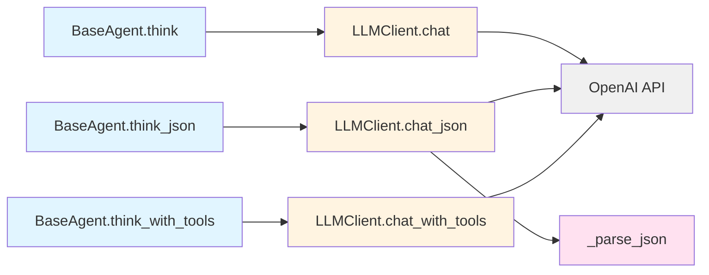
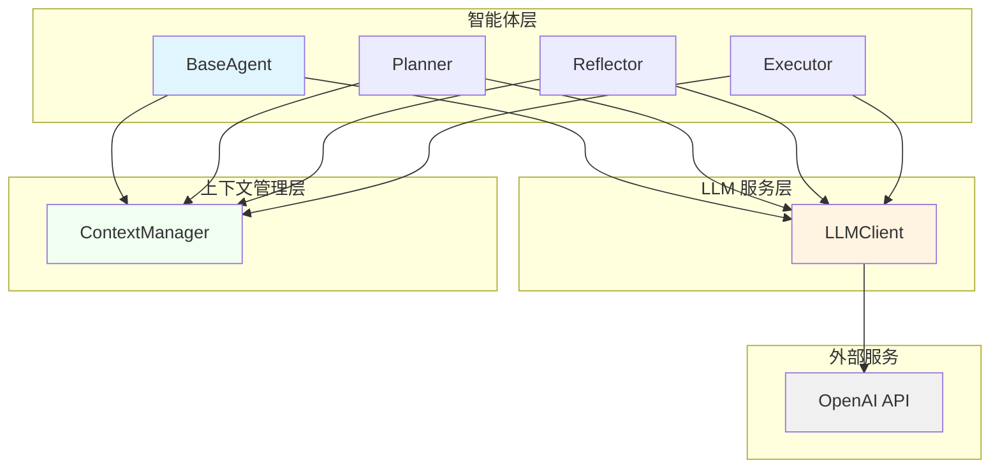
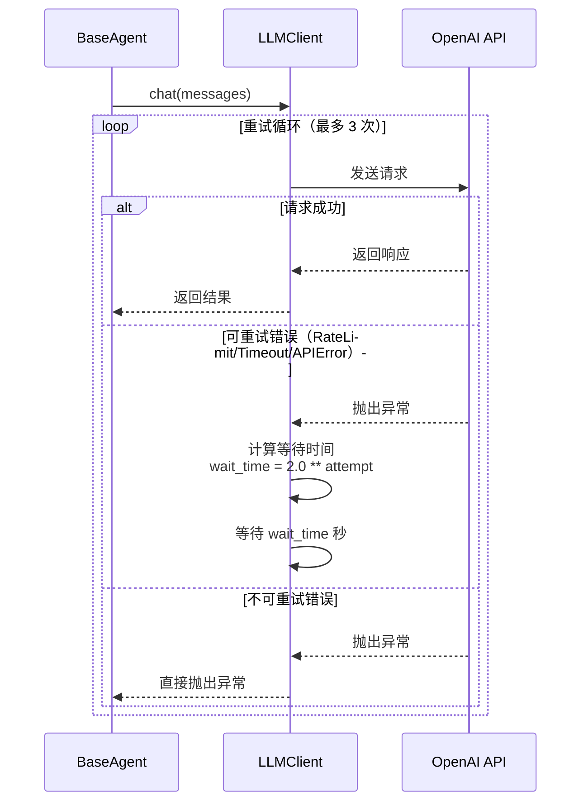

# Manus Demo - LLM 集成手册

> **版本**: v6（含重试机制 + ReActEngine Feature Flag）
> **更新日期**: 2026-04-20
> **目的**: 详解 LLM 客户端的设计、配置和使用

## 目录
1. [架构概览](#1-架构概览)
2. [LLMClient 详解](#2-llmclient-详解)
3. [v6 重试机制](#3-v6-重试机制)
4. [BaseAgent 集成](#4-baseagent-集成)
5. [三种调用模式](#5-三种调用模式)
6. [JSON 解析策略](#6-json-解析策略)
7. [配置参考](#7-配置参考)
8. [错误处理](#8-错误处理)
9. [性能优化](#9-性能优化)

---

## 1. 架构概览

### 调用链路



```
BaseAgent.think() → LLMClient.chat() → OpenAI API
BaseAgent.think_json() → LLMClient.chat_json() → OpenAI API → _parse_json()
BaseAgent.think_with_tools() → LLMClient.chat_with_tools() → OpenAI API (function calling)
```

### 组件关系图



---

## 2. LLMClient 详解

### 初始化

LLMClient 是对 OpenAI 兼容 API 的轻量异步封装，所有智能体共享同一个实例。

**参数说明**：
- `base_url`: OpenAI 兼容 API 的基础 URL（默认从 `config.LLM_BASE_URL` 读取）
- `api_key`: API 密钥（默认从 `config.LLM_API_KEY` 读取）
- `model`: 模型名称（默认从 `config.LLM_MODEL` 读取）
- `retry_enabled`: 是否启用重试机制（默认从 `config.LLM_RETRY_ENABLED` 读取）
- `max_retries`: 最大重试次数（默认从 `config.LLM_RETRY_MAX_ATTEMPTS` 读取）
- `backoff_factor`: 退避因子（默认从 `config.LLM_RETRY_BACKOFF_FACTOR` 读取）

**代码示例**：
```python
from llm.client import LLMClient

llm_client = LLMClient(
    base_url="https://api.deepseek.com/v1",
    api_key="your-api-key",
    model="deepseek-chat",
    retry_enabled=True,
    max_retries=3,
    backoff_factor=2.0
)
```

### chat() 方法

纯文本对话方法，返回 assistant 的文本响应。

**参数**：
- `messages`: 消息列表，格式为 `[{"role": "user", "content": "..."}]`
- `temperature`: 温度参数，控制输出随机性（默认 0.7）
- `max_tokens`: 最大生成 token 数（默认 4096）
- `**kwargs`: 其他传递给 OpenAI API 的参数

**返回值**：`str` - assistant 的文本响应

**使用场景**：反思、分析、汇总等需要自由文本输出的场景

**代码示例**：
```python
messages = [
    {"role": "system", "content": "你是一个 helpful assistant"},
    {"role": "user", "content": "帮我分析一下这个任务"}
]

response = await llm_client.chat(messages, temperature=0.7)
print(response)
```

### chat_with_tools() 方法

带工具调用的对话方法，使用 OpenAI 风格的 function calling。

**参数**：
- `messages`: 消息列表
- `tools`: 工具定义列表，OpenAI function calling 格式
- `temperature`: 温度参数（默认 0.7）
- `max_tokens`: 最大生成 token 数（默认 4096）
- `**kwargs`: 其他参数

**返回值**：原始响应消息对象，包含 `content` 和 `tool_calls`

**工具定义格式**：
```python
tools = [
    {
        "type": "function",
        "function": {
            "name": "search_web",
            "description": "在网络上搜索信息",
            "parameters": {
                "type": "object",
                "properties": {
                    "query": {"type": "string", "description": "搜索查询"}
                },
                "required": ["query"]
            }
        }
    }
]
```

**使用场景**：ReAct 循环执行，让 LLM 自主决策调用哪个工具

### chat_json() 方法

结构化 JSON 输出方法，强制 LLM 返回 JSON 格式响应。

**参数**：
- `messages`: 消息列表
- `temperature`: 温度参数（默认 0.3，较低温度保证结构化）
- `max_tokens`: 最大生成 token 数（默认 4096）
- `**kwargs`: 其他参数

**返回值**：`dict` - 解析后的 JSON 对象

**使用场景**：规划生成、分类判断等需要结构化输出的场景

**代码示例**：
```python
messages = [
    {"role": "system", "content": "你是一个计划生成器"},
    {"role": "user", "content": "为这个任务生成执行计划"}
]

plan = await llm_client.chat_json(messages, temperature=0.3)
print(plan)
```

---

## 3. v6 重试机制

### 设计动机

LLM API 的不稳定性是实际应用中的常见问题：
- **速率限制**：短时间内请求过多被限流
- **超时**：网络延迟或服务响应慢
- **临时错误**：服务端的临时故障

v6 引入的可选重试机制使用指数退避策略，有效避免雪崩效应，提高系统鲁棒性。

### 实现细节

**重试循环伪代码**：
```python
for attempt in range(max_retries + 1):
    try:
        response = await api_call()
        return response
    except RETRYABLE_ERRORS as exc:
        if attempt < max_retries:
            wait_time = backoff_factor ** attempt
            await asyncio.sleep(wait_time)
        else:
            raise
```

**等待时间计算**：
- `wait_time = backoff_factor ** attempt`
- 默认 `backoff_factor = 2.0`，即第 1 次等待 2s，第 2 次等待 4s，第 3 次等待 8s

**可重试错误类型**：
```python
RETRYABLE_ERRORS = (
    RateLimitError,    # 速率限制
    APITimeoutError,   # 请求超时
    APIError,          # 通用 API 错误
)
```

**不可重试错误**：认证错误、参数错误等，直接抛出异常

### 配置项

| 配置项 | 默认值 | 说明 |
|--------|--------|------|
| `LLM_RETRY_ENABLED` | `false` | 是否启用重试机制（向后兼容） |
| `LLM_RETRY_MAX_ATTEMPTS` | `3` | 最大重试次数 |
| `LLM_RETRY_BACKOFF_FACTOR` | `2.0` | 退避因子 |

**配置示例**：
```bash
# .env 文件
LLM_RETRY_ENABLED=true
LLM_RETRY_MAX_ATTEMPTS=5
LLM_RETRY_BACKOFF_FACTOR=1.5
```

### 重试时序图



---

## 4. BaseAgent 集成

### BaseAgent 类结构

所有专用智能体（Planner、Reflector、Executor）都继承自 BaseAgent。

**核心属性**：
- `name`: 智能体名称，用于日志标识
- `llm_client`: 共享的 LLM 客户端实例
- `context_manager`: 上下文管理器，处理 Token 超限压缩
- `system_prompt`: 系统提示词，定义智能体角色
- `_messages`: 消息历史列表

**初始化示例**：
```python
from agents.base import BaseAgent
from llm.client import LLMClient
from context.manager import ContextManager

llm_client = LLMClient()
context_manager = ContextManager()

agent = BaseAgent(
    name="Planner",
    system_prompt="你是一个任务规划专家...",
    llm_client=llm_client,
    context_manager=context_manager
)
```

### think() 方法

纯文本对话方法，自动处理上下文压缩。

**参数**：
- `user_input`: 用户输入文本
- `**kwargs`: 传递给 LLMClient.chat() 的参数

**返回值**：`str` - assistant 的文本响应

**代码示例**：
```python
response = await agent.think(
    "帮我分析一下这个任务的可行性",
    temperature=0.7
)
```

### think_json() 方法

结构化输出方法，返回 JSON 对象。

**参数**：
- `user_input`: 用户输入文本
- `**kwargs`: 传递给 LLMClient.chat_json() 的参数

**返回值**：`dict` - 解析后的 JSON 对象

**代码示例**：
```python
plan = await agent.think_json(
    "为这个任务生成执行计划",
    temperature=0.3
)
print(plan["steps"])
```

### think_with_tools() 方法

工具调用方法，返回原始响应消息对象。

**参数**：
- `user_input`: 用户输入文本
- `tools`: 工具定义列表
- `**kwargs`: 传递给 LLMClient.chat_with_tools() 的参数

**返回值**：原始响应消息对象，包含 `content` 和 `tool_calls`

**代码示例**：
```python
tools = [
    {
        "type": "function",
        "function": {
            "name": "search_web",
            "description": "搜索网络信息",
            "parameters": {
                "type": "object",
                "properties": {
                    "query": {"type": "string"}
                },
                "required": ["query"]
            }
        }
    }
]

response = await agent.think_with_tools(
    "帮我搜索最新的 AI 技术进展",
    tools=tools
)

if response.tool_calls:
    # 处理工具调用
    for tool_call in response.tool_calls:
        print(f"调用工具: {tool_call.function.name}")
        print(f"参数: {tool_call.function.arguments}")
```

### add_tool_result() 方法

将工具执行结果记录到消息历史中。

**参数**：
- `tool_call_id`: 工具调用 ID
- `result`: 工具执行结果文本

**代码示例**：
```python
agent.add_tool_result(
    tool_call_id="call_abc123",
    result="搜索结果：..."
)
```

### 消息管理

**add_message()**: 添加消息到历史
```python
agent.add_message("user", "这是一个用户消息")
agent.add_message("assistant", "这是一个助手消息")
```

**get_messages()**: 获取当前所有消息
```python
messages = agent.get_messages()
print(f"当前有 {len(messages)} 条消息")
```

**reset()**: 清空对话历史，保留 system prompt
```python
agent.reset()  # 执行新任务前调用
```

---

## 5. 三种调用模式

### 5.1 纯文本模式 (chat)

**使用场景**：
- 反思分析（Reflector 生成反馈）
- 上下文摘要（ContextManager 生成摘要）
- 自由文本对话

**示例代码**：
```python
messages = [
    {"role": "system", "content": "你是一个反思助手"},
    {"role": "user", "content": "分析以下执行结果：..."}
]

response = await llm_client.chat(messages, temperature=0.7)
print(response)
```

**特点**：
- 灵活性高，适合开放性任务
- 输出格式不受约束
- 适合需要创造性或解释性内容的场景

### 5.2 结构化输出模式 (chat_json)

**使用场景**：
- 规划生成（Planner 生成执行计划）
- 分类判断（任务类型分类）
- 评估结果（Reflector 生成评估分数）

**JSON Schema 约束**：
虽然 LLMClient.chat_json() 不直接接受 schema 参数，但可以在 system prompt 或 user message 中明确指定 JSON 结构要求。

**示例代码**：
```python
messages = [
    {
        "role": "system",
        "content": """你是一个计划生成器。输出必须符合以下 JSON 格式：
{
    "steps": [
        {"id": 1, "description": "...", "dependencies": []}
    ],
    "estimated_time": "..."
}"""
    },
    {"role": "user", "content": "为以下任务生成计划：..."}
]

plan = await llm_client.chat_json(messages, temperature=0.3)
print(plan["steps"])
```

**特点**：
- 强制 JSON 输出，便于程序解析
- 较低温度（0.3）保证结构稳定性
- 三种解析策略确保兼容性

### 5.3 工具调用模式 (chat_with_tools)

**使用场景**：
- ReAct 循环执行
- 需要调用外部工具的任务
- 多步骤推理和执行

**OpenAI Function Calling 格式**：
```python
tools = [
    {
        "type": "function",
        "function": {
            "name": "tool_name",
            "description": "工具描述",
            "parameters": {
                "type": "object",
                "properties": {
                    "param1": {
                        "type": "string",
                        "description": "参数描述"
                    }
                },
                "required": ["param1"]
            }
        }
    }
]
```

**调用结果解析**：
```python
response = await llm_client.chat_with_tools(messages, tools)

if response.content:
    print(f"文本回答: {response.content}")

if response.tool_calls:
    for tool_call in response.tool_calls:
        print(f"工具: {tool_call.function.name}")
        print(f"参数: {tool_call.function.arguments}")
        # 执行工具并记录结果
        result = execute_tool(
            tool_call.function.name,
            json.loads(tool_call.function.arguments)
        )
        agent.add_tool_result(tool_call.id, str(result))
```

**特点**：
- `tool_choice="auto"` 让 LLM 自主决定是否调用工具
- 返回原始消息对象，灵活处理
- 支持多工具并行调用

---

## 6. JSON 解析策略

### _parse_json() 静态方法

LLMClient._parse_json() 使用两种策略的降级处理（Two-strategy fallback），确保从各种 LLM 输出格式中成功提取 JSON。

**策略 1：直接解析**
```python
try:
    return json.loads(text)
except json.JSONDecodeError:
    pass  # 继续尝试其他策略
```

**适用场景**：LLM 直接输出纯 JSON 字符串

**策略 2：代码块提取**
```python
patterns = [
    r'```json\s*\n(.*?)\n```',  # ```json ... ```
    r'```\s*\n(.*?)\n```',      # ``` ... ```
]
for pattern in patterns:
    match = re.search(pattern, text, re.DOTALL)
    if match:
        return json.loads(match.group(1).strip())
```

**适用场景**：LLM 输出 Markdown 格式，JSON 包裹在代码块中

**降级处理**：
如果以上两种策略都失败，抛出 `ValueError` 异常，包含原始输出片段（前 300 字符）便于调试。

> [!TIP]
> **未来扩展**：可考虑增加第三种策略——花括号提取（brace extraction），用于处理 JSON 嵌入在文本中的场景（如 `re.search(r'\{.*\}', text, re.DOTALL)`）。当前版本未实现此策略。

**完整示例**：
```python
from llm.client import LLMClient

# 各种格式的 LLM 输出
examples = [
    '{"key": "value"}',  # 纯 JSON
    '```json\n{"key": "value"}\n```',  # Markdown 代码块
    '分析结果如下：\n```json\n{"key": "value"}\n```',  # 嵌入文本
]

for text in examples:
    try:
        result = LLMClient._parse_json(text)
        print(f"解析成功: {result}")
    except ValueError as e:
        print(f"解析失败: {e}")
```

---

## 7. 配置参考

所有 LLM 相关配置项的完整列表：

| 配置项 | 默认值 | 说明 | 示例 |
|--------|--------|------|------|
| `LLM_BASE_URL` | `https://api.deepseek.com/v1` | OpenAI 兼容 API 基础 URL | `https://api.openai.com/v1` |
| `LLM_API_KEY` | `""` | API 密钥（必须配置） | `sk-xxx...` |
| `LLM_MODEL` | `deepseek-chat` | 模型名称 | `gpt-4`, `qwen-turbo` |
| `LLM_TIMEOUT` | - | 请求超时时间（秒） | `60` |
| `LLM_TEMPERATURE` | - | 默认温度参数 | `0.7` |
| `LLM_MAX_TOKENS` | - | 默认最大 token 数 | `4096` |
| `LLM_RETRY_ENABLED` | `false` | 是否启用重试机制 | `true` |
| `LLM_RETRY_MAX_ATTEMPTS` | `3` | 最大重试次数 | `5` |
| `LLM_RETRY_BACKOFF_FACTOR` | `2.0` | 退避因子 | `1.5` |
| `ENABLE_REACT_ENGINE_V2` | `false` | 是否使用 ReActEngine V2 | `true` |

**配置文件示例** (.env)：
```bash
# LLM API 配置
LLM_BASE_URL=https://api.deepseek.com/v1
LLM_API_KEY=sk-your-api-key-here
LLM_MODEL=deepseek-chat

# 重试机制
LLM_RETRY_ENABLED=true
LLM_RETRY_MAX_ATTEMPTS=3
LLM_RETRY_BACKOFF_FACTOR=2.0

# 特性开关
ENABLE_REACT_ENGINE_V2=false
```

**代码中读取配置**：
```python
import config

print(f"API URL: {config.LLM_BASE_URL}")
print(f"Model: {config.LLM_MODEL}")
print(f"Retry Enabled: {config.LLM_RETRY_ENABLED}")
```

---

## 8. 错误处理

### 错误分类

**可重试错误**（v6 重试机制自动处理）：
- `RateLimitError`: 速率限制，通常等待后可恢复
- `APITimeoutError`: 请求超时，网络或服务端问题
- `APIError`: 通用 API 错误，包含临时故障

**不可重试错误**（直接抛出）：
- 认证错误：API Key 无效或过期
- 参数错误：请求参数格式不正确
- 权限错误：无权访问指定资源
- 配额超限：账户余额不足或配额用尽

### 最佳实践

**生产环境建议**：
```bash
# 启用重试机制
LLM_RETRY_ENABLED=true

# 根据实际业务调整重试次数
LLM_RETRY_MAX_ATTEMPTS=3

# 退避因子建议 1.5-2.0
LLM_RETRY_BACKOFF_FACTOR=2.0
```

**超时设置建议**：
- 简单任务：30-60 秒
- 复杂推理：60-120 秒
- 批量处理：根据任务量动态调整

**错误监控建议**：
```python
import logging

logger = logging.getLogger(__name__)

try:
    response = await llm_client.chat(messages)
except RateLimitError as e:
    logger.error(f"速率限制: {e}")
    # 实现降级策略或告警
except APITimeoutError as e:
    logger.error(f"请求超时: {e}")
    # 考虑增加超时时间或重试
except APIError as e:
    logger.error(f"API 错误: {e}")
    # 检查 API 状态或联系服务提供商
```

---

## 9. 性能优化

### Token 消耗优化

**系统提示词优化**：
- 使用简洁明确的描述
- 避免冗余的示例和说明
- 动态生成 prompt，根据任务调整

**上下文管理**：
```python
# 自动压缩旧消息
messages = await context_manager.compress_if_needed(
    messages,
    llm_client
)
```

**消息历史清理**：
- 定期调用 `agent.reset()` 清理历史
- 使用滑动窗口保留最近 N 条消息

### 延迟优化

**并发调用**：
```python
import asyncio

# 并发执行多个独立任务
tasks = [
    agent1.think("任务1"),
    agent2.think("任务2"),
    agent3.think("任务3")
]
results = await asyncio.gather(*tasks)
```

**缓存策略**：
- 对重复性查询结果进行缓存
- 使用内存缓存或 Redis 缓存

### 成本控制

**模型选择**：
- 简单任务使用便宜模型（如 `deepseek-chat`）
- 复杂任务使用强大模型（如 `gpt-4`）

**Token 限制**：
```python
# 限制输出 token 数
response = await llm_client.chat(
    messages,
    max_tokens=1000  # 根据需求调整
)
```

**批量处理优化**：
- 合并相似请求，减少 API 调用次数
- 使用批量 API（如果服务提供商支持）

---

## 附录

### 相关文档

- [README.md](../../README.md) - 项目总览
- [docs/llm-integration-v6.md](./llm-integration-v6.md) - v6 版本更新日志
- [agents/base.py](../../agents/base.py) - BaseAgent 源码
- [llm/client.py](../../llm/client.py) - LLMClient 源码

### 常见问题

**Q: 如何切换到其他 LLM 提供商？**
A: 修改 `.env` 文件中的 `LLM_BASE_URL` 和 `LLM_MODEL` 即可，无需修改代码。

**Q: 重试机制会影响性能吗？**
A: 只在发生错误时才会触发重试，正常请求不受影响。可以通过 `LLM_RETRY_ENABLED=false` 完全关闭。

**Q: 如何调试 JSON 解析失败？**
A: 捕获 `ValueError` 异常，查看错误消息中的原始输出片段，调整 prompt 引导 LLM 输出正确格式。

**Q: 支持哪些 LLM 提供商？**
A: 任何提供 OpenAI 兼容 API 的服务商，包括 DeepSeek、通义千问、Ollama、vLLM 等。

---

> **文档维护**: 本文档随代码更新而更新，如有疑问请参考源码或提交 Issue。
