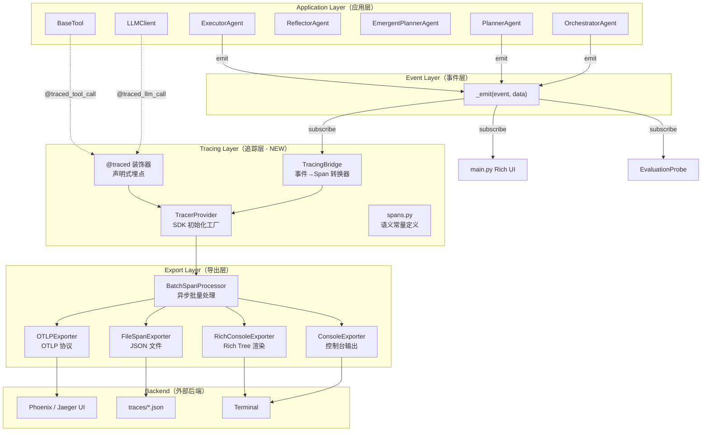
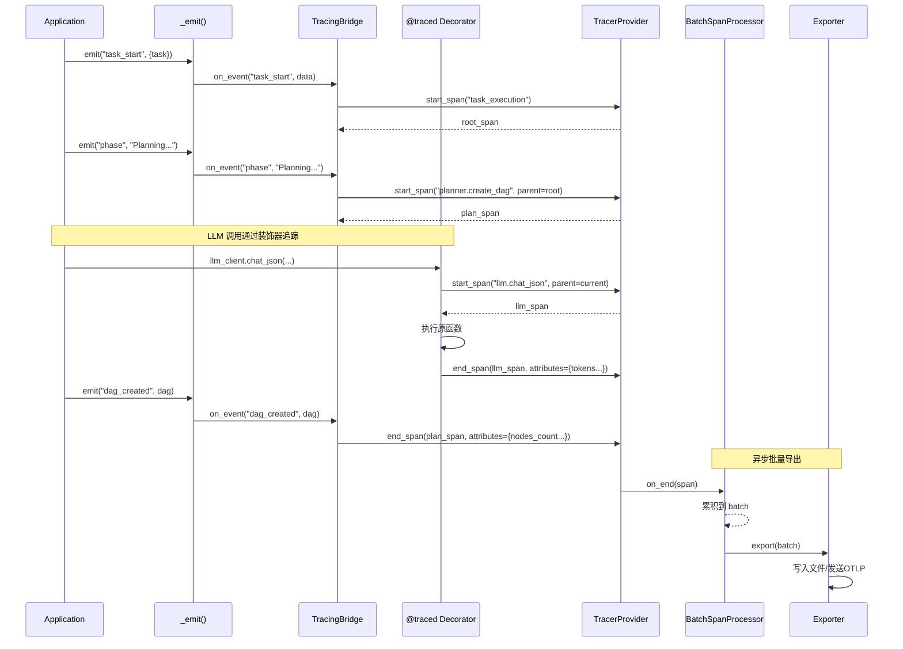
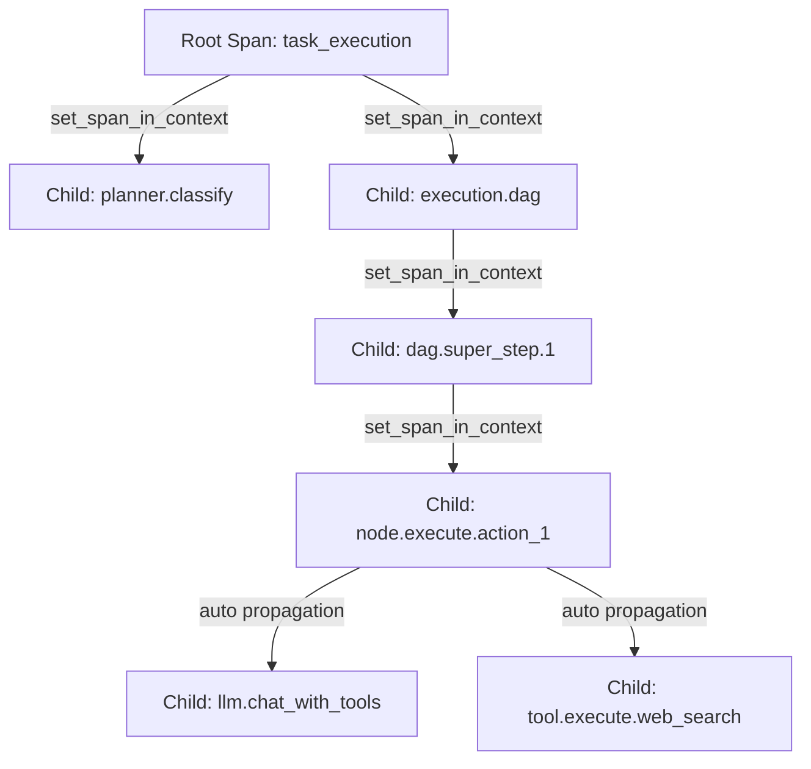

# 全链路 Tracing 模块设计文档

> 版本: v7.0  
> 日期: 2026-05-11  
> 状态: Draft

---

## 1. 需求分析

### 1.1 背景

当前 manus_demo 项目的可观察性基于轻量级内存事件回调（`_emit`/`on_event`），具有以下局限：

| 现状 | 局限 |
|------|------|
| 事件仅在内存中流转 | 进程结束后数据丢失，无法事后分析 |
| 扁平的事件流 | 缺乏结构化的 Span 层级和时间线 |
| UI 消费为主 | 无法进行 LLM 调用粒度的性能分析 |
| 无 Trace ID | 跨组件的因果关系无法追踪 |
| 同步回调 | 可能阻塞主执行流程 |

### 1.2 关键需求

#### 性能需求
- **零开销原则**：`TRACING_ENABLED=false` 时，模块不引入任何性能损耗（不创建 Span、不调用导出器）
- **异步导出**：Span 数据通过 BatchSpanProcessor 批量异步导出，不阻塞主执行路径
- **内存可控**：通过 `max_queue_size` 和 `max_export_batch_size` 限制内存使用
- **采样支持**：生产环境通过 `TRACING_SAMPLE_RATE` 控制采样率，降低开销

#### 准确性需求
- **完整生命周期覆盖**：从任务接收到最终响应，覆盖分类→规划→执行→反思全流程
- **因果关系正确**：Span 父子关系准确反映调用栈，并行执行的 Span 正确并列
- **时间精度**：Span 的 start_time 和 end_time 精度至少到毫秒级
- **属性完整**：LLM 调用记录 model、tokens、latency；工具调用记录 name、params、result

#### 易用性需求
- **零侵入集成**：参照 `EvaluationProbe` 模式，核心 Agent 代码零改动或极少改动
- **Feature Flag 控制**：通过环境变量一键开关，向后完全兼容
- **多后端支持**：开发时用 Console/File，生产时切换到 OTLP/Phoenix
- **声明式埋点**：通过装饰器 `@traced` 实现最少代码量的手动埋点
- **开箱即用**：默认配置即可使用，无需额外部署后端服务

### 1.3 非功能性需求

- **隐私保护**：默认不记录完整 prompt/response，通过 `TRACING_LOG_PROMPTS` 显式开启
- **属性截断**：所有属性值限制在 `TRACING_MAX_ATTRIBUTE_LENGTH` 字符以内
- **优雅降级**：Tracing 组件异常不影响主流程执行

---

## 2. 架构设计

### 2.1 整体架构



### 2.2 集成策略：双通道模式

本模块采用**双通道**策略同时获取追踪数据：

| 通道 | 机制 | 覆盖范围 | 优势 |
|------|------|---------|------|
| **事件桥接（Bridge）** | 订阅 `_emit` 事件流 | 高层级 Span（Task、Phase、DAG Super-step） | 零侵入，自动获取所有现有事件 |
| **装饰器（Decorators）** | `@traced_llm_call` / `@traced_tool_call` | 底层 Span（LLM 调用、工具调用） | 精确控制，记录详细属性 |

两个通道生成的 Span 通过 OpenTelemetry 的 **Context Propagation** 自动建立父子关系：
- Bridge 创建外层 Span（如 `dag.execution`）并设为当前 Context
- 装饰器创建内层 Span（如 `llm.chat`）时自动继承父 Span

### 2.3 Feature Flag 控制

```python
# config.py
TRACING_ENABLED = os.getenv("TRACING_ENABLED", "false").lower() == "true"
```

当 `TRACING_ENABLED=false` 时：
- `TracingBridge` 不被创建，事件回调不注册
- `@traced` 装饰器退化为 no-op（直接调用原函数）
- 不导入 `opentelemetry` 包（延迟导入）
- 完全不影响现有功能和性能

---

## 3. Span 层级设计

### 3.1 完整 Span 树

```
Trace: task_execution/{task_id}
│
├── Span: orchestrator.gather_context
│   ├── Span: memory.search
│   │   └── Attribute: memory.query, memory.results_count
│   └── Span: knowledge.retrieve
│       └── Attribute: knowledge.query, knowledge.results_count
│
├── Span: planner.classify_task
│   ├── Attribute: task.complexity_result, task.classification_method
│   └── Span: llm.chat (仅 LLM 兜底分类时)
│       └── Attribute: gen_ai.*, latency_ms
│
├── Span: planner.create_{plan_type}  (plan / dag / todo_list)
│   ├── Attribute: plan.type, plan.steps_count / plan.nodes_count
│   └── Span: llm.chat_json
│       └── Attribute: gen_ai.*, latency_ms
│
├── Span: execution.{mode}  (simple / dag / emergent)
│   │
│   ├── [DAG 路径]
│   │   ├── Span: dag.super_step.{n}
│   │   │   ├── Attribute: superstep.index, superstep.parallel_count
│   │   │   ├── Span: node.execute.{node_id}
│   │   │   │   ├── Attribute: node.type, node.description
│   │   │   │   ├── Span: react.iteration.{i}
│   │   │   │   │   ├── Span: llm.chat_with_tools
│   │   │   │   │   │   └── Attribute: gen_ai.request.model, gen_ai.usage.*
│   │   │   │   │   └── Span: tool.execute.{tool_name}
│   │   │   │   │       └── Attribute: tool.name, tool.parameters, tool.latency_ms
│   │   │   │   └── Span: react.iteration.{i+1}
│   │   │   └── Span: node.validate_exit_criteria
│   │   │       └── Attribute: exit_criteria.passed
│   │   └── Span: dag.super_step.{n+1}
│   │
│   ├── [Simple 路径]
│   │   └── Span: step.execute.{step_id}
│   │       ├── Span: react.iteration.{i}
│   │       │   ├── Span: llm.chat_with_tools
│   │       │   └── Span: tool.execute.{tool_name}
│   │       └── ...
│   │
│   └── [Emergent 路径]
│       └── Span: todo.execute.{todo_id}
│           ├── Attribute: todo.description, todo.retry_count
│           ├── Span: react.iteration.{i}
│           │   ├── Span: llm.chat_with_tools
│           │   └── Span: tool.execute.{tool_name}
│           └── ...
│
├── Span: reflector.reflect
│   ├── Attribute: reflection.passed, reflection.score
│   └── Span: llm.chat_json
│       └── Attribute: gen_ai.*
│
├── Span: adaptive_planning (v3, 若触发)
│   ├── Attribute: adaptation.action_count
│   └── Span: llm.chat_json
│
└── Span: memory.store
    └── Attribute: memory.entry_task_summary
```

### 3.2 Attribute 命名规范

遵循 [OpenTelemetry GenAI Semantic Conventions](https://opentelemetry.io/docs/specs/semconv/gen-ai/)：

| 类别 | Attribute Key | 示例值 |
|------|--------------|--------|
| **通用** | `task.id` | `"task_abc123"` |
| **通用** | `task.input` | `"搜索2024年AI论文"` (截断) |
| **通用** | `task.complexity` | `"complex"` |
| **LLM** | `gen_ai.system` | `"openai"` |
| **LLM** | `gen_ai.request.model` | `"deepseek-chat"` |
| **LLM** | `gen_ai.request.temperature` | `0.7` |
| **LLM** | `gen_ai.usage.input_tokens` | `150` |
| **LLM** | `gen_ai.usage.output_tokens` | `80` |
| **LLM** | `gen_ai.usage.total_tokens` | `230` |
| **Tool** | `tool.name` | `"web_search"` |
| **Tool** | `tool.parameters` | `{"query": "..."}` (JSON) |
| **Tool** | `tool.result_size` | `256` (bytes) |
| **Tool** | `tool.success` | `true` |
| **DAG** | `dag.total_nodes` | `8` |
| **DAG** | `dag.superstep_index` | `2` |
| **DAG** | `dag.parallel_count` | `3` |
| **Node** | `node.id` | `"action_1"` |
| **Node** | `node.type` | `"ACTION"` |
| **Node** | `node.status` | `"COMPLETED"` |
| **React** | `react.iteration` | `3` |
| **React** | `react.max_iterations` | `10` |

---

## 4. 核心组件设计

### 4.1 TracingBridge（事件桥接器）

```python
class TracingBridge:
    """
    将现有 _emit 事件流转换为 OpenTelemetry Spans。
    
    设计原则：
    - 维护 Span 栈实现父子关系
    - 事件映射表驱动，易于扩展
    - 异常安全，不影响主流程
    """
    
    def __init__(self):
        self._tracer = get_tracer("manus_demo.bridge")
        self._span_stack: list[Span] = []
        self._root_span: Span | None = None
    
    def on_event(self, event: str, data: Any) -> None:
        """事件入口，根据事件类型路由到对应的处理方法。"""
        ...
```

**事件到 Span 的映射规则**：

| 事件 | 动作 | Span 名称 |
|------|------|-----------|
| `task_start` | 创建 Root Span | `task_execution` |
| `phase` + "Gathering context" | 创建子 Span | `orchestrator.gather_context` |
| `task_complexity` | 结束分类 Span，记录属性 | — |
| `phase` + "Planning" | 创建子 Span | `planner.create_{type}` |
| `plan` / `dag_created` | 结束规划 Span，记录属性 | — |
| `phase` + "Executing" | 创建子 Span | `execution.{mode}` |
| `superstep` | 创建子 Span | `dag.super_step.{n}` |
| `node_running` | 创建子 Span | `node.execute.{id}` |
| `node_completed` / `node_failed` | 结束节点 Span | — |
| `phase` + "Reflecting" | 创建子 Span | `reflector.reflect` |
| `reflection` | 结束反思 Span，记录属性 | — |
| `task_complete` | 结束 Root Span | — |

### 4.2 装饰器系统

```python
def traced(span_name: str = "", attributes: dict = None):
    """
    通用追踪装饰器，支持同步和异步函数。
    
    当 TRACING_ENABLED=false 时退化为 no-op。
    
    Usage:
        @traced("planner.classify")
        async def classify_task(self, task: str) -> str: ...
    """
    
def traced_llm_call(func):
    """
    LLM 调用专用装饰器。
    自动记录: model, temperature, tokens, latency, retry_count
    """

def traced_tool_call(func):
    """
    工具调用专用装饰器。
    自动记录: tool_name, parameters, result_size, success, latency
    """
```

### 4.3 TracerProvider 工厂

```python
def init_tracing() -> None:
    """
    初始化 OpenTelemetry TracerProvider。
    
    根据 TRACING_BACKEND 配置选择导出器：
    - "console": ConsoleSpanExporter（内置）
    - "file": FileSpanExporter（自定义，输出 JSON）
    - "rich": RichConsoleExporter（自定义，Rich Tree）
    - "otlp": OTLPSpanExporter（标准 OTLP 协议）
    - "phoenix": OTLPSpanExporter + Phoenix 端点
    """

def get_tracer(name: str) -> Tracer:
    """获取命名 Tracer 实例。"""
```

### 4.4 自定义导出器

#### FileSpanExporter

将完成的 Span 以 JSON 格式写入文件，每个 Trace 一个文件：

```json
{
  "trace_id": "abc123...",
  "spans": [
    {
      "span_id": "span_001",
      "parent_span_id": null,
      "name": "task_execution",
      "start_time": "2026-05-11T10:30:00.000Z",
      "end_time": "2026-05-11T10:30:15.234Z",
      "attributes": {"task.id": "...", "task.complexity": "complex"},
      "events": [],
      "status": "OK"
    },
    ...
  ]
}
```

#### RichConsoleExporter

实时渲染 Span 树到终端（开发调试用）：

```
🔍 Trace: task_execution (15.2s)
├── 📋 orchestrator.gather_context (0.3s)
│   ├── 🧠 memory.search (0.1s) [results: 2]
│   └── 📚 knowledge.retrieve (0.2s) [results: 3]
├── 🏷️ planner.classify_task (0.8s) [result: complex]
├── 📐 planner.create_dag (2.1s) [nodes: 6]
├── ⚡ execution.dag (10.5s)
│   ├── 🔄 dag.super_step.1 (4.2s) [parallel: 2]
│   │   ├── 🎯 node.execute.action_1 (3.8s) ✅
│   │   └── 🎯 node.execute.action_2 (4.1s) ✅
│   └── 🔄 dag.super_step.2 (6.3s) [parallel: 1]
│       └── 🎯 node.execute.action_3 (6.1s) ✅
├── 🪞 reflector.reflect (1.2s) [passed: true, score: 0.85]
└── 💾 memory.store (0.05s)
```

---

## 5. 数据流

### 5.1 Tracing 数据流



### 5.2 Context Propagation



关键实现：
- Bridge 创建 Span 后，通过 `context.attach()` 将其注入当前 asyncio Task 的 Context
- 装饰器创建子 Span 时，自动从当前 Context 获取 parent
- asyncio.gather 中的并行任务通过 `context.copy()` 保持独立的 Context 链

---

## 6. 与现有系统的集成

### 6.1 对 Orchestrator 的改动（最小化）

```python
# agents/orchestrator.py
class OrchestratorAgent:
    def __init__(self, ..., on_event=None):
        ...
        # NEW: 初始化 Tracing Bridge（仅当启用时）
        if config.TRACING_ENABLED:
            from tracing import TracingBridge, init_tracing
            init_tracing()  # 初始化 TracerProvider（幂等）
            self._tracing_bridge = TracingBridge()
            # 多播模式：事件同时发送给原始回调 + Bridge
            original = on_event or (lambda *_: None)
            self._on_event = self._make_multicast(original, self._tracing_bridge.on_event)
        else:
            self._on_event = on_event or (lambda *_: None)
    
    @staticmethod
    def _make_multicast(*callbacks):
        def multicast(event, data=None):
            for cb in callbacks:
                try:
                    cb(event, data)
                except Exception:
                    pass
        return multicast
```

### 6.2 对 LLMClient 的改动

```python
# llm/client.py
from tracing.decorators import traced_llm_call

class LLMClient:
    @traced_llm_call
    async def chat(self, messages, temperature=0.7, max_tokens=4096, **kwargs):
        ...  # 原有逻辑不变
    
    @traced_llm_call
    async def chat_with_tools(self, messages, tools, ...):
        ...  # 原有逻辑不变
    
    @traced_llm_call
    async def chat_json(self, messages, ...):
        ...  # 原有逻辑不变
```

### 6.3 对 BaseTool 的改动

```python
# tools/base.py
from tracing.decorators import traced_tool_call

class BaseTool(ABC):
    @traced_tool_call
    async def execute(self, **kwargs):
        ...  # 原有逻辑不变（由子类实现）
```

> [!NOTE]
> 由于 `BaseTool.execute` 是抽象方法，装饰器实际应用在调用层而非定义层。
> 具体方案：在 `ExecutorAgent._call_tool()` 或 `ReActEngine._execute_tool()` 中包装调用。

---

## 7. 隐私与安全

| 控制项 | 配置 | 默认值 | 说明 |
|--------|------|--------|------|
| Prompt 记录 | `TRACING_LOG_PROMPTS` | `false` | 关闭时 prompt/response 不记录 |
| 属性截断 | `TRACING_MAX_ATTRIBUTE_LENGTH` | `1000` | 超长属性自动截断 |
| API Key 过滤 | 内置 | — | 自动检测并脱敏包含 key/secret/token 的属性 |
| 采样 | `TRACING_SAMPLE_RATE` | `1.0` | 生产环境建议设为 0.1~0.3 |

---

## 8. 配置参考

### 8.1 环境变量

| 变量名 | 默认值 | 说明 |
|--------|--------|------|
| `TRACING_ENABLED` | `false` | 总开关 |
| `TRACING_BACKEND` | `console` | 导出后端：`console` / `file` / `rich` / `otlp` / `phoenix` |
| `TRACING_ENDPOINT` | `http://localhost:4318` | OTLP HTTP 端点 |
| `TRACING_SERVICE_NAME` | `manus-demo` | 服务标识 |
| `TRACING_SAMPLE_RATE` | `1.0` | 采样率 (0.0-1.0) |
| `TRACING_LOG_PROMPTS` | `false` | 是否记录完整 prompt |
| `TRACING_MAX_ATTR_LENGTH` | `1000` | 属性值最大字符数 |

### 8.2 使用示例

```bash
# 开发调试：Rich 控制台渲染
TRACING_ENABLED=true TRACING_BACKEND=rich python main.py

# 离线分析：输出 JSON 文件
TRACING_ENABLED=true TRACING_BACKEND=file python main.py

# 对接 Phoenix UI
TRACING_ENABLED=true TRACING_BACKEND=phoenix TRACING_ENDPOINT=http://localhost:6006/v1/traces python main.py

# 对接 Jaeger/其他 OTLP 后端
TRACING_ENABLED=true TRACING_BACKEND=otlp TRACING_ENDPOINT=http://localhost:4318 python main.py
```

---

## 9. 依赖

### 9.1 新增 Python 包

```
opentelemetry-api>=1.27.0         # OTel API 层（轻量，仅定义接口）
opentelemetry-sdk>=1.27.0         # OTel SDK 层（TracerProvider, Processors）
opentelemetry-exporter-otlp>=1.27.0  # OTLP 协议导出器
```

### 9.2 为何选择 OpenTelemetry

| 考量因素 | OpenTelemetry | LangFuse | Arize Phoenix |
|---------|--------------|----------|---------------|
| **标准化** | ✅ CNCF 标准 | ❌ 私有协议 | ✅ 基于 OTel |
| **Vendor Lock-in** | ✅ 无 | ❌ 有 | ✅ 无 |
| **本地使用** | ✅ Console/File | ❌ 需服务 | ✅ 本地 UI |
| **生态集成** | ✅ 所有 APM | ❌ 仅自身 | ✅ 通过 OTel |
| **代码侵入** | ✅ 低 | ⚠️ 中 | ✅ 低 |
| **学习成本** | ⚠️ 中等 | ✅ 低 | ✅ 低 |

选择 OpenTelemetry 作为核心标准，确保最大灵活性。用户可后续自行对接 LangFuse 或 Phoenix 作为可视化后端。

---

## 10. 文件清单

| 文件路径 | 类型 | 职责 |
|---------|------|------|
| `tracing/__init__.py` | NEW | 模块入口，导出公共 API |
| `tracing/config.py` | NEW | Tracing 配置常量 |
| `tracing/provider.py` | NEW | TracerProvider 工厂 |
| `tracing/spans.py` | NEW | Span 名称和 Attribute 键名常量 |
| `tracing/decorators.py` | NEW | 声明式埋点装饰器 |
| `tracing/bridge.py` | NEW | 事件桥接器 |
| `tracing/exporters.py` | NEW | 自定义导出器 |
| `config.py` | MODIFY | 新增 Tracing 环境变量 |
| `requirements.txt` | MODIFY | 新增 OTel 依赖 |
| `.env.example` | MODIFY | 新增 Tracing 配置示例 |
| `agents/orchestrator.py` | MODIFY | 初始化 Bridge + 多播 |
| `llm/client.py` | MODIFY | LLM 调用埋点 |
| `tools/base.py` | MODIFY | 工具调用埋点 |
| `tests/test_tracing.py` | NEW | 单元测试 |
