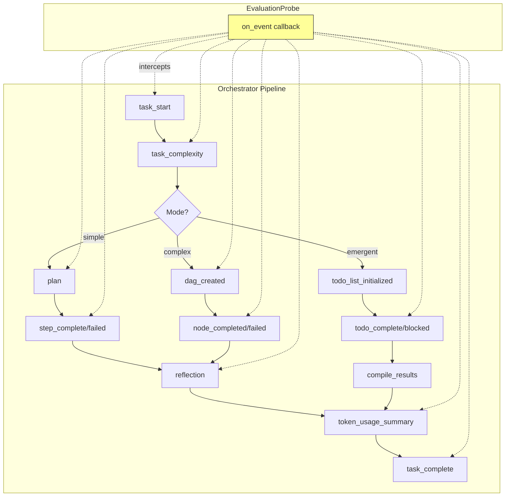
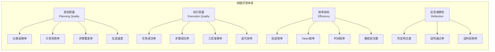
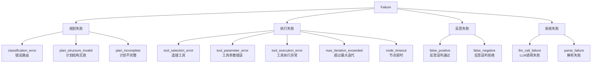
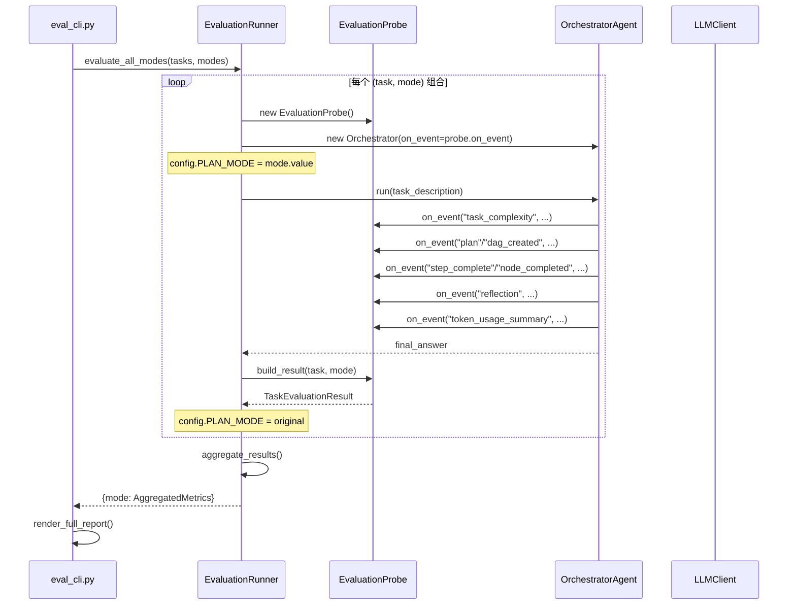
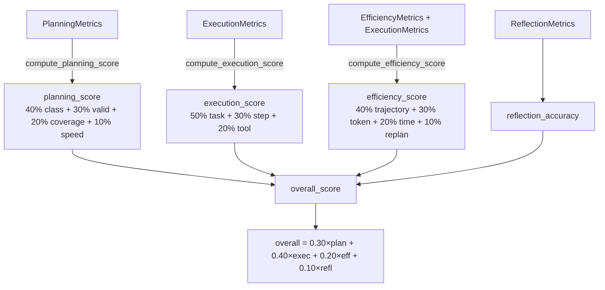

# Manus Demo 评测系统实施方案

> **版本**: v1.0
> **更新日期**: 2026-05-11
> **目的**: 为三种 plan-and-execute 规划范式设计并实现量化精准评测功能

---

## 目录

- [1. 背景与动机](#1-背景与动机)
- [2. 业界评测实践调研](#2-业界评测实践调研)
- [3. 现状分析：三种规划范式的可观测性缺口](#3-现状分析三种规划范式的可观测性缺口)
- [4. 评测指标体系设计](#4-评测指标体系设计)
- [5. 评测基准数据集设计](#5-评测基准数据集设计)
- [6. 系统架构设计](#6-系统架构设计)
- [7. 模块详细设计](#7-模块详细设计)
- [8. 使用方式](#8-使用方式)
- [9. 扩展计划](#9-扩展计划)
- [附录](#附录)

---

## 1. 背景与动机

### 1.1 问题陈述

Manus Demo v6.0 实现了三种 plan-and-execute 规划范式：

| 范式 | 版本 | 核心机制 | 适用场景 |
|------|------|---------|---------|
| **Simple** | v1 | 扁平 Plan → 顺序 ReAct 执行 → Reflector | 单步骤/简单任务 |
| **Complex** | v2 | 分层 DAG → Super-step 并行执行 → 逐节点验证 | 多步骤/有依赖/需并行 |
| **Emergent** | v5 | Claude Code 风格 TODO 列表 → while(tool_use) 循环 | 探索性/迭代发现任务 |

**核心问题**：目前缺少系统化的评测机制，无法量化回答以下问题：

1. 三种范式各自在什么任务上表现最好？
2. 两阶段分类器（规则 + LLM）的路由准确率是多少？
3. LLM 生成的计划质量如何（步骤覆盖、结构有效性）？
4. 执行效率（Token、迭代次数、耗时）的差异有多大？
5. Reflector 的 pass/fail 判定与实际结果的吻合度如何？

### 1.2 目标

设计并实现一个**针对性评测模块**，满足：

- **可量化**：数值化指标取代主观判断
- **可对比**：三种范式在相同基准上直接对比
- **可复现**：基准数据集固定、配置可快照
- **可扩展**：新增指标、任务、维度成本低
- **无侵入**：不修改核心执行路径

---

## 2. 业界评测实践调研

### 2.1 主要评测基准框架

通过调研 2024-2026 年发表的 Agent 评测论文和开源框架，以下是对本项目最具参考价值的成果：

#### AgentBench (ICLR 2024)

- **来源**: [arXiv 2308.03688](https://arxiv.org/abs/2308.03688)
- **核心**: 首个多环境 LLM-as-Agent 评测基准，覆盖 8 个环境（OS、数据库、知识图谱、Web 等）
- **参考价值**: 多维度评测方法论——不局限于单一指标，而是在多个独立环境中分别评估

#### AgentEval (ACL 2026 Industry Track)

- **来源**: [arXiv 2604.23581](https://arxiv.org/abs/2604.23581)
- **核心**: DAG 结构化步骤级评测，追踪错误传播链
- **关键发现**:
  - 步骤级评测比端到端评测的**失败检测召回率高 2.17 倍**（0.89 vs 0.41）
  - 与人类专家的 Cohen's kappa = 0.84
  - 3 级 21 子类的失败分类体系
- **参考价值**: 步骤级评测 + 错误传播追踪 + 失败分类法

#### SWE-bench (ICLR 2024)

- **来源**: [arXiv 2310.06770](https://arxiv.org/abs/2310.06770)
- **核心**: 2,294 个真实 GitHub issue + PR 对，执行级验证（运行测试套件判定通过）
- **参考价值**: 执行级验证思想——不依赖人工标注，而是通过运行时结果判定

#### Odysseys (2025)

- **来源**: [arXiv 2604.24964](https://arxiv.org/abs/2604.24964)
- **核心**: 200 个长时序 Web 任务，引入 **Trajectory Efficiency** 指标
- **公式**: `Trajectory_Efficiency = rubric_score / num_steps`
- **参考价值**: 轨迹效率指标——不只看是否成功，还看用了多少步

#### Plan-RewardBench (ACL 2026)

- **来源**: [arXiv 2604.08178](https://arxiv.org/abs/2604.08178)
- **核心**: 轨迹级偏好基准，四个评测维度
  - Safety Refusal（安全拒绝）
  - Tool-Irrelevance（工具无关性）
  - Complex Planning（复杂规划）
  - Robust Error Recovery（错误恢复鲁棒性）
- **参考价值**: 多维度评测框架 + 错误恢复专门评估

#### ELHPlan (2026)

- **来源**: [arXiv 2509.24230](https://arxiv.org/abs/2509.24230)
- **核心**: 高效长时序规划，Token 效率指标
- **关键发现**: 在保持相当成功率的前提下，仅消耗 SOTA 方法 30-40% 的 Token
- **参考价值**: Token 效率是规划范式对比的关键维度

#### WorkBench (2025)

- **来源**: [arXiv 2405.00823](https://arxiv.org/abs/2405.00823)
- **核心**: 首个 outcome-centric 评测数据集
- **参考价值**: 结果导向评测——关注最终输出是否正确，而非过程是否匹配

#### SLATE (2025)

- **来源**: [arXiv 2604.12126](https://arxiv.org/abs/2604.12126)
- **核心**: 承认多种有效执行路径的存在，不以单一参考答案为准
- **参考价值**: 柔性匹配——评测应接受多种正确路径

### 2.2 通用评测指标汇总

| 指标类别 | 具体指标 | 来源 |
|---------|---------|------|
| 任务成功率 | Task Success Rate, Pass@k, Solved@<=N | AgentBench, SWE-bench |
| 步骤级质量 | Step Success Rate, Progress Ratio | LongCLI-Bench, WorkBench |
| 计划质量 | Plan Validity, Step Coverage, F1 | Tool-Aware Planning, FIRE-Bench |
| 效率 | Trajectory Efficiency, CPS, Token Efficiency | Odysseys, ELHPlan, SLM Survey |
| 工具使用 | Tool Accuracy, PEA, Schema Validity Rate | GeoAgentBench, SLM Survey |
| 鲁棒性 | Replan Frequency, Error Recovery Rate | Plan-RewardBench |
| 反思/验证 | Reflection Accuracy, FP/FN Rate | AgentEval |
| 安全性 | Safe Success Rate, NRP | ResponsibleRobotBench, MSB |

### 2.3 对本项目的启示

综合调研结论，对 Manus Demo 评测设计的关键启示：

1. **多维度评测优于单一指标**（AgentBench/AgentEval 的核心教训）
2. **步骤级追踪比端到端判定信息量高 2x+**（AgentEval 量化验证）
3. **效率指标不可忽视**——Token 和时间成本是范式选择的关键因素（ELHPlan）
4. **失败分类比失败计数更有价值**——需要知道"为什么失败"而不只是"失败了"（AgentEval 21 子类）
5. **接受多路径正确**——不强制匹配单一参考答案（SLATE）
6. **反思判定需要独立验证**——Reflector 的 FP/FN 率是独立评估维度（Plan-RewardBench）

---

## 3. 现状分析：三种规划范式的可观测性缺口

### 3.1 已有的可观测性

```
当前系统已有的事件流（Orchestrator._emit）：

task_start → phase("Gathering context") → memory → knowledge
  → task_complexity → phase("Planning") → plan / dag_created / todo_list_initialized
    → [执行阶段事件] → phase("Reflecting") → reflection
      → token_usage_summary → task_complete
```

| 事件 | 当前数据 | 评测可用性 |
|------|---------|-----------|
| `task_complexity` | `{complexity, task}` | ✅ 可判定分类准确率 |
| `plan` | Plan 对象（steps 列表） | ✅ 可提取步骤数 |
| `dag_created` | TaskDAG 对象（nodes/edges） | ✅ 可提取节点数、环检测 |
| `step_complete/failed/skipped` | Step + StepResult | ✅ 可提取步骤成功率 |
| `node_completed/failed` | TaskNode + StepResult | ✅ 可提取节点成功率 + 工具日志 |
| `todo_complete/blocked` | TodoItem | ✅ 可提取 TODO 完成率 |
| `reflection` | Reflection(passed, score, feedback) | ✅ 可对比 GT 判定 FP/FN |
| `token_usage_summary` | TokenUsageSummary | ✅ 可提取 Token 消耗 |
| `plan_adaptation` | AdaptationResult | ✅ 可统计自适应规划次数 |

### 3.2 缺失的可观测性

| 缺失项 | 影响 | 解决方案 |
|--------|------|---------|
| 无参考答案（Ground Truth） | 无法量化计划覆盖率和任务成功率 | 设计 benchmark 数据集 |
| 无工具级准确率追踪 | 不知道工具选择是否合理 | 从 StepResult.tool_calls_log 提取 |
| 无计划生成耗时 | 不知规划阶段效率 | 探针记录时间戳 |
| 无跨模式对比机制 | 三种模式各自运行、无法直接比较 | EvaluationRunner 统一入口 |
| 无失败分类 | 只知道"失败"不知道"为什么" | 设计 FailureCategory 枚举 |
| 无反思准确性验证 | Reflector 的 passed 可能是 FP/FN | GT 对比判定 |

### 3.3 事件挂载点分析



**关键设计决策**：评测探针通过 `on_event` 回调挂载，**零修改**核心代码。每次评测运行时注入探针，运行结束后提取数据。

---

## 4. 评测指标体系设计

### 4.1 指标总览

基于调研结果和系统特点，设计四维度评测体系：



### 4.2 规划质量指标

| 指标 | 公式 | 评分权重 | 数据来源 |
|------|------|---------|---------|
| 分类准确率 | `classification_correct ? 1 : 0` | 40% | `task_complexity` 事件 vs GT |
| 计划有效率 | `plan_structure_valid ? 1 : 0` | 30% | DAG 环检测 / Plan 解析 |
| 步骤覆盖率 | `\|covered_subtasks\| / \|expected_subtasks\|` | 20% | 输出 vs GT.expected_subtasks |
| 生成速度 | `max(0, 1 - time_ms / 10000)` | 10% | 探针时间戳差 |

**规划评分公式**：
```
planning_score = 0.4 × classification_accuracy
               + 0.3 × plan_validity
               + 0.2 × step_coverage_ratio
               + 0.1 × speed_bonus
```

### 4.3 执行质量指标

| 指标 | 公式 | 评分权重 | 数据来源 |
|------|------|---------|---------|
| 任务成功率 | `task_success ? 1 : 0` | 50% | 最终输出 vs GT.must_include_keywords |
| 步骤成功率 | `steps_completed / total_steps` | 30% | step/node 事件统计 |
| 工具准确率 | `successful_tool_calls / total_tool_calls` | 20% | ToolCallRecord 统计 |

**执行评分公式**：
```
execution_score = 0.5 × task_success
               + 0.3 × step_success_rate
               + 0.2 × tool_accuracy
```

### 4.4 效率指标

| 指标 | 公式 | 评分权重 | 说明 |
|------|------|---------|------|
| 轨迹效率 | `1 - (iters_per_step - 1) / 9` | 40% | 参考 Odysseys |
| Token 效率 | `max(0, 1 - log10(tokens) / 5)` | 30% | 参考 ELHPlan |
| 时间效率 | `max(0, 1 - time_ms / 120000)` | 20% | < 5s 优秀, > 120s 差 |
| 重规划惩罚 | `1 - replan_count × 0.33` | 10% | 每次重规划扣 33% |

**效率评分公式**：
```
efficiency_score = 0.4 × trajectory_efficiency
                + 0.3 × token_efficiency
                + 0.2 × time_efficiency
                + 0.1 × (1 - replan_penalty)
```

### 4.5 反思准确性指标

| 指标 | 公式 | 说明 |
|------|------|------|
| 判定吻合度 | `reflection_passed == gt_success ? 1 : 0` | 最核心指标 |
| 误判通过率 (FP) | `FP_count / total_evaluated` | 反思通过但 GT 认为失败 |
| 误判拒绝率 (FN) | `FN_count / total_evaluated` | 反思拒绝但 GT 认为成功 |

### 4.6 综合评分公式

```
overall_score = 0.30 × planning_score
              + 0.40 × execution_score
              + 0.20 × efficiency_score
              + 0.10 × reflection_accuracy
```

**权重设计理由**：

- 执行质量 (40%) 最高——任务是否完成是首要评判标准
- 规划质量 (30%) 次之——好的计划是成功的一半
- 效率 (20%) 第三——在成功的前提下追求效率
- 反思准确性 (10%) 加成——独立验证反思系统的可靠度

### 4.7 失败分类体系

参考 AgentEval 的 3 级 21 子类，精简为 10 个类别：



---

## 5. 评测基准数据集设计

### 5.1 设计原则

| 原则 | 依据 | 实现方式 |
|------|------|---------|
| 结果导向评测 | WorkBench | GT 关注最终输出是否正确 |
| 接受多路径正确 | SLATE | 步骤覆盖率用模糊匹配，不强求精确匹配 |
| 分级难度 | AgentBench | easy/medium/hard 三级 |
| 工具覆盖 | ToolBench | 确保每种工具组合都有任务 |
| 分类标签 | Plan-RewardBench | 每个任务标注期望分类 |

### 5.2 任务分布

| 难度 | 数量 | 期望分类 | 工具组合 | 设计意图 |
|------|------|---------|---------|---------|
| Easy | 4 | simple | search / code / file / shell（各 1 个） | 单步骤、单工具、直接回答 |
| Medium | 4 | complex | search+code / code+file（多步骤依赖） | 2-5 步骤、序列依赖、多工具 |
| Hard | 4 | complex/emergent | search+code+file / code+search（探索性） | 4-8 步骤、并行/探索、动态发现 |

### 5.3 Ground Truth 结构

每个任务包含以下参考信息：

```python
class GroundTruth:
    expected_complexity: str             # simple / complex / emergent
    expected_step_count_range: tuple     # (min, max) 合理步骤数范围
    expected_tools: list[str]            # 期望使用的工具列表
    expected_subtasks: list[str]         # 期望覆盖的子任务描述
    success_criteria: str                # 自然语言成功判定标准
    must_include_keywords: list[str]     # 输出必须包含的关键词
    must_not_include: list[str]          # 输出不应包含的内容
    reference_output: str                # 参考输出（可选）
```

### 5.4 具体任务清单

#### Easy 级别（预期分类: simple）

| ID | 任务描述 | 期望工具 | 成功标准 |
|----|---------|---------|---------|
| easy_001 | 搜索一下今天的天气 | web_search | 包含"天气" |
| easy_002 | Calculate the factorial of 10 using Python | execute_python | 包含"3628800" |
| easy_003 | Write 'Hello World' to a file named test_output.txt | file_ops | 文件写入成功 |
| easy_004 | 列出当前目录下的所有文件 | shell | 返回文件列表 |

#### Medium 级别（预期分类: complex）

| ID | 任务描述 | 期望工具 | 核心特征 |
|----|---------|---------|---------|
| medium_001 | 搜索Python和JavaScript的区别，然后用代码演示列表操作差异 | search + code | 2 步序列依赖 |
| medium_002 | Research Tokyo population, write density calculator, test it | search + code | 3 步序列依赖 |
| medium_003 | 创建CSV成绩数据→Python计算平均分→保存结果 | file + code | 3 步管道流 |
| medium_004 | Generate random numbers → save to file → compute stats | code + file | 3 步管道流 |

#### Hard 级别（预期分类: complex/emergent）

| ID | 任务描述 | 期望工具 | 核心特征 |
|----|---------|---------|---------|
| hard_001 | 研究AI趋势→分析技术方向→生成报告→保存→搜索论文 | search+code+file | 5 步并行+序列混合 |
| hard_002 | 调研Web框架对比→写FastAPI示例→测试运行 | search+code+shell | 探索性+迭代 |
| hard_003 | 探索文本分类方法→实现→测试→优化 | code+search | 迭代优化 |
| hard_004 | 设计学生成绩管理系统（添加/录入/排名/导出CSV） | code+file | 复杂设计+多功能 |

---

## 6. 系统架构设计

### 6.1 模块结构

```
evaluation/
├── __init__.py          # 模块说明，参考论文索引
├── metrics.py           # 核心指标定义与计算（~400 行）
│   ├── 枚举: PlanMode, TaskDifficulty, FailureCategory
│   ├── 指标模型: PlanningMetrics, ExecutionMetrics, EfficiencyMetrics, ReflectionMetrics
│   ├── 结果模型: TaskEvaluationResult, AggregatedMetrics
│   └── 计算函数: compute_*_score(), aggregate_results()
├── benchmark.py         # 基准任务定义（~250 行）
│   ├── GroundTruth: 参考答案模型
│   ├── BenchmarkTask: 任务+GT 模型
│   ├── BENCHMARK_TASKS: 12 个内置任务
│   └── get_benchmark_tasks(): 按条件筛选
├── runner.py            # 评测执行器（~350 行）
│   ├── EvaluationProbe: 事件探针（挂载到 Orchestrator）
│   └── EvaluationRunner: 评测编排（创建 Orchestrator → 运行 → 收集）
├── report.py            # 报告生成（~300 行）
│   ├── render_comparison_table(): 三模式对比表
│   ├── render_mode_detail(): 单模式详情
│   ├── render_summary_tree(): 树形总览
│   ├── export_json(): JSON 导出
│   └── render_full_report(): 完整报告
└── eval_cli.py          # CLI 入口（~120 行）
    ├── --modes: 指定规划模式
    ├── --difficulty: 按难度筛选
    ├── --tasks: 指定任务 ID
    ├── --output: JSON 导出路径
    └── --dry-run: 预览任务列表

tests/
└── test_evaluation.py   # 28 个单元测试（无需 LLM API）
```

### 6.2 数据流



### 6.3 关键设计决策

| 决策 | 选择 | 理由 |
|------|------|------|
| 数据采集方式 | 事件回调探针 | 无侵入、不修改核心代码、复用已有事件系统 |
| 模式控制 | 运行时覆盖 `config.PLAN_MODE` | 与现有配置机制一致、最小化改动 |
| 评测粒度 | 任务级 + 步骤级 | 任务级看总体、步骤级定位瓶颈 |
| GT 匹配策略 | 关键词包含 + 模糊覆盖 | 参考 SLATE，接受多路径正确 |
| 评分体系 | 加权线性组合 | 可解释、可调参、维度独立 |
| 聚合方式 | 均值聚合 | 简单直观，后续可扩展中位数/分位数 |

---

## 7. 模块详细设计

### 7.1 metrics.py — 指标计算核心

#### 数据模型层次

```
TaskEvaluationResult (单个任务 × 单个模式的评测结果)
├── planning: PlanningMetrics
│   ├── classified_complexity / expected_complexity
│   ├── classification_correct
│   ├── plan_step_count / plan_has_cycle / plan_structure_valid
│   ├── plan_generation_time_ms
│   └── step_coverage_ratio
├── execution: ExecutionMetrics
│   ├── total_steps_planned / steps_completed / steps_failed / steps_skipped
│   ├── step_success_rate / task_success
│   ├── total_tool_calls / successful_tool_calls / tool_accuracy
│   └── total_react_iterations / avg_iterations_per_step
├── efficiency: EfficiencyMetrics
│   ├── total_tokens / tokens_by_phase
│   ├── trajectory_efficiency
│   └── replan_count / replan_success
├── reflection: ReflectionMetrics
│   ├── reflection_passed / reflection_score
│   ├── gt_task_success / reflection_accuracy
│   └── is_false_positive / is_false_negative
├── failures: list[FailureRecord]
└── planning_score / execution_score / efficiency_score / overall_score

AggregatedMetrics (多个任务的聚合结果)
├── task_success_rate / avg_overall_score / avg_planning_score / ...
├── success_rate_by_difficulty: {easy: 0.9, medium: 0.7, hard: 0.3}
├── classification_accuracy / plan_validity_rate
├── reflection_accuracy / false_positive_rate / false_negative_rate
├── failure_distribution: {tool_execution_error: 5, parse_failure: 2, ...}
└── results: list[TaskEvaluationResult]  # 原始数据可下钻
```

#### 评分计算流程



### 7.2 runner.py — 评测执行器

#### EvaluationProbe 关键实现

探针通过 OrchestratorAgent 的 `on_event` 回调挂载：

```python
# 核心挂载机制
probe = EvaluationProbe()
orchestrator = OrchestratorAgent(
    llm_client=llm_client,
    tools=tools,
    on_event=probe.on_event,  # ← 零侵入挂载
)
```

探针内部按事件类型分发处理：

```python
def on_event(self, event: str, data: Any) -> None:
    if event == "task_complexity":
        self.classified_complexity = data.get("complexity")
    elif event == "plan":
        self.plan_step_count = len(data.steps)
    elif event == "dag_created":
        self.dag_node_count = len(data.nodes)
    elif event == "node_completed":
        self.steps_completed += 1
        # ... 提取工具调用记录
    elif event == "reflection":
        self.reflection_passed = data.passed
    # ... 更多事件处理
```

#### EvaluationRunner 执行流程

```python
async def evaluate_task(self, task, mode) -> TaskEvaluationResult:
    probe = EvaluationProbe()
    
    # 强制指定规划模式
    config.PLAN_MODE = mode.value
    
    orchestrator = OrchestratorAgent(
        on_event=probe.on_event,  # 注入探针
    )
    
    await orchestrator.run(task.task_description)  # 执行任务
    
    # 从探针提取数据，构建评测结果
    return probe.build_result(task, mode, llm_model)
```

### 7.3 report.py — 报告生成

#### 输出内容

1. **三模式并排对比表** — 所有指标一行一个，三种模式列对比，最优值高亮 ★
2. **各难度成功率表** — easy/medium/hard 分别统计
3. **失败分布表** — 按失败类别统计各模式次数
4. **单模式详情** — 任务成功率、各分项评分、Token/时间消耗
5. **逐任务明细表** — 每个任务的 success、score、tokens、steps
6. **树形总览** — 一目了然三种模式的摘要
7. **JSON 导出** — 完整数据，便于后续分析

#### 示例输出（简化版）

```
┌──────────────────────────── Plan-Execute Paradigm Comparison ─────────────────────────────┐
│ Metric                    │ SIMPLE          │ COMPLEX         │ EMERGENT        │
│ Task Success Rate         │ 100.0% ★        │ 75.0%           │ 66.7%           │
│ Overall Score             │ 0.892 ★         │ 0.756           │ 0.701           │
│ Planning Score            │ 0.950 ★         │ 0.830           │ 0.780           │
│ Tool Accuracy             │ 95.2% ★         │ 88.1%           │ 82.3%           │
│ Avg Total Tokens          │ 2500 ★          │ 4800            │ 6200            │
│ Reflection Accuracy       │ 83.3%           │ 91.7% ★         │ 75.0%           │
└──────────────────────────────────────────────────────────────────────────────────────────┘
```

---

## 8. 使用方式

### 8.1 预览基准任务（不执行）

```bash
python3 -m evaluation.eval_cli --dry-run
```

### 8.2 全量评测（3 模式 × 12 任务）

```bash
# 需要设置 LLM_API_KEY
python3 -m evaluation.eval_cli --output results.json
```

### 8.3 指定模式和难度

```bash
# 仅评测 simple 和 complex 模式
python3 -m evaluation.eval_cli --modes simple complex

# 仅评测简单任务
python3 -m evaluation.eval_cli --difficulty easy

# 组合筛选
python3 -m evaluation.eval_cli --modes simple --difficulty easy
```

### 8.4 指定任务 ID

```bash
python3 -m evaluation.eval_cli --tasks easy_001 medium_001 hard_002
```

### 8.5 代码集成

```python
from evaluation.runner import EvaluationRunner
from evaluation.benchmark import get_benchmark_tasks
from evaluation.metrics import PlanMode
from evaluation.report import render_full_report

runner = EvaluationRunner()
tasks = get_benchmark_tasks(difficulty=TaskDifficulty.EASY)

# 评测单个模式
agg = await runner.evaluate_mode(PlanMode.SIMPLE, tasks)
print(f"Success rate: {agg.task_success_rate:.1%}")

# 评测全部模式并生成报告
all_metrics = await runner.evaluate_all_modes(tasks=tasks)
render_full_report(all_metrics, output_json="results.json")
```

### 8.6 测试

```bash
# 28 个测试，全部 mock，无需 LLM API
python3 -m pytest tests/test_evaluation.py -v
```

---

## 9. 扩展计划

### 9.1 短期（v6.1）

| 方向 | 内容 | 优先级 |
|------|------|-------|
| 扩充基准集 | 增加 10-15 个任务，覆盖更多工具组合 | 高 |
| LLM-as-Judge | 对开放式输出使用 LLM 评分（参考 AgentEval 的 calibrated judge） | 高 |
| 稳定性评测 | 同一任务运行 3-5 次，统计成功率方差 | 中 |
| 配置快照 | 记录运行时 config 到 `config_snapshot` 字段 | 中 |

### 9.2 中期（v7）

| 方向 | 内容 |
|------|------|
| 回归测试集成 | 每次代码变更后自动运行评测，检测性能退化 |
| 历史趋势图 | JSON 结果存储到文件，CLI 生成跨版本对比图表 |
| 分类器校准 | 基于评测数据调整 `_rule_classify` 的阈值和权重 |
| 自适应权重 | 根据评测结果自动调整综合评分的维度权重 |

### 9.3 长期（v8+）

| 方向 | 内容 |
|------|------|
| 竞品基准 | 与 LangGraph/AutoGen/CrewAI 等框架在相同任务上对比 |
| 人类评估 | 引入人工评分，校准自动评分体系 |
| A/B 测试框架 | 同一任务随机分配模式，统计显著性检验 |
| CI 集成 | 评测作为 CI pipeline 的一部分 |

---

## 附录

### A. 参考论文

| 论文 | 会议/年份 | arXiv | 与本项目的关联 |
|------|----------|-------|--------------|
| AgentBench | ICLR 2024 | 2308.03688 | 多环境评测方法论 |
| AgentEval | ACL 2026 | 2604.23581 | DAG 步骤级评测 + 失败分类 |
| SWE-bench | ICLR 2024 | 2310.06770 | 执行级验证 |
| Odysseys | 2025 | 2604.24964 | Trajectory Efficiency 指标 |
| Plan-RewardBench | ACL 2026 | 2604.08178 | 多维度评测 + 错误恢复 |
| ELHPlan | 2026 | 2509.24230 | Token 效率指标 |
| WorkBench | 2025 | 2405.00823 | 结果导向评测 |
| SLATE | 2025 | 2604.12126 | 多路径正确 |
| GeoAgentBench | 2025 | 2604.13888 | PEA 指标 |
| LongCLI-Bench | 2025 | 2602.14337 | 步骤级评分 |

### B. 相关文件

| 文件 | 说明 |
|------|------|
| `evaluation/metrics.py` | 指标定义与计算 |
| `evaluation/benchmark.py` | 基准任务数据集 |
| `evaluation/runner.py` | 评测执行器 |
| `evaluation/report.py` | 报告生成 |
| `evaluation/eval_cli.py` | CLI 入口 |
| `tests/test_evaluation.py` | 28 个单元测试 |

### C. 版本历史

| 版本 | 日期 | 变更 |
|------|------|------|
| v1.0 | 2026-05-11 | 初始版本：四维指标体系 + 12 任务基准 + 事件探针 + Rich 报告 + 28 测试 |

> **文档维护**: 本文档由 Claude 辅助生成，基于 Manus Demo v6.0 源码分析和 2024-2026 年 Agent 评测论文调研。当评测模块有重大更新时同步修订。
